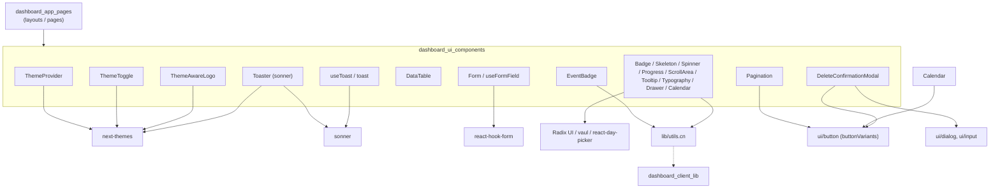
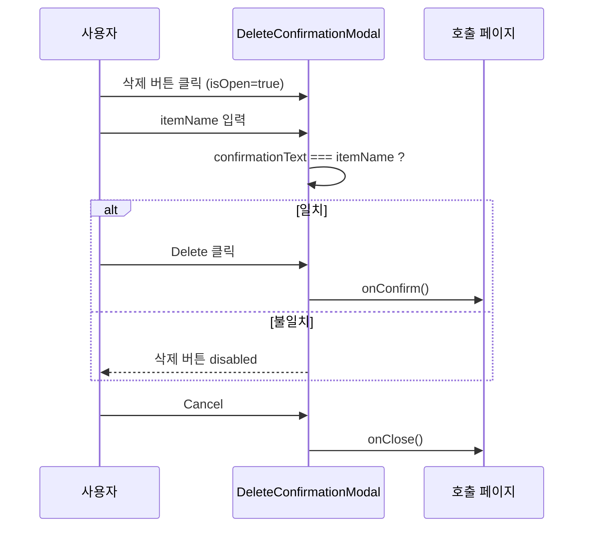
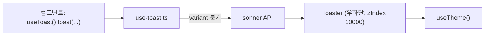

# dashboard_ui_components 모듈

## 개요

`dashboard_ui_components`는 셀프 호스팅 관리자 대시보드(`server/dashboard`, Next.js + Tailwind + shadcn/ui 스타일)에서 쓰이는 **재사용 가능한 UI 프리미티브와 공용 컴포넌트 모음**입니다. 페이지/레이아웃(`dashboard_app_pages`)과 데이터·인증 로직(`dashboard_client_lib`)은 이 모듈의 컴포넌트를 조합해서 화면을 구성합니다.

- 상위 모듈: Self-Hosted Admin Dashboard
- 관련 모듈: [dashboard_app_pages](dashboard_app_pages.md), [dashboard_client_lib](dashboard_client_lib.md), [dashboard_build_config](Build_Configuration_and_Tooling.md), 백엔드 API는 [Self-Hosted Server](Self-Hosted_Server_(API,_Auth,_Persistence,_Deployment).md)

## 구성 요소 한눈에 보기

| 분류 | 파일 | 컴포넌트 | 역할 |
|---|---|---|---|
| misc | `components/misc/spinner.tsx` | `Spinner` | `animate-spin` 로딩 스피너 (`small`/그 외 크기) |
| misc | `components/misc/theme-aware-logo.tsx` | `ThemeAwareLogo` | 테마에 따라 `/images/dark.svg` 또는 `/images/light.svg` 표시 |
| shared | `components/shared/data-table.tsx` | `DataTable`, `tableClasses` | 제네릭 컬럼 기반 테이블 |
| shared | `components/shared/event-badge.tsx` | `EventBadge` | ADD/UPDATE/SEARCH/DELETE/USER 이벤트 뱃지 |
| theme | `components/theme-provider.tsx` | `ThemeProvider` | `next-themes` 래퍼 |
| ui | `components/ui/badge.tsx` | `Badge` | `cva` 기반 variant 뱃지 |
| ui | `components/ui/calendar.tsx` | `Calendar` | `react-day-picker` 스타일 래퍼 |
| ui | `components/ui/delete-confirmation-modal.tsx` | `DeleteConfirmationModal` (`DeleteConfirmationModalProps`) | 이름 입력 확인형 삭제 모달 |
| ui | `components/ui/drawer.tsx` | `Drawer`, `DrawerHeader`, `DrawerFooter` 등 | `vaul` 기반 하단 드로어 |
| ui | `components/ui/form.tsx` | `Form`, `FormField`, `useFormField` 등 | `react-hook-form` + Radix Label 연동 |
| ui | `components/ui/pagination.tsx` | `Pagination`, `PaginationPrevious/Next/Ellipsis` | 페이지 네비게이션 |
| ui | `components/ui/progress.tsx` | `Progress` (`CustomProgressProps`) | `indicatorColor` 지정 가능한 진행 막대 |
| ui | `components/ui/scroll-area.tsx` | `ScrollArea`, `ScrollBar` (`ScrollAreaProps`) | Radix 스크롤 영역 + `viewportRef` |
| ui | `components/ui/skeleton.tsx` | `Skeleton` | `animate-pulse` 플레이스홀더 |
| ui | `components/ui/sonner.tsx` | `Toaster` | `sonner` 토스트 컨테이너 (우하단) |
| ui | `components/ui/theme-toggle.tsx` | `ThemeToggle` | light/dark/system 드롭다운 |
| ui | `components/ui/tooltip.tsx` | `TooltipProvider`, `Tooltip*` | Radix 툴팁 (기본 `delayDuration=200`) |
| ui | `components/ui/typography.tsx` | `Typography`, `TypographyProps` | `typo-*` 클래스 variant 타이포그래피 |
| ui | `components/ui/use-toast.ts` | `useToast`, `toast` | Sonner를 감싼 호환 API |
| types | `types/ui-components.ts` | `InputProps`, `TextareaProps` | Input/Textarea 공용 prop 타입 |

## 아키텍처

`cn`(`@/lib/utils`)은 [dashboard_client_lib](dashboard_client_lib.md)에 있으며, `ui/button`, `ui/dialog`, `ui/input`, `ui/label`, `ui/dropdown-menu`는 이 모듈의 핵심 컴포넌트 목록에는 없지만 여러 컴포넌트가 의존합니다.

## 주요 컴포넌트 상세

### 테마 계층
`ThemeProvider`는 `next-themes`의 `ThemeProvider`를 그대로 감싸는 클라이언트 컴포넌트입니다. `ThemeToggle`(`setTheme`로 light/dark/system 선택), `ThemeAwareLogo`, `Toaster`는 모두 `useTheme`를 사용합니다.

`ThemeAwareLogo`는 하이드레이션 불일치를 피하기 위해 `mounted` 상태가 `true`가 될 때까지 같은 크기의 빈 `div`를 렌더링합니다. 이후 `theme === "system"`이면 `resolvedTheme`을 사용해 로고 경로를 정합니다.

### DataTable
제네릭 `DataTable<T>`는 `columns: Column<T>[]`와 `data: T[]`를 받습니다.

- `Column<T>`: `key`, `label`, `icon`, `render(value, row)`, `className`, `width`(상대 가중치), `align`, `cellVariant`(`default`/`flush`), `headerVariant`(`default`/`check`).
- 열 너비는 `width` 숫자를 가중치로 보고 전체 합 대비 퍼센트로 `<colgroup>`에 적용합니다(미지정 시 100).
- 헤더 `className`에서는 `w-`, `min-w-`, `max-w-`, `text-left/center/right`만 추려서 사용합니다.
- 행: `getRowKey`, `onRowClick`(있으면 `cursor-pointer`), `getRowClassName` 지원. `render`가 없으면 `String(value)`로 출력.
- 최소 높이는 데이터 수에 비례(`38 + n*38`, 최소 76, 빈 경우 100px).
- 스타일 상수는 `tableClasses`로 export됩니다.

### EventBadge
`type`(없으면 `event`)을 대문자로 변환해 variant/아이콘을 결정합니다.

| type | variant | 아이콘 |
|---|---|---|
| `ADD`(및 기본값) | add | `Plus` |
| `UPDATE` | update | `RefreshCw` |
| `SEARCH`/`GET_ALL`/`GET` | retrieved | `SearchCode` |
| `DELETE` | delete | `Trash` |
| `USER`/`USERS` | user | `UserRound` |

`count === 0`이고 `label`이 없으면 `null`을 반환합니다. `variant`(`primary`/`secondary`)는 배경색만 바꿉니다. 이 타입들은 [dashboard_client_lib](dashboard_client_lib.md)의 `ApiRequestLog` 등 API 타입에서 오는 이벤트 이름과 대응됩니다.

### 삭제 확인 모달
`DeleteConfirmationModal`은 사용자가 `itemName`을 정확히 입력해야 삭제 버튼이 활성화됩니다. 닫기/확인 시 입력 상태가 초기화됩니다.

참고: 이 파일은 `export default`로 내보내며 `DeleteConfirmationModalProps` 인터페이스는 export되지 않습니다.

### 토스트
`use-toast.ts`는 shadcn의 기존 `toast({ title, description, variant })` 호출 형태를 유지하면서 내부적으로 `sonner`를 호출합니다. `destructive` → `sonnerToast.error`, `success` → `sonnerToast.success`, 그 외 → 기본 토스트. `dismiss`/`update`는 no-op이며, 화면 표시는 앱 어딘가에 마운트된 `Toaster`(`ui/sonner.tsx`)가 담당합니다.

### Form
`Form`은 `FormProvider`의 별칭이고 `FormField`는 `Controller`에 필드 이름 컨텍스트를 제공합니다. `FormItem`은 `useId`로 ID를 만들고, `useFormField`가 `formItemId`, `formDescriptionId`, `formMessageId`와 필드 상태(`error` 등)를 반환해 `FormLabel`, `FormControl`(aria 속성 설정), `FormDescription`, `FormMessage`가 접근성 속성을 일관되게 구성합니다.

### 기타 프리미티브
- `Badge`: `cva` variant `default | secondary | destructive | outline`.
- `Pagination*`: `isDisabled`일 때 클릭을 `preventDefault`하고 스타일을 흐리게 처리. 파일 export 목록에는 없으나 `cn`을 임포트해 사용합니다.
- `Progress`: `indicatorColor`(필수 클래스 문자열)와 `value`로 `translateX`를 계산.
- `ScrollArea`: `viewportRef` 추가 지원, `ScrollBar`는 vertical/horizontal.
- `Typography`: `variant`에 따라 기본 요소(h1~h5, p, span)를 선택하고 `as`로 재정의. 헤딩/본문은 Fustat, 캡션류는 DM Mono 폰트 토큰.
- `Drawer`: `vaul` 래퍼, 기본 `shouldScaleBackground=true`.
- `Calendar`: `DayPicker` 클래스 매핑, 이전/다음 아이콘은 Radix Icons.
- `Tooltip`: `TooltipProvider` 기본 지연 200ms, `sideOffset` 10.
- `types/ui-components.ts`: `InputProps`(variant `default | textField | nestedInput`), `TextareaProps`(라벨/컨테이너 클래스 옵션).

## 사용 시 유의사항

- 대부분의 컴포넌트가 `"use client"`이며, `Spinner`, `Badge`, `Skeleton`, `DataTable`, `EventBadge`처럼 지시자가 없는 것은 서버/클라이언트 양쪽에서 쓸 수 있습니다.
- 디자인 토큰(`memBorder-primary`, `surface-default-*`, `onSurface-default-*` 등)은 Tailwind 설정과 글로벌 CSS에 정의되어 있으므로, 새 컴포넌트도 같은 토큰을 사용해야 테마 전환이 일관됩니다.
- 빌드/런타임 설정(`package.json`, `Dockerfile`, `tsconfig.json`)은 `server/dashboard`에 있습니다. 자세한 내용은 [Build_Configuration_and_Tooling](Build_Configuration_and_Tooling.md)을 참고하세요.
- `Spinner`의 `size`는 `"small"`이 아니면 모두 큰 크기(`w-6 h-6`)로 처리됩니다.
