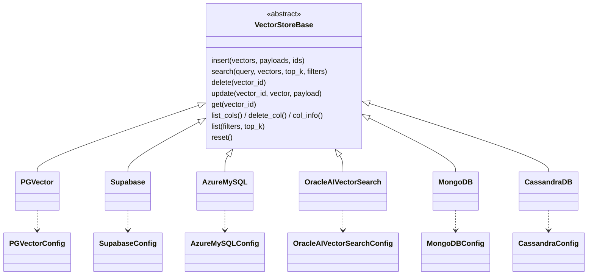
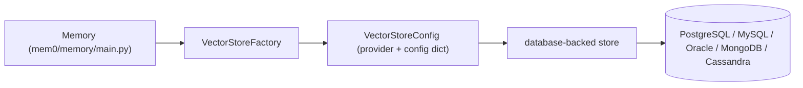

# database_backed_vector_stores 모듈

## 1. 개요

`database_backed_vector_stores`는 mem0 Python SDK의 벡터 스토어 계층 중 **범용 데이터베이스를 벡터 저장소로 사용하는 구현체**를 모은 모듈이다. 각 스토어는 `mem0.vector_stores.base.VectorStoreBase`를 상속하고, 짝이 되는 Pydantic 설정 클래스(`mem0/configs/vector_stores/*.py`)로 검증된다. 스토어 선택과 설정 매핑은 [vector_store_config_registry.md](vector_store_config_registry.md)의 `VectorStoreConfig` / `VectorStoreFactory`가 담당한다.

| 스토어 | 구현 파일 | 설정 파일 / 클래스 | 백엔드 |
|---|---|---|---|
| `PGVector` | `mem0/vector_stores/pgvector.py` | `PGVectorConfig` | PostgreSQL + pgvector (psycopg3/psycopg2) |
| `Supabase` | `mem0/vector_stores/supabase.py` | `SupabaseConfig`, `IndexMethod`, `IndexMeasure` | Supabase `vecs` 클라이언트 |
| `AzureMySQL` | `mem0/vector_stores/azure_mysql.py` | `AzureMySQLConfig` | Azure MySQL (PyMySQL + DBUtils) |
| `OracleAIVectorSearch` | `mem0/vector_stores/oracledb.py` | `OracleAIVectorSearchConfig`, `HnswParams`, `IvfParams` | Oracle 23.4+ AI Vector Search |
| `MongoDB` | `mem0/vector_stores/mongodb.py` | `MongoDBConfig` | MongoDB Atlas Vector/Text Search |
| `CassandraDB` | `mem0/vector_stores/cassandra.py` | `CassandraConfig` | Apache Cassandra / Astra DB |

TypeScript 대응 구현은 `ts_oss_vector_stores_database_backed_vector_stores` 모듈을 참고한다.
형제 모듈: [local_and_adapter_vector_stores.md](local_and_adapter_vector_stores.md), [dedicated_vector_database_stores.md](dedicated_vector_database_stores.md), [search_engine_and_keyvalue_stores.md](search_engine_and_keyvalue_stores.md), [cloud_platform_vector_stores.md](cloud_platform_vector_stores.md).

별도 하위 모듈로 나누지 않고 이 문서 하나에서 6개 스토어를 모두 설명한다 (구조가 동일한 어댑터의 반복이기 때문).

## 2. 아키텍처





### 공통 규약
- 모든 스토어는 `OutputData(id, score, payload)`를 반환한다. `list()`는 `[[OutputData, ...]]` 형태의 중첩 리스트를 반환한다(Memory 엔진 호환).
- 레코드 = `id` + `vector` + `payload`(JSON). 필터는 payload 내부 키를 대상으로 한다.
- 설정 클래스는 `validate_extra_fields`로 알 수 없는 필드를 거부한다.
- `keyword_search()`를 지원하는 스토어(PGVector, AzureMySQL, MongoDB)는 payload의 `text_lemmatized`를 대상으로 하이브리드 검색을 돕고, 지원 불가 시 `None`을 반환한다.
- `__del__`에서 연결/풀을 정리한다.

## 3. 스토어별 상세

### 3.1 PGVector
- **연결 우선순위**: `connection_pool` > `connection_string` > 개별 파라미터(`postgresql://user:pw@host:port/db`). `sslmode`는 `_with_sslmode()`로 URI/키워드 conninfo 양쪽에 주입한다.
- **드라이버**: `psycopg`(v3, `ConnectionPool(open=False)` 후 `open(wait=False)`)를 우선, 없으면 `psycopg2`의 `ThreadedConnectionPool`. `PSYCOPG_VERSION`으로 분기하며 `_get_cursor(commit)` 컨텍스트 매니저가 commit/rollback/풀 반환을 통합 처리한다.
- **스키마**: `id UUID`, `vector vector(N)`, `payload JSONB`. 인덱스는 `diskann`(vectorscale 확장 설치 시, 차원 < 2000) 또는 `hnsw (vector_cosine_ops)`, 그리고 `to_tsvector('simple', payload->>'text_lemmatized')` GIN 인덱스.
- **지연 생성**: `_ensure_collection()`이 첫 연산 시 테이블을 만든다.
- **검색**: `vector <=> %s::vector`(코사인 거리), 점수 = `max(0, 1 - distance)`. 필터는 `_build_filter_conditions()`가 `OPERATOR_SQL_MAP`(`eq, ne, gt, gte, lt, lte, in, nin, contains, icontains`), `$or`, `$not`, `"*"`(키 존재)로 파라미터화 SQL을 만든다. `contains`는 LIKE 와일드카드를 이스케이프한다.
- **키워드 검색**: `ts_rank_cd` + `plainto_tsquery('simple', ...)`.
- 식별자는 `sql.Identifier`로 안전하게 인용된다.

### 3.2 Supabase
- `vecs.create_client(connection_string)`에 위임. 생성 시 컬렉션이 없으면 `create_col()`이 `get_or_create_collection` + `create_index(method, measure)`를 호출.
- `IndexMethod`(`auto|hnsw|ivfflat`), `IndexMeasure`(`cosine_distance|l2_distance|l1_distance|max_inner_product`) enum은 `mem0/configs/vector_stores/supabase.py`에 있다.
- `_preprocess_filters()`가 dict를 vecs 형식(`{"k": {"$eq": v}}`, 복수 키는 `$and`)으로 변환. `top_k`는 `VECS_MAX_QUERY_LIMIT = 1000`으로 제한된다.
- `list()`는 영벡터로 쿼리해 ID를 얻은 뒤 `fetch`한다. `keyword_search`는 없다.
- `SupabaseConfig`는 `postgresql://`로 시작하는 연결 문자열을 강제한다.
- 주의: `update()`가 vector 없이 payload만 받을 때 `existing.payload.get("vector")`에서 벡터를 찾는데, payload에 벡터가 없으면 갱신이 일어나지 않는다.

### 3.3 AzureMySQL
- `PooledDB(creator=pymysql)` 풀, `DictCursor`. `use_azure_credential=True`이면 `DefaultAzureCredential`로 `https://ossrdbms-aad.database.windows.net/.default` 토큰을 받아 비밀번호로 사용(`azure-identity` 필요). 기본적으로 SSL 인증서 검증을 켠다(`ssl_disabled`, `ssl_ca`).
- **스키마**: `id VARCHAR(255)`, `vector JSON`, `payload JSON`, 생성 컬럼 `text_lemmatized` + FULLTEXT 인덱스 `ft_text_lemmatized`.
- **검색은 Python에서 수행**: 필터링된 모든 행을 읽어 numpy로 코사인 유사도를 계산한 뒤 정렬한다 → 대규모 데이터에서는 O(N). (`_cosine_distance` SQL 헬퍼는 미사용 단순 버전.)
- **보안**: 컬렉션명은 `_validate_identifier`로, 필터 키는 `_VALID_FILTER_KEY`로 화이트리스트 검증(유효하지 않은 키는 경고 후 건너뜀). `insert`는 `ON DUPLICATE KEY UPDATE` upsert.
- `keyword_search`: `MATCH ... AGAINST (NATURAL LANGUAGE MODE)`.

### 3.4 OracleAIVectorSearch
- 생성자는 `**kwargs`를 `OracleAIVectorSearchConfig`로 검증. `client`(Connection/Pool) 직접 주입, `use_connection_pool=True`(기본, min 1/max 4) 풀 생성, 단일 연결 중 선택. 직접 만든 클라이언트만 `_owns_client`로 닫는다.
- 클라이언트 드라이버(thick 모드 ≥ 23.4)와 DB 버전(≥ 23.4)을 검사한 뒤 `create_col()`을 호출한다.
- **스키마**: `VECTOR(N)`, `payload JSON`. 인덱스는 `HNSW`(INMEMORY NEIGHBOR GRAPH) 또는 `IVF`(NEIGHBOR PARTITIONS), `distance_metric`(`COSINE` 등 6종), `index_accuracy`. `index_parameters`는 `HnswParams`/`IvfParams`(extra 금지, strict)로 검증된다.
- **필터**: `_build_filter_group()`이 `$and/$or/$not`(및 `AND/OR/NOT`)과 연산자(`eq…icontains`)를 `JSON_EXISTS(... PASSING ...)` 바인드 변수 SQL로 변환. 메타데이터 키는 `METADATA_PATTERN`으로 검증.
- **점수**: `_convert_distance_to_score()`가 메트릭별로 거리를 [0,1]류 점수로 변환(DOT은 `-d`).
- 식별자는 `_quote_identifier`로 인용되며 `schema.table` 형식도 허용한다. `keyword_search`는 없다.

### 3.5 MongoDB
- `MongoClient(mongo_uri, driver=DriverInfo(name="Mem0", ...))`. 문서 형식: `{_id, embedding, payload}`.
- `create_col()`이 컬렉션(플레이스홀더 문서 삽입/삭제로 생성)과 Atlas `vectorSearch` 인덱스(`{collection}_vector_index`, cosine), 텍스트 인덱스(`{collection}_text_search_index`, `payload.data`·`payload.text_lemmatized`)를 만든다. 텍스트 인덱스 실패는 경고만 남긴다.
- `search`: `$vectorSearch`(`numCandidates = min(top_k*20, 10000)`) → `$match` 필터 → `embedding` 제외. 점수는 `vectorSearchScore`.
- `keyword_search`: `$search` + `searchScore`.
- **인젝션 방어**: `_validate_filter_value()`가 dict/내부 dict 리스트 값을 거부(`$ne` 등 연산자 주입 방지). 필터는 `payload.<key>` 동등 비교만 지원.
- 대부분의 오류는 로깅 후 빈 결과로 삼킨다(`PyMongoError`).

### 3.6 CassandraDB
- `Cluster` 접속: `secure_connect_bundle`(Astra DB) 또는 `contact_points`+`port`, 선택적 `PlainTextAuthProvider`, `load_balancing_policy`.
- 생성 시 `CREATE KEYSPACE IF NOT EXISTS`(SimpleStrategy, RF=1)와 `id text / vector list<float> / payload text(JSON)` 테이블을 만든다. keyspace/collection명은 `_validate_identifier`로 검증.
- **검색은 클라이언트 측 전체 스캔**: 테이블 전체를 읽어 numpy 코사인 유사도 + payload 동등 필터를 Python에서 처리 → 소규모 용도. `LIMIT {top_k}`는 `list()`에서 f-string으로 삽입된다(정수 가정).
- `reset()`은 `TRUNCATE`. `keyword_search` 없음. `CassandraConfig`는 username/password 동시 지정, `contact_points` 또는 번들 필수를 검증한다.

## 4. 스토어 기능 비교

| 항목 | PGVector | Supabase | AzureMySQL | Oracle | MongoDB | Cassandra |
|---|---|---|---|---|---|---|
| 서버측 ANN 검색 | O (hnsw/diskann) | O (vecs) | X (Python) | O (HNSW/IVF) | O (Atlas) | X (Python) |
| `keyword_search` | O | X | O | X | O | X |
| 풍부한 필터 연산자 | O | 동등만 | 동등만 | O | 동등만 | 동등만 |
| 커넥션 풀 | O | vecs | O | O | 드라이버 | 드라이버 |
| 외부 풀/클라이언트 주입 | O | X | O | O | X | X |

## 5. 사용 예

```python
from mem0 import Memory

config = {
    "vector_store": {
        "provider": "pgvector",
        "config": {
            "host": "localhost", "port": 5432,
            "user": "postgres", "password": "postgres",
            "dbname": "postgres", "collection_name": "mem0",
            "embedding_model_dims": 1536,
        },
    }
}
m = Memory.from_config(config)
```

## 6. 유지보수 시 참고
- 새 DB 스토어 추가는 `mem0/AGENTS.md`의 "Adding a provider" 절차를 따른다(`base.py` 상속, `configs/vector_stores/`에 설정, 레지스트리 등록).
- 동적 SQL을 만드는 스토어(AzureMySQL, Cassandra, Oracle)는 식별자 검증이 보안 경계이므로, 설정 검증과 스토어 내부 검증을 함께 유지해야 한다.
- 파이썬 의존성은 코어가 아닌 선택적 그룹으로 추가한다(루트 `pyproject.toml`).
