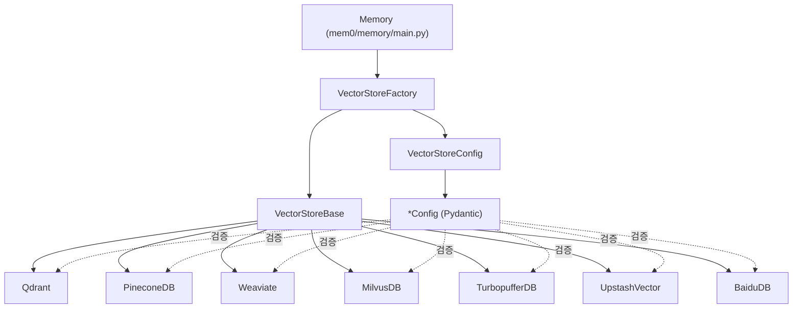
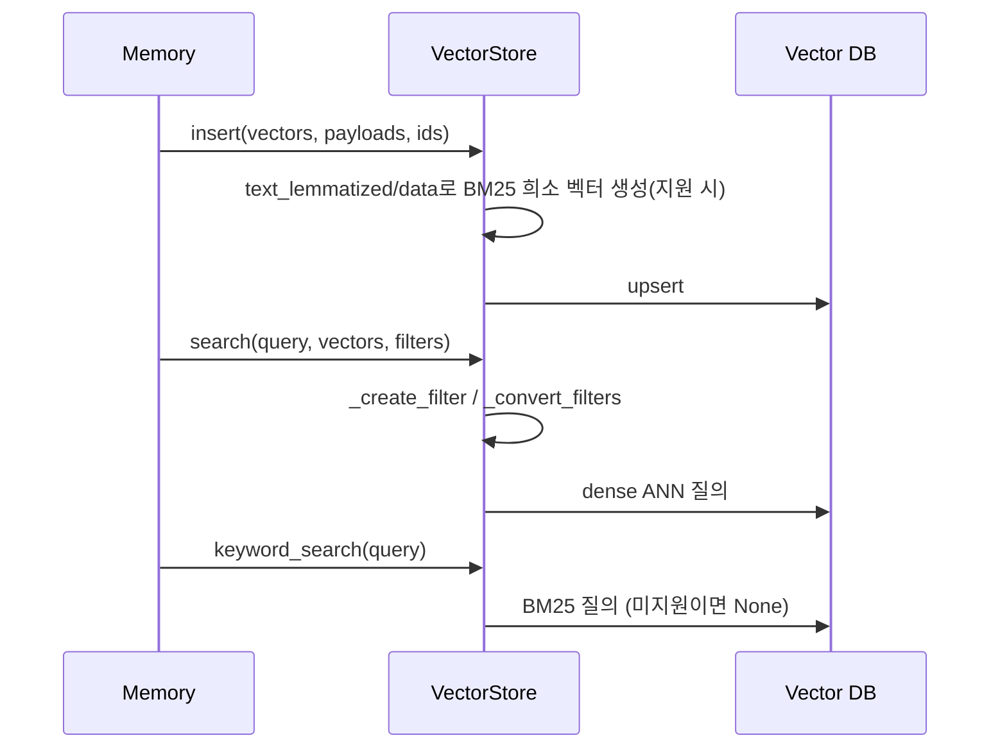

# dedicated_vector_database_stores

## 개요

`dedicated_vector_database_stores`는 Mem0 Python SDK의 벡터 스토어 계층 중, **벡터 검색 전용으로 설계된 전문 벡터 데이터베이스**(Qdrant, Pinecone, Weaviate, Milvus/Zilliz, Turbopuffer, Upstash Vector, Baidu VectorDB)를 연결하는 어댑터 모음이다. 각 스토어는 두 파일로 구성된다.

- `mem0/vector_stores/<name>.py`: `VectorStoreBase`를 상속하는 구현체 (실제 DB 호출)
- `mem0/configs/vector_stores/<name>.py`: Pydantic 설정 모델 (`model_validator`로 연결 파라미터와 허용 필드 검증)

상위 `Memory` 엔진은 `VectorStoreFactory`(`mem0/utils/factory.py`)와 `VectorStoreConfig`(`mem0/vector_stores/configs.py`, 문서: [vector_store_config_registry](vector_store_config_registry.md))를 통해 provider 이름으로 이 클래스들을 로드한다. 같은 계층의 다른 그룹은 [local_and_adapter_vector_stores](local_and_adapter_vector_stores.md), [search_engine_and_keyvalue_stores](search_engine_and_keyvalue_stores.md), [database_backed_vector_stores](database_backed_vector_stores.md), [cloud_platform_vector_stores](cloud_platform_vector_stores.md)를 참고한다. TypeScript 대응 구현은 [ts_oss_vector_stores_dedicated_vector_database_stores](ts_oss_vector_stores_dedicated_vector_database_stores.md)에 있다.

## 아키텍처

## 공통 인터페이스

모든 스토어는 다음 메서드를 구현한다: `create_col`, `insert`, `search`, `keyword_search`, `get`, `update`, `delete`, `list`, `list_cols`, `col_info`, `delete_col`, `reset`.

- `search`는 `OutputData(id, score, payload)` 목록을 반환한다(Qdrant는 클라이언트 `points`를 그대로 반환). `list`는 `[[results]]` 형태로 한 번 감싸 반환하는 구현이 많다(Pinecone, Weaviate, Milvus, Turbopuffer, Upstash, Baidu).
- `keyword_search`는 BM25 계열 키워드 검색이며, 지원되지 않거나 실패하면 `None`을 반환해 호출자가 시맨틱 검색만 사용하도록 한다.
- 설정 모델은 모두 `validate_extra_fields`로 정의되지 않은 필드를 거부한다(`Upstash`, `Qdrant` 포함 대부분 동일 패턴).

## 하이브리드 검색 흐름

## 스토어별 설명

| 스토어 | 클래스 / 설정 | 핵심 특징 |
|---|---|---|
| Qdrant | `Qdrant` / `QdrantConfig` | 로컬(`path`)·원격(`host`+`port`, `url`+`api_key`)·기존 `client` 지원. 컬렉션에 dense 벡터와 이름 있는 `bm25` 희소 벡터(IDF modifier, fastembed `Qdrant/bm25`)를 함께 저장. v3 이전 컬렉션은 `_has_bm25_slot=False`로 BM25만 비활성화. 원격일 때 `user_id`/`agent_id`/`run_id`/`actor_id` payload 인덱스 생성. `eq/ne/gt/gte/lt/lte/in/nin/contains/icontains`와 `AND/OR/NOT` 필터를 `Filter`로 변환(ISO 날짜 문자열은 `DatetimeRange`). `search_batch`는 `query_batch_points` 사용. |
| Pinecone | `PineconeDB` / `PineconeConfig` | `api_key`(또는 `PINECONE_API_KEY`)나 `client` 필수. `serverless_config`와 `pod_config`는 동시 지정 불가(기본은 aws/us-west-2 serverless). `hybrid_search=True`이면 `pinecone_text`의 `BM25Encoder`로 희소 값 생성. `namespace` 지정 시 `delete_col`은 인덱스 삭제 대신 해당 네임스페이스만 비움. `batch_size` 단위 upsert. |
| Weaviate | `Weaviate` / `WeaviateConfig` | `cluster_url` 필수. localhost는 `connect_to_local`, `auth_client_secret`이 있으면 Weaviate Cloud, 아니면 custom 연결(gRPC 50051). `search`는 `hybrid`(벡터 지정), `keyword_search`는 `bm25`(`data` 속성) 사용. 필터는 `user_id`/`agent_id`/`run_id`만 반영. 객체 ID는 `get_valid_uuid`로 UUID화. |
| Milvus/Zilliz | `MilvusDB` / `MilvusDBConfig`, `MetricType` | `MilvusClient(uri, token, db_name)`. 새 컬렉션은 `vectors`(AUTOINDEX), `text`(analyzer), `sparse` 필드와 BM25 `Function`을 갖는다. 기존 컬렉션에 `text`/`sparse`가 없으면 `_has_bm25_schema=False`. 필터 키는 정규식으로 검증하고 문자열 값은 이스케이프. L2 거리는 `1/(1+d)`로 유사도 변환. |
| Turbopuffer | `TurbopufferDB` / `TurbopufferConfig` | `api_key`(또는 `TURBOPUFFER_API_KEY`), `region`, `distance_metric`(`cosine_distance`/`euclidean_squared`). 네임스페이스는 첫 upsert 때 암묵 생성되므로 `create_col`은 no-op. 필터는 `("And", ((field, Op, value), ...))` 튜플로 변환하며 미지원 연산자는 `ValueError`. `keyword_search`는 구현되어 있지 않다(기본 인터페이스 동작 사용). |
| Upstash Vector | `UpstashVector` / `UpstashVectorConfig` | `client` 또는 `url`+`token`(환경변수 `UPSTASH_VECTOR_REST_URL`/`TOKEN` 허용, 검증기가 값을 보존). `collection_name`을 namespace로 사용. `enable_embeddings=True`이면 Upstash 내장 임베딩에 `data` 필드 사용. 필터 문자열을 직접 조립하므로 `_validate_filter`로 키 패턴과 따옴표/역슬래시를 차단. |
| Baidu VectorDB | `BaiduDB` / `BaiduDBConfig` | `pymochow` 기반. 데이터베이스/테이블을 자동 생성하고 HNSW 벡터 인덱스와 metadata 필터링 인덱스를 구성한 뒤 테이블이 `NORMAL`이 될 때까지 폴링. `search`는 L2를 유사도로 변환. `keyword_search`는 `data_bm25_idx` 인덱스가 없으면 `None`. 필터 키/값 검증 포함. |

## 사용 시 유의점

- 각 provider SDK는 선택 의존성이다(`pinecone`, `pinecone-text`, `weaviate-client`, `pymilvus`, `turbopuffer`, `upstash_vector`, `pymochow`, `qdrant_client`, BM25용 `fastembed`). 미설치 시 모듈 import 단계에서 `ImportError`가 발생한다. Qdrant의 fastembed는 지연 로딩이며 없으면 BM25만 비활성화된다. 의존성은 `pyproject.toml`의 optional 그룹으로 관리한다.
- `reset()`은 컬렉션/인덱스를 삭제 후 재생성하는 파괴적 동작이다(Turbopuffer는 전체 삭제만 수행).
- 사용자 입력 필터를 쿼리 문자열로 조립하는 Milvus, Upstash, Baidu는 키·값 검증이 보안 경계이므로 수정 시 검증 로직을 유지해야 한다.
- 점수 의미를 통일하기 위해 거리 기반 메트릭(Milvus/Baidu L2, Turbopuffer `euclidean_squared`)은 "높을수록 유사"로 변환한다.
- 서브모듈로 분할하지 않았다: 7개 스토어가 동일한 `VectorStoreBase` 계약을 따르는 독립 어댑터이며, 위 표가 각 스토어의 세부 사항을 다룬다.
