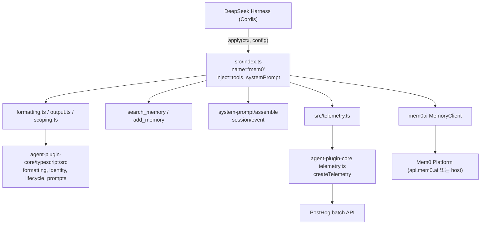
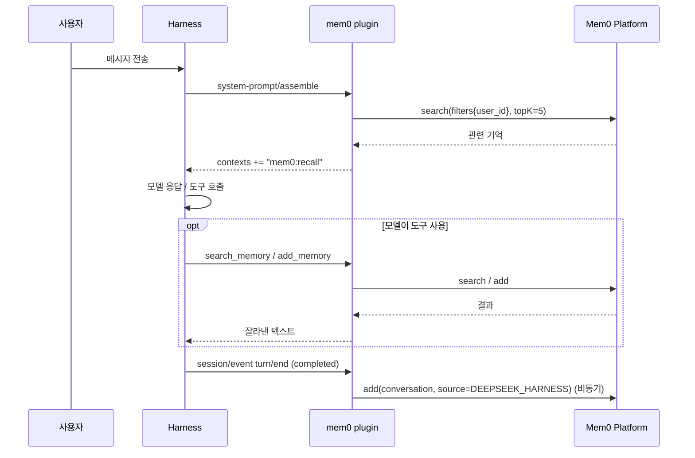
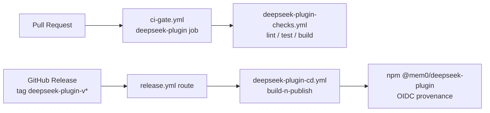

# deepseek_plugin 모듈

`integrations/deepseek-plugin`은 Mem0 장기 기억을 **DeepSeek Harness(Cordis) 네이티브 플러그인**으로 제공하는 npm 패키지(`@mem0/deepseek-plugin`, v0.3.2)입니다. 하네스 에이전트에 `search_memory` / `add_memory` 두 도구를 등록하고, 선택적으로 모델 요청 전 자동 회상(auto recall)과 턴 종료 후 자동 저장(auto capture)을 수행합니다.

상위 그룹: [Framework_and_Workflow-Tool_Integrations](Framework_and_Workflow-Tool_Integrations.md). 형제 모듈: [openclaw](openclaw.md), [pi_agent_plugin](pi_agent_plugin.md), [opencode_plugin](opencode_plugin.md).

---

## 1. 목적과 핵심 기능

| 기능 | 설명 |
|------|------|
| 도구 등록 | `ctx.tools.register(defineTool(...))`로 `search_memory`, `add_memory` 등록. 플러그인 언마운트 시 Cordis가 자동 해제 |
| 자동 회상 | `system-prompt/assemble` 훅에서 마지막 사용자 메시지로 검색 후 `mem0:recall` 컨텍스트 주입 (기본 on, 상위 5건) |
| 자동 저장 | `session/event`의 `turn/end`(reason `completed`)에서 해당 턴 대화를 `client.add`로 저장 (기본 on) |
| 범위 지정 | `userId`(필수 기본값), 선택 `agentId`/`runId`. 다른 사용자 접근은 `allowUserOverride: true`일 때만 허용 |
| 텔레메트리 | PostHog 익명 이벤트(큐잉·재시도·비밀 필터링). `MEM0_TELEMETRY=false/0/no/off`로 끔 |

> 핵심 소스 `src/index.ts`가 `apply`/`Config`를 제공하며, `formatting.ts`·`output.ts`·`scoping.ts`는 [agent-plugin-core (TypeScript)](Coding-Agent_Memory_Plugins_and_Shared_Plugin_Core.md)의 `formatting.ts`·`identity.ts`를 재export하는 얇은 래퍼입니다.

## 2. 아키텍처



핵심 코어의 상세는 [Coding-Agent_Memory_Plugins_and_Shared_Plugin_Core](Coding-Agent_Memory_Plugins_and_Shared_Plugin_Core.md), 호스팅 클라이언트는 [TypeScript_SDK_Core_(Hosted_Client_and_OSS_Engine)](TypeScript_SDK_Core_(Hosted_Client_and_OSS_Engine).md)를 참고하세요.

## 3. 구성 요소

### 3.1 `apply(ctx, config)` — `src/index.ts`

`Config` 필드:

| 필드 | 기본값 | 설명 |
|------|--------|------|
| `apiKey` | `MEM0_API_KEY` 환경변수 | 없으면 예외 |
| `userId` | (필수) | 공백/`*`만 있으면 예외 |
| `allowUserOverride` | `false` | 모델이 지정한 타 사용자 접근 허용 |
| `host` | `api.mem0.ai` | Platform on-prem/dedicated URL. 자체 호스팅 OSS 전환용이 아님 |
| `autoRecall` / `autoCapture` | `true` | 각 훅 on/off |

세션별 상태는 `WeakMap<session, SessionState>`(lifecycle + messages)로 관리하며, 도구용 `toolLifecycle`은 별도 인스턴스입니다.

### 3.2 도구

- `search_memory(query, limit?, userId?, agentId?, runId?)` — 기본 limit 10. 범위는 `filters` 안에 넣습니다(플랫폼이 검색에서 최상위 엔티티 파라미터를 거부). 결과는 `formatMemoryList` → `truncateOutput`.
- `add_memory(text, userId?, agentId?, runId?)` — `resolveAddParams`로 최상위 파라미터 구성, `source: "DEEPSEEK_HARNESS"` 태깅. 서버 측 추출이 비동기이므로 쓰기 직후 확인 검색은 권장하지 않습니다.
- 실패 시 예외를 던지지 않고 `"<tool> failed: ..."` 문자열을 반환합니다(단, 권한 검사 오류는 throw).

### 3.3 텔레메트리 — `src/telemetry.ts`

`captureEvent`, `flushEvents`, `_queueForTesting`, `_resetForTesting`을 노출하며 `errorKind`, `isTelemetryEnabled`는 코어에서 재export합니다.

- `distinctId`: `client.telemetryId` 우선, 없으면 `~/.mem0/deepseek-plugin-telemetry.json`의 `deepseek-anon-<uuid>`.
- 익명 → 식별 ID 전환 시 최초 1회 `$identify`(`$anon_distinct_id`)를 보내고 로컬 파일을 삭제.
- 코어 `createTelemetry`: 큐 최대 100, 10건 또는 5초 주기 flush, 실패 시 지수 백오프(상한 60초)·5회 연속 실패 시 큐 폐기, `beforeExit`에서 1회 강제 flush. `apiKey`, `query`, `prompt`, `userId` 등 민감 키는 속성에서 제거되고 문자열은 `redactSecrets` 처리됩니다.
- 이벤트: `deepseek.plugin.mounted`, `deepseek.recall.auto`, `deepseek.capture.auto`, `deepseek.tool.search_memory`, `deepseek.tool.add_memory`.

## 4. 데이터 흐름



## 5. 빌드·패키징·테스트

| 파일 | 내용 |
|------|------|
| `package.json` | ESM 패키지. 스크립트: `build`(tsup), `test`(vitest run), `test:watch`, `typecheck`(tsc --noEmit). 의존성 `mem0ai ^3.0.7`, peer `@deepseek-ai/{cordis,dsh-agent,dsh-session,dsh-system-prompt,dsh-tools}` |
| `tsup.config.ts` | 엔트리 `src/index.ts`, ESM + d.ts + sourcemap. `node:*`, `@deepseek-ai/*`, `mem0ai`는 external(번들 제외) |
| `tsconfig.json` | ES2022, `strict`, `moduleResolution: bundler`, `allowImportingTsExtensions`, `noEmit`, 테스트 파일 제외 |
| `cordis.example.yml` | `dsh web --patch`로 플러그인을 로드하는 예시 설정 (`userId`, 선택 `autoRecall`/`autoCapture`/`host`) |

`../../agent-plugin-core/typescript/src/*.ts`는 상대 경로로 직접 import되며 tsup이 번들에 포함시킵니다. 따라서 코어 변경은 이 패키지의 CI 경로 필터에도 포함됩니다.

## 6. CI/CD

관련 상세는 [CI_CD_and_Repository_Governance](CI_CD_and_Repository_Governance.md)(`integrations_ci_cd`)를 참고하세요.



- `deepseek-plugin-checks.yml`: `lint`(tsc --noEmit), `test`(Node 20·22, vitest), `build`(pnpm build 후 `python3 integrations/agent-plugin-core/conformance/artifacts.py deepseek`로 패키지 산출물 검증). pnpm 9, `--frozen-lockfile`. push-to-main 경로: `integrations/deepseek-plugin/**`, `integrations/agent-plugin-core/typescript/**`.
- `deepseek-plugin-cd.yml`: `workflow_dispatch`(`tag`, `prerelease`), 태그가 `deepseek-plugin-v`로 시작할 때만 실행. Node 22, `npm publish --provenance --access public`(프리릴리스는 preid dist-tag).
- 주의: npm OIDC trusted publishing이 워크플로 **파일명**에 고정되어 있으므로 이름을 바꾸면 배포가 깨집니다. 워크플로 수정은 메인테이너 승인이 필요합니다.

## 7. 사용 예

```bash
cd integrations/deepseek-plugin
pnpm install
pnpm typecheck && pnpm test && pnpm build
```

```yaml
- insert:
    - id: mem0
      name: ".../node_modules/@mem0/deepseek-plugin/dist/index.js"
      config:
        userId: "your-user-id"   # apiKey는 MEM0_API_KEY에서 읽음
```

## 8. 유의사항

- `SOURCE = "DEEPSEEK_HARNESS"`는 플랫폼 `EventSource` 허용 목록에 반영되기 전까지 `OTHERS`로 집계됩니다(소스 주석 기준).
- 자동 저장은 `completed` 턴만 대상이며 fire-and-forget이라 실패해도 에이전트 동작에 영향이 없습니다.
- 텔레메트리 큐는 디스크에 보존되지 않고 메모리에서만 재시도합니다(호스트 프로세스가 세션 동안 유지된다는 가정).
