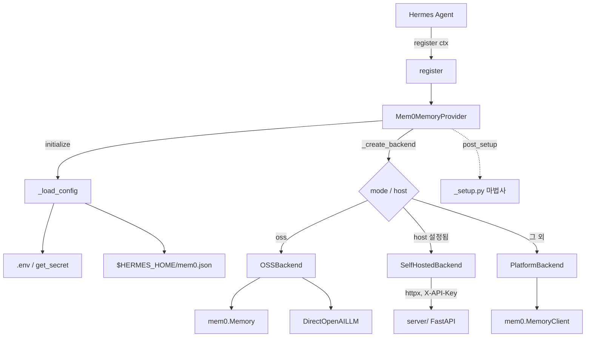
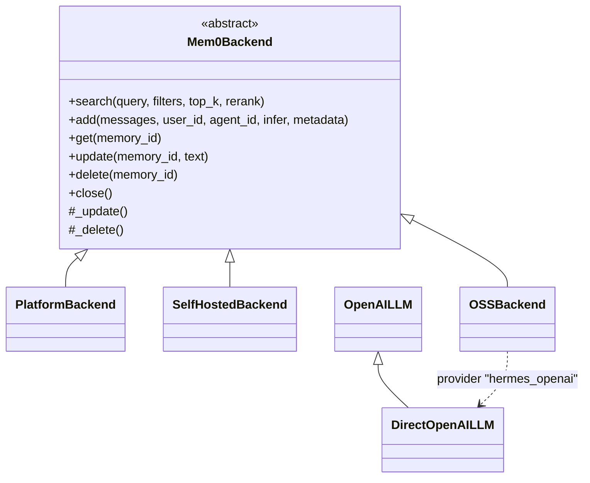
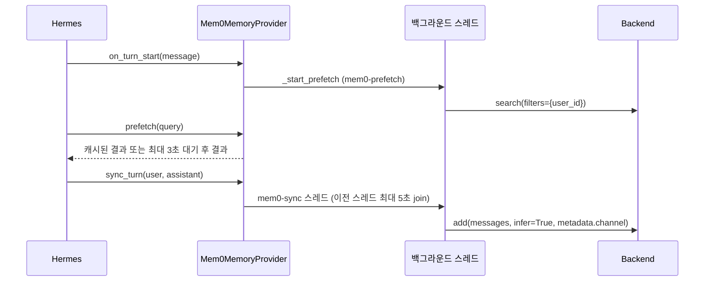
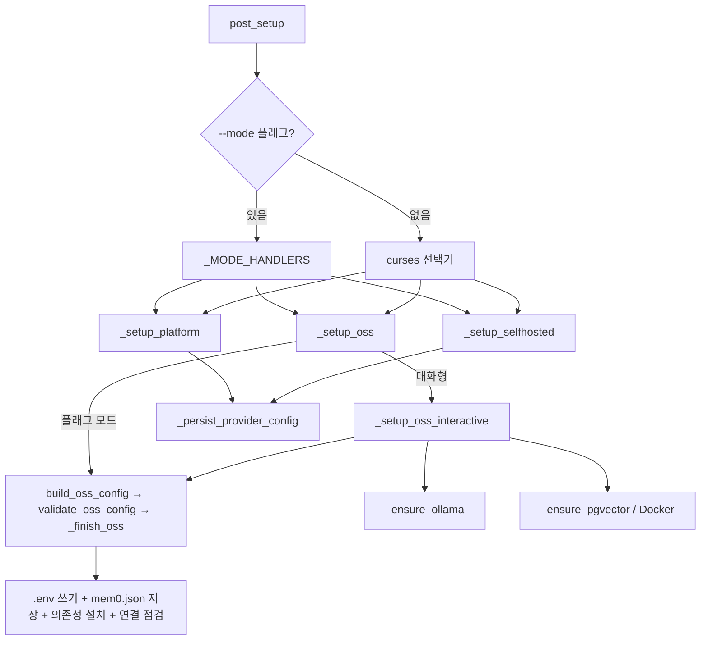

# hermes_plugin_mem0 모듈

`integrations/hermes-plugin-mem0`는 **Hermes Agent**의 `MemoryProvider` 인터페이스를 구현하는 Mem0 메모리 플러그인입니다. 에이전트가 대화 간 사용자 기억을 유지하도록, 세 가지 백엔드(Mem0 Platform 클라우드, 자체 호스팅 Mem0 서버, 로컬 OSS `mem0.Memory`)를 하나의 인터페이스로 묶습니다.

관련 모듈:
- Python SDK 코어: [Python_SDK_Core_(Memory_Engine_and_Hosted_Client)](Python_SDK_Core_(Memory_Engine_and_Hosted_Client).md) — `MemoryClient`, `Memory`
- 프로바이더 계층: [Python_Pluggable_Provider_Layer](Python_Pluggable_Provider_Layer.md) — `LlmFactory`, `OpenAILLM`, `QdrantConfig`
- 자체 호스팅 서버: [Self-Hosted_Server_(API,_Auth,_Persistence,_Deployment)](Self-Hosted_Server_(API,_Auth,_Persistence,_Deployment).md) — `/memories`, `/search` API
- 같은 분류의 다른 통합: [Framework_and_Workflow-Tool_Integrations](Framework_and_Workflow-Tool_Integrations.md)

> 참고: `_backend.py`와 `_setup.py`는 `_oss_providers` 모듈(`EMBEDDER_PROVIDERS`, `LLM_PROVIDERS`, `VECTOR_PROVIDERS`, `KNOWN_DIMS`, `validate_oss_config` 등)을 import하지만, 이 모듈의 핵심 컴포넌트 코드에는 포함되어 있지 않습니다. 해당 부분은 아래에서 "사용처"만 설명합니다.

---

## 1. 구성 요소

| 파일 | 핵심 컴포넌트 | 역할 |
|------|---------------|------|
| `__init__.py` | `Mem0MemoryProvider`, `_schema`, `register` | Hermes 플러그인 진입점, 도구 스키마, 서킷 브레이커, 프리페치/동기화 |
| `_backend.py` | `PlatformBackend`, `SelfHostedBackend`, `OSSBackend` | 3종 백엔드 추상화 (`Mem0Backend` ABC) |
| `_openai_llm.py` | `DirectOpenAILLM` | OpenRouter 환경변수에 영향받지 않는 OpenAI 전용 LLM 어댑터 |
| `_setup.py` | `post_setup`, `_setup_platform`, `_setup_selfhosted`, `_setup_oss`, `has_oss_flags` | `hermes memory setup` 마법사 (대화형/플래그 기반) |
| `pyproject.toml` | — | 패키지 `hermes-plugin-mem0` 1.3.0, Python ≥3.11, `mem0ai>=2.0.10,<3`, `httpx`; 선택 의존성 `postgres`, `qdrant` |

---

## 2. 아키텍처

백엔드 선택 우선순위는 **oss > host > platform** 입니다 (`_create_backend`, `system_prompt_block`에서 동일하게 적용).

### 클래스 구조

`update()`/`delete()`는 템플릿 메서드이며, 서브클래스는 원시 `_update`/`_delete`만 구현합니다.

---

## 3. Mem0MemoryProvider

### 3.1 설정 로딩 (`_load_config`)
1. 기본값: `MEM0_MODE`(기본 `platform`), `MEM0_HOST`, `MEM0_AGENT_ID`(기본 `hermes`), `MEM0_USER_ID`(명시된 경우에만)를 `get_secret`으로 읽음 — 프로필 스코프를 존중합니다.
2. `$HERMES_HOME/mem0.json`의 비어있지 않은 키가 개별 키를 덮어씀.
3. `oss` 모드가 아니면 `api_key`를 `MEM0_API_KEY`에서 보충. OSS 모드는 `api_key=""`.

### 3.2 user_id 우선순위
운영자 설정(env/`mem0.json`) > 게이트웨이 고유 id(`kwargs["user_id"]`) > `_DEFAULT_USER_ID`(`"hermes-user"`). 리터럴 플레이스홀더 `hermes-user`는 "미설정"으로 취급됩니다.

### 3.3 도구 (4종)
`TOOL_SCHEMAS`는 `_schema` 헬퍼로 생성됩니다.

| 도구 | 필수 파라미터 | 동작 | 클라이언트 오류 정책 |
|------|---------------|------|----------------------|
| `mem0_search` | `query` (`top_k` 1–50, `rerank`) | 의미 검색, `user_id` 필터만 적용 | `skip` (브레이커 미반영) |
| `mem0_add` | `content` | `infer=False`로 원문 저장 | `count` (실패로 집계) |
| `mem0_update` | `memory_id`, `text` | 소유권 확인 후 교체 | `not_found` → "Memory not found" |
| `mem0_delete` | `memory_id` | 소유권 확인 후 삭제 | `not_found` |

`_ensure_owns_memory`는 메모리의 `user_id`가 호출자와 다르면 `PermissionError`를 발생시킵니다. `handle_tool_call`은 `_TOOL_HANDLERS` 테이블 기반으로 인자 검증 → 백엔드/브레이커 상태 확인 → 실행 → 성공/실패 기록을 수행합니다.

### 3.4 서킷 브레이커
- 연속 실패 5회(`_BREAKER_THRESHOLD`) 시 120초(`_BREAKER_COOLDOWN_SECS`) 동안 호출 중단.
- 쿨다운이 지나면 실패 카운터가 리셋됩니다 (`_is_breaker_open`).
- 사용자 오류(`MemoryNotFoundError`, `ValidationError`, 404, "valid uuid")는 `_is_client_error`로 분류되어 브레이커를 작동시키지 않습니다(`mem0_add` 제외).

### 3.5 턴 라이프사이클

- **프리페치**: 결과는 `## Mem0 Memory` 불릿 목록으로 반환. 느린 백엔드면 주입을 건너뛰며 `mem0_search`가 백스톱 역할.
- **동기화**: 각 메시지를 `_truncate_for_sync`로 자릅니다 (기본 450자, `sync_max_chars`로 조정). 마지막 문장 경계(`。！？.!?`)를 우선하고, 경계가 첫 1/3 이내이면 하드 컷. 임베딩 모델의 작은 컨텍스트 창 때문에 백엔드 `add()`가 실패하는 것을 막기 위한 조치입니다.
- **종료**: `atexit`로 `shutdown` 등록. 진행 중인 스레드를 `join`한 뒤 백엔드를 닫습니다 (추출 도중 저장소를 닫아 턴을 잃지 않도록).

### 3.6 쓰기/읽기 범위
읽기는 `user_id`만으로 필터링하여 모든 게이트웨이/에이전트의 기억을 회수하고, 쓰기에는 `agent_id`와 `metadata.channel`(게이트웨이 이름)이 붙습니다.

---

## 4. 백엔드

### PlatformBackend
`mem0.MemoryClient(api_key)`를 감쌉니다. `rerank`는 플랫폼 전용이며, 응답은 `_unwrap_results`로 정규화됩니다.

### SelfHostedBackend
`MemoryClient`가 클라우드 API(`Authorization: Token`, `GET /v1/ping/`)에 고정되어 있어 `httpx.Client`로 직접 통신합니다.
- 인증: `X-API-Key` (`AUTH_DISABLED` 서버면 생략).
- 경로: `POST /search`, `POST/GET/PUT/DELETE /memories[/{id}]`.
- 타임아웃 30초, `infer=True` 추가는 120초. 연결 재시도 2회.
- `rerank`는 무시됩니다.

### OSSBackend
`mem0.Memory`를 감싸며 다음을 처리합니다.
- **설정 정규화**: 레거시 `api_base` → 프로바이더 표준 base-URL 키, OpenAI 키/URL은 `get_secret`으로 해석, 임베딩 차원은 `embedding_dims` 또는 `KNOWN_DIMS`.
- **로컬 Qdrant 공유**: 원격 설정이 없으면 로컬 경로(`os.path.realpath`)를 키로 `_LOCAL_QDRANT_MEMORIES`에 `_LocalQdrantMemory`를 등록해 인스턴스를 공유(참조 카운트 `users`). 동일 경로에 다른 프로필/설정이 열려 있으면 `ValueError`.
- **차원 불일치 가드**: `_reject_dimension_mismatch` → `_detect_current_dims`(Qdrant/pgvector)로 기존 컬렉션 차원을 확인, 다르면 기존 기억을 보존한 채 예외. 감지 실패 시 경고 후 건너뜀.
- **OpenAI 전용 LLM**: LLM 프로바이더가 `openai`이면 `LlmFactory.register_provider("hermes_openai", ...DirectOpenAILLM, OpenAIConfig)`를 등록하고 `MemoryConfig.llm.provider`를 교체합니다.
- **직렬화**: `_call`이 `RLock`으로 모든 SDK 호출을 직렬화합니다(로컬 Qdrant는 다중 프로세스 접근 불가; 병렬 처리량이 필요하면 Qdrant 서버 사용).
- **정리**: `close()`는 참조 카운트가 0이 되면 telemetry(posthog), 벡터 스토어, 클라이언트를 닫습니다.

### DirectOpenAILLM (`_openai_llm.py`)
`OpenAILLM.__init__`는 `OPENROUTER_API_KEY`가 있으면 OpenRouter를 선택하므로 이를 우회해 `LLMBase.__init__`만 호출합니다. 키/URL은 `get_secret`(`OPENAI_API_KEY`, `OPENAI_API_BASE`, `OPENAI_BASE_URL`)로 읽어 멀티플렉스된 프로필 간 자격 증명 누수를 막습니다. 기본 모델은 `gpt-5-mini`(추론 모델로 표시), 타임아웃 120초, OpenRouter 전용 필드는 보내지 않습니다.

---

## 5. 설정 마법사 (`_setup.py`)

`post_setup(hermes_home, config)`는 `hermes memory setup`의 진입점입니다. `mem0ai < 2.0.10`이면 경고하고, `--mode`(`platform` / `selfhosted` / `oss`) 플래그가 있으면 해당 핸들러를, 없으면 curses 선택기를 띄웁니다.

핵심 동작:
- 비밀(`MEM0_API_KEY` 등)은 `$HERMES_HOME/.env`(`_write_env`, 권한 0600), 일반 설정은 `mem0.json`(0600)에 저장하고, `config.yaml`의 `memory.provider`를 `mem0`로 설정(`_activate_provider`).
- 플랫폼 모드는 `host=""`로 오래된 self-hosted 설정을 지우며, 환경에 `MEM0_HOST`가 남아 있으면 경고합니다.
- 자체 호스팅 모드는 `/docs`로 서버 도달성을 점검합니다(비치명적).
- OSS 모드: 제공자 선택, 선택된 프로바이더의 `pip_dep` 설치(`_install_provider_deps`), Ollama 기동·모델 pull, pgvector Docker 컨테이너(`hermes-pgvector`, `pgvector/pgvector:pg17`) 자동 기동, `CREATE EXTENSION vector`, 연결성 검사.
- `--dry-run`은 파일을 쓰지 않고 요약만 출력합니다. 오류 메시지의 비밀은 `_scrub`으로 마스킹됩니다.
- 주요 플래그: `--mode`, `--api-key`, `--host`, `--oss-llm[-key|-model|-url]`, `--oss-embedder[...]`, `--oss-vector[-path|-url|-host|-port|-user|-password|-dbname]`, `--user-id`, `--dry-run`.

---

## 6. 호환성 블록과 패키징

- `__init__.py`의 `ADD_SCHEMA`, `DELETE_SCHEMA`, `SEARCH_SCHEMA`, `UPDATE_SCHEMA`와 `_setup.py`의 `has_oss_flags`는 `PLUGIN-COMPAT` 블록으로, 외부 플러그인이 분해 이전에 import하던 이름을 위한 **되돌리기 예정** 코드입니다. 내부 코드는 사용하면 안 됩니다(CI의 `check_compat_pointers.py`가 검사).
- `pyproject.toml`: Hermes가 `hermes plugins install/enable` 및 `hermes update` 후 의존성을 설치하므로 상한 버전을 유지해야 합니다. Postgres(`psycopg2-binary`)와 Qdrant(`qdrant-client`)는 선택 의존성입니다.
- CI/배포: 이 플러그인 전용 워크플로는 트리에 없으며, 통합 전반의 CI는 [CI_CD_and_Repository_Governance](CI_CD_and_Repository_Governance.md)를 참고하세요.

---

## 7. 유지보수 시 유의점

1. 비밀은 반드시 `get_secret` 경유 — `os.environ` 직접 접근은 프로필 격리를 깨뜨립니다.
2. 백그라운드 경로의 오류는 `_try`로 감싸 로그만 남기고 브레이커에 반영합니다. 새 백그라운드 작업도 동일 패턴을 따르세요.
3. 새 백엔드 추가 시 `Mem0Backend`의 `search/add/get/_update/_delete`를 구현하고 `_create_backend`의 우선순위와 `system_prompt_block`의 모드 라벨을 함께 갱신해야 합니다.
4. `sync_max_chars` 기본값(450)은 512 토큰 임베더 기준 측정값입니다. 큰 컨텍스트 모델에서는 `mem0.json`에서 올리세요.
