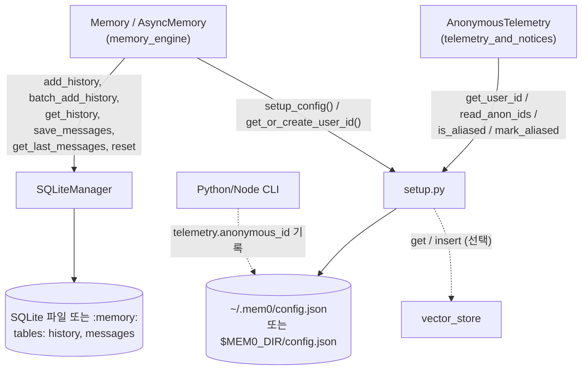
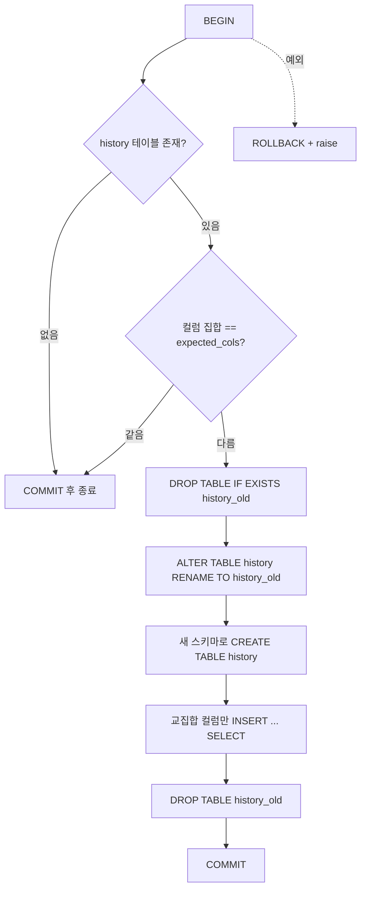
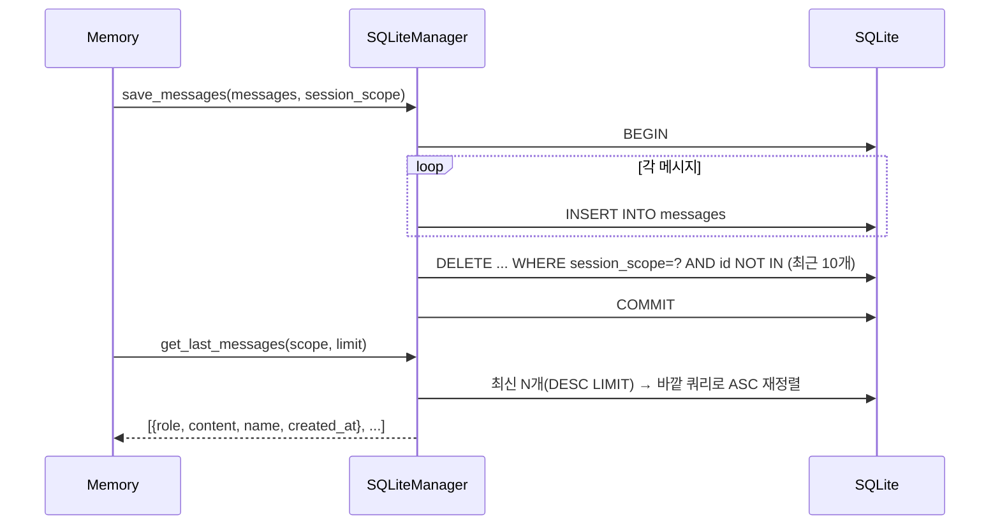
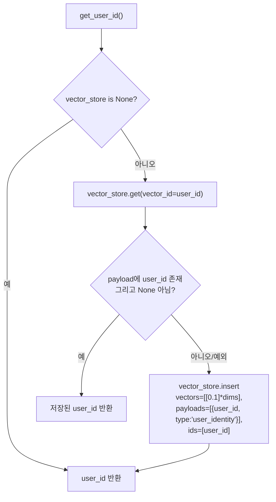

# history_storage_and_setup 모듈

`history_storage_and_setup`은 Python SDK의 OSS `Memory`가 쓰는 **로컬 영속 계층**입니다. 두 파일로 이루어집니다.

| 파일 | 핵심 컴포넌트 | 역할 |
|------|---------------|------|
| `mem0/memory/storage.py` | `SQLiteManager` | 메모리 변경 이력(`history`)과 최근 대화 메시지(`messages`)를 SQLite에 저장 |
| `mem0/memory/setup.py` | `setup_config` 및 보조 함수 | `~/.mem0/config.json`과 익명 `user_id`를 관리 |

상위 모듈은 `py_memory_core`입니다. 이 모듈을 호출하는 쪽은 [memory_engine](memory_engine.md)이고, `setup.py`가 만든 ID를 소비하는 쪽은 [telemetry_and_notices](telemetry_and_notices.md)입니다. TypeScript 쪽 대응 구현은 [ts_oss_history_storage](ts_oss_history_storage.md)에 있습니다.

---

## 1. 아키텍처 개요



두 컴포넌트는 서로 호출하지 않습니다. 둘 다 `Memory`가 초기화 시점에 사용하는 독립된 저장소 어댑터입니다.

---

## 2. SQLiteManager (`mem0/memory/storage.py`)

### 2.1 생성과 스레드 안전성

```python
SQLiteManager(db_path: str = ":memory:")
```

- `sqlite3.connect(db_path, check_same_thread=False)`로 연결 하나를 열고 여러 스레드가 공유합니다.
- 모든 쓰기와 읽기는 `threading.Lock`(`self._lock`)으로 직렬화합니다.
- 쓰기 메서드는 `BEGIN` → 작업 → `COMMIT` 순서로 실행하고, 예외가 나면 `ROLLBACK` 후 로그를 남기고 다시 raise합니다.
- 기본값 `:memory:`는 프로세스 종료 시 데이터가 사라집니다. 영속화하려면 파일 경로를 넘겨야 합니다.

초기화 순서는 `_migrate_history_table()` → `_create_history_table()` → `_create_messages_table()`입니다.

### 2.2 스키마

**`history`** — 메모리 한 건에 일어난 변경 하나가 한 행입니다.

| 컬럼 | 타입 | 설명 |
|------|------|------|
| `id` | TEXT PK | `uuid4`, 삽입 시 자동 생성 |
| `memory_id` | TEXT | 대상 메모리 ID |
| `old_memory` / `new_memory` | TEXT | 변경 전/후 내용. ADD면 old가 `None`, DELETE면 new가 `None`이 되는 것이 일반적 |
| `event` | TEXT | 이벤트 종류(예: ADD/UPDATE/DELETE). 값은 호출자가 정함 |
| `created_at` / `updated_at` | DATETIME | 호출자가 넘긴 문자열을 그대로 저장 |
| `is_deleted` | INTEGER | 0/1. 조회 시 `bool`로 변환 |
| `actor_id` / `role` | TEXT | 변경 주체와 메시지 역할 |

**`messages`** — 세션 범위별 최근 대화 컨텍스트입니다.

| 컬럼 | 설명 |
|------|------|
| `id` | `uuid4` |
| `session_scope` | 세션을 구분하는 키 |
| `role`, `content`, `name` | 메시지 본문 |
| `created_at` | UTC ISO 문자열(`datetime.now(timezone.utc).isoformat()`) |

### 2.3 마이그레이션 (`_migrate_history_table`)

과거 버전의 `history` 테이블에는 그룹 채팅용 컬럼이 있었습니다. 현재 스키마와 컬럼 집합이 다르면 다음 순서로 같은 트랜잭션 안에서 변환합니다.



- 새 스키마에 없는 옛 컬럼의 데이터는 버려집니다. 교집합 컬럼만 복사하기 때문입니다.
- 이전 마이그레이션이 중간에 실패해 `history_old`가 남아 있어도 먼저 지우고 다시 시작합니다.
- 컬럼이 같으면 아무 작업도 하지 않으므로 반복 실행해도 안전합니다.

### 2.4 공개 메서드

| 메서드 | 동작 |
|--------|------|
| `add_history(memory_id, old_memory, new_memory, event, *, created_at, updated_at, is_deleted=0, actor_id, role)` | 이력 한 건 삽입 |
| `batch_add_history(records)` | dict 목록을 `executemany`로 한 트랜잭션에 삽입. 누락된 키는 `None`, `is_deleted`만 기본 0 |
| `get_history(memory_id)` | 해당 메모리의 이력을 `created_at ASC, DATETIME(updated_at) ASC`로 반환. `is_deleted`는 `bool`로 변환 |
| `save_messages(messages, session_scope)` | 메시지를 삽입한 뒤 해당 scope에서 **최근 10개만 남기고 삭제**. 빈 리스트면 바로 반환 |
| `get_last_messages(session_scope, limit=10)` | 최근 `limit`개를 시간 오름차순으로 반환 |
| `reset()` | `history`와 `messages` 테이블을 DROP |
| `close()` | 연결을 닫고 `self.connection = None`으로 설정 |

#### 메시지 보관 정책



- 삭제 쿼리의 서브쿼리를 한 번 더 감싼 것은, SQLite가 `ORDER BY ... LIMIT`을 먼저 확정한 뒤 `NOT IN`을 평가하도록 하기 위해서입니다.
- 한 번의 `save_messages` 호출에서 `now`를 한 번만 계산하므로, 같은 호출의 메시지는 `created_at`이 모두 같습니다. 이 경우 정렬 순서가 삽입 순서와 다를 수 있습니다.
- 보관 개수 10은 `save_messages`에 하드코딩되어 있습니다. `get_last_messages`의 `limit`을 10보다 크게 줘도 10개 넘게는 나오지 않습니다.

### 2.5 수명주기와 주의사항

- `reset()`은 테이블을 DROP만 하고 다시 만들지 않습니다. 코드 주석대로 **호출자가 인스턴스를 새로 만들어 교체해야** 합니다. DROP 이후에 이 인스턴스로 `add_history` 등을 부르면 테이블이 없어 실패합니다.
- `reset()`은 연결이 이미 닫혔으면(`not self.connection`) `RuntimeError`를 던집니다. `close()` 이후의 다른 메서드는 `None.execute`로 `AttributeError`가 납니다.
- `__del__`이 `close()`를 호출합니다. GC 시점에 연결이 정리됩니다.
- `get_history`와 `get_last_messages`는 읽기 전용이라 트랜잭션 없이 락만 잡습니다.
- `batch_add_history`는 레코드 중 하나라도 실패하면 전체가 롤백됩니다.

---

## 3. setup.py (`mem0/memory/setup.py`)

### 3.1 import 시점의 부수 효과

모듈을 import하면 다음이 즉시 실행됩니다.

1. `VECTOR_ID = str(uuid.uuid4())`를 생성합니다.
2. `mem0_dir`를 정합니다. `MEM0_DIR` 환경변수가 있으면 그 값을, 없으면 `~/.mem0`을 씁니다.
3. `os.makedirs(mem0_dir, exist_ok=True)`로 디렉터리를 만듭니다.

따라서 홈 디렉터리가 읽기 전용인 환경(컨테이너, 서버리스 등)에서는 `MEM0_DIR`을 쓰기 가능한 경로로 지정해야 합니다.

### 3.2 config.json 구조

```json
{
  "user_id": "<uuid4>",
  "telemetry": {
    "anonymous_id": "<CLI가 기록>",
    "aliased_pairs": ["<sha256 hex>", "..."]
  }
}
```

- `user_id`는 OSS Python SDK가 쓰는 최상위 키입니다.
- `telemetry.anonymous_id`는 CLI가 쓰는 키입니다.
- 두 값은 어느 표면이 먼저 실행됐느냐에 따라 같이 있을 수도, 하나만 있을 수도 있습니다.

### 3.3 함수 목록

| 함수 | 설명 |
|------|------|
| `_config_path()` | `mem0_dir/config.json` 경로 반환 |
| `_load_config()` | 파일이 없거나 JSON이 깨졌거나 dict가 아니면 `{}` 반환. 예외를 던지지 않음 |
| `_write_config(config)` | 같은 디렉터리의 임시 파일에 쓰고 `flush` + `fsync` 후 `os.replace`로 교체(원자적 쓰기). 실패해도 raise하지 않고 임시 파일을 정리한 뒤 debug 로그만 남김 |
| `setup_config()` | 최상위 `user_id`가 없으면 `uuid4`를 만들어 저장. 멱등 |
| `get_user_id()` | config가 비어 있으면 `"anonymous_user"`, 아니면 `config.get("user_id")`(키가 없으면 `None`) |
| `read_anon_ids()` | `{"oss", "cli", "aliased_pairs"}` 반환 |
| `is_aliased(anon_id, email)` | `anon_id → email` 쌍이 이미 식별됐는지 확인 |
| `mark_aliased(anon_id, email)` | 쌍의 SHA-256 마커를 `telemetry.aliased_pairs`에 추가 |
| `get_or_create_user_id(vector_store=None)` | 벡터 스토어에 `user_id`를 보관하고 반환 |

`setup_config()`가 존재하는 이유는 docstring에 있습니다. CLI가 `telemetry.anonymous_id`만 써 둔 config에서는 최상위 `user_id`가 없고, 그러면 `get_user_id()`가 `None`을 반환하여 OSS Python 텔레메트리가 조용히 버려집니다. 이를 막기 위해 누락된 `user_id`를 채웁니다.

### 3.4 alias 마커

`_alias_pair_marker`는 `sha256(f"{anon_id}\0{email}")`의 hex 값입니다. 이메일 원문을 로컬 파일에 남기지 않으면서, 같은 `(anon_id, email)` 쌍에 대해 `$identify` 이벤트가 한 번만 나가도록 합니다. `anon_id`나 `email`이 비어 있으면 `is_aliased`는 `False`를 반환하고 `mark_aliased`는 아무 일도 하지 않습니다.

### 3.5 get_or_create_user_id 흐름



- `dims`는 `vector_store.embedding_model_dims`를 쓰고, 없으면 1536을 씁니다.
- `get`과 `insert`의 예외는 모두 삼킵니다. 텔레메트리 초기화가 벡터 스토어 문제로 실패하지 않게 하려는 의도입니다.
- 조회가 성공했더라도 payload가 맞지 않으면 다시 insert하므로, 같은 ID의 레코드가 다시 쓰일 수 있습니다.

---

## 4. 설계 특성 요약

| 항목 | 저장소(`SQLiteManager`) | 설정(`setup.py`) |
|------|-------------------------|------------------|
| 동시성 | 단일 연결 + `threading.Lock` | 락 없음. 원자적 `os.replace`로 파일 손상만 방지 |
| 오류 정책 | 로그 후 **전파** | **삼킴**(debug 로그). 부가 기능이 본 기능을 막지 않음 |
| 영속성 | `db_path` 지정 시 파일, 기본은 메모리 | 항상 파일 |
| 멱등성 | 마이그레이션과 `CREATE IF NOT EXISTS` | `setup_config()` |

`setup.py`의 동시 쓰기는 마지막 쓴 쪽이 이깁니다. 두 프로세스가 동시에 `mark_aliased`를 호출하면 한쪽의 마커가 유실될 수 있습니다. 텔레메트리 용도라 허용되는 한계입니다.

## 5. 관련 문서

- [memory_engine](memory_engine.md): `Memory`/`AsyncMemory`가 `SQLiteManager`로 이력을 기록하고 메시지 컨텍스트를 읽습니다.
- [telemetry_and_notices](telemetry_and_notices.md): `get_user_id`, `read_anon_ids`, `is_aliased`, `mark_aliased`를 사용합니다.
- [ts_oss_history_storage](ts_oss_history_storage.md): TypeScript OSS의 `SQLiteManager`, `MemoryHistoryManager`, `SupabaseHistoryManager`, `DummyHistoryManager`.
- [cli_python_telemetry](cli_python_telemetry.md): `telemetry.anonymous_id`를 기록하는 CLI 쪽 구현.
