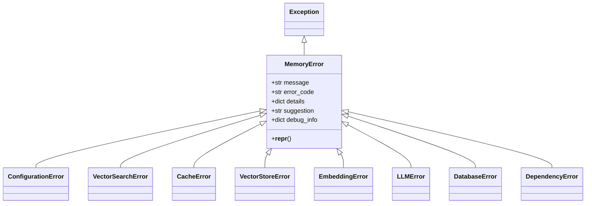
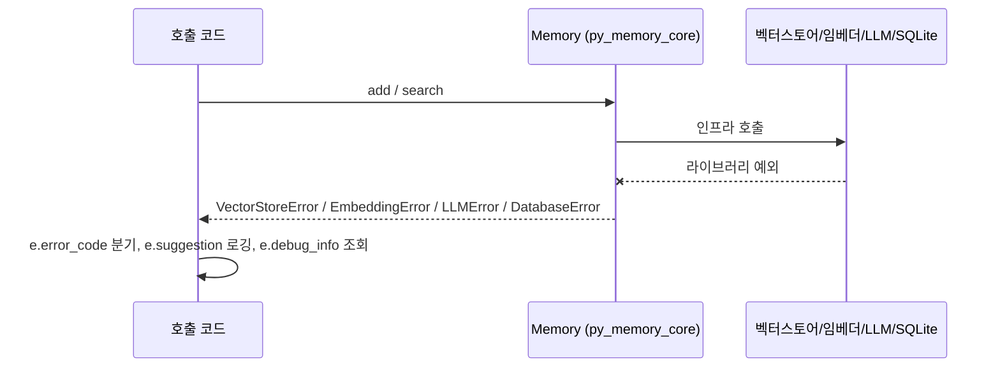
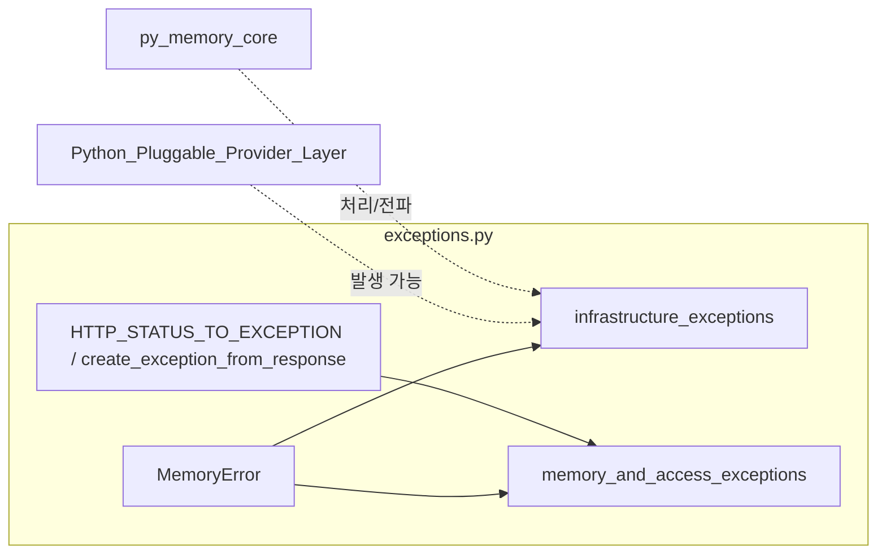

# infrastructure_exceptions 모듈

`mem0/exceptions.py`에 정의된 예외 계층 중 **인프라·구성 계열** 예외 8개(`CacheError`, `ConfigurationError`, `DatabaseError`, `DependencyError`, `EmbeddingError`, `LLMError`, `VectorSearchError`, `VectorStoreError`)를 다룬다. 모두 공통 베이스 `MemoryError`를 상속하며, 벡터 스토어·임베더·LLM·SQLite·선택적 의존성·설정 등 Mem0가 의존하는 외부/내부 인프라의 실패를 구조화된 형태(에러 코드, 제안, 디버그 정보)로 전달한다.

사용자·권한·쿼터 등 도메인/접근 계열 예외(`AuthenticationError`, `RateLimitError`, `MemoryNotFoundError` 등)는 [memory_and_access_exceptions](memory_and_access_exceptions.md)를 참고한다. 상위 모듈은 [py_memory_core](py_memory_core.md)이다.

## 1. 아키텍처



두 가지 부류로 나뉜다.

| 부류 | 클래스 | 특징 |
|------|--------|------|
| 일반(클라이언트/공통) | `ConfigurationError`, `VectorSearchError`, `CacheError` | `pass` 본문. 생성 시 `message`, `error_code`를 **반드시** 전달해야 함 |
| OSS 전용 | `VectorStoreError`, `EmbeddingError`, `LLMError`, `DatabaseError`, `DependencyError` | 기본 `error_code`와 `suggestion`이 `__init__`에 내장되어 `message`만으로 생성 가능 |

## 2. 컴포넌트 상세

### 2.1 베이스 `MemoryError` (참고)
`message`, `error_code`, `details`(기본 `{}`), `suggestion`, `debug_info`(기본 `{}`)를 속성으로 저장하고 `super().__init__(message)`를 호출한다. 내장 `MemoryError`(Python 빌트인)를 가리므로, 이 모듈에서 import할 때 이름 충돌에 주의해야 한다.

### 2.2 예외별 기본값

| 예외 | 기본 `error_code` | 기본 `suggestion` | 주 용도 |
|------|-------------------|-------------------|---------|
| `ConfigurationError` | 없음(필수 지정) | 없음 | API 키 누락, 잘못된 host URL, 호환되지 않는 옵션, 환경 변수 누락 |
| `VectorSearchError` | 없음(필수 지정) | 없음 | 벡터 검색 쿼리/인덱스 실패, 차원 불일치, 타임아웃 |
| `CacheError` | 없음(필수 지정) | 없음 | 캐시 조회/무효화/손상 |
| `VectorStoreError` | `VECTOR_001` | "Please check your vector store configuration and connection" | 벡터 스토어 저장·유사도 검색·연산 실패 |
| `EmbeddingError` | `EMBED_001` | "Please check your embedding model configuration" | 임베딩 생성/모델 오류 |
| `LLMError` | `LLM_001` | "Please check your LLM configuration and API key" | LLM 생성·추론 오류 |
| `DatabaseError` | `DB_001` | "Please check your database configuration and connection" | SQLite 등 DB 작업·연결 오류 |
| `DependencyError` | `DEPS_001` | "Please install the required dependencies" | 선택적 패키지 누락 (예: `pip install kuzu`) |

> `VectorSearchError`(일반)와 `VectorStoreError`(OSS)는 의미가 유사하지만 별개의 클래스이며 상속 관계가 없다. 한쪽을 잡는다고 다른 쪽이 잡히지 않는다.

## 3. 사용 흐름



```python
from mem0.exceptions import DependencyError, LLMError

try:
    raise DependencyError(
        message="Required dependency missing",
        details={"package": "kuzu", "feature": "graph_store"},
    )
except DependencyError as e:
    print(e.error_code)   # DEPS_001
    print(e.suggestion)   # Please install the required dependencies
```

## 4. 시스템 내 위치와 연관 컴포넌트



- 제공자 계층(벡터 스토어, 임베딩, LLM)과 `setup_config` 등에서 발생·변환되는 예외 대상은 [Python_Pluggable_Provider_Layer](Python_Pluggable_Provider_Layer.md)와 [history_storage_and_setup](history_storage_and_setup.md)를 참고한다.
- `create_exception_from_response`와 `HTTP_STATUS_TO_EXCEPTION`은 HTTP 상태 코드를 `ValidationError`, `AuthenticationError`, `NetworkError`, `RateLimitError` 등으로 매핑한다. **이 모듈의 8개 예외는 해당 매핑에 포함되지 않는다.** 즉 인프라 예외는 HTTP 응답이 아니라 SDK 내부 로직에서 직접 raise된다.
- `ValidationError`, `NetworkError`는 같은 파일에 정의되어 있으나 이 모듈의 핵심 컴포넌트가 아니다. 호스티드 클라이언트의 오류 처리는 [py_hosted_client](py_hosted_client.md)를 참고한다.

## 5. 유지보수 시 유의점

- 새 인프라 예외를 추가할 때는 OSS 전용 부류 패턴(기본 `error_code`·`suggestion`을 `__init__`에 내장)을 따른다.
- `error_code`는 프로그램적 분기용 식별자이므로 기존 값(`VECTOR_001`, `EMBED_001`, `LLM_001`, `DB_001`, `DEPS_001`)을 변경하면 호출자 코드가 깨질 수 있다.
- OSS 전용 예외의 `__init__`은 `details: dict = None`처럼 `Optional` 없이 선언되어 있다. 동작에는 문제가 없고, 베이스에서 `or {}`로 처리된다.
- 공개 API 변경 시 저장소 규칙에 따라 `docs/`를 같은 PR에서 갱신해야 한다.
