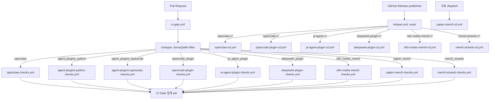
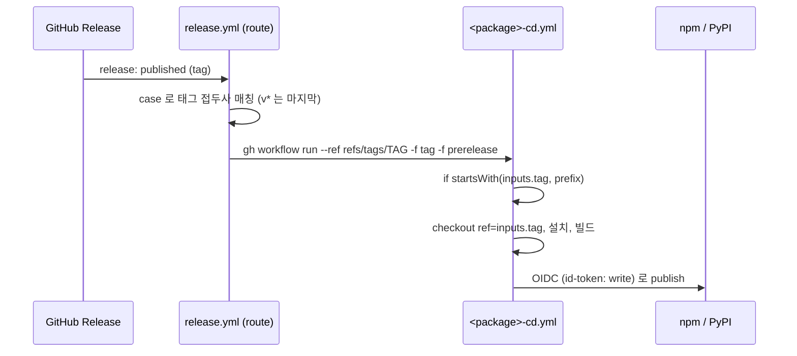

# integrations_ci_cd 모듈

`integrations_ci_cd`는 `integrations/` 아래 에이전트·워크플로 도구 연동 패키지(플러그인, n8n, Zapier, Strands 등)를 검증(CI)하고 배포(CD)하는 GitHub Actions 워크플로 모음이다. 상위 모듈 [CI_CD_and_Repository_Governance](CI_CD_and_Repository_Governance.md)의 하위 모듈이며, 형제 모듈은 [root_ci_cd_pipeline](root_ci_cd_pipeline.md), [repo_governance_workflows](repo_governance_workflows.md), [cli_ci_cd](cli_ci_cd.md)이다.

> 주의: `.github/workflows/`는 메인테이너의 명시적 승인 없이 수정하지 않는다. npm/PyPI의 trusted publisher 설정이 **워크플로 파일명**에 묶여 있으므로 CD 파일 이름을 바꾸면 배포가 깨진다 (`.github/CLAUDE.md`).

## 1. 구성 요소

| 대상 패키지 | CI 워크플로 (`*-checks.yml`) | CD 워크플로 (`*-cd.yml`) | 릴리스 태그 접두사 | 배포처 |
|---|---|---|---|---|
| Agent Plugins (Python) | `agent-plugins-python-checks.yml` | (없음) | - | - |
| Agent Plugins (TypeScript 공유 코어) | `agent-plugins-typescript-checks.yml` | (없음) | - | - |
| DeepSeek plugin | `deepseek-plugin-checks.yml` | `deepseek-plugin-cd.yml` | `deepseek-plugin-v*` | npm `@mem0/deepseek-plugin` |
| mem0-strands | `mem0-strands-checks.yml` | `mem0-strands-cd.yml` | `mem0-strands-v*` | PyPI `mem0-strands` |
| n8n-nodes-mem0 | `n8n-nodes-mem0-checks.yml` | `n8n-nodes-mem0-cd.yml` | `n8n-nodes-mem0-v*` | npm |
| OpenClaw | `openclaw-checks.yml` | `openclaw-cd.yml` | `openclaw-v*` | npm `@mem0/openclaw-mem0` |
| OpenCode plugin | `opencode-plugin-checks.yml` | `opencode-plugin-cd.yml` | `opencode-v*` | npm `@mem0/opencode-plugin` |
| Pi agent plugin | `pi-agent-plugin-checks.yml` | `pi-agent-plugin-cd.yml` | `pi-agent-v*` | npm `@mem0/pi-agent-plugin` |
| Zapier app | `zapier-mem0-checks.yml` | `zapier-mem0-cd.yml` | (라우터 미사용, 수동) | Zapier 플랫폼 |

Vercel AI SDK의 CD(`vercel-ai-cd.yml`)는 [root_ci_cd_pipeline](root_ci_cd_pipeline.md)에서 다룬다. 이 모듈이 검증·배포하는 대상 코드는 [Coding-Agent_Memory_Plugins_and_Shared_Plugin_Core](Coding-Agent_Memory_Plugins_and_Shared_Plugin_Core.md)와 [Framework_and_Workflow-Tool_Integrations](Framework_and_Workflow-Tool_Integrations.md)에 설명되어 있다.

## 2. 아키텍처

CI는 `ci-gate.yml`(루트 모듈)이 PR마다 변경 경로를 감지해 이 모듈의 `*-checks.yml`을 reusable workflow(`workflow_call`)로 호출하는 구조다. CD는 `release.yml`(Release Router)이 태그 접두사를 보고 해당 `*-cd.yml`을 `workflow_dispatch`로 호출한다.



### 트리거 규칙
모든 `*-checks.yml`은 `workflow_call`, `workflow_dispatch`, `push`(main, `paths` 필터) 트리거를 가진다. `pull_request` 트리거는 의도적으로 없다. PR 시에는 `ci-gate.yml`이 호출하며, 필수 상태 체크는 `CI Gate` 하나뿐이다. 단, `ci-gate.yml`의 `n8n_nodes_mem0` 필터는 다른 필터와 달리 `ci-gate.yml` 자체 경로를 포함하지 않는다.

## 3. CI 워크플로 상세

| 워크플로 | job | 런타임/매트릭스 | 주요 단계 |
|---|---|---|---|
| `agent-plugins-python-checks.yml` | `test` | Python 3.10/3.11/3.12 (`fail-fast: false`) | 모든 버전: `compileall` 호환성 검사. 3.10: `pytest`만 설치해 `claude-code-plugin/tests`의 `test_memory_core.py`, `test_telemetry.py` 실행. 3.12: `ruff check`, `build.py <host> --kind native --check`(claude-code, cursor, codex, kimi, antigravity) 및 `mem0-agent-plugin --kind portable --check`로 생성 번들 최신 여부 검증. 3.11/3.12: 전체 pytest(`claude-code-plugin/tests/integration` 제외) |
| `agent-plugins-typescript-checks.yml` | `test` | Node 22, pnpm 10 | `pnpm install --frozen-lockfile` → `pnpm typecheck` → `pnpm test` (`integrations/agent-plugin-core/typescript`) |
| `deepseek-plugin-checks.yml` | `lint`, `test`, `build` | Node 20(lint/build), 20·22(test), pnpm 9 | `tsc --noEmit`, `vitest run`, `pnpm build` 후 `conformance/artifacts.py deepseek` |
| `openclaw-checks.yml` | `lint`, `test`, `build` | Node 20·22 | `tsc --noEmit`, `vitest run --coverage`(Node 20에서만 Codecov 업로드, `CODECOV_TOKEN`), 빌드 후 `artifacts.py openclaw` |
| `opencode-plugin-checks.yml` | `build` | Bun latest | `bun install --frozen-lockfile` → `type-check` → `bun test` → `build` → `artifacts.py opencode` |
| `pi-agent-plugin-checks.yml` | `lint`, `test`, `build` | Node 20·22 | `tsc --noEmit`, `vitest run`, 빌드 후 `artifacts.py pi-agent` |
| `n8n-nodes-mem0-checks.yml` | `lint`, `test`, `build` | Node 20 | `--ignore-scripts` 설치, `lint`, `test`, `build` 후 `dist/nodes/Mem0/Mem0.node.js`, `dist/credentials/Mem0Api.credentials.js`, `dist/nodes/Mem0/mem0.svg` 존재 확인 |
| `zapier-mem0-checks.yml` | `validate` | Node 22 | `pnpm build` → `zapier-platform-cli@19 validate` → `pnpm test:unit`(오프라인, 모킹). 실제 Mem0 API를 쓰는 E2E는 CI에서 제외 |
| `mem0-strands-checks.yml` | `lint`, `test`, `build` | Python 3.12(lint/build), 3.10~3.12(test) | `ruff check`, `ruff format --check`, `mypy src`, `pytest`, `hatch build --clean` 후 wheel·sdist 존재 확인 |

### 공통 패턴
- **패키지 산출물 검증**: TypeScript 플러그인(deepseek, openclaw, opencode, pi-agent)은 빌드 후 `integrations/agent-plugin-core/conformance/artifacts.py <name>`으로 배포 아티팩트가 규격에 맞는지 확인한다.
- **공유 코어 변경 전파**: TS 플러그인들의 `push` 경로 필터에 `integrations/agent-plugin-core/typescript/**`가 포함되어, 공유 코어가 바뀌면 각 소비 패키지 CI가 다시 돈다.
- **생성물 드리프트 검사**: Python 플러그인은 `build.py ... --check`로 커밋된 번들이 소스와 일치하는지 검증한다.
- **의존성 고정**: 전 워크플로가 `pnpm install --frozen-lockfile`(opencode는 `bun install --frozen-lockfile`)을 사용한다.

## 4. CD 워크플로 상세

모든 `*-cd.yml`(Zapier 제외)은 동일한 골격이다.



- **입력**: `tag`(필수), `prerelease`(boolean, 기본 false). `if: startsWith(inputs.tag, '<prefix>')`로 다른 패키지 태그의 오배포를 막는다.
- **권한**: `permissions: id-token: write`. 장기 토큰 없이 OIDC trusted publishing을 사용한다 (`ZAPIER_DEPLOY_KEY`만 예외).
- **npm**: `npx npm@latest publish --provenance --access public`. `prerelease=true`이면 버전의 preid(`version.split('-')[1].split('.')[0]`)를 dist-tag로 사용한다.
- **PyPI** (`mem0-strands-cd.yml`): Python 3.11 + `pip install hatch` → `hatch build --clean` → `pypa/gh-action-pypi-publish@release/v1` (`packages-dir: integrations/mem0-strands/python/dist/`). PyPI의 사전 릴리스는 버전 문자열 자체로 표현하므로 `prerelease` 입력은 무시된다.
- **툴체인 차이**: deepseek/openclaw/pi-agent는 pnpm 9 + Node 22, n8n은 Node 20 + `--ignore-scripts`, opencode는 Bun + Node 22(`npm publish` 용).
- **Zapier**: `zapier-mem0-cd.yml`은 `workflow_dispatch`만 있으며 npm 라우터에 연결되지 않는다. 빌드 후 `npx zapier-platform-cli@19 push`를 `ZAPIER_DEPLOY_KEY` 시크릿으로 실행한다. 실행: `gh workflow run zapier-mem0-cd.yml --ref main`.

### 재배포
릴리스를 지우고 다시 만들지 말고 해당 워크플로를 직접 dispatch한다.

```bash
gh workflow run <package>-cd.yml --ref refs/tags/<tag> -f tag=<tag>
```

## 5. 새 패키지 추가 절차

1. `<pkg>-checks.yml` 작성: `workflow_call` + `push`(paths) + `workflow_dispatch`, `pull_request` 금지.
2. `ci-gate.yml`의 `changes` 필터 추가, 호출 job 추가, `gate`의 `needs`에 등록.
3. `<pkg>-cd.yml` 작성(`workflow_dispatch` 전용, `tag`/`prerelease` 입력, `id-token: write`).
4. `release.yml`의 `case`에 태그 접두사를 추가하되 bare `v*`는 마지막에 둔다.
5. 레지스트리에서 trusted publisher를 워크플로 파일명에 맞춰 설정. npm 신규 패키지의 첫 배포는 수동으로 해야 한다.

## 6. 참고한 파일

- `.github/workflows/*-checks.yml`, `.github/workflows/*-cd.yml` (위 표의 파일들)
- `.github/workflows/ci-gate.yml`, `.github/workflows/release.yml`
- `.github/CLAUDE.md` (CI/CD 운영 규칙)
- `integrations/agent-plugin-core/conformance/artifacts.py`, `integrations/agent-plugin-core/build/build.py`
