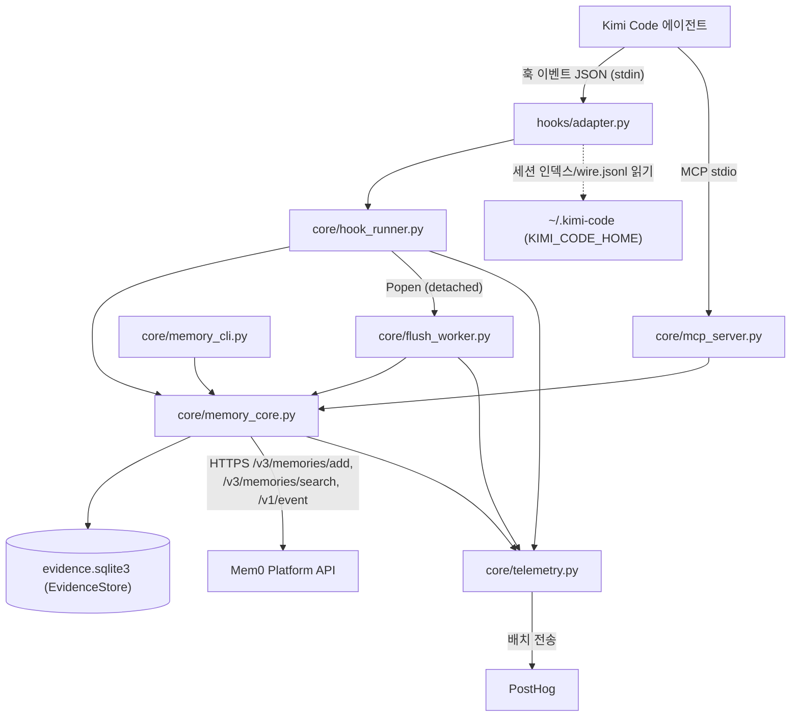
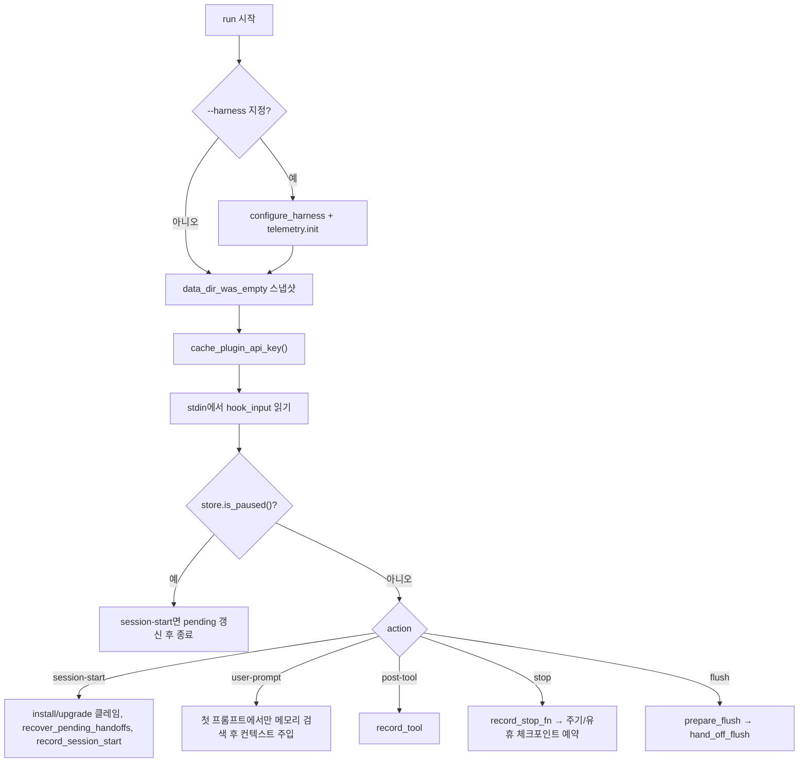
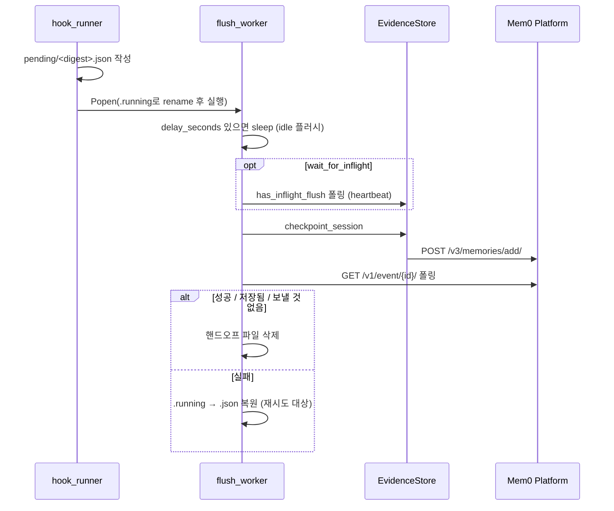
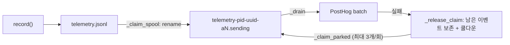

# kimi_plugin 모듈

`integrations/kimi-plugin`은 **Kimi Code**(Moonshot의 코딩 에이전트)에 Mem0 장기 메모리를 붙이는 플러그인입니다. Kimi Code의 훅 이벤트를 공유 Mem0 런타임(`core/`)이 이해하는 형태로 변환하고, 세션 중 발생한 작업 기록을 로컬 SQLite에 쌓은 뒤 Mem0 플랫폼(`https://api.mem0.ai`)으로 보내 메모리로 추출합니다. 이후 작업에서는 훅 자동 주입 또는 MCP 도구 `search_memories`로 과거 메모리를 검색합니다.

이 모듈은 다른 에이전트 플러그인(Claude Code, Codex, Cursor, Antigravity)과 **같은 공유 코어를 복제 배포한 것**이며, Kimi 전용 코드는 `hooks/adapter.py` 하나뿐입니다. 공유 코어의 원본과 빌드·적합성 검사는 [Coding-Agent_Memory_Plugins_and_Shared_Plugin_Core](Coding-Agent_Memory_Plugins_and_Shared_Plugin_Core.md) 문서(`agent_plugin_core_python`, `agent_plugin_core_build_conformance`)를 참고하세요. 형제 플러그인은 `claude_code_plugin`, `codex_plugin`, `cursor_plugin`, `antigravity_plugin`, `mem0_agent_plugin` 하위 모듈에 정리되어 있습니다.

## 구성 파일

| 파일 | 역할 |
|------|------|
| `hooks/adapter.py` | Kimi 전용 어댑터. Kimi 훅 이벤트 → `hook_runner` 액션 변환, 페이로드 정규화, 트랜스크립트에서 마지막 어시스턴트 응답 추출 |
| `core/hook_runner.py` | 모든 플러그인이 공유하는 훅 오케스트레이션(`run`, `entry_point`, `default_record_stop`) |
| `core/memory_core.py` | 로컬 증거 저장소 `EvidenceStore`, 저장소 식별, 플랫폼 API 호출, 검색/플러시/삭제/진단 |
| `core/flush_worker.py` | 분리(detached) 프로세스로 실행되는 원격 체크포인트 워커 |
| `core/mcp_server.py` | stdio JSON-RPC 기반 MCP 서버. 도구 `search_memories` 하나를 노출 |
| `core/memory_cli.py` | 사용자 제어/진단 CLI (`status`, `doctor`, `pause`, `resume`, `forget`) |
| `core/telemetry.py` | 로컬 스풀 + 분리 전송기 방식의 사용량 텔레메트리(PostHog) |

> `core/*.py`의 임포트(`import telemetry`, `from memory_core import ...`)는 플랫(flat) 모듈 방식입니다. `hooks/adapter.py`가 `sys.path`에 `core` 디렉터리를 먼저 삽입하며, 번들 `core/`가 없으면 `core/python`(저장소 공유 소스)으로 폴백합니다. 또한 빌드가 생성하는 `_harness_id` 모듈(`HARNESS_ID`, `SOURCE_TAG`, `PLATFORM_SOURCE`, `PLATFORM_APPLICATION`)이 있으면 이를 읽고, 없으면 `generic`/`MEM0_PLUGIN` 기본값을 사용합니다.

## 아키텍처



## hooks/adapter.py (Kimi 전용 계층)

`main()`은 `argv[1]`로 Kimi 이벤트 이름을 받아 `EVENTS` 매핑으로 `hook_runner`의 액션으로 변환합니다.

| Kimi 이벤트 | hook_runner 인자 |
|-------------|------------------|
| `SessionStart` | `session-start` |
| `UserPromptSubmit` | `user-prompt` |
| `PostToolUse` | `post-tool` |
| `PostToolUseFailure` | `post-tool-failure` (extra action, `record_tool(..., failed=True)`) |
| `Stop` | `stop` |
| `PreCompact` | `flush --reason pre-compact` |
| `SessionEnd` | `flush --reason session-end` |

핵심 동작:

- **`normalize(payload)`**: Kimi 필드를 공유 코어 스키마로 맞춥니다. `tool_output`/`error` → `tool_response`, `response` → `last_assistant_message`. `Stop` 이벤트에서는 `_session_dir()`로 세션 디렉터리를 찾고 `agents/main/wire.jsonl`을 `transcript_path`로 설정한 뒤 `_last_assistant_message()`로 마지막 응답을 보충합니다.
- **`_session_dir()`**: `$KIMI_CODE_HOME`(기본 `~/.kimi-code`)의 `session_index.jsonl`에서 `sessionId`로 `sessionDir`을 찾고, 없으면 `sessions/*/<session_id>`를 글롭합니다. 경로 이탈을 막기 위해 `session_id`가 파일명 단독 형태인지 검사합니다.
- **`_last_assistant_message()`**: wire 로그의 `context.append_loop_event` 레코드에서 `step.begin` → `content.part`(text) → `step.end` 순서로 텍스트를 조립합니다. `finishReason`이 `error`/`interrupted`인 스텝은 버립니다.
- **하네스 설정**: `configure_harness("kimi", data_dir_name="kimi-plugin", source_tag="kimi_plugin")`, `telemetry.init(harness="kimi", source_tag="KIMI_PLUGIN")`. 로컬 데이터 디렉터리는 기본 `~/.mem0/kimi-plugin`입니다.
- **자동 플러시 사유**: `automatic_flush_reasons={"session-end", "pre-compact"}`.
- **출력 변환**: `hook_runner.run()`의 stdout을 가로채, `UserPromptSubmit`일 때만 JSON의 `hookSpecificOutput.additionalContext`를 꺼내 **평문으로 출력**합니다(Kimi가 그대로 컨텍스트로 주입).
- **Fail-open**: 예외는 `hook_runner.log_failure()`로 `plugin-errors.log`에 기록하고 종료 코드 0으로 끝납니다. 훅이 에이전트를 막지 않습니다.

## core/hook_runner.py (훅 오케스트레이션)

`run()`은 `session-start | user-prompt | post-tool | stop | flush` 및 `extra_actions`를 처리하는 argparse 진입점입니다.



주요 동작:

- **첫 프롬프트 검색** (`first_prompt_memory_output`): 세션의 첫 프롬프트이고 길이가 `MEM0_CODE_MIN_QUERY_CHARS`(기본 20) 이상일 때만 `top_k=5`, 타임아웃 2초로 검색합니다. 결과는 `format_context()`로 포맷해 `additionalContext`로 반환합니다.
- **Stop 처리**: `default_record_stop`이 `last_assistant_message`를 redact 후 기록합니다. 이어서 `schedule_periodic_checkpoint`(교환 5회/메시지 10개/원문 40,000자 도달 시)를 시도하고, 아니면 `schedule_idle_flush`(`MEM0_CODE_IDLE_FLUSH_SECONDS`, 기본 300초 지연)를 예약합니다.
- **Flush 처리**: `MEM0_CODE_SYNC_FLUSH=1`이면 동기 실행, 아니면 `hand_off_flush`로 `pending/` 디렉터리에 핸드오프 JSON을 원자적으로 쓰고 `_launch_handoff`가 `flush_worker.py`를 분리 프로세스(`detached_process_kwargs`)로 띄웁니다. 이미 진행 중인 플러시가 있고 사유가 `session-end`면 `wait_for_inflight=True`로 대기형 핸드오프를 만듭니다.
- **복구** (`recover_pending_handoffs`): `session-start`마다 300초 넘게 갱신 안 된 `*.running`을 `.json`으로 되돌리고, 7일 넘은 핸드오프는 삭제하며, 오래된 순으로 최대 5개를 재실행합니다.
- **일시정지**: `store.is_paused()`가 참이면 아무것도 기록/검색하지 않습니다.
- **환경 변수**: `MEM0_CODE_AUTO_FLUSH`(기본 true)로 자동 플러시를 끌 수 있습니다.

## core/flush_worker.py (분리 체크포인트 워커)

Claude Code 계열 호스트가 프로세스 종료 시 `SessionEnd` 훅을 취소할 수 있어, 훅은 입력을 먼저 디스크에 영속화하고 이 워커를 새 세션으로 실행합니다.



- 종료 시 항상 `telemetry.flush()`를 호출합니다.
- 완료 상태는 `semantic-succeeded`, `explicitly-stored`, `nothing-to-flush`입니다.
- `touch_handoff_heartbeat()`가 파일 mtime을 갱신해 복구 로직이 살아 있는 워커를 재실행하지 않게 합니다.

## core/memory_core.py (공유 코어)

### 저장소 식별과 스코프
- `_resolve_repo_cached`/`resolve_repo`: git 루트·원격 URL·브랜치·HEAD를 읽어 `RepoContext`를 만듭니다. 원격 URL은 `_normalize_remote`로 정규화하며, 원격이 없으면 `local:<경로>` 식별자를 씁니다.
- `app_id`는 레거시 프로젝트 이름(`_legacy_project_id`), `project_id`는 호스트 해시가 포함된 공유 네임스페이스(`_project_id`), `directory`는 루트 기준 상대 경로입니다. `directory_app_id()`는 `repo/path` 형태를 반환합니다.
- `_scope_value`는 `*` 같은 와일드카드를 식별자로 거부해 범위가 넓어지는 것을 막습니다.
- `EvidenceStore.repo_for_session`은 세션 첫 훅에서 스코프를 `session_scopes`에 고정해, 세션 중 `cwd`가 바뀌어도 같은 프로젝트로 취급합니다.

### 로컬 증거 저장소 `EvidenceStore`
SQLite(WAL, `busy_timeout=10000`) 파일 `evidence.sqlite3`. DB가 손상되면 `-wal`/`-shm` 포함 `.corrupt-<stamp>`로 격리하고 새로 시작합니다(`db_quarantined` 텔레메트리).

| 테이블 | 용도 |
|--------|------|
| `events` | 훅이 기록한 이벤트(`session_start`, `user_prompt`, `tool_result`, `tool_failure`, `assistant_stop`, `subagent_*`), `flush_id`로 플러시 패킷에 묶임 |
| `session_scopes` | 세션별로 고정된 저장소 스코프 |
| `flushes` | 플러시 패킷 상태(`prepared`, `semantic-queued`, `semantic-succeeded`, `gave-up` 등), 시도 횟수, 이벤트 ID |
| `retrievals` | 세션에 이미 주입한 메모리(중복 주입 방지, 서브에이전트 재사용) |
| `operations` | 검색/플러시 소요 시간과 성공 여부(CLI `status`에서 사용) |
| `sidekick_runs` | 서브에이전트 실행 기록 |
| `settings` | `paused` 등 사용자 설정 |

`record_assistant_response`는 `BEGIN IMMEDIATE`로 직렬화해 Stop/SessionEnd 훅이 같은 응답을 중복 기록하지 않게 합니다. `prepare_flush`는 `MAX_FLUSH_ATTEMPTS`(5) 초과 시 패킷을 `gave-up`으로 표시합니다.

### 체크포인트와 추출
1. `select_checkpoint_events`: 한 교환을 쪼개지 않고, 5교환/10메시지/40,000자 중 하나에 도달한 첫 `assistant_stop`까지를 하나의 블록으로 선택합니다(`force=True`면 전부).
2. `build_episode` → `build_extraction_messages`: 사용자/어시스턴트 메시지와, 변경 경로·실패한 명령 등 보충 증거를 구성합니다. 테스트/빌드 성공 결과는 추출을 흐리지 않도록 의도적으로 제외합니다.
3. `extraction_message_batches`: 토큰 추정치(`MAX_EXTRACTION_INPUT_TOKENS`=24,000) 기준으로 교환 단위 → 메시지 분할 순으로 배치를 나눕니다.
4. `flush_session`: 배치마다 `POST /v3/memories/add/`를 호출합니다. 본문에는 `agent_id`(공유 프로젝트), `user_id`, `app_id`, `run_id`(세션), `PROJECT_MEMORY_INSTRUCTIONS`/`PERSONAL_MEMORY_INSTRUCTIONS`, `CODING_MEMORY_CATEGORIES`, `infer: true`가 들어갑니다. 이후 `_wait_for_event`가 `/v1/event/{id}/`를 `SUCCEEDED`/`FAILED`/`TIMEOUT`까지 폴링(기본 120초)합니다. 이벤트 ID는 `flushes.semantic_event_id`에 JSON 배열로 저장되어 재시도 시 이어서 처리됩니다. 남은 미플러시 이벤트가 있으면 재귀적으로 이어서 플러시합니다.

메모리 카테고리: `project_knowledge`, `decisions_and_constraints`, `workflows`, `problems_and_fixes`, `results`.

### 검색
`search_memories`는 `POST /v3/memories/search/`를 호출하며 `rerank: false`, `latest_only: true`입니다. 범위(`SEARCH_SCOPES`):

| scope | 의미 |
|-------|------|
| `repo` (기본) | 저장소 공유 메모리 + 내 개인 선호 |
| `dir` | 공유 부분을 현재 디렉터리(`metadata.dirs`)로 제한 |
| `mine` | 내 개인 메모리만 |

`category`, `run_id` 필터를 추가할 수 있고, `record_kind == "task_episode"` 결과는 제외합니다. 세션이 있으면 `unseen`/`mark_injected`로 이미 보여준 메모리를 거릅니다. `format_context`와 `combine_context`는 문자 예산(`MEM0_CODE_MAX_CONTEXT_CHARS`, 기본 4,000, 1,000~10,000로 clamp)과 중복 제거를 적용하며, 기본 브랜치가 아닌 곳에서 학습된 메모리에는 `[learnt on branch ...]`를 붙입니다.

### 서브에이전트
`record_subagent_start`는 메인 대화에 이미 주입된 메모리를 `combine_context`로 모아 반환하고, 해당 에이전트의 첫 시작일 때만 컨텍스트를 전달합니다. `record_subagent_stop`은 최종 메시지를 기록합니다. (Kimi 어댑터의 `EVENTS`에는 서브에이전트 이벤트가 매핑되어 있지 않으므로, 이 함수들은 공유 코드에 포함되어 있을 뿐 Kimi 경로에서는 호출되지 않습니다.)

### 설정·보안
- **API 키 해석 순서**: `MEM0_API_KEY` → `PLUGIN_OPTION_API_KEY` → `CLAUDE_PLUGIN_OPTION_API_KEY` → `CLAUDE_PLUGIN_OPTION_MEM0_API_KEY` → `<data_dir>/api-key`. `cache_plugin_api_key`는 권한 `0600`으로 원자적으로 캐시하고, `clear_stale_api_key_cache`는 모든 소스가 사라지면 캐시를 지웁니다.
- **user_id 해석**: 플러그인 옵션 → `MEM0_USER_ID` → `MEM0_RESOLVED_USER_ID` → `USER` → `USERNAME` → `default`.
- **데이터 디렉터리**: `MEM0_CODE_DATA_DIR` → `MEM0_PLUGIN_DATA_DIR` → `PLUGIN_DATA` → `CLAUDE_PLUGIN_DATA` → `~/.mem0/<data_dir_name>`.
- **비밀 마스킹**: `redact()`가 `SECRET_PATTERNS`(Bearer 토큰, API 키, AWS/GitHub/Slack 토큰, 개인 키 블록, JSON 비밀 필드 등)를 `[REDACTED]`로 치환합니다. 로컬에 저장하는 모든 텍스트는 `bounded()`를 통해 마스킹 + 길이 제한됩니다.
- **요청 헤더** (`platform_headers`): `Authorization: Token ...`, `X-Mem0-Source`, `X-Mem0-Client: mem0-plugin/<PLUGIN_VERSION>`(현재 `0.3.3`), `X-Application`(있을 때).
- **네트워크**: `urllib`만 사용(표준 라이브러리). 검색은 일시적 연결 실패 시 한 번 재시도합니다(`_request_json_with_network_retry`).
- `detached_process_kwargs()`는 POSIX에서 `start_new_session`, Windows에서 `DETACHED_PROCESS | CREATE_NEW_PROCESS_GROUP`을 사용합니다.

### 진단과 삭제
- `doctor()`: Python ≥ 3.10, 데이터 디렉터리 쓰기 가능, API 키, 저장소, user_id, 읽기 전용 검색으로 인증 확인을 점검합니다.
- `forget_remote_repo()`: `/v2/memories/`를 페이지네이션(페이지 100, 최대 50페이지)해 사용자(및 옵션으로 공유 프로젝트) 메모리 ID를 모은 뒤 `DELETE /v1/memories/{id}/`로 삭제합니다. 와일드카드 스코프는 거부합니다.

## core/mcp_server.py (MCP 서버)

stdin의 줄 단위 JSON-RPC 2.0을 처리합니다(프로토콜 기본값 `2024-11-05`). 지원 메서드: `initialize`, `ping`, `tools/list`, `tools/call`, `notifications/initialized`(무시). 그 외는 `-32601`, 파싱 실패는 `-32700`, 내부 오류는 `-32603`.

노출 도구: **`search_memories`** (`readOnlyHint`, `idempotentHint`, `openWorldHint`).

| 인자 | 제약 |
|------|------|
| `query` (필수) | 문자열, 1~2000자 |
| `top_k` | 정수 1~20 |
| `category` | `CODING_MEMORY_CATEGORY_NAMES` 중 하나 |
| `scope` | `repo` / `dir` / `mine` |
| `run_id` | 비어 있지 않은 문자열 |

알 수 없는 인자는 `ToolInputError`로 거부합니다. 작업 디렉터리는 `_meta.x-codex-turn-metadata.workspaces` → `CLAUDE_PROJECT_DIR` → `os.getcwd()` 순으로 결정합니다. 종료 시 `telemetry.spawn_flush()`를 호출합니다.

## core/memory_cli.py (사용자 제어)

```bash
python3 core/memory_cli.py --harness kimi status [--json]
python3 core/memory_cli.py --harness kimi doctor [--json]   # 실패 시 종료 코드 1
python3 core/memory_cli.py --harness kimi pause | resume
python3 core/memory_cli.py --harness kimi forget --yes [--remote] [--include-project-memory]
```

- `forget`은 `--yes` 없이는 삭제를 거부합니다(종료 코드 2). `--remote`를 주면 Mem0 쪽 사용자/저장소 범위도 삭제하며, `--include-project-memory`가 있어야 공유 프로젝트 메모리까지 지웁니다.
- `pause`는 `settings.paused`를 설정하며, 훅의 기록/검색을 모두 중단시킵니다.

## core/telemetry.py (텔레메트리)

훅은 짧은 예산(3~6초) 안에서 매 도구 호출마다 실행되므로 `record()`는 **네트워크를 쓰지 않고** `telemetry.jsonl` 스풀에 한 줄만 추가합니다(상한 256KB). 분리된 `python3 telemetry.py`가 `spawn_flush()`로 시작되어 PostHog `/batch/`로 배치(100개) 전송합니다.



- **옵트아웃**: `MEM0_TELEMETRY=false|0|no|off`.
- **프라이버시**: 프롬프트·메모리 텍스트·쿼리·경로·저장소 이름·API 키는 보내지 않습니다(`_PRIVATE_KEYS` 필터). 저장소/세션은 설치별 무작위 salt(`telemetry-salt`, `O_EXCL` + `os.link`로 원자적 게시)로 해시한 `repo_hash`/`session_hash`로만 전달합니다. salt를 저장할 수 없으면 해시를 생략합니다.
- **식별**: API 키가 있으면 `/v1/ping/`으로 계정 이메일을 조회해 `distinct_id`로 사용합니다. 키 지문(`key_fingerprint`)이 바뀌면 계정 연결을 끊고 익명 ID를 회전해 오귀속을 막습니다. 익명 → 이메일로 처음 전환할 때만 `$identify` 별칭을 보냅니다. 소스 코드 주석에도 명시되어 있듯 완전한 익명은 아닙니다.
- **설치/업그레이드 이벤트**: `claim_install`(`install-state.json`을 `O_EXCL`로 선점)과 `claim_version_change`(센티널 `upgraded-<version>`)가 동시 시작된 여러 세션 중 하나만 이벤트를 기록하게 합니다. `data_dir_was_empty()`는 다른 쓰기 이전에 스냅샷해야 합니다.
- **전송 내구성**: 클레임 파일명에 시도 횟수(`-aN`)를 담아 `MAX_CLAIM_ATTEMPTS`(3) 초과 시에만 폐기하고, 배치마다 `_rewrite_claim`으로 진행 상황과 임대(lease)를 갱신합니다. 디코딩 불가 파일은 `.corrupt`로 격리하며 `_sweep_debris`가 `.partial`/`.tmp` 잔여물을 정리합니다.
- `error_kind()`는 예외를 `timeout`, `auth`, `rate-limited`, `server-error`, `bad-request`, `network` 등 내용 없는 라벨로 축약합니다.

## 로컬 데이터 레이아웃 (`~/.mem0/kimi-plugin/`)

| 항목 | 설명 |
|------|------|
| `evidence.sqlite3` | 증거 저장소 |
| `api-key` | 캐시된 API 키(0600) |
| `pending/*.json`, `*.running` | 플러시 핸드오프 |
| `flush-worker.log`, `plugin-errors.log` | 워커/훅 로그 |
| `telemetry.jsonl`, `telemetry-*.sending`, `telemetry-salt`, `telemetry-identity.json`, `install-state.json` | 텔레메트리 상태 |

## 주요 환경 변수

| 변수 | 기본값 | 효과 |
|------|--------|------|
| `KIMI_CODE_HOME` | `~/.kimi-code` | Kimi 세션 인덱스/트랜스크립트 위치 |
| `MEM0_API_KEY`, `MEM0_API_URL` | — / `https://api.mem0.ai` | 인증 / 엔드포인트 |
| `MEM0_CODE_AUTO_FLUSH` | `true` | 자동 플러시 on/off |
| `MEM0_CODE_SYNC_FLUSH` | — | `1`이면 동기 플러시 |
| `MEM0_CODE_IDLE_FLUSH_SECONDS` | 300 | 유휴 플러시 지연(0이면 비활성) |
| `MEM0_CODE_EXTRACTION_WAIT_SECONDS` | 120 | 추출 이벤트 대기 한도 |
| `MEM0_CODE_EVENT_POLL_SECONDS` | 1 | 이벤트 폴링 간격 |
| `MEM0_CODE_MIN_QUERY_CHARS` | 20 | 첫 프롬프트 검색 최소 길이 |
| `MEM0_CODE_TOP_K` | 3 | 기본 검색 결과 수 |
| `MEM0_CODE_SEARCH_SCOPE` | `repo` | 기본 검색 범위 |
| `MEM0_CODE_SEARCH_ONCE_PER_SESSION` | `false` | 세션당 1회 검색 제한 |
| `MEM0_CODE_MAX_CONTEXT_CHARS` | 4000 | 주입 컨텍스트 문자 예산 |
| `MEM0_TELEMETRY` | `true` | 텔레메트리 on/off |

## 설계상 유의점

- **공유 코어 복제**: `core/*.py`는 형제 플러그인과 동일한 파일이므로 직접 수정하지 말고 `integrations/agent-plugin-core/python`의 원본을 고친 뒤 빌드/적합성 검사로 재생성합니다(자세한 내용은 [Coding-Agent_Memory_Plugins_and_Shared_Plugin_Core](Coding-Agent_Memory_Plugins_and_Shared_Plugin_Core.md)). 빌드·검증 및 CI는 [CI_CD_and_Repository_Governance](CI_CD_and_Repository_Governance.md)의 `agent-plugins-python-checks.yml`과 관련됩니다.
- **Fail-open**: 모든 훅 경로는 예외를 삼키고 종료 코드 0을 반환하므로 Mem0 장애가 에이전트 작업을 막지 않습니다. 실패는 로컬 로그와 `flushes.error`에만 남습니다.
- **내구성 우선 플러시**: 입력을 먼저 디스크에 쓰고 분리 프로세스가 처리하며, 하트비트와 `*.running` 복구로 중단된 플러시를 이어갑니다.
- **Kimi 고유 가정**: 마지막 어시스턴트 응답은 `agents/main/wire.jsonl` 형식에 의존합니다. Kimi가 로그 포맷을 바꾸면 `_last_assistant_message()`가 빈 문자열을 반환하고 `Stop` 기록이 비게 됩니다.
- **`flush_worker.py`의 문서 문자열**은 Claude Code를 언급하지만 공유 코드이므로 Kimi에서도 동일하게 동작합니다.
