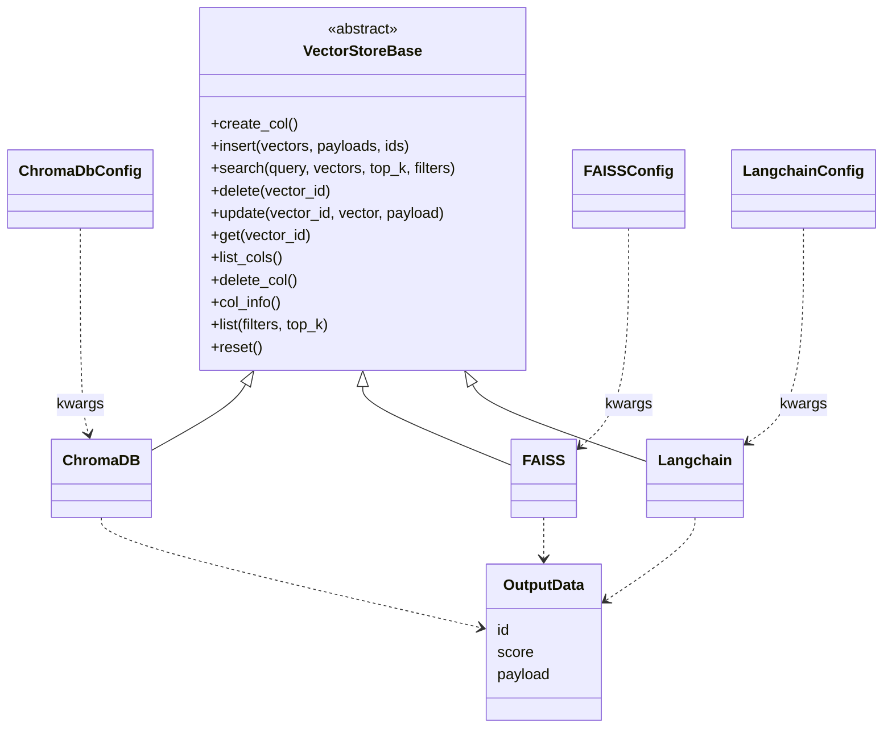
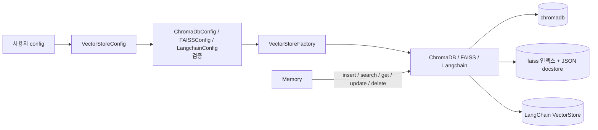
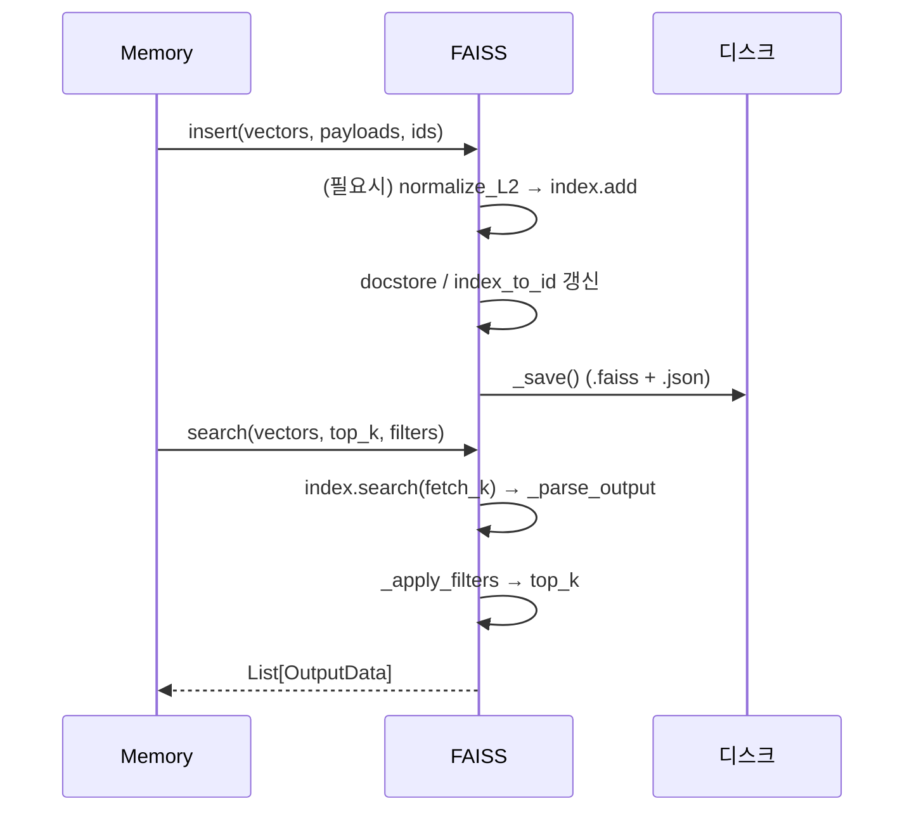

# local_and_adapter_vector_stores 모듈

## 소개

`local_and_adapter_vector_stores`는 mem0 Python SDK의 벡터 스토어 중 **별도 서버 없이 로컬(임베디드)로 동작하거나, 외부 라이브러리(LangChain)를 감싸는 어댑터** 형태의 구현체 세 가지를 묶은 모듈이다.

| 구현체 | 파일 | 설정 클래스 | 성격 |
|---|---|---|---|
| `ChromaDB` | `mem0/vector_stores/chroma.py` | `ChromaDbConfig` (`mem0/configs/vector_stores/chroma.py`) | 로컬 영속 / 서버 / Chroma Cloud |
| `FAISS` | `mem0/vector_stores/faiss.py` | `FAISSConfig` (`mem0/configs/vector_stores/faiss.py`) | 인-프로세스 인덱스 + 디스크 저장 |
| `Langchain` | `mem0/vector_stores/langchain.py` | `LangchainConfig` (`mem0/configs/vector_stores/langchain.py`) | 기존 LangChain `VectorStore` 어댑터 |

세 클래스 모두 `mem0.vector_stores.base.VectorStoreBase`를 상속하며, `VectorStoreFactory`(→ [py_utils](py_utils.md))가 `VectorStoreConfig`(→ [vector_store_config_registry](vector_store_config_registry.md))의 provider 이름으로 선택해 인스턴스화한다. 상위 `Memory`(→ [memory_engine](memory_engine.md))는 이 공통 인터페이스만 사용한다. 원격 전용 DB는 [dedicated_vector_database_stores](dedicated_vector_database_stores.md), [search_engine_and_keyvalue_stores](search_engine_and_keyvalue_stores.md), [database_backed_vector_stores](database_backed_vector_stores.md), [cloud_platform_vector_stores](cloud_platform_vector_stores.md)를 참고한다. TypeScript 대응 구현은 `ts_oss_vector_stores_local_and_adapter_vector_stores`(→ [ts_oss_vector_stores](ts_oss_vector_stores.md))에 있다.

## 아키텍처

각 파일은 동일한 형태의 `OutputData(id, score, payload)` Pydantic 모델을 자체 정의한다(공유하지 않고 파일마다 복제).

## 설정 클래스 (공통 규칙)

세 설정 모두 Pydantic `BaseModel`이며 `validate_extra_fields`(mode="before")로 **정의되지 않은 필드를 `ValueError`로 거부**한다. `arbitrary_types_allowed=True`로 외부 클라이언트 객체를 필드로 받을 수 있다.

- **`ChromaDbConfig`**: `collection_name`(기본 `"mem0"`), `client`, `path`, `host`, `port`, `api_key`, `tenant`. `check_connection_config`가 (a) 클라우드(`api_key`+`tenant`) 또는 (b) 로컬/서버(`path` 또는 `host`+`port`) 중 **정확히 하나**만 허용한다. 둘 다 없거나 둘 다 있으면 오류. 클라우드 설정 시 기본 `path == "/tmp/chroma"`는 제거된다.
- **`FAISSConfig`**: `collection_name`, `path`, `distance_strategy`(`euclidean`/`inner_product`/`cosine`, 그 외 오류), `normalize_L2`, `embedding_model_dims`(기본 1536).
- **`LangchainConfig`**: 필수 `client`(기존 `VectorStore` 인스턴스), `collection_name`. `langchain_community`가 없으면 import 시점에 `ImportError`.

## ChromaDB

**초기화 우선순위**: 주입된 `client` → Cloud(`api_key`+`tenant`, database는 `"mem0"` 고정) → 서버(`host`+`port`, FastAPI impl) → 로컬 영속(`path`, 기본 `"db"`). 텔레메트리는 꺼진다(`anonymized_telemetry=False`). 컬렉션은 `get_or_create_collection`으로 생성한다.

**점수**: Chroma 거리 `d`를 `1/(1+d)`로 변환해 `score`로 반환(`_parse_output`).

**필터 변환 (`_generate_where_clause`)**: mem0 필터를 Chroma where 문법으로 바꾼다.
- 연산자 매핑: `eq/ne/gt/gte/lt/lte/in/nin` → `$eq` 등. `contains/icontains` 및 미지원 연산자는 `$eq`로 폴백.
- Chroma는 레벨당 단일 필드/연산자만 허용하므로, 한 필드의 다중 연산자(`{"gte":18,"lte":65}`)와 다중 필드는 명시적 `$and`로 결합한다.
- 값이 `"*"`이면 해당 필터를 생략(와일드카드).
- `$or`: 각 조건을 `$and`로 묶은 뒤 `$or`로 결합. `$not`: 드모르간 법칙(NOT(a AND b) = NOT a OR NOT b)으로 연산자를 반전(`negate_map`)한다.

**주의**: `list()`는 `[self._parse_output(results)]`처럼 리스트로 한 번 더 감싸 반환하며, `col_info()`는 dict가 아닌 collection 객체를 돌려준다.

## FAISS

인-프로세스 `IndexFlat*` 인덱스와 별도 **docstore**(payload 저장소)로 구성된다.

- **저장 구조**: `index`(FAISS), `docstore: {vector_id → payload}`, `index_to_id: {정수 위치 → vector_id}`. 기본 경로 `/tmp/faiss/{collection_name}`, 파일은 `{name}.faiss` + `{name}.json`.
- **거리 전략**: `inner_product`/`cosine` → `IndexFlatIP`, 그 외 → `IndexFlatL2`. `_should_normalize()`는 cosine이면 항상, euclidean이면 `normalize_L2`일 때 L2 정규화한다(cosine은 IP 인덱스가 단위벡터일 때만 코사인과 같기 때문). euclidean 점수는 `1/(1+d)`, 나머지는 원본 점수.
- **보안/마이그레이션**: 신규 저장은 JSON만 사용한다. 레거시 `.pkl`은 `SafeUnpickler`(builtins의 기본 타입만 허용)로 로드하고 `_validate_docstore_structure`로 구조를 검증한 뒤 JSON으로 자동 이전한다. 악성 pickle이면 `ValueError`.
- **검색**: 필터가 있으면 `top_k*2`개를 가져와 `_apply_filters`(키 일치, 리스트는 포함 여부)로 후처리 후 `top_k`로 자른다. 따라서 필터가 강하면 결과가 `top_k`보다 적을 수 있다.
- **삭제/수정**: `delete`는 남은 벡터를 `reconstruct`해 인덱스를 **전체 재구성**(O(n))한다. `update`에서 벡터가 바뀌면 delete + insert를 수행한다.
- **기타**: 필터는 단순 동등/리스트 포함만 지원(연산자 미지원). `list()`도 `[results]` 형태로 반환한다. 로드 실패 시 경고 후 빈 docstore로 계속 진행(인덱스는 읽은 상태일 수 있어 불일치 가능성 있음).

## Langchain 어댑터

이미 구성된 LangChain `VectorStore`를 `client`로 받아 mem0 인터페이스로 노출한다. 컬렉션 개념이 없어 `create_col`은 이름만 갱신, `list_cols`는 `[collection_name]`을 반환한다.

- **insert**: `add_embeddings`가 있으면 사용, 없으면 `add_texts`(텍스트는 `payload["data"]`).
- **search**: `_SCORED_BY_VECTOR_METHODS` 순서(`similarity_search_by_vector_with_relevance_scores` → `similarity_search_with_score_by_vector` → `similarity_search_by_vector_with_score`)로 점수 포함 메서드를 시도하고 `NotImplementedError/TypeError`면 다음으로 넘어간다. 모두 실패하면 `similarity_search_by_vector`를 쓰며 점수를 `1.0`으로 채운다(None 점수가 랭킹 단계에서 비교 오류를 내는 것을 방지).
- **update**: delete 후 insert.
- **delete_col**: `delete_collection` → `reset_collection` → `delete(ids=None)` 순으로 폴백.
- **list**: `client._collection.get`(Chroma 내부 속성)이 있을 때만 동작하며 그 외 백엔드는 `None`을 반환한다(예외 시 `[]`). 사실상 Chroma 백엔드 전용이므로 주의.
- 필터는 그대로 `filter=`로 전달되어 백엔드별 문법에 의존한다.

## 선택 가이드 및 의존성

| 요구 | 권장 |
|---|---|
| 개발/테스트, 단일 프로세스 | FAISS (`pip install faiss-cpu`/`faiss-gpu`) |
| 로컬 영속 + 풍부한 필터, 또는 Chroma 서버/Cloud | ChromaDB (`pip install chromadb`) |
| 이미 LangChain 스택 보유 | Langchain (`pip install langchain_community`) |

선택 의존성은 `pyproject.toml`의 optional 그룹으로 관리한다(저장소 규칙: 코어 `dependencies`에 추가 금지). 각 모듈은 라이브러리 미설치 시 import 단계에서 안내 메시지와 함께 `ImportError`를 발생시킨다.
