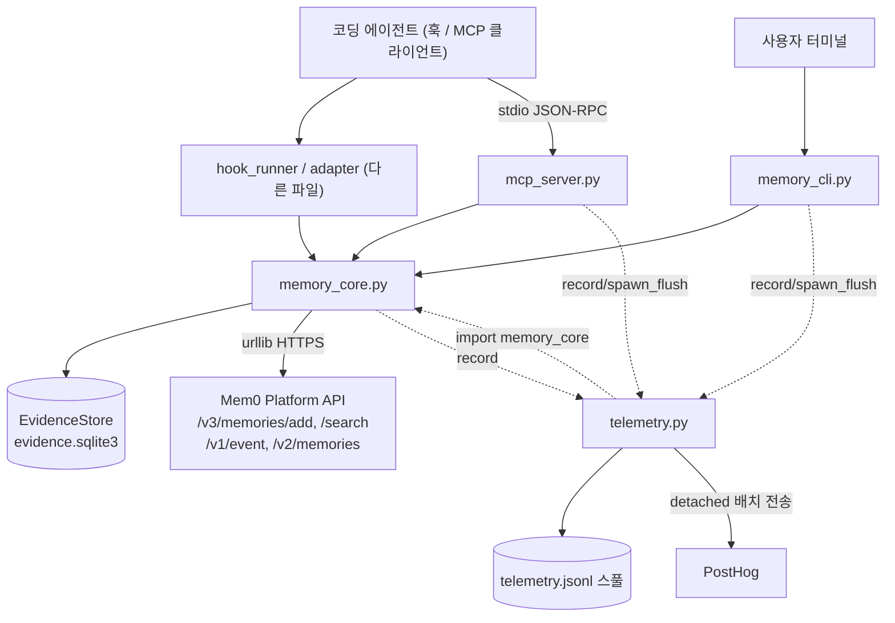
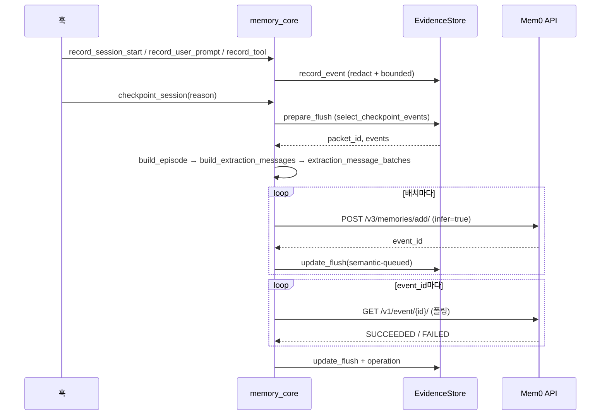
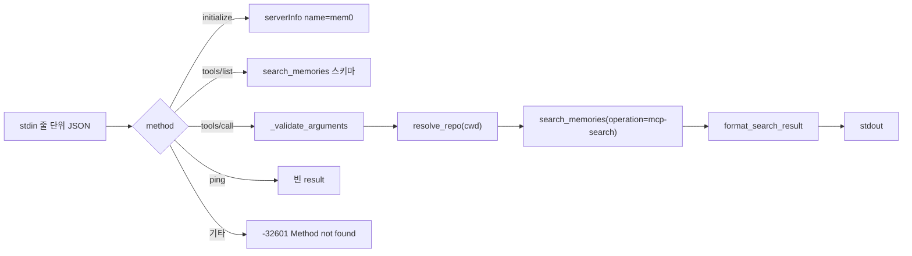
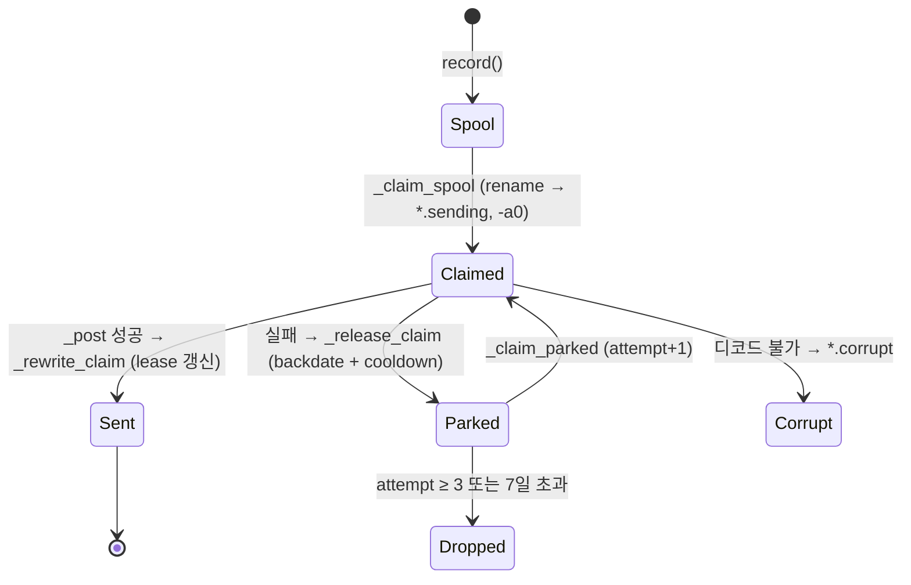

# mem0_agent_plugin 모듈

`integrations/mem0-agent-plugin/core/` 는 코딩 에이전트(Claude Code, Codex, Cursor 등)용 Mem0 플러그인의 **범용(harness-agnostic) 코어**입니다. 에이전트 훅이 발생시키는 세션 이벤트를 로컬 SQLite에 기록하고, 컴팩션/세션 종료 시점에 Mem0 플랫폼(`/v3/memories/add/`)으로 전송해 메모리를 생성하며, 이후 작업에서 `search_memories` MCP 도구로 검색할 수 있게 합니다.

동일한 코어 코드가 하네스별 디렉터리(`claude-code-plugin/core`, `codex-plugin/core`, `cursor-plugin/core`, `kimi-plugin/core`, `antigravity-plugin/core`)에 빌드 산출물로 복제됩니다. 공유 원본과 빌드/적합성 검증은 [agent_plugin_core_build_conformance](agent_plugin_core_build_conformance.md), [agent_plugin_core_python](agent_plugin_core_python.md), 다른 하네스는 [claude_code_plugin](claude_code_plugin.md), [codex_plugin](codex_plugin.md), [cursor_plugin](cursor_plugin.md), [kimi_plugin](kimi_plugin.md), [antigravity_plugin](antigravity_plugin.md) 문서를 참고하세요. 이 문서는 `mem0-agent-plugin` 하네스 사본을 기준으로 설명합니다.

> 참고: `mem0_agent_plugin` 사본에는 `hook_runner.py`, `flush_worker.py` 가 컴포넌트로 포함되어 있지 않습니다. 훅 진입점과 flush 워커의 동작은 `memory_core.py`/`telemetry.py` 가 참조하는 인터페이스(`MEM0_CODE_HANDOFF_PATH`, `detached_process_kwargs`, `spawn_flush`)를 통해서만 설명합니다.

## 구성 요소

| 파일 | 역할 | 주요 심볼 |
|---|---|---|
| `core/memory_core.py` | 저장소 식별, 로컬 증거 저장소, flush(원격 추출), 검색, 포맷, 삭제, 진단 | `EvidenceStore`, `search_memories`, `flush_session`, `checkpoint_session`, `doctor`, `forget_remote_repo` |
| `core/mcp_server.py` | stdio JSON-RPC MCP 서버. 도구 1개(`search_memories`) 노출 | `main`, `handle_request`, `call_search_memories` |
| `core/memory_cli.py` | 사용자 제어 CLI: `status`, `doctor`, `pause`, `resume`, `forget` | `main` |
| `core/telemetry.py` | 로컬 스풀 기반 사용 텔레메트리(PostHog 배치 전송) | `record`, `spawn_flush`, `claim_install`, `claim_version_change`, `error_kind` |

## 아키텍처

`telemetry.py` 와 `memory_core.py` 는 서로 import 합니다(순환). `memory_core` 는 상단에서 `import telemetry`, `telemetry` 는 `memory_core.data_dir()`, `redact()`, `PLUGIN_VERSION` 등을 사용합니다. 의존성은 순수 표준 라이브러리입니다.

## 핵심 개념

### 저장소/범위(scope) 식별
`resolve_repo()` 는 `git rev-parse --show-toplevel`, `remote.origin.url` 로 `RepoContext` 를 만듭니다.

- `identity`: 정규화된 원격 URL, 없으면 `local:<root>`
- `app_id`: 이전 Claude Code 플러그인과 호환되는 이름(`MEM0_PROJECT_ID` → `~/.mem0/project_map.json` → `owner-repo`)
- `project_id`: `app_id` + identity 해시 → 호스트가 다른 동명 저장소 분리. Mem0의 `agent_id` 로 사용
- `directory`: 저장소 루트 기준 상대 경로 (`dirs` 메타데이터)

메모리는 두 레인으로 저장됩니다.

| 레인 | Mem0 필드 | 지시문 |
|---|---|---|
| 공유 프로젝트 메모리 | `agent_id=project_id`, `app_id` | `PROJECT_MEMORY_INSTRUCTIONS` |
| 개인 선호 메모리 | `user_id`, `app_id` | `PERSONAL_MEMORY_INSTRUCTIONS` |

검색 범위 `SEARCH_SCOPES = ("repo", "dir", "mine")` 는 `_search_filters` 가 필터로 변환합니다 (`repo`: 공유∪개인, `dir`: 공유를 현재 디렉터리로 제한, `mine`: 개인만). `_scope_value` 는 `*` 같은 와일드카드를 식별자로 거부해 범위 확대를 막습니다.

카테고리(`CODING_MEMORY_CATEGORIES`): `project_knowledge`, `decisions_and_constraints`, `workflows`, `problems_and_fixes`, `results`.

### EvidenceStore (로컬 SQLite)
`~/.mem0/<harness>-plugin/evidence.sqlite3` (WAL, `busy_timeout=10000`). 손상 시 `_quarantine()` 으로 `.corrupt-<ts>` 로 옮기고 새로 시작합니다.

| 테이블 | 용도 |
|---|---|
| `events` | 훅 이벤트(`session_start`, `user_prompt`, `tool_result`, `tool_failure`, `assistant_stop`, `subagent_*`), `flush_id` 로 패킷 귀속 |
| `session_scopes` | 세션 시작 시 저장소 범위를 고정(pin) |
| `flushes` | 전송 패킷 상태·시도 횟수 |
| `retrievals` | 세션에서 이미 주입한 메모리(중복 방지, 서브에이전트 재사용) |
| `operations` | 작업별 지연/성공/건수 (status 표시용) |
| `sidekick_runs` | 서브에이전트 실행 기록 (레거시 이름 유지) |
| `settings` | `paused` 등 |

## 데이터 흐름: 기록 → 추출

핵심 동작:

- **체크포인트 조건**: 완료된 교환 5회, 메시지 10개, 원문 40,000자 중 하나 이상(`select_checkpoint_events`). 교환을 쪼개지 않으며 `periodic` 이외 사유는 강제 flush.
- **멱등/재시도**: `packet_id` 는 `(repo, session, event_start, event_end)` 해시. 실패 상태(`error`, `semantic-failed/timeout/missing`)는 `attempts` 증가, `MAX_FLUSH_ATTEMPTS=5` 초과 시 `gave-up`. 이미 큐잉된 `semantic_event_id` 는 재전송 없이 재폴링.
- **토큰 예산**: `MAX_EXTRACTION_INPUT_TOKENS=24000`, 초과 시 교환 → 서브에이전트 지시/응답 쌍 → 메시지 이분 분할 순으로 배치화.
- **실패 개방(fail-open)**: flush 예외는 상태에 기록하고 훅을 막지 않음.
- **프라이버시**: `redact()` 가 API 키/토큰/비밀번호/개인키 등을 `[REDACTED]` 처리, `bounded()` 로 길이 제한. 테스트/빌드 결과는 로컬에만 남고 추출 입력에는 실패한 명령만 포함(`build_semantic_evidence`).
- **API 키 해석**: `MEM0_API_KEY` → `PLUGIN_OPTION_API_KEY` → `CLAUDE_PLUGIN_OPTION_*` → 데이터 디렉터리의 `api-key`(0600). `cache_plugin_api_key` 가 호스트의 훅 전용 설정을 파일로 원자적으로 캐시하고, `clear_stale_api_key_cache` 가 소스가 사라지면 삭제.
- **플랫폼 헤더**: `platform_headers` 가 `Authorization`, `X-Mem0-Source`, `X-Mem0-Client: mem0-plugin/<PLUGIN_VERSION>`, 필요 시 `X-Application` 설정. 값은 빌드가 생성하는 `_harness_id.py` 에서 읽으며 없으면 `MEM0_PLUGIN` 기본값.
- **분리 프로세스**: `detached_process_kwargs` 는 POSIX `start_new_session`, Windows `DETACHED_PROCESS|CREATE_NEW_PROCESS_GROUP` 로 에이전트 종료 후에도 워커를 유지.

## 검색과 MCP 서버

`search_memories` (memory_core):

- 요청: `POST /v3/memories/search/`, `rerank=false`, `latest_only=true`, `top_k` 1–20 (기본 `MEM0_CODE_TOP_K`=3).
- `task_episode` 레코드 제외, 카테고리/`run_id` 필터는 `AND` 로 결합.
- 세션 추적 시 `unseen` + `mark_injected` 로 이미 보여준 메모리 제외. `MEM0_CODE_SEARCH_ONCE_PER_SESSION` 으로 1회 제한 가능.
- 일시적 네트워크 오류는 1회 재시도(HTTP 오류 제외). 실패 시 예외 대신 `MemorySearchResult(succeeded=False)`.
- `format_context`/`combine_context` 가 `MEM0_CODE_MAX_CONTEXT_CHARS`(기본 4000, 1000–10000)로 출력 예산을 강제하고 줄 중복을 제거. `main`/`master` 가 아닌 브랜치는 `[learnt on branch X]` 표기.
- 서브에이전트 시작 시 `record_subagent_start` 가 메인 턴에서 주입된 메모리를 재사용(최초 1회만 전달).

`mcp_server.py`:

- 도구 인자: `query`(필수, ≤2000자), `top_k`, `category`, `scope`, `run_id`. 알 수 없는 인자는 거부(`additionalProperties: false`).
- 작업 디렉터리: Codex 메타데이터 `_meta.x-codex-turn-metadata.workspaces` → `CLAUDE_PROJECT_DIR` → `os.getcwd()` 순.
- 오류 처리: 입력 오류는 `isError` 응답, 그 외 예외는 `"Memory search failed."` 로 내부 정보 비노출. 파싱 오류 `-32700`, 내부 오류 `-32603`.
- 종료 시 `telemetry.spawn_flush()`. 주석 `readOnlyHint`, `idempotentHint`, `openWorldHint` 제공.
- 이 프로세스는 `telemetry.init()` 을 호출하지 않으므로 `_harness_id` 기본값에 의존.

## CLI (`memory_cli.py`)

| 명령 | 동작 |
|---|---|
| `status [--json]` | 일시정지 여부, 저장소 ID, 데이터 경로, 키 설정, 이벤트/flush/검색/서브에이전트 통계 |
| `doctor [--json]` | Python≥3.10, 데이터 디렉터리 쓰기, API 키, 저장소, `user_id`, 읽기 전용 검색으로 인증 확인. 실패 시 종료 코드 1 |
| `pause` / `resume` | `settings.paused` 토글 (저장·검색 모두 중지) |
| `forget --yes [--remote] [--include-project-memory]` | 로컬 저장소 데이터 삭제. `--remote` 는 `/v2/memories/` 를 페이지 조회(100개씩, 최대 50페이지) 후 `DELETE /v1/memories/{id}/`. 공유 프로젝트 메모리는 옵션 지정 시에만 삭제 |

전역 옵션 `--harness`(→ `configure_harness`, `telemetry.init`), `--plugin-data-dir`(→ `MEM0_CODE_DATA_DIR`). `--yes` 없이는 삭제를 거부(종료 코드 2). 와일드카드 범위일 때 원격 삭제 거부.

## 텔레메트리 (`telemetry.py`)

훅은 3–6초 예산이므로 `record()` 는 네트워크 없이 `telemetry.jsonl` 에 한 줄만 추가합니다(256KB 초과 시 폐기). 별도 detached 프로세스(`python3 telemetry.py`)가 PostHog `/batch/` 로 전송합니다.

- **옵트아웃**: `MEM0_TELEMETRY=false|0|no|off`. 옵트아웃 중에는 설치 claim을 소비하지 않음.
- **프라이버시**: `_PRIVATE_KEYS`(query, prompt, text, memory, path, userid, repoid 등)를 제거하고, `repo_hash`/`session_hash` 는 설치별 랜덤 salt(`telemetry-salt`, `O_EXCL`+`os.link` 원자 발행)로 해시. salt를 저장할 수 없으면 해시 속성을 생략.
- **식별**: API 키가 있으면 `/v1/ping/` 으로 계정 이메일 해석, 키 지문(`key_fingerprint`)이 바뀌면 익명 ID 회전. 익명→이메일 최초 전환에만 `$identify` alias. 키가 없으면 `code-anon-*` 익명 ID.
- **설치/업그레이드**: `claim_install` 이 `install-state.json` 을 `O_EXCL` 로 원자 생성(`install` 또는 `upgrade`), `claim_version_change` 가 sentinel(`upgraded-<ver>`)로 동시 세션 중복 방지. `is_first_run`/`_data_dir_has_content` 는 이 판정 보조.
- **동시성/내구성**: 배치마다 `fsync` 후 rename, `_safe_mtime` 순 오래된 claim 우선, `MAX_PARKED_PER_RUN=3`, `_sweep_debris` 가 `.partial`/`.tmp`/`.corrupt` 정리.
- `error_kind` 는 `timeout`, `auth`, `rate-limited`, `server-error`, `bad-request`, `network` 등 내용 없는 분류만 반환.

## 주요 환경 변수

| 변수 | 의미 |
|---|---|
| `MEM0_API_KEY`, `MEM0_API_URL` | 인증, API 주소(기본 `https://api.mem0.ai`) |
| `MEM0_CODE_DATA_DIR` / `MEM0_PLUGIN_DATA_DIR` / `PLUGIN_DATA` | 데이터 디렉터리(기본 `~/.mem0/<harness>-plugin`) |
| `MEM0_CODE_USER_ID`, `MEM0_USER_ID`, `USER` | 사용자 식별 우선순위 |
| `MEM0_CODE_TOP_K`, `MEM0_CODE_SEARCH_SCOPE`, `MEM0_CODE_MAX_CONTEXT_CHARS` | 검색/컨텍스트 조정 |
| `MEM0_CODE_EXTRACTION_WAIT_SECONDS`(120), `MEM0_CODE_EVENT_POLL_SECONDS`(1) | 추출 이벤트 폴링 |
| `MEM0_CODE_HANDOFF_PATH` | flush 워커 heartbeat 파일(`touch_handoff_heartbeat`) |
| `MEM0_TELEMETRY` | 텔레메트리 on/off |

## 설계상 유의점

- 모든 사본이 공유 원본에서 생성되므로, 이 디렉터리를 직접 수정하기보다 `agent-plugin-core` 를 수정하고 빌드/적합성 검증([agent_plugin_core_build_conformance](agent_plugin_core_build_conformance.md))을 통과시켜야 합니다. `marketplace.json`, `plugin.schema.json`, `mcp.schema.json` 이 배포 매니페스트를 규정합니다.
- CI 에서의 검사는 `.github/workflows/agent-plugins-python-checks.yml` 이 담당합니다 ([CI_CD_and_Repository_Governance](CI_CD_and_Repository_Governance.md), [integrations_ci_cd](integrations_ci_cd.md)).
- 이 사본의 `memory_core.py` 는 `_collect_memory_ids`, `combine_context` 를 포함한 확장판입니다. `agent_plugin_core_python` 의 원본에는 이 두 심볼이 컴포넌트 목록에 없으므로 기능 차이가 있을 수 있습니다.
- 플랫폼 SDK/CLI 와는 독립적으로 `urllib` 로 REST 를 직접 호출합니다. 호스티드 클라이언트 구현은 [py_hosted_client](py_hosted_client.md), CLI 는 [Python_CLI](Python_CLI.md) 를 참고하세요.
