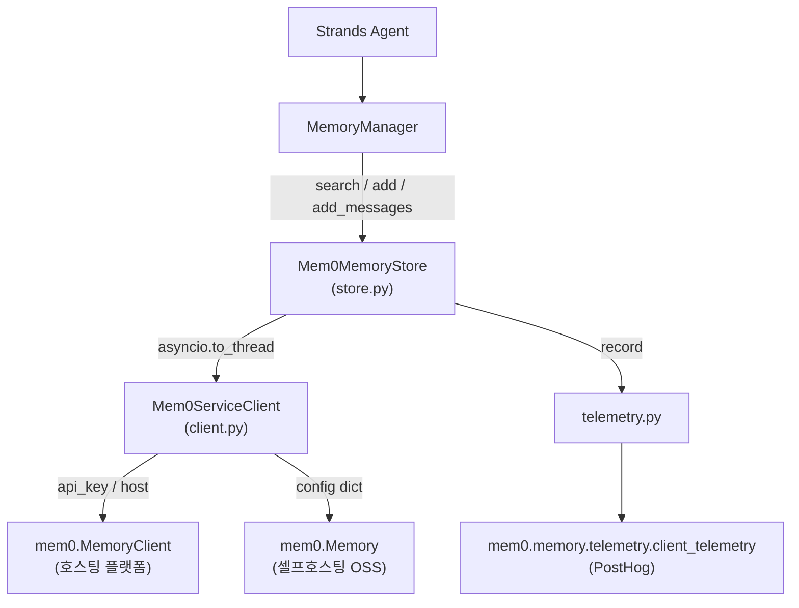
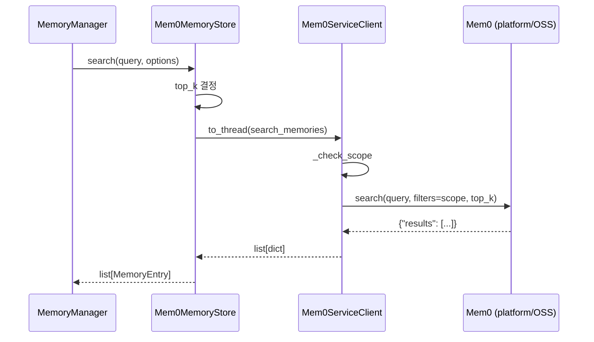
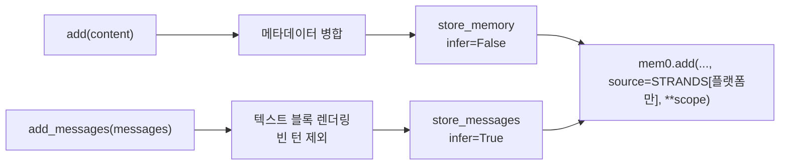

# mem0_strands 모듈

`mem0_strands`는 [Strands Agents](https://github.com/strands-agents)용 **장기 기억(long-term memory) 저장소**를 Mem0 위에 구현한 Python 통합 패키지입니다. 위치는 `integrations/mem0-strands/python`이며, PyPI 패키지명은 `mem0-strands`(현재 버전 `0.1.1`)입니다.

핵심은 `strands.memory.MemoryStore` 프로토콜을 구현한 `Mem0MemoryStore`입니다. Strands의 `MemoryManager`가 이 저장소를 검색해 사실(fact)을 회상하고, 쓰기가 허용되면 새 사실을 기록합니다. 모델이 명시적으로 호출하는 도구(`mem0_memory`)와 달리, 저장소는 에이전트 루프에 바로 연결되어 메모리 주입과 추출 트리거를 매니저가 처리합니다.

## 1. 구성 요소 개요

| 파일 | 구성 요소 | 역할 |
|------|-----------|------|
| `src/mem0_strands/store.py` | `Mem0MemoryStore` | Strands `MemoryStore` 구현. `search`, `add`, `add_messages` 제공 |
| `src/mem0_strands/client.py` | `Mem0ServiceClient` | Mem0 SDK(`MemoryClient` / `Memory`)를 감싸는 얇은 래퍼 |
| `src/mem0_strands/telemetry.py` | `record`, `error_kind` | 익명 사용 텔레메트리 (내용 비수집) |
| `pyproject.toml` | 패키징/도구 설정 | hatchling 빌드, ruff/mypy/pytest 설정 |

의존성: `strands-agents>=1.45.0`(`strands.memory` 모듈을 처음 포함한 릴리스), `mem0ai>=2.0.11`. Python `>=3.10`.

## 2. 아키텍처



Mem0 SDK 자체는 [Python_SDK_Core_(Memory_Engine_and_Hosted_Client)](Python_SDK_Core_(Memory_Engine_and_Hosted_Client).md)에서 다룹니다. 이 모듈은 그 위의 어댑터 계층입니다. 유사한 프레임워크 통합은 [Framework_and_Workflow-Tool_Integrations](Framework_and_Workflow-Tool_Integrations.md)의 다른 하위 모듈(예: `hermes_plugin_mem0`, `openclaw`)을 참고하세요.

## 3. 컴포넌트 상세

### 3.1 `Mem0MemoryStore` (`store.py`)

**스코프(entity scope)**: 생성자는 `user_id`, `agent_id`, `run_id`, `app_id` 중 값이 있는 것만 `self.scope`에 담습니다. 하나도 없으면 `ValueError`를 발생시킵니다. `app_id`는 플랫폼 전용이므로 `config`(OSS)와 함께 쓰면 생성 시점에 `ValueError`로 거부합니다.

**MemoryStore 프로토콜 속성**: `name`(기본 `"mem0"`), `description`, `max_search_results`, `writable`(기본 `True`), `extraction`.
**Mem0 전용 설정**: `metadata`(모든 쓰기에 병합되는 기본 메타데이터), `api_key`, `host`, `config`, `client`.

**지연 초기화**: `client` 프로퍼티는 첫 사용 시 `Mem0ServiceClient`를 만듭니다. 플랫폼 클라이언트는 HTTP로 API 키를 검증하고 OSS 클라이언트는 임베더/벡터 스토어를 빌드하는 등 블로킹일 수 있으므로, 항상 `asyncio.to_thread` 내부(워커 스레드)에서 해석됩니다. 최초 1회 `store.init` 텔레메트리가 기록됩니다.

**메서드**

| 메서드 | 동작 | Mem0 호출 |
|--------|------|-----------|
| `search(query, options)` | `top_k` 우선순위: `options["max_search_results"]` → `self.max_search_results` → `DEFAULT_MAX_SEARCH_RESULTS`(5). 결과를 `MemoryEntry`로 변환 | `search_memories` |
| `add(content, metadata)` | 이미 정제된 단일 사실을 **원문 그대로** 기록(`infer=False`). 메타데이터는 호출별 값이 기본값을 덮어씀 | `store_memory` |
| `add_messages(messages, context)` | 대화 턴을 텍스트로 렌더링해 Mem0 **서버 측 추출**에 위임(`infer=True`) | `store_messages` |

`add_messages`는 Strands `Message.content`가 content block 리스트(`{"text": "..."}`)라는 점을 처리합니다. Mem0는 `{"type": "text"}` 파트만 유지하므로, 텍스트 블록을 `"\n"`으로 이어 붙인 문자열로 렌더링하고, 렌더링 결과가 빈 턴(도구 사용/결과만 있는 턴)은 건너뜁니다. 남는 턴이 없으면 `None`을 반환합니다. 이 싱크가 있기 때문에 `extraction`을 켜면 클라이언트 측 모델 호출 없이 Mem0의 추출 파이프라인과 중복 제거가 적용됩니다.

**결과 매핑(`_to_entry`)**: `memory["memory"]`(없으면 `content`)가 `MemoryEntry.content`가 되고, `id`, `score`, `categories`, `created_at`, `updated_at` 및 스코프 필드, 그리고 Mem0 `metadata` dict가 `MemoryEntry.metadata`로 병합됩니다.

### 3.2 `Mem0ServiceClient` (`client.py`)

생성 시 정확히 하나의 백엔드를 선택합니다(우선순위 순).

1. `client` 지정: 그대로 사용(테스트/고급 설정). 비동기 클라이언트(`add`/`search`가 코루틴 함수)는 `ValueError`로 거부합니다. 워커 스레드에서 코루틴이 await되지 않아 모든 쓰기가 조용히 무시되기 때문입니다.
2. `config` 지정: `Memory.from_config(config)`로 셀프호스팅 OSS 구성(`is_platform=False`).
3. 그 외: `MemoryClient(api_key=api_key or $MEM0_API_KEY)`로 호스팅 플랫폼 구성. `host`는 지정된 경우에만 전달합니다(`None`이 SDK 기본값을 덮어쓰지 않도록).

**백엔드 차이 흡수**

- `_check_scope`: OSS에서 `app_id`가 있으면 `ValueError`(플랫폼 전용 스코프).
- `_write_extras`: 플랫폼 쓰기에만 `source="STRANDS"`를 붙임(OSS `Memory.add`는 알 수 없는 kwarg를 거부).
- `_extract_results`: 검색 응답이 `{"results": [...]}`이든 맨 리스트든 평범한 dict 리스트로 정규화.

### 3.3 텔레메트리 (`telemetry.py`)

- Mem0 SDK의 PostHog 클라이언트(`client_telemetry`)를 재사용하므로 추가 의존성이 없습니다. 플랫폼은 계정 이메일(`client.mem0.user_email`), OSS는 SDK의 로컬 익명 ID가 distinct id가 됩니다.
- 이벤트 이름은 `strands.<event>`(`store.init`, `store.search`, `store.add`, `store.add_messages`). 속성: `source`, `language="python"`, `strands_store_version`, `backend`(`platform`/`oss`)와 호출별 값(성공 여부, `duration_ms`, 개수 등). 샘플링하지 않습니다.
- **수집하지 않는 것**: 쿼리, 메모리 텍스트, 메시지 내용, 엔티티 ID, 메타데이터, API 키.
- `error_kind(exc)`: 예외를 `timeout`, `auth`, `rate-limited`, `server-error`, `bad-request` 또는 예외 클래스명으로 분류.
- `record`는 어떤 예외도 밖으로 내지 않습니다. 옵트아웃: `MEM0_TELEMETRY=false`.

## 4. 데이터 흐름

### 검색



### 쓰기 (두 가지 싱크)



## 5. 사용 예시

```python
from strands import Agent
from strands.memory import MemoryManager
from mem0_strands import Mem0MemoryStore

store = Mem0MemoryStore(user_id="alex", writable=True, extraction=True)
agent = Agent(memory_manager=MemoryManager(stores=[store]))
```

호스팅 플랫폼은 `api_key` 인자 또는 `MEM0_API_KEY` 환경 변수로, 셀프호스팅은 `config=` dict로 설정합니다. 셀프호스팅 서버 자체는 [Self-Hosted_Server_(API,_Auth,_Persistence,_Deployment)](Self-Hosted_Server_(API,_Auth,_Persistence,_Deployment).md)를 참고하세요.

## 6. 동작상 주의점

- **동기 SDK 전제**: 저장소는 SDK를 워커 스레드에서 실행합니다. `AsyncMemoryClient`는 지원하지 않습니다.
- **`app_id`는 플랫폼 전용**: OSS와 조합하면 즉시 `ValueError`.
- **중복 허용**: 추출 쓰기는 at-least-once이며 중복 제거는 Mem0 서버가 담당합니다.
- **오류 전파**: 검색/쓰기 실패는 실패 텔레메트리를 기록한 뒤 예외를 그대로 다시 던집니다.

## 7. 빌드, 테스트, 배포

`integrations/mem0-strands/python/pyproject.toml` 기준:

- 빌드: hatchling, wheel 대상 `src/mem0_strands`.
- hatch 스크립트: `test`(pytest), `lint`(`ruff check src tests`), `format`, `typecheck`(`mypy src`), `prepare`(format → lint → typecheck → test).
- ruff 줄 길이 120(`E`, `F`, `I`, `B`), pytest `asyncio_mode = "auto"`, `pythonpath = ["src"]`.

CI/CD (세부는 [CI_CD_and_Repository_Governance](CI_CD_and_Repository_Governance.md) 참고):

| 워크플로 | 내용 |
|----------|------|
| `.github/workflows/mem0-strands-checks.yml` | `lint`(ruff check/format --check, mypy, Python 3.12), `test`(pytest, Python 3.10/3.11/3.12 매트릭스), `build`(`hatch build --clean` 후 wheel·sdist 존재 확인). PR에서는 `ci-gate.yml`이 호출 |
| `.github/workflows/mem0-strands-cd.yml` | 태그 `mem0-strands-v*`일 때 `release.yml`(Release Router)이 `workflow_dispatch`로 호출. 해당 태그를 체크아웃해 `hatch build` 후 PyPI Trusted Publishing(OIDC, 토큰 없음)으로 배포 |

배포 시 PyPI 신뢰 발행자 설정이 워크플로 **파일명**에 고정되어 있으므로 `mem0-strands-cd.yml` 이름을 바꾸면 배포가 깨집니다. 워크플로 수정은 메인테이너 승인이 필요합니다.
