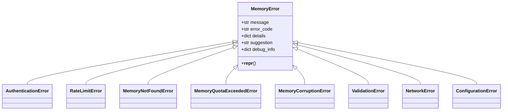
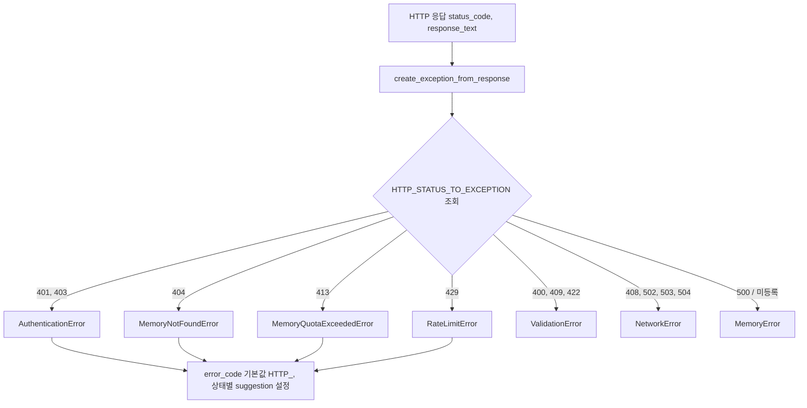
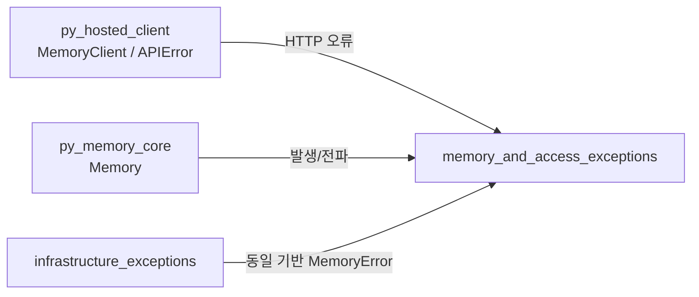

# memory_and_access_exceptions 모듈

## 개요

`memory_and_access_exceptions`는 `mem0/exceptions.py`에 정의된 구조화 예외 계층 중 **메모리 자원 상태와 접근 권한/사용량 제한**을 표현하는 5개 예외 클래스를 다룬다.

| 예외 | 의미 | 대표 `error_code` 예 (docstring 기준) |
|------|------|------|
| `AuthenticationError` | 인증 실패 (잘못된/만료된 API 키, 헤더 누락, 권한 부족) | `AUTH_001` |
| `RateLimitError` | 호출 빈도 제한 초과 | `RATE_001` |
| `MemoryNotFoundError` | 존재하지 않거나 접근 불가한 메모리 | `MEM_404` |
| `MemoryQuotaExceededError` | 저장/사용량 쿼터 초과 | `QUOTA_001` |
| `MemoryCorruptionError` | 저장된 메모리 데이터 손상 | `CORRUPT_001` |

모두 기반 클래스 `MemoryError`를 상속하며 본문 없이(`pass`) 타입 구분만 제공한다. 동작(속성, `__repr__`)은 전부 `MemoryError`에서 온다.
인프라(벡터 스토어, 임베딩, LLM, DB, 의존성, 캐시, 설정) 계열 예외는 [infrastructure_exceptions](infrastructure_exceptions.md)를 참고한다. 상위 모듈은 [Python_SDK_Core_(Memory_Engine_and_Hosted_Client)](Python_SDK_Core_(Memory_Engine_and_Hosted_Client).md), 예외를 발생시키는 호스티드 클라이언트는 [py_hosted_client](py_hosted_client.md)이다.

## 아키텍처



(`ValidationError`, `NetworkError`, `ConfigurationError` 등은 본 모듈 범위 밖이며 비교 목적으로만 표시했다. 단, 이 모듈 트리에서 `ConfigurationError`는 [infrastructure_exceptions](infrastructure_exceptions.md)에 속한다.)

### `MemoryError` 공통 계약

생성자: `MemoryError(message, error_code, details=None, suggestion=None, debug_info=None)`

- `message`: 사람이 읽는 메시지 (`Exception` 메시지로도 전달됨)
- `error_code`: 프로그램 처리를 위한 고유 식별자 (필수)
- `details`: 추가 문맥 (`None`이면 `{}`)
- `suggestion`: 해결 방법 안내
- `debug_info`: 기술적 디버깅 정보 (`None`이면 `{}`)

> 주의: Python 내장 `MemoryError`(메모리 부족)를 모듈 내에서 가린다(shadow). `from mem0.exceptions import MemoryError`를 쓸 때 내장과 혼동하지 않도록 한다.

OSS 전용 예외(`VectorStoreError`, `EmbeddingError` 등)는 `error_code`/`suggestion` 기본값을 갖지만, **이 모듈의 5개 클래스는 기본값이 없으므로 `error_code`를 반드시 전달**해야 한다.

## 각 예외의 용도와 `debug_info` 관례

- **AuthenticationError** – 잘못된 API 키, 만료 토큰, 인증 헤더 누락, 권한 부족. HTTP 401/403에 매핑.
- **RateLimitError** – `debug_info` 관례 키: `retry_after`(재시도까지 초), `limit`, `remaining`, `reset_time`. HTTP 429에 매핑.
- **MemoryNotFoundError** – 조회/수정/삭제 대상 메모리가 없거나 현재 사용자에게 접근 불가. `details`에 `memory_id`, `user_id` 포함 관례. HTTP 404에 매핑.
- **MemoryQuotaExceededError** – `debug_info` 관례 키: `current_usage`, `quota_limit`, `usage_type`. HTTP 413에 매핑(요청 크기 초과와 같은 코드를 공유함에 유의).
- **MemoryCorruptionError** – 저장 데이터가 손상/비정상. 자동 HTTP 매핑 없음, 코드에서 직접 발생시켜야 한다.

## HTTP 응답 → 예외 변환 흐름

같은 파일의 `HTTP_STATUS_TO_EXCEPTION`과 `create_exception_from_response()`가 상태 코드를 위 예외들로 변환한다.



동작 세부:
1. 매핑에 없는 상태 코드는 `MemoryError`로 폴백.
2. `error_code` 미지정 시 `HTTP_{status_code}`.
3. `suggestion`은 상태 코드별 고정 문구(예: 401 "Please check your API key and authentication credentials", 429 "Rate limit exceeded. Please wait before making more requests"), 없으면 "Please try again later".
4. `message`는 `response_text`, 비어 있으면 `HTTP {status_code} error`.
5. `MemoryCorruptionError`는 이 경로로 생성되지 않는다.

## 사용 예

```python
from mem0.exceptions import RateLimitError, MemoryQuotaExceededError, MemoryNotFoundError
import time

try:
    memory.update(memory_id, content=new_content)
except RateLimitError as e:
    time.sleep(e.debug_info.get("retry_after", 60))
except MemoryQuotaExceededError as e:
    logger.error(f"Quota exceeded: {e.error_code}")
except MemoryNotFoundError as e:
    logger.warning(f"{e.message} / {e.suggestion}")
```

모든 예외가 `MemoryError`를 상속하므로 `except MemoryError`로 일괄 처리할 수도 있다.

## 시스템 내 위치 및 관련 모듈



- TypeScript SDK는 `mem0-ts/src/common/exceptions.ts`에 동일 개념의 `AuthenticationError`, `MemoryNotFoundError`, `MemoryQuotaExceededError`, `RateLimitError`를 별도로 정의한다. 자세한 내용은 [ts_hosted_client](ts_hosted_client.md) 참고.
- 참고: 제공된 코드에서 `mem0/client/utils.py`의 `APIError`/`api_error_handler`가 이 예외로 변환하는지는 확인되지 않았다. 변환 경로가 필요하면 [py_hosted_client](py_hosted_client.md)의 구현을 직접 확인한다.

## 유지보수 시 참고

- 새 접근/상태 예외 추가 시 `MemoryError`를 상속하고, HTTP 대응이 필요하면 `HTTP_STATUS_TO_EXCEPTION`과 `suggestions` 딕셔너리를 함께 갱신한다.
- 상태 코드 413이 쿼터 초과로 매핑되는 점은 의미가 겹치므로, 구분이 필요하면 `error_code`로 구분한다.
- 공개 API 변경 시 `docs/`도 함께 갱신해야 한다 (저장소 `CLAUDE.md` 규칙).
