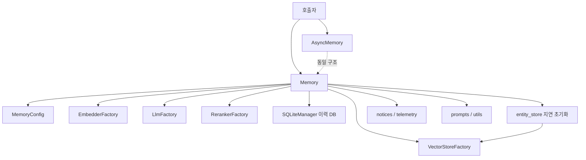
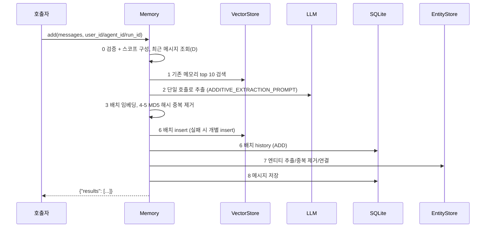
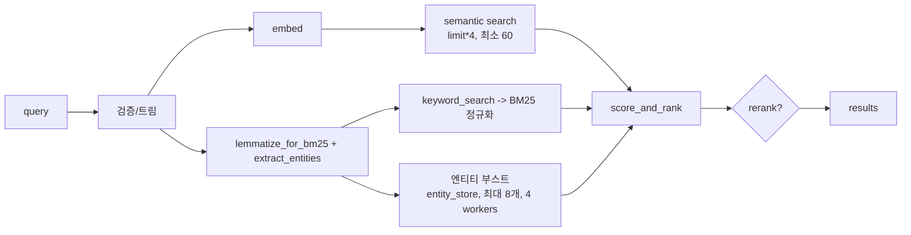

# memory_engine 모듈

## 개요

`memory_engine`은 Mem0 오픈소스 Python SDK의 핵심 엔진이다. 대화 메시지에서 사실(memory)을 추출하여 벡터 스토어에 저장하고, 하이브리드 검색(의미 + BM25 + 엔티티 부스트)으로 조회하며, 수정·삭제·이력 관리를 제공한다.

핵심 구성요소:

| 구성요소 | 파일 | 역할 |
|---|---|---|
| `Memory` | `mem0/memory/main.py` | 동기 메모리 엔진 |
| `AsyncMemory` | `mem0/memory/main.py` | 비동기 버전 (모든 블로킹 호출을 `asyncio.to_thread`로 래핑) |
| `MemoryType` | `mem0/configs/enums.py` | 메모리 유형 enum: `SEMANTIC`, `EPISODIC`, `PROCEDURAL` (현재 `PROCEDURAL`만 `add()`에서 명시적으로 처리) |

단일 코드 파일 중심 모듈이므로 별도의 하위 모듈 문서는 만들지 않았다. 주변 모듈은 아래 "관련 문서"를 참고한다.

## 아키텍처

`__init__`에서 임베더, 벡터 스토어, LLM, SQLite 이력 DB, (선택) 리랭커를 팩토리로 생성한다. `entity_store`는 같은 벡터 스토어 provider에 `<collection>_entities`(S3 Vectors는 `-entities`) 컬렉션으로 **지연 생성**된다. Qdrant 임베디드 모드에서는 RocksDB 락 충돌을 피하려고 기존 client를 공유한다. 벡터 스토어가 `keyword_search`를 구현하지 않으면 경고 후 의미 검색만 사용한다.

## 주요 흐름

### add(): V3 단계별 배치 파이프라인 (`infer=True`)

- 단계 1에서 기존 메모리 ID를 정수 문자열로 매핑해 LLM 환각을 방지한다.
- LLM 실패는 `LLMError`로, 전부 insert 실패는 `VectorStoreError`로 전파된다. 실제 저장된 레코드만 history·엔티티·결과에 반영된다.
- `infer=False`: 메시지를 원문 그대로 저장한다 (system 역할은 건너뜀).
- `memory_type="procedural_memory"` + `agent_id`: LLM으로 절차 기억 요약을 생성해 저장 (향후 제거 예정으로 TODO 표기됨).
- `timestamp`(add) / `reference_date`(search)는 플랫폼 전용으로 OSS에서는 `ValueError`.

### search(): 하이브리드 점수화

- 엔티티 부스트: 엔티티 유사도 0.5 이상만 반영, 연결 메모리 수가 많을수록 가중치 감소 (`1 / (1 + 0.001*(n-1)^2)`), 최대 `ENTITY_BOOST_WEIGHT`.
- 리랭커 실패 시 원본 결과로 폴백한다.
- 만료된(`expiration_date`) 메모리는 `show_expired=True`가 아니면 제외된다.
- 고급 필터(`eq/ne/gt/gte/lt/lte/in/nin/contains/icontains`, `AND/OR/NOT`, `"*"`)는 `_process_metadata_filters`가 벡터 스토어 공통 형식(`$or`, `$not` 포함)으로 변환한다.

### update / delete / reset

- `update()`: `text`, `metadata`, `expiration_date` 중 하나 이상 필수. `data`는 deprecated 별칭. 텍스트가 바뀌면 엔티티 연결을 제거 후 재연결한다.
- `delete()` / `delete_all()`: `delete_all`은 1000개 배치로 반복 조회·삭제하며, 같은 배치가 반복되면 중단한다. 비동기 버전은 `gather`로 병렬 삭제하고 엔티티는 `_bulk_clear_entity_store`로 일괄 정리하여 읽기-수정-쓰기 경합을 피한다.
- `reset()`: 이력 DB와 벡터 스토어(및 entity_store)를 초기화한다.
- `close()` 및 컨텍스트 매니저(`with` / `async with`)로 SQLite 연결을 해제한다.
- `chat()`은 `NotImplementedError`.

## 입력 검증과 보안 설계

- **스코프 필수**: `user_id`, `agent_id`, `run_id` 중 최소 하나 (`Mem0ValidationError`, `VALIDATION_001`). ID는 문자열로 변환·트림하며 빈 값/공백 포함 값은 거부한다.
- **조회 API는 `filters`만 허용**: `search`/`get_all`에 최상위 entity 인자를 넘기면 `ValueError` (`_reject_top_level_entity_params`).
- **신원 키 보호**: `metadata`의 `user_id/agent_id/run_id/actor_id`는 `_strip_identity_keys`가 제거한다 (생성·수정 모두, 이슈 #4490/#6277/#6655 대응). 스코프는 엔티티 파라미터로만 설정된다.
- **텔레메트리 안전**: `_is_sensitive_field`가 secret/token/password 계열 필드를 마스킹하고, `_safe_deepcopy_config`가 deepcopy 실패 시 dict 기반 복제로 폴백한다. 텔레메트리 활성 시 별도 `mem0migrations` 컬렉션을 사용한다.
- `_validate_search_params`: `threshold`는 0~1, `top_k`는 0 이상의 정수(bool 제외).

## 데이터 모델

벡터 payload 핵심 키: `data`, `hash`, `text_lemmatized`, `created_at`, `updated_at`, 그리고 승격 키(`user_id`, `agent_id`, `run_id`, `actor_id`, `role`, `attributed_to`, `expiration_date`). 나머지는 결과의 `metadata`로 노출된다. 엔티티 레코드 payload: `data`, `entity_type`, `linked_memory_ids`, 스코프 키. 엔티티 매칭은 정규화된 텍스트 정확 일치 또는 유사도 ≥ 0.95로 판정한다.

## 동기/비동기 차이 요약

| 항목 | `Memory` | `AsyncMemory` |
|---|---|---|
| 블로킹 호출 | 직접 호출 | `asyncio.to_thread` |
| 엔티티 부스트 병렬화 | `ThreadPoolExecutor(4)` | `Semaphore(4)` + `gather` |
| `reset()` | `VectorStoreFactory.reset` 사용 가능 | `delete_col` 후 client close 및 재생성 |
| `add(llm=...)` | 없음 | LangChain LLM으로 절차 기억 생성 가능 |
| 프로젝트 | `project.update` → `ValueError` | 동일 (async) |

## 관련 문서

이 저장소의 다른 모듈은 같은 폴더의 문서를 참고한다 (하위 문서 생성 여부는 모듈 트리 기준 이름).

- `memory_prompts_and_text_utils` — 프롬프트 및 텍스트 유틸리티
- `history_storage_and_setup` — `SQLiteManager`, `setup_config`
- `telemetry_and_notices` — 텔레메트리 및 사용 안내
- `infrastructure_exceptions`, `memory_and_access_exceptions` — 예외 계층
- `py_utils` — 팩토리, 엔티티 추출
- `py_vector_stores`, `py_llms`, `py_embeddings`, `py_rerankers` — 플러그형 provider 계층
- `py_hosted_client` — 호스티드 `MemoryClient` (플랫폼 전용 기능이 필요한 경우)
