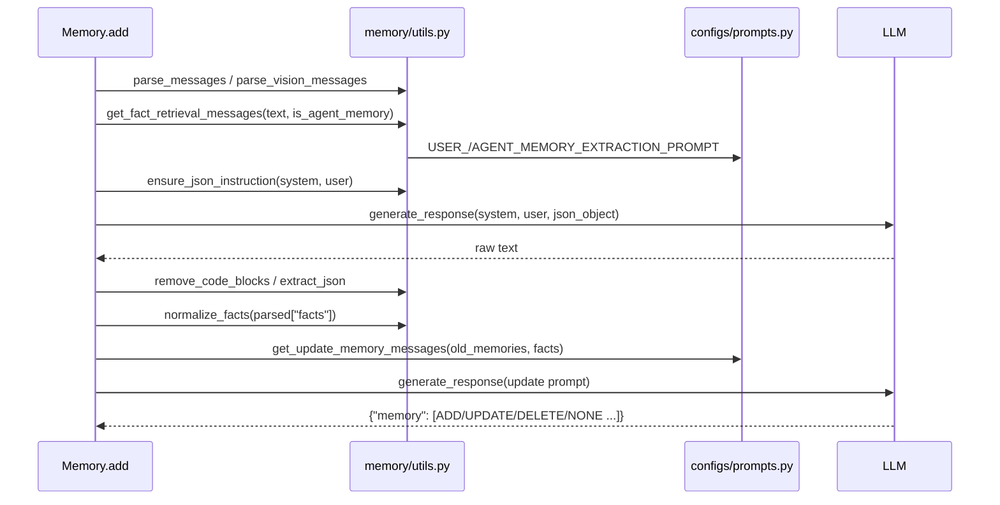

# memory_prompts_and_text_utils

`memory_prompts_and_text_utils`는 Mem0 Python SDK의 메모리 파이프라인에서 **LLM에 보낼 프롬프트를 만들고, LLM이 돌려준 텍스트를 정리하는** 모듈입니다. 상태를 갖지 않는 순수 함수와 문자열 상수로만 구성됩니다.

| 파일 | 역할 | 핵심 컴포넌트 |
|------|------|---------------|
| `mem0/configs/prompts.py` | 프롬프트 상수와 프롬프트 조립 함수 | `get_update_memory_messages` |
| `mem0/memory/utils.py` | 사실(fact) 추출 프롬프트 선택, LLM 출력 정규화, 엔티티 정리 | `get_fact_retrieval_messages`, `get_fact_retrieval_messages_legacy`, `ensure_json_instruction`, `normalize_facts`, `format_entities`, `remove_spaces_from_entities` |

이 모듈을 호출하는 쪽은 [memory_engine](memory_engine.md)의 `Memory` / `AsyncMemory`입니다. 같은 `py_memory_core` 아래의 다른 하위 모듈은 [history_storage_and_setup](history_storage_and_setup.md), [telemetry_and_notices](telemetry_and_notices.md), [infrastructure_exceptions](infrastructure_exceptions.md), [memory_and_access_exceptions](memory_and_access_exceptions.md)입니다. 프롬프트에 쓰이는 LLM 호출 자체는 [py_llms](py_llms.md)가 담당합니다.

---

## 1. 아키텍처

```mermaid
graph TD
    Engine["Memory / AsyncMemory<br/>(memory_engine)"]
    subgraph prompts["mem0/configs/prompts.py"]
        FRP["FACT_RETRIEVAL_PROMPT"]
        UMEP["USER_MEMORY_EXTRACTION_PROMPT"]
        AMEP["AGENT_MEMORY_EXTRACTION_PROMPT"]
        DUMP["DEFAULT_UPDATE_MEMORY_PROMPT"]
        AEP["ADDITIVE_EXTRACTION_PROMPT<br/>+ AGENT_CONTEXT_SUFFIX"]
        PMSP["PROCEDURAL_MEMORY_SYSTEM_PROMPT"]
        MAP["MEMORY_ANSWER_PROMPT"]
        GUMM["get_update_memory_messages"]
        GAEP["generate_additive_extraction_prompt"]
    end
    subgraph utils["mem0/memory/utils.py"]
        GFRM["get_fact_retrieval_messages"]
        GFRML["get_fact_retrieval_messages_legacy"]
        EJI["ensure_json_instruction"]
        NF["normalize_facts"]
        FE["format_entities"]
        RSE["remove_spaces_from_entities"]
        Helpers["parse_messages / remove_code_blocks / extract_json<br/>parse_vision_messages / process_telemetry_filters"]
    end
    Engine --> GFRM
    Engine --> GFRML
    Engine --> EJI
    Engine --> NF
    Engine --> GUMM
    Engine --> GAEP
    Engine --> Helpers
    Engine --> FE
    Engine --> RSE
    GFRM --> UMEP
    GFRM --> AMEP
    GFRML --> FRP
    GUMM --> DUMP
    GAEP --> AEP
```

`mem0/memory/utils.py`는 `mem0/configs/prompts.py`에서 세 가지 추출 프롬프트(`FACT_RETRIEVAL_PROMPT`, `USER_MEMORY_EXTRACTION_PROMPT`, `AGENT_MEMORY_EXTRACTION_PROMPT`)를 import합니다. 반대 방향 의존은 없습니다.

---

## 2. `mem0/configs/prompts.py`

### 2.1 프롬프트 상수

| 상수 | 용도 |
|------|------|
| `FACT_RETRIEVAL_PROMPT` | 구버전 사실 추출 프롬프트. 입력 형식은 `Input: ...`이고 user/assistant 메시지 모두에서 사실을 뽑습니다. |
| `USER_MEMORY_EXTRACTION_PROMPT` | **user 메시지만** 근거로 사실을 추출합니다. assistant/system 정보를 넣으면 불이익을 준다는 지시가 들어 있습니다. |
| `AGENT_MEMORY_EXTRACTION_PROMPT` | **assistant 메시지만** 근거로 에이전트 자신의 선호, 능력, 성향을 추출합니다. |
| `DEFAULT_UPDATE_MEMORY_PROMPT` | 기존 메모리와 새 사실을 비교해 `ADD` / `UPDATE` / `DELETE` / `NONE`을 결정하게 하는 기본 프롬프트입니다. |
| `ADDITIVE_EXTRACTION_PROMPT` | V3 방식의 **ADD 전용** 추출 프롬프트입니다. 기존 메모리 ID를 `linked_memory_ids`로 연결하고, 관찰 날짜 기준으로 시간 표현을 절대 날짜로 바꾸는 규칙이 들어 있습니다. |
| `AGENT_CONTEXT_SUFFIX` | 주체가 AI 에이전트일 때 `ADDITIVE_EXTRACTION_PROMPT` 뒤에 덧붙이는 "Entity Context" 섹션입니다. |
| `PROCEDURAL_MEMORY_SYSTEM_PROMPT` | 에이전트 실행 이력을 단계별로 요약하는 절차 기억(procedural memory)용 프롬프트입니다. |
| `MEMORY_ANSWER_PROMPT` | 메모리를 근거로 질문에 답하게 하는 프롬프트입니다. |

세 가지 추출 프롬프트는 f-string으로 만들어지며 `datetime.now().strftime("%Y-%m-%d")`를 넣습니다. 그래서 날짜는 **모듈 import 시점에 한 번 고정**됩니다. 장시간 실행되는 프로세스에서는 "Today's date"가 오래된 값일 수 있습니다. 출력 JSON 예시의 중괄호는 `{{ }}`로 이스케이프되어 있으니 이 프롬프트를 수정할 때 유의해야 합니다.

### 2.2 `get_update_memory_messages(retrieved_old_memory_dict, response_content, custom_update_memory_prompt=None)`

업데이트 단계(기존 메모리와 병합)의 **사용자 프롬프트 문자열 하나**를 반환합니다.

- `custom_update_memory_prompt`가 `None`이면 `DEFAULT_UPDATE_MEMORY_PROMPT`를 씁니다.
- `retrieved_old_memory_dict`가 비어 있지 않으면 현재 메모리를 코드 블록으로 삽입하고, 비어 있으면 `Current memory is empty.`를 넣습니다.
- 새로 추출한 사실(`response_content`)을 삼중 백틱으로 감쌉니다.
- 응답 형식을 `{"memory": [{"id", "text", "event", "old_memory"}]}` JSON으로 강제하는 지시를 덧붙입니다. `old_memory`는 `UPDATE`일 때만 필요합니다.

### 2.3 V3 프롬프트 빌더

`generate_additive_extraction_prompt(...)`는 `ADDITIVE_EXTRACTION_PROMPT`와 짝을 이루는 **사용자 쪽 프롬프트**를 만듭니다. `get_update_memory_messages`와 달리 `__all__` 같은 외부 노출 지정은 없지만 같은 파일의 공개 함수입니다.

섹션 순서: `Summary` → `Last k Messages` → `Recently Extracted Memories` → `Existing Memories` → `New Messages` → `Observation Date` → `Current Date` → (선택) `Custom Instructions` → (선택) `Language Requirement` → `# Output:`

| 보조 함수 | 동작 |
|-----------|------|
| `_truncate_content` | 과거 메시지를 `PAST_MESSAGE_TRUNCATION_LIMIT`(300자)로 자르고 `...`을 붙입니다. |
| `_format_summary` | 문자열 또는 `{"summary": ...}` 딕셔너리를 받습니다. |
| `_format_conversation_history` | `role: content` 줄로 변환하며 `message` 키를 `content`보다 먼저 봅니다. |
| `_serialize_memories` | `json.dumps(..., ensure_ascii=False)`를 쓰고 비어 있으면 `[]`을 반환합니다. |
| `_format_new_messages` | 문자열이면 그대로 쓰고, 아니면 JSON으로 직렬화합니다. |
| `_resolve_dates` | `current_date`가 없으면 오늘(UTC)을 쓰고, `observation_date`(인자 이름은 `timestamp`)가 없으면 `current_date`를 씁니다. |

`use_input_language=True`이면 입력과 같은 언어, 같은 문자 체계로 추출하라는 지시가 추가됩니다.

---

## 3. `mem0/memory/utils.py`

### 3.1 핵심 함수

| 함수 | 입력 → 출력 | 설명 |
|------|-------------|------|
| `get_fact_retrieval_messages(message, is_agent_memory=False)` | → `(system_prompt, user_prompt)` | `is_agent_memory`에 따라 `AGENT_MEMORY_EXTRACTION_PROMPT` 또는 `USER_MEMORY_EXTRACTION_PROMPT`를 고르고, 사용자 프롬프트는 `"Input:\n{message}"`입니다. |
| `get_fact_retrieval_messages_legacy(message)` | → `(FACT_RETRIEVAL_PROMPT, "Input:\n...")` | 하위 호환용입니다. |
| `ensure_json_instruction(system_prompt, user_prompt)` | → 같은 튜플 | 두 프롬프트에 `json`(대소문자 무시)이 없으면 시스템 프롬프트 끝에 JSON 형식 지시를 붙입니다. OpenAI는 `response_format={"type": "json_object"}`를 쓸 때 메시지에 "json"이 있어야 하며, 없으면 400 오류가 납니다. 사용자 정의 `custom_instructions`가 이 경우를 만들 수 있습니다. |
| `normalize_facts(raw_facts)` | → `List[str]` | 작은 LLM이 `{"fact": ...}`나 `{"text": ...}` 같은 객체로 돌려주는 경우를 문자열 리스트로 바꿉니다. 키가 없는 딕셔너리는 경고 로그를 남기고 건너뛰며, 문자열도 딕셔너리도 아닌 값은 `str()`로 변환하고, 빈 문자열은 버립니다. |
| `format_entities(entities)` | → `str` | 그래프 엔티티를 `source -- relationship -- destination` 줄로 만들어 줄바꿈으로 잇습니다. 비어 있으면 `""`입니다. |
| `remove_spaces_from_entities(entity_list, *, sanitize_relationship=True)` | → `List[Dict]` | LLM/도구가 낸 관계 딕셔너리를 소문자로 바꾸고 공백을 `_`로 치환합니다. `source`, `relationship`, `destination` 중 하나라도 없거나 빈 딕셔너리, 딕셔너리가 아닌 항목은 건너뜁니다. 입력 딕셔너리를 **제자리에서 수정**합니다. |

### 3.2 같은 파일의 보조 함수 (핵심 컴포넌트 외)

| 함수 | 설명 |
|------|------|
| `parse_messages` | 메시지 리스트를 `role: content` 문자열로 만듭니다. `content`가 `None`인 메시지(예: `tool_calls`만 있는 assistant 메시지)는 건너뜁니다. |
| `remove_code_blocks` | 코드 블록 펜스와 `<think>...</think>` 블록을 제거합니다. 문자열 블록이나 `{"text": ...}` 블록의 리스트도 받아 이어 붙입니다. |
| `extract_json` | 코드 블록이 있으면 그 안쪽을 쓰고, 없으면 첫 `{`부터 마지막 `}`까지를 잘라 JSON 후보를 얻습니다. |
| `get_image_description` / `parse_vision_messages` | 이미지가 있는 메시지를 `llm.generate_response`로 텍스트 설명으로 바꿉니다. `llm`이 없으면 텍스트 부분만 남기고 이미지는 버립니다. |
| `process_telemetry_filters` | `user_id`, `agent_id`, `run_id`를 MD5로 해시해 텔레메트리에 쓸 값으로 만듭니다. 자세한 내용은 [telemetry_and_notices](telemetry_and_notices.md)를 참고하십시오. |
| `sanitize_relationship_for_cypher` | 관계 이름의 특수문자와 전각 문장부호를 `_name_` 형태로 치환하고, 연속된 `_`를 하나로 합친 뒤 양끝의 `_`를 제거합니다. Cypher 쿼리 안전성을 위한 처리입니다. |

---

## 4. 데이터 흐름

위 다이어그램은 이 모듈 함수들의 일반적인 호출 순서를 보여 줍니다. 호출 지점은 [memory_engine](memory_engine.md)이 소유하므로, 실제 분기(예: V3 additive 경로에서는 `generate_additive_extraction_prompt`를 쓰고 업데이트 프롬프트를 쓰지 않음)는 그쪽에서 확인하십시오.

그래프 메모리 경로에서는 LLM이 낸 엔티티를 `remove_spaces_from_entities`로 정규화한 뒤 그래프 저장소에 넣고, 검색 결과를 `format_entities`로 문자열로 만들어 응답에 포함합니다.

---

## 5. 사용상 주의점과 설계 메모

- **순수성**: 모든 함수는 I/O가 없습니다. 예외는 `get_image_description`(LLM 호출)과 `parse_vision_messages`입니다. 이미지 처리 중 오류가 나면 `Error while downloading {image_url}.`로 감싸 다시 던집니다.
- **프롬프트 날짜 고정**: 2.1절 참고.
- **TypeScript 대응**: `mem0-ts/src/oss/src/prompts/index.ts`의 `getFactRetrievalMessages`, `getUpdateMemoryMessages`, `parseMessages`가 같은 역할을 합니다. `normalize_facts`의 주석은 TypeScript의 `FactRetrievalSchema` 검증을 따라 만들었다고 밝힙니다. 자세한 내용은 TypeScript SDK 코어 문서를 참고하십시오.
- **프롬프트 변경 시**: 예시 JSON이 파서(`normalize_facts`, 메모리 업데이트 응답 처리)가 기대하는 키(`facts`, `memory`, `id`, `text`, `event`, `old_memory`)와 일치해야 합니다. 이 키들을 바꾸면 [memory_engine](memory_engine.md)의 파싱 코드도 함께 고쳐야 합니다.
- **`custom_instructions`**: 사용자가 정의한 지시에 "json"이 없는 경우를 위해 JSON 형식 응답을 요구하는 호출 앞에서 `ensure_json_instruction`을 거치는 것이 안전합니다.
