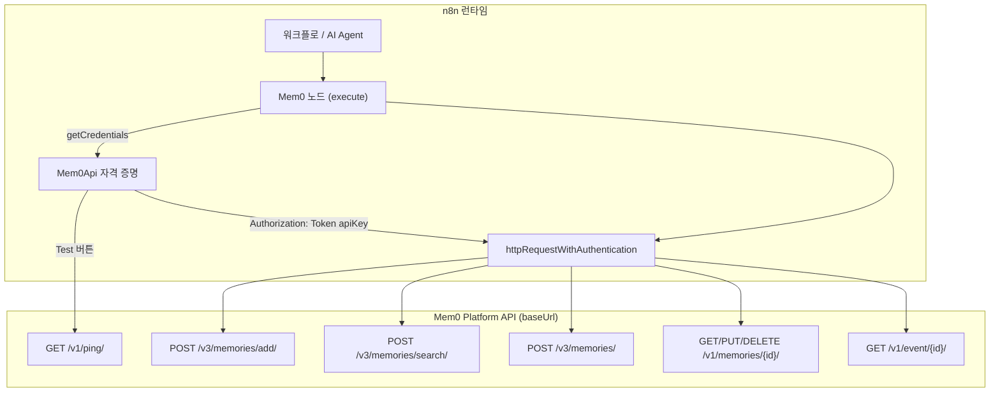
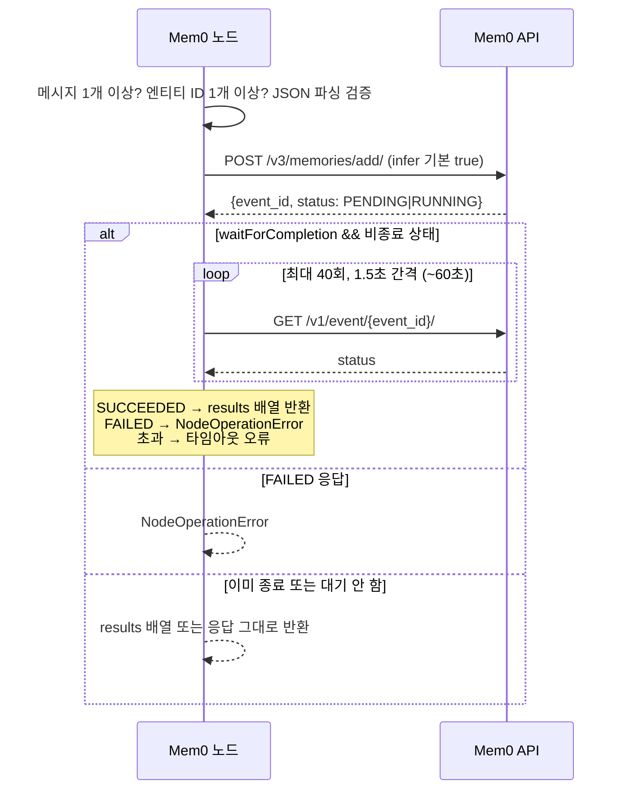
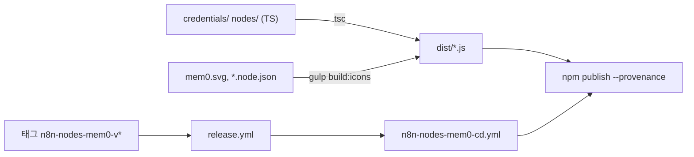

# n8n_nodes_mem0 모듈 문서

## 1. 개요

`integrations/n8n-nodes-mem0`는 Mem0 호스티드 플랫폼 REST API를 [n8n](https://n8n.io) 워크플로에서 사용할 수 있게 해 주는 **n8n 커뮤니티 노드 패키지**(`@mem0/n8n-nodes-mem0`, 현재 `0.1.4`, MIT)입니다. 노드 하나(`Mem0`)와 자격 증명 타입 하나(`Mem0Api`)로 구성되며, 메모리의 추가/검색/목록/조회/수정/삭제를 지원합니다. `usableAsTool: true`이므로 n8n AI Agent(Tools Agent) 노드에서 도구로도 사용할 수 있습니다.

| 구성 요소 | 파일 | 역할 |
|---|---|---|
| `Mem0Api` | `credentials/Mem0Api.credentials.ts` | API 키/Base URL 저장, 인증 헤더 주입, 연결 테스트 |
| `Mem0` | `nodes/Mem0/Mem0.node.ts` | UI 속성 정의 및 `execute()` 구현 |
| `copyIcons` (`build:icons`) | `gulpfile.js` | `tsc`가 내보내지 않는 정적 자산(svg/png/json)을 `dist/`로 복사 |
| `jest.config.js` | `jest.config.js` | 개발 전용 테스트 설정(배포 제외) |
| `package.json` / `tsconfig.json` | 루트 | 빌드·린트·배포 스크립트, n8n 등록 정보, 컴파일러 옵션 |

> 이 모듈은 Python/TypeScript SDK를 import하지 않고 `n8n-workflow`(peer dependency)만 사용하여 REST API를 직접 호출합니다. 동일 API를 다루는 다른 클라이언트는 [TypeScript_SDK_Core_(Hosted_Client_and_OSS_Engine)](TypeScript_SDK_Core_(Hosted_Client_and_OSS_Engine).md), [Python_SDK_Core_(Memory_Engine_and_Hosted_Client)](Python_SDK_Core_(Memory_Engine_and_Hosted_Client).md)를 참고하세요. 같은 계열의 다른 연동은 [Framework_and_Workflow-Tool_Integrations](Framework_and_Workflow-Tool_Integrations.md)에 있고, 이 패키지의 CI/CD는 [CI_CD_and_Repository_Governance](CI_CD_and_Repository_Governance.md)에서 다룹니다.

## 2. 아키텍처

### 2.1 자격 증명 (`Mem0Api`)
- `name = 'mem0Api'`, 속성: `apiKey`(password 타입, 필수, `m0-` 접두사), `baseUrl`(기본 `https://api.mem0.ai`; 셀프 호스팅 시 변경).
- `authenticate`는 `Authorization: Token <apiKey>` 헤더를 모든 요청에 주입합니다(공식 SDK와 동일한 방식).
- `test`는 `GET {baseUrl}/v1/ping/`으로 키를 검증합니다.
- 셀프 호스팅 서버를 가리키려면 [Self-Hosted_Server_(API,_Auth,_Persistence,_Deployment)](Self-Hosted_Server_(API,_Auth,_Persistence,_Deployment).md)의 엔드포인트 호환성을 확인해야 합니다(코드에는 호환성 보장이 없고, 주석상 "self-hosted or non-default deployments" 용도로만 안내됨).

### 2.2 노드 (`Mem0`)
- 리소스는 `memory` 하나이며, 오퍼레이션은 `add`, `search`, `getAll`(Get Many), `get`, `update`, `delete`입니다.
- 입력/출력은 `NodeConnectionTypes.Main` 각 1개입니다.
- 모든 요청은 내부 `request()` 클로저를 거치며, `qs.source = 'N8N'`을 항상 붙여 사용 출처를 귀속시킵니다. 인증은 `httpRequestWithAuthentication('mem0Api', …)`이 처리합니다.

## 3. 오퍼레이션별 동작

| 오퍼레이션 | 엔드포인트 | 주요 파라미터 | 출력 |
|---|---|---|---|
| `add` | `POST /v3/memories/add/` (+ 필요 시 `GET /v1/event/{id}/` 폴링) | `messages`(role/content), `userId`, `waitForCompletion`, `addFields`(agent_id, app_id, run_id, metadata, custom_instructions, custom_categories, includes, excludes, infer) | 결과 배열 또는 이벤트 객체 |
| `search` | `POST /v3/memories/search/` | `query`, 엔티티 ID 4종, `limit`(→`top_k`, 기본 50), `output_format: 'v1.1'` | `results` 배열 |
| `getAll` | `POST /v3/memories/?page&page_size` | 엔티티 ID 4종, `returnAll`, `page`, `pageSize` | `results` 배열 |
| `get` | `GET /v1/memories/{id}/` | `memoryId` | 단일 객체 |
| `update` | `PUT /v1/memories/{id}/` | `memoryId`, `text` 및/또는 `metadata` | 단일 객체 |
| `delete` | `DELETE /v1/memories/{id}/` | `memoryId` | 단일 객체 |

`memoryId`는 `encodeURIComponent`로 이스케이프됩니다.

### 3.1 add 흐름 (비동기 이벤트 폴링)

- `infer`(LLM 추출 여부)와 `waitForCompletion`(노드가 기다릴지 여부)은 **서로 독립**입니다.
- 폴링 상수: `POLL_INTERVAL_MS = 1500`, `MAX_POLL_ATTEMPTS = 40`.

### 3.2 엔티티 필터 (`buildEntityFilters`)
`search`/`getAll`은 `user_id`, `agent_id`, `app_id`, `run_id` 중 **최소 하나**가 필요합니다(없으면 `NodeOperationError`). 하나면 `{key: value}`, 둘 이상이면 `{ OR: [...] }` 형태의 `filters`가 됩니다. 즉 여러 ID를 입력하면 AND가 아니라 **OR**로 결합됩니다. `add`에서도 4개 ID 중 하나는 필수입니다.

### 3.3 페이지네이션
`returnAll=true`면 `page=1`부터 반복 호출하여 결과가 `pageSize`보다 적거나 `next`가 없으면 중단하며, 안전 상한은 10000페이지입니다. 그렇지 않으면 지정한 `page` 한 장만 가져옵니다.

### 3.4 오류 처리
- 입력 검증 실패는 `NodeOperationError`(itemIndex 포함)로 던집니다: 메시지 없음, 잘못된 `metadata`/`custom_categories` JSON, 업데이트 시 `text`·`metadata` 모두 없음 등.
- 아이템 루프 안에서 예외가 나면 `continueOnFail()`이 켜져 있을 때 `{ error: message }`를 출력하고 계속하며, 아니면 `NodeApiError`로 감싸 던집니다.
- 각 출력 항목에는 `pairedItem: { item: i }`가 설정됩니다.

## 4. 빌드, 테스트, 배포

- **빌드**(`package.json`): `npx rimraf dist && tsc && gulp build:icons`. `tsconfig.json`은 `commonjs`/`es2019`, `strict`, `noUnusedLocals`, 출력 `./dist/`, 대상은 `credentials/**/*`와 `nodes/**/*`입니다. `copyIcons`는 `nodes/**/*.{png,svg,json}`(코덱스 `*.node.json` 포함)과 `credentials/**/*.{png,svg}`를 `dist/`로 복사합니다.
- **n8n 등록**: `package.json`의 `n8n.nodes = dist/nodes/Mem0/Mem0.node.js`, `n8n.credentials = dist/credentials/Mem0Api.credentials.js`, `n8nNodesApiVersion: 1`. 게시 파일은 `files: ["dist"]`만 포함하며 Node `>=20.15`가 필요합니다.
- **스크립트**: `dev`(`tsc --watch`), `format`(prettier), `lint`/`lintfix`(`eslint-plugin-n8n-nodes-base`), `test`(jest), `prepublishOnly`(build + lint).
- **테스트**: `jest.config.js`는 `**/test/**/*.test.ts`를 `ts-jest`로 실행하며, n8n 검증 스캐너를 위해 게시되는 `package.json`을 최소화하려고 설정을 별도 파일에 두었습니다(저장소 내 CLAUDE 지침상 pnpm 사용).
- **CI** (`.github/workflows/n8n-nodes-mem0-checks.yml`): `lint`, `test`, `build` 세 잡을 Node 20 + pnpm 9로 실행하고, 빌드 후 `dist/nodes/Mem0/Mem0.node.js`, `dist/credentials/Mem0Api.credentials.js`, `dist/nodes/Mem0/mem0.svg` 존재를 검증합니다. PR에서는 `ci-gate.yml`이 호출하고, `main` 푸시와 수동 실행은 단독 동작합니다.
- **CD** (`.github/workflows/n8n-nodes-mem0-cd.yml`): `release.yml`이 `n8n-nodes-mem0-v*` 태그에서 디스패치하며, OIDC 신뢰 게시(`npm publish --provenance`)를 사용합니다. `prerelease` 입력 시 버전의 preid를 dist-tag로 사용합니다. npm 신뢰 게시 설정이 **워크플로 파일명**에 고정되어 있으므로 파일명을 바꾸면 안 됩니다. 자세한 내용은 [CI_CD_and_Repository_Governance](CI_CD_and_Repository_Governance.md)를 참고하세요.

## 5. 유지보수 시 참고 사항

- 엔드포인트 버전이 혼재합니다: add/search/list는 `/v3`, get/update/delete/event/ping은 `/v1`. API 변경 시 해당 호출만 개별 갱신해야 합니다.
- 새 오퍼레이션을 추가하려면 `properties`에 `displayOptions`로 필드를 추가하고, `execute()`의 분기를 늘리며, 필요하면 `subtitle`/`options`도 수정합니다.
- `package.json`의 `pnpm.overrides`는 전이 의존성 보안 패치용 고정입니다.
- 이 디렉터리의 일부 테스트 파일(`test/`)은 제공된 코어 컴포넌트에 포함되어 있지 않으므로, 테스트 범위는 저장소에서 직접 확인하세요.
