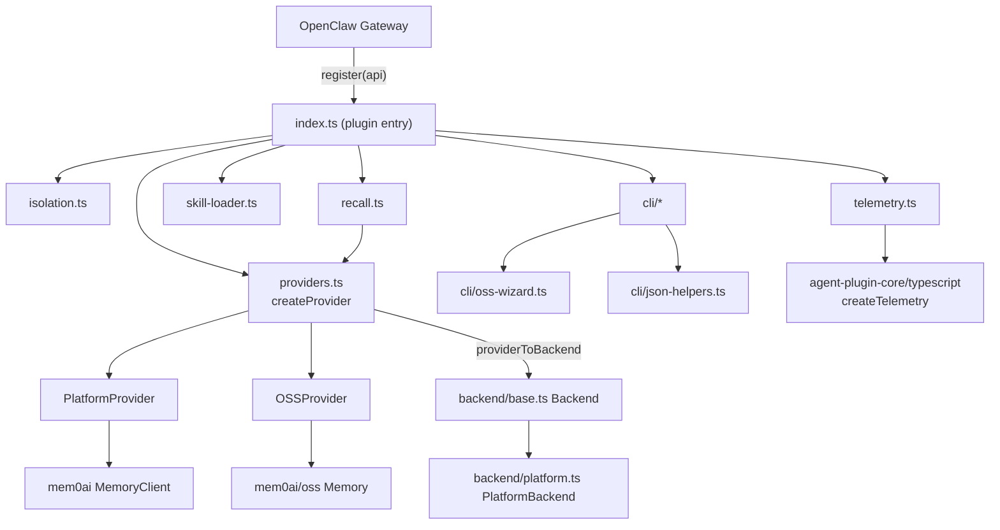
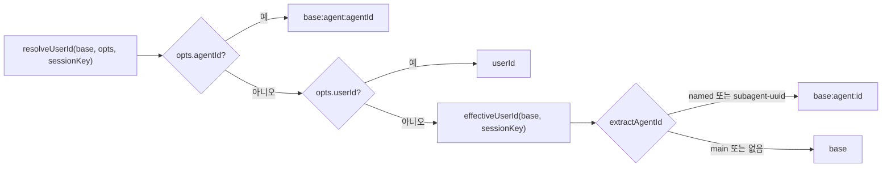
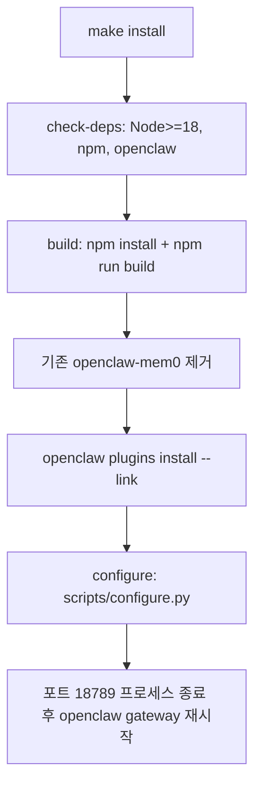

# openclaw 모듈

`integrations/openclaw`는 [OpenClaw](https://www.npmjs.com/package/openclaw) 게이트웨이용 **Mem0 메모리 플러그인**(`@mem0/openclaw-mem0`, v1.2.1)입니다. 에이전트에 장기 메모리를 제공하며, 호스팅 **Platform**(api.mem0.ai)과 **자체 호스팅 OSS**(`mem0ai/oss`) 두 모드를 지원합니다. 핵심 기능은 다음과 같습니다.

- **Provider 추상화**: Platform/OSS 차이를 `Mem0Provider` 뒤에 숨김
- **Backend 추상화**: CLI 명령용 `Backend` 인터페이스 (Platform REST 직접 호출)
- **Skills 모드**: `memory-triage` 스킬 프롬프트 주입 + 카테고리/토큰 예산 기반 recall
- **에이전트별 격리**: 세션 키에서 `user_id` 네임스페이스 도출
- **설치/설정 도구**: `Makefile`, `scripts/configure.py`, OSS 마법사

> 참고: 이 문서는 제공된 코어 컴포넌트 기준입니다. `index.ts`, `types.ts`, `config.ts`, `fs-safe.ts`, `cli/config-file.ts`는 제공된 코드에 포함되지 않았고, 다른 파일에서의 import/테스트 사용 내용으로만 확인되었습니다.

관련 모듈: [Framework_and_Workflow-Tool_Integrations](Framework_and_Workflow-Tool_Integrations.md), [Coding-Agent_Memory_Plugins_and_Shared_Plugin_Core](Coding-Agent_Memory_Plugins_and_Shared_Plugin_Core.md)(공유 `createTelemetry`, `createMemoryLifecycle`), [TypeScript_SDK_Core_(Hosted_Client_and_OSS_Engine)](TypeScript_SDK_Core_(Hosted_Client_and_OSS_Engine).md)(`mem0ai`, `mem0ai/oss`), [Node_CLI](Node_CLI.md)(`Backend` 원본), [CI_CD_and_Repository_Governance](CI_CD_and_Repository_Governance.md)(`openclaw-checks.yml`, `openclaw-cd.yml`).

## 1. 아키텍처



## 2. 컴포넌트

### 2.1 Provider 계층 — `providers.ts`
| 항목 | 설명 |
|---|---|
| `createProvider(cfg, api)` | `cfg.mode === "open-source"`면 `OSSProvider`, 아니면 `PlatformProvider` |
| `PlatformProvider` | `mem0ai`의 `MemoryClient`를 지연 import. camelCase 옵션, `user_id`/`run_id`는 `filters`에 포함 |
| `OSSProvider` | `mem0ai/oss`의 `Memory` 사용. 지연 초기화 후 `getAll`로 워밍업 |
| `providerToBackend` | Provider를 `Backend`로 감쌈. `entities`, `listEvents`, `getEvent`, `deleteEntities`는 Platform 전용이라 오류 발생 |
| `normalize*` | Platform(`user_id`)과 OSS(`userId`) 필드명 및 `{results: []}`/배열 응답 차이를 흡수 |
| `customCategoryMapToList` | `{이름: 설명}` 맵을 `[{이름: 설명}]` 리스트로 변환 |

OSSProvider의 복원력 장치:
- **initPromise 재시도**: 초기화 실패 시 promise를 비워 다음 호출에서 재시도 (`sqlite-resilience.test.ts`에서 검증)
- **SQLite 폴백**: `better-sqlite3`를 `:memory:`로 미리 검사해 깨져 있으면 `disableHistory`로 시작. 생성자 실패 시 history 비활성화로 1회 재시도
- **벡터 스토어 패치**: `PGVector`, `RedisDB`, `Qdrant`의 `initialize`를 감싸 `dimension`/`embeddingModelDims`를 동기화하고, 차원을 모르면 초기화를 건너뛰며, 실제 초기화는 1회만 실행
- `_buildConfig`: 기본 embedder `openai/text-embedding-3-small`, 기본 LLM `openai/gpt-5-mini`. 빈 문자열 값 제거, `host`를 `url`로 변환. 상대 `historyDbPath`는 `api.resolvePath`로 해석하고 절대경로(Unix/Windows)는 유지
- `console.warn`에서 `checkCompatibility` 메시지만 필터링
- `infer === false`이고 `deduced_memories`가 있으면 OSS는 해당 사실을 메시지로 재작성해 저장 (OSS는 `deduced_memories` 미지원)

### 2.2 Backend 계층 — `backend/base.ts`, `backend/platform.ts`
`cli/node/src/backend/*`를 **미러링한 파일**("DO NOT DIVERGE")입니다. 원본과 동기화를 유지해야 합니다 ([Node_CLI](Node_CLI.md) 참조).

- `Backend` 인터페이스: `add`, `search`, `get`, `listMemories`, `update`, `delete`, `deleteEntities`, `status`, `entities`, `listEvents`, `getEvent`
- 오류: `AuthError`(401), `NotFoundError`(404), `APIError`(400), 기타 `HTTP <status>: ...`
- `PlatformBackend`: `fetch` 기반, 30초 타임아웃, 헤더 `Authorization: Token <key>`, `X-Mem0-Source: OPENCLAW`, `X-Mem0-Caller-Type: plugin` 등
- 엔드포인트: `POST /v1/memories/`, `POST /v2/memories/search/`(기본 `top_k=10`, `threshold=0.3`), `POST /v2/memories/`(목록), `GET|PUT|DELETE /v1/memories/{id}/`, `DELETE /v2/entities/{type}/{id}/`, `GET /v1/ping/`, `/v1/entities/`, `/v1/events/`, `/v1/event/{id}/`
- `_buildFilters`: 조건이 1개면 그대로, 2개 이상이면 `{AND: [...]}`. 호출자가 `AND`/`OR` 구조를 넘기면 그대로 사용

### 2.3 에이전트 격리 — `isolation.ts`

- `extractAgentId`: `agent:<id>:...`에서 id 추출. `main`이면 `undefined`, `...:subagent:<uuid>`는 `subagent-<uuid>`
- `isNonInteractiveTrigger`: `cron`, `heartbeat`, `automation`, `schedule` 트리거(대소문자 무시) 또는 세션 키의 `:cron:`/`:heartbeat:`는 autocapture/autorecall 건너뜀
- `isSubagentSession`: `:subagent:` 포함 여부 (서브에이전트 UUID는 매번 달라 네임스페이스가 항상 비어 있기 때문)

### 2.4 Recall 엔진 — `recall.ts`
```mermaid
sequenceDiagram
    participant H as before_prompt_build 훅
    participant R as recall()
    participant P as Mem0Provider
    H->>R: query, userId, SkillsConfig, sessionId
    R->>R: sanitizeQuery (메타데이터 접두 제거)
    R->>P: search(top_k=maxMemories*2, threshold, source=OPENCLAW)
    opt sessionId 존재
        R->>P: search(run_id=sessionId, top_k=5)
    end
    R->>R: 중복 제거, rankMemories, budgetMemories
    R-->>H: context(&lt;recalled-memories&gt;), memories, tokenEstimate
```
- 기본값: 토큰 예산 1500, 최대 15개, threshold 0.4, 약 4자당 1토큰
- 카테고리 순서: identity, configuration, rule, preference, decision, technical, relationship, project, operational
- 정렬 키: 카테고리 우선순위, importance(메타데이터 또는 카테고리 기본값), 검색 score
- `identityAlwaysInclude`(기본 true)면 identity/configuration은 예산과 무관하게 포함(단 `maxMemories`는 적용)
- 검색 실패는 경고만 남기고 계속 진행 (graceful degradation)

### 2.5 스킬 로더 — `skill-loader.ts`
- `resolveSkillsDir`: `import.meta.url`, `__dirname`(jiti/CJS) 후보를 순서대로 시도하고 `memory-triage/SKILL.md` 존재로 검증
- `safePath`: 스킬 디렉터리 밖으로 벗어나는 경로(path traversal) 차단
- `loadSkill`: SKILL.md 본문 + 도메인 오버레이(`<skill>/domains/<domain>.md`) + 카테고리/triage 설정/사용자 규칙을 병합
- `loadTriagePrompt`: 전체 프롬프트(`<memory-system>`). SKILL.md가 없으면 최소 인라인 프로토콜로 폴백
- `loadCompactTriagePrompt`: 매 턴 주입용 축약본. 커스텀 규칙이 280자를 넘으면 미리보기만 포함
- `ttlToExpirationDate("7d")`: 오늘 기준 `YYYY-MM-DD` 반환 (`Nd` 형식만 지원)
- 기본 카테고리 TTL: `project` 90d, `operational` 7d, 나머지 영구 (`identity`는 immutable)
- `resolveCredentialPatterns`의 기본값: `sk-`, `m0-`, `ghp_`, `AKIA`, `Bearer ` 등 (자격 증명 저장 금지)
- `isSkillsMode`: `triage.enabled !== false`

### 2.6 텔레메트리 — `telemetry.ts`
- `captureEvent(name, props, {apiKey, mode, skillsActive})`: 공유 `createTelemetry`(host `openclaw`, source `OPENCLAW`) 사용
- 비활성화: `MEM0_TELEMETRY` 값이 `false/0/no/off`
- distinct id 우선순위: 키에 매칭되는 이메일의 SHA-256 → API 키의 SHA-256 → 익명 ID(`openclaw-anon-…`)
- `/v1/ping/`로 이메일을 비동기 확인하고 키 지문(fingerprint)으로 계정 전환을 감지. 익명 ID는 `$identify`로 연결 후 삭제
- 텔레메트리 오류는 플러그인 동작에 영향을 주지 않음 (모두 try/catch)
- `PLUGIN_VERSION`은 빌드 시 `__OPENCLAW_PLUGIN_VERSION__`로 주입 (`tsup.config.ts`, `vitest.config.ts`의 `define`)

### 2.7 CLI 보조 — `cli/`
- `json-helpers.ts`: `jsonOut`/`jsonErr`(`--json` 출력), `redactSecrets`(8자 이하는 앞 2자+`***`, 그 외 앞4…뒤4)
- `oss-wizard.ts`: LLM(openai, ollama, anthropic), embedder(openai, ollama), vector(qdrant, pgvector) 정의와 설정 빌더. 컬렉션 이름은 `mem0_<dims>d`. 연결 점검(`checkOllamaConnectivity`, `checkQdrantConnectivity`, `checkPgConnectivity`)과 `validateOssFlags`(`--oss-*` 비대화형 플래그 검증)

### 2.8 SDK 타입 선언 — `openclaw-plugin-sdk.d.ts`
`openclaw/plugin-sdk`의 `OpenClawPluginApi`(`registerTool`, `on`, `registerCli`, `registerService`, 선택적 `registerMemoryCapability` 등), `PluginEntry`, `definePluginEntry` 선언. `registrationMode`가 `cli-metadata`이면 `registerCli`만 호출하고 런타임 부작용(서비스/툴/훅 등록)은 없어야 함 (`index.test.ts`에서 검증).

## 3. 빌드, 설치, 설정 (아티팩트)

| 파일 | 역할 |
|---|---|
| `package.json` | ESM 패키지, 의존성 `mem0ai 3.0.7`, `@sinclair/typebox`. `openclaw.compat`는 pluginApi/gateway `>=2026.4.24`. 배포 파일: `dist`, `openclaw.plugin.json`, `skills` |
| `tsup.config.ts` | 엔트리 `index.ts`, `fs-safe.ts`. ESM, dts, `mem0ai`, `better-sqlite3`, `openclaw/*`는 external |
| `vitest.config.ts` | `openclaw/plugin-sdk*`를 `test-shims/`로 alias (런타임에는 게이트웨이가 제공) |
| `tsconfig.json` | `strict: false`, `rootDir: ".."`(공유 core 참조 가능), `noEmit` |
| `pnpm-workspace.yaml` | `better-sqlite3`, `esbuild`, `protobufjs` 빌드 허용 및 보안 `overrides` |
| `Makefile` | `install`, `uninstall`, `restart`, `status`, `logs`, `clean`, `build`, `check-deps`, `configure`, `help` |
| `scripts/configure.py` | `~/.openclaw/openclaw.json` 패치 |



`configure.py`는 최초 1회 `openclaw.json.pre-skills-backup`을 만든 뒤 `tools.profile=full`, 내장 `session-memory` 훅 비활성화, `plugins.entries.openclaw-mem0`에 skills 설정(triage 활성, recall 예산 1500, `domain: companion`)을 기록합니다. `make uninstall`은 npm의 `@mem0/openclaw-mem0`를 재설치하고 백업을 복원합니다. `MEM0_API_KEY`가 없으면 `make configure`가 대화형으로 입력을 받습니다.

CI/CD: `.github/workflows/openclaw-checks.yml`(build/lint/test), `openclaw-cd.yml`(npm 배포). 자세한 내용은 [CI_CD_and_Repository_Governance](CI_CD_and_Repository_Governance.md)를 참고하세요.

## 4. 테스트
- `index.test.ts`: 등록 모드, `extractAgentId`/`effectiveUserId`/`resolveUserId` 우선순위, 트리거/서브에이전트 판별, 노이즈 메시지 필터(`isNoiseMessage`, `isGenericAssistantMessage`, `stripNoiseFromContent`, `filterMessagesForExtraction`), recall threshold 동작
- `sqlite-resilience.test.ts`: `disableHistory` 전달, 초기화 재시도, SQLite 폴백, 벡터 스토어 차원 패치, `history()` 오류 처리, `customInstructions`/`historyDbPath` 처리
- 실행: `pnpm test` (`vitest run`)

## 5. 주의사항
- `backend/*`는 `cli/node`와 동기화가 필요합니다. 한쪽만 수정하면 안 됩니다.
- `mem0ai` 3.0.x 규칙: SDK 옵션은 camelCase, 엔티티 ID는 `filters` 안에 snake_case로 전달하고, `source`는 필터가 아닌 add 전용입니다.
- OSS 모드에서는 메타데이터 단독 업데이트와 엔티티/이벤트 관리를 지원하지 않습니다.
- 정확한 훅 등록, 툴 정의, 설정 스키마(`mem0ConfigSchema`)는 `index.ts`/`config.ts`(제공되지 않음)에서 확인해야 합니다.
