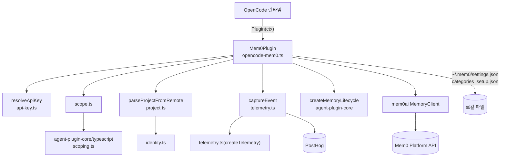
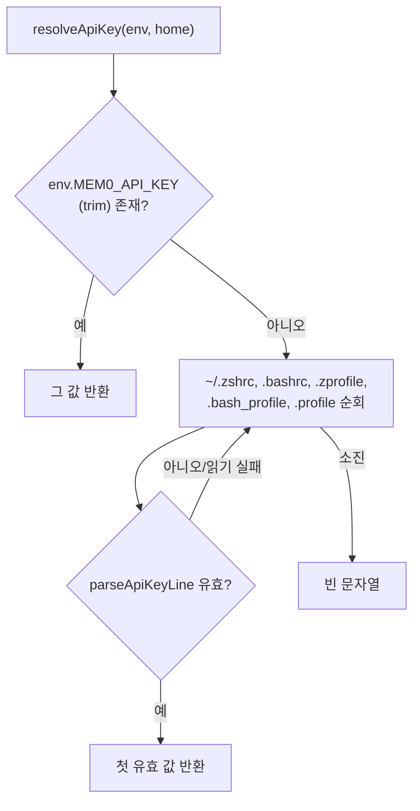
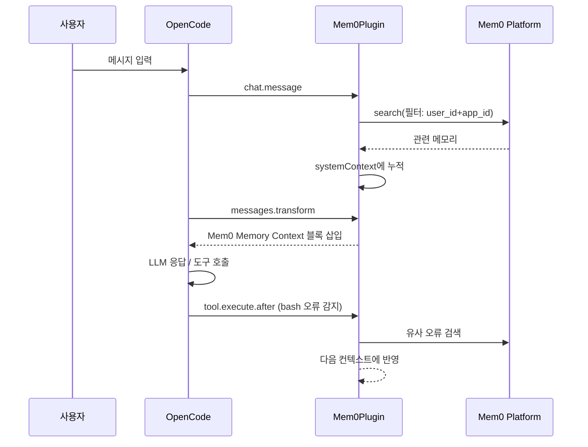
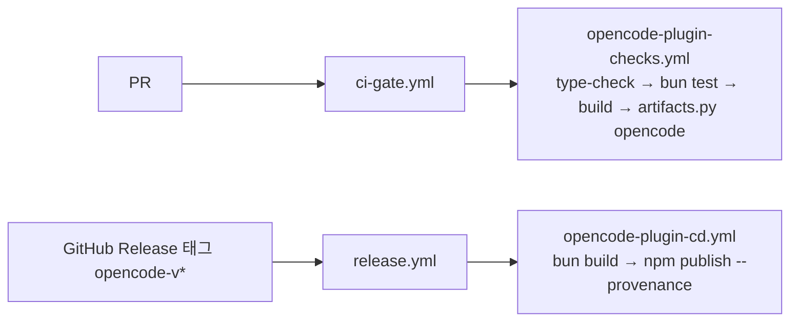

# opencode_plugin

`@mem0/opencode-plugin`(v0.4.1)은 [OpenCode](https://opencode.ai)용 Mem0 영속 메모리 플러그인이다. 세션 간에 메모리를 추가·검색·관리할 수 있으며, MCP 서버 없이 `mem0ai` SDK(`MemoryClient`)를 감싼 **네이티브 OpenCode 도구**와 **훅(hook)** 으로 동작한다. Bun/TypeScript로 작성되었고 npm으로 배포된다.

> 소속: `Framework_and_Workflow-Tool_Integrations` 모듈의 하위 모듈. 공유 로직은 `integrations/agent-plugin-core/typescript/`(→ [Coding-Agent_Memory_Plugins_and_Shared_Plugin_Core](Coding-Agent_Memory_Plugins_and_Shared_Plugin_Core.md))에서 가져온다. 호출하는 SDK는 [TypeScript_SDK_Core_(Hosted_Client_and_OSS_Engine)](TypeScript_SDK_Core_(Hosted_Client_and_OSS_Engine).md)의 호스티드 `MemoryClient`이다.

## 1. 파일 구성

| 파일 | 역할 |
|------|------|
| `opencode-mem0.ts` | 플러그인 본체 `Mem0Plugin`: 신원 해석, 도구 정의, 훅 구현 |
| `api-key.ts` | `resolveApiKey` / `parseApiKeyLine` — API 키 해석 (테스트: `api-key.test.ts`) |
| `scope.ts` | 스코프(`project`/`session`/`global`) 필터·쓰기 파라미터 래퍼, `scopeSearchFilters`, `scopeWriteParams`, `asScope`, `resolveDefaultScope`, `SCOPE_GUIDANCE` |
| `project.ts` | `parseProjectFromRemote` 재노출 (`agent-plugin-core`의 `identity.ts`) |
| `telemetry.ts` | PostHog 텔레메트리 `buildEvent`, `captureEvent` |
| `package.json` / `tsconfig.json` | 패키지 매니페스트·빌드·타입체크 설정 |
| `opencode-skills/` | 번들 스킬(`SKILL.md`) 디렉터리; `/mem0-*` 슬래시 명령의 원천 |

## 2. 아키텍처

### 초기화 순서 (`Mem0Plugin`)

1. `resolveApiKey(process.env, HOME)` — 없으면 `client.app.log`로 오류를 남기고 **빈 객체 `{}`를 반환**(플러그인 비활성).
2. `MemoryClient({apiKey})` 생성.
3. 신원 결정: `userId`(`MEM0_USER_ID` → OS 사용자명), `appId`(`MEM0_APP_ID` → git remote `owner/repo` → git 루트 디렉터리명 → cwd 이름), `branch`, `sessionId`(`ses_<ts>_<rand>`).
4. `loadGlobalSearch()`로 `~/.mem0/settings.json`의 `global_search` 읽기, `createMemoryLifecycle().beginSession()`.
5. `beforeExit`에 `session_stop` 텔레메트리 등록, 코딩용 카테고리 자동 설정을 백그라운드 실행.
6. 훅·도구 객체 반환.

### API 키 해석 (`api-key.ts`)

`parseApiKeyLine`은 `MEM0_API_KEY=값` 및 `export MEM0_API_KEY=값` 형태(따옴표, 뒤쪽 `# 주석` 허용)만 받아들이고, 빈 값과 `$`로 시작하는 값(`$VAR`, `$(cmd)`)은 **실행/치환을 하지 않고 거부**한다. `.env` 등 허용 목록 밖의 파일은 읽지 않는다. 데스크톱 앱처럼 프로세스 환경에 키가 없지만 셸 프로필에 있는 경우를 복구하기 위한 것이다(`api-key.test.ts`가 이슈 #6003 경로를 검증).

## 3. 스코프 모델

`scope.ts`는 `agent-plugin-core`의 `scoping.ts`를 얇게 감싼다.

| 스코프 | 검색 필터 | 쓰기 파라미터 |
|--------|-----------|---------------|
| `project`(기본) | `user_id` + `app_id` | `user_id`, `app_id` |
| `session` | `user_id` + `app_id` + `run_id` | + `run_id`(= sessionId) |
| `global` | `user_id`만 | `user_id`만 |

- 기본 스코프는 `~/.mem0/settings.json`의 `default_scope`이며 **매 호출마다 새로 읽으므로** `/mem0-scope` 변경이 재시작 없이 반영된다.
- `resolveToolScope`: 명시적 `scope` 인자가 우선하되, `global`은 설정에서 global이 선택된 경우에만 허용(아니면 오류). 값이 비었거나 `*`뿐이면 `Invalid memory scope` 오류.
- 읽기 우선순위(`readScopeFilters`): 명시 `scope` → 명시 `filters`/`agent_id`(`resolveFilters`가 누락된 `user_id`/`app_id`를 AND로 보충) → 기본 스코프(`project`면 기존 동작, `global_search`면 `{OR:[{user_id:"*"}]}` 포함).

## 4. 노출 도구 (`tool`)

모두 `mem0ai` `MemoryClient`를 호출하고 결과를 `JSON.stringify`로 반환하며, 호출 시 `tool_use` 텔레메트리를 남긴다.

| 도구 | SDK 호출 | 비고 |
|------|----------|------|
| `add_memory` | `mem0.add` | 메타데이터 기본값(`confidence=0.7`, `source=opencode`, `type=task_learning`, `session_id`, `files`, `branch`); `confidence>=1.0`이면 `infer=false` 기본 |
| `search_memories` | `mem0.search` | `limit`/`top_k`(기본 10), 스코프 필터 |
| `get_memories` | `mem0.getAll` | 페이지네이션 |
| `get_memory` | `mem0.get` | ID 조회 |
| `update_memory` | `mem0.update` | 텍스트/메타데이터 |
| `delete_memory` | `mem0.delete` | |
| `delete_all_memories` | `mem0.deleteAll` | 파괴적; `global`은 명시 필요 |
| `delete_entities` | `mem0.deleteUsers` | |
| `list_entities` | `mem0.users` | |
| `get_event_status` | `mem0.client.get("/v1/event/{id}/")` | 비동기 쓰기 확인 |

텍스트 입력은 `lifecycle.prepareUserText`를 거쳐 공유 코어의 전처리를 적용한다. 검색 도구 설명은 `agent-plugin-core`의 `SEARCH_TOOL_DESCRIPTION`/`SEARCH_QUERY_DESCRIPTION`을 재사용한다.

## 5. 훅

| 훅 | 동작 |
|----|------|
| `chat.message` | 10자 이상 사용자 메시지만 처리. 첫 메시지에서 세션 초기화(메모리 개수 조회, 상위 5개 이전 컨텍스트, 스코프 안내 주입, `session_start`). "remember this" 류(`NUDGE_RE`)는 `add_memory` 유도 문구, "where did we leave off" 류(`RESUME_RE`)는 상태/결정 2건 병렬 검색 후 중복 제거, 그 외에는 관련 메모리 검색. 3번째 메시지마다 `infer:true`로 비동기 자동 캡처, 5번째마다 저장 부족 시 리마인더 |
| `experimental.chat.messages.transform` | 누적된 `systemContext`를 `## Mem0 Memory Context` 블록으로 첫 사용자 메시지 앞에 삽입(마커로 중복 방지) |
| `tool.execute.before` | `Write/Edit/MultiEdit`가 `MEMORY.md`나 `.claude/memory`를 쓰려 하면 오류로 차단하고 `add_memory` 사용 유도 |
| `tool.execute.after` | `bash` 출력에서 강한 오류 패턴(Traceback, panic, FATAL 등) 또는 오류 2회 이상 감지 시(git commit/merge/rebase 제외) 유사 오류 메모리 검색 후 컨텍스트에 추가 |
| `experimental.session.compacting` | 압축 전 요약 메모리를 비동기 저장하고, 상위 10개 메모리를 `output.context`에 추가 |
| `shell.env` | 셸 환경에 `MEM0_USER_ID`, `MEM0_APP_ID`, `MEM0_SESSION_ID`, `MEM0_BRANCH`, `MEM0_GLOBAL_SEARCH` 주입 |
| `config` | 플러그인의 `opencode-skills` 디렉터리를 `skills.paths`에 추가하고, 각 스킬을 `/mem0-<skill>` 슬래시 명령으로 `config.command`에 등록(설명은 `SKILL.md`의 `description:`) |

대부분의 부수 작업(검색·자동 캡처)은 `try/catch`로 실패를 삼켜 **OpenCode 대화 흐름을 막지 않는다**.

## 6. 코딩 카테고리 자동 설정

`autoSetupCategories`는 17개의 `CODING_CATEGORIES`(예: `architecture_decisions`, `debugging_notes`, `security` …)를 프로젝트 `customCategories`에 설정한다. `~/.mem0/categories_setup.json`에 API 키 SHA-256 지문 → 카테고리 지문을 기록해 이미 적용됐으면 건너뛰는 **멱등** 동작이며 실패는 무시된다.

## 7. 텔레메트리 (`telemetry.ts`)

- `agent-plugin-core`의 `createTelemetry`를 `host: "opencode"`, `source: "OPENCODE_PLUGIN"`, 이벤트명 `plugin.<event>`로 구성. `MEM0_TELEMETRY=false`로 비활성화(테스트에서 사용).
- `distinct_id` = API 키의 SHA-256 앞 32자. `project_hash` = `sha256("<apiKey>:<projectId>")` — API 키를 솔트로 써서 프로젝트 ID 추측 역산을 방지하며, 키 없이는 생략.
- 이벤트: `session_start`, `session_stop`, `user_prompt`, `tool_use`, `bash_error`, `pre_compact`. 이벤트에는 개수·플래그만 담고 메시지 내용은 담지 않는다.

## 8. 빌드·테스트·배포

| 항목 | 내용 (출처) |
|------|-------------|
| 빌드 | `bun build opencode-mem0.ts --outdir dist --target bun --format esm --entry-naming index.[ext]` (`package.json`) |
| 개발 | 같은 명령에 `--watch` (`dev`) |
| 타입체크 | `tsc --noEmit` (`tsconfig.json`: strict, `rootDir: ".."`로 `agent-plugin-core` 소스 포함, `bun-types`) |
| 테스트 | `bun test` (`api-key.test.ts`, `scope.test.ts`, `project.test.ts`, `telemetry.test.ts`) |
| 패키지 파일 | `dist`, `index.d.ts`, `LICENSE`, `opencode-skills` |
| 의존성 | `@opencode-ai/plugin ^1.0.162`, `mem0ai ^3.0.8` |

`package.json`의 `opencode.hooks` 필드는 `config`, `chat.message`, `tool.execute.before/after`, `experimental.chat.messages.transform`, `experimental.session.compacting`, `shell.env`를 선언한다.

테스트는 `fetch`를 스텁하고 임시 HOME을 만들며 `beforeExit` 리스너를 정리해 플러그인이 남기는 전역 상태를 격리한다(`stubFetch`, `home`, `pluginContext`, `captureDeferredPluginCleanup`).

### CI/CD

- `opencode-plugin-checks.yml`: `integrations/opencode-plugin/**`, `integrations/agent-plugin-core/typescript/**` 변경 시 실행. 마지막에 `integrations/agent-plugin-core/conformance/artifacts.py opencode`로 패키지 산출물을 검증한다.
- `opencode-plugin-cd.yml`: `tag`가 `opencode-v`로 시작할 때만 동작, OIDC 신뢰 게시. **워크플로 파일명이 npm 신뢰 게시자 설정에 고정**되어 있으므로 이름을 바꾸면 안 된다. 프리릴리스는 버전 preid를 dist-tag로 사용한다.
- 자세한 파이프라인은 [CI_CD_and_Repository_Governance](CI_CD_and_Repository_Governance.md) 참고.

## 9. 설정 요약

| 이름 | 용도 |
|------|------|
| `MEM0_API_KEY` | API 키(없으면 셸 프로필 폴백) |
| `MEM0_USER_ID` / `MEM0_APP_ID` | 사용자/프로젝트 ID 오버라이드 |
| `MEM0_TELEMETRY` | `false`로 텔레메트리 끔 |
| `~/.mem0/settings.json` | `global_search`, `default_scope` |
| `~/.mem0/categories_setup.json` | 카테고리 설정 상태 캐시 |

## 10. 유지보수 시 주의

- 스코프·신원·텔레메트리·라이프사이클 로직은 `agent-plugin-core/typescript`가 원천이므로 여기서 복제하지 말고 코어를 수정한다(다른 플러그인과 동작 일치 필요).
- `delete_all_memories`/`delete_entities`는 되돌릴 수 없다. `global` 스코프는 사용자가 `/mem0-scope`로 활성화해야만 허용되는 안전장치를 유지할 것.
- 이 패키지는 pnpm이 아닌 **Bun**을 사용한다(저장소 규칙 예외).
