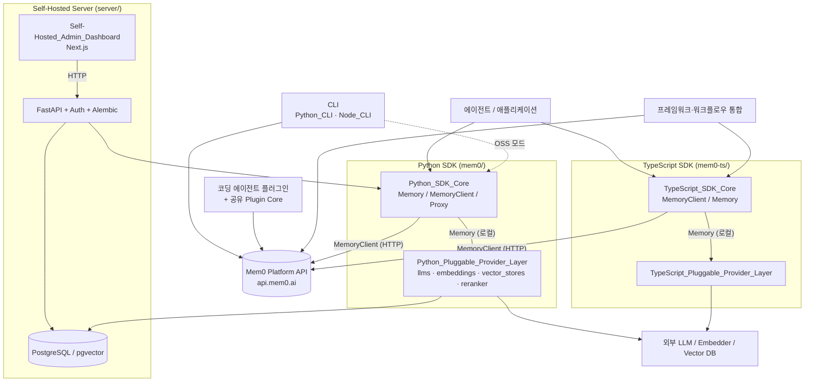
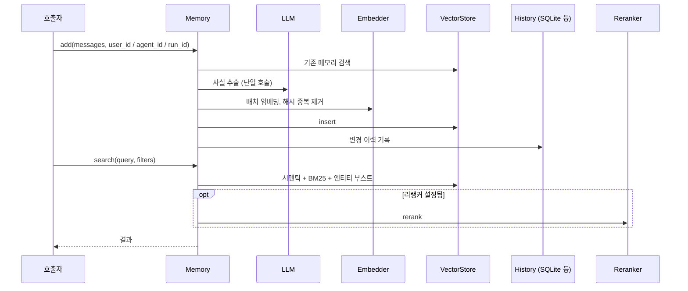
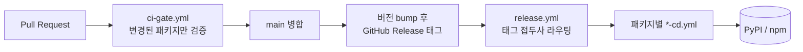

# mem0 저장소 개요

## 1. 목적

**Mem0**("mem-zero")는 AI 에이전트에 지속적이고 개인화된 메모리를 제공하는 메모리 계층입니다. 호스티드 플랫폼 API와 자체 호스팅용 오픈소스 SDK를 함께 제공하며, 라이선스는 Apache-2.0입니다. 이 저장소는 Python, TypeScript, Docker 등 여러 언어가 섞인 모노레포이고, 패키지마다 린터, 포매터, 테스트 러너가 다릅니다.

저장소는 크게 다섯 영역으로 나뉩니다.

| 영역 | 내용 |
|---|---|
| SDK | Python(`mem0/`)과 TypeScript(`mem0-ts/`) 두 SDK. 각각 **호스티드 클라이언트**와 **로컬(OSS) 메모리 엔진**을 제공합니다. |
| 프로바이더 계층 | LLM, 임베딩, 벡터 스토어, 리랭커를 설정의 `provider` 값만 바꿔 교체할 수 있게 한 계층 |
| 자체 호스팅 서버 | FastAPI REST 서버, PostgreSQL/pgvector, Next.js 관리 대시보드 |
| CLI | Python CLI(`mem0-cli`)와 Node CLI(`@mem0/cli`), 진입점은 모두 `mem0` |
| 통합 | 코딩 에이전트 플러그인(Claude Code, Codex, Cursor 등), 프레임워크·워크플로우 도구 통합(Vercel AI SDK, n8n, Zapier, OpenClaw 등) |

## 2. 전체 아키텍처

### 2.1 시스템 전체 구성

### 2.2 메모리 추가·검색 흐름 (OSS 엔진)

### 2.3 릴리스 흐름

## 3. 핵심 모듈 문서

| 모듈 | 경로 | 설명 | 문서 |
|---|---|---|---|
| Python SDK Core | `mem0/` | `Memory`/`AsyncMemory`(로컬 엔진), `MemoryClient`(호스티드), OpenAI 호환 프록시, 유틸 | [Python_SDK_Core](Python_SDK_Core_(Memory_Engine_and_Hosted_Client).md) |
| Python Provider Layer | `mem0/llms`, `embeddings`, `vector_stores`, `reranker` | 교체 가능한 LLM, 임베딩, 벡터 스토어, 리랭커 | [Python_Pluggable_Provider_Layer](Python_Pluggable_Provider_Layer.md) |
| TypeScript SDK Core | `mem0-ts/src` | 호스티드 `MemoryClient`, OSS `Memory`, 히스토리 저장소, LangChain 어댑터 | [TypeScript_SDK_Core](TypeScript_SDK_Core_(Hosted_Client_and_OSS_Engine).md) |
| TypeScript Provider Layer | `mem0-ts/src/oss/src` | TS 쪽 프로바이더 구현 | [TypeScript_Pluggable_Provider_Layer](TypeScript_Pluggable_Provider_Layer.md) |
| Python CLI | `cli/python` | Typer 기반 `mem0-cli` | [Python_CLI](Python_CLI.md) |
| Node CLI | `cli/node` | Commander 기반 `@mem0/cli` | [Node_CLI](Node_CLI.md) |
| 코딩 에이전트 플러그인 | `integrations/agent-plugin-core`, `*-plugin` | 공유 코어와 호스트별 플러그인, 문서 검색 스킬 | [Coding-Agent_Memory_Plugins_and_Shared_Plugin_Core](Coding-Agent_Memory_Plugins_and_Shared_Plugin_Core.md) |
| 프레임워크 통합 | `integrations/` | Vercel AI SDK, n8n, Zapier, OpenClaw, Strands 등 | [Framework_and_Workflow-Tool_Integrations](Framework_and_Workflow-Tool_Integrations.md) |
| 자체 호스팅 서버 | `server/` | FastAPI API, 인증, DB, 관리 스크립트, Docker Compose 배포 | [Self-Hosted_Server](Self-Hosted_Server_(API,_Auth,_Persistence,_Deployment).md) |
| 관리 대시보드 | `server/dashboard` | Next.js 관리 UI | [Self-Hosted_Admin_Dashboard](Self-Hosted_Admin_Dashboard.md) |
| 빌드 설정과 도구 | `Makefile`, `pyproject.toml` 등 | 패키지별 빌드·린트·테스트 설정 | [Build_Configuration_and_Tooling](Build_Configuration_and_Tooling.md) |
| CI/CD와 거버넌스 | `.github/workflows` | CI 게이트, 릴리스 라우팅, 기여 거버넌스 | [CI_CD_and_Repository_Governance](CI_CD_and_Repository_Governance.md) |

## 4. 핵심 설계 포인트

- **두 가지 사용 모드**: 호스티드 `MemoryClient`는 플랫폼 API에 요청을 위임합니다. 로컬 `Memory`는 LLM 사실 추출, 임베딩, 벡터 저장, 하이브리드 검색, 이력 기록을 직접 수행합니다.
- **프로바이더 교체**: Pydantic 설정(Python)과 zod(TypeScript)가 `provider`를 검증하고, 팩토리가 구현 클래스를 지연 로딩합니다. 선택 의존성이 없어도 코어 SDK는 동작합니다.
- **스코프 필수**: 로컬 엔진은 `user_id`, `agent_id`, `run_id` 중 하나가 필요합니다.
- **텔레메트리**: `MEM0_TELEMETRY=false`로 끕니다. 프롬프트와 메모리 내용은 전송하지 않습니다.
- **생성물 보호**: 에이전트 플러그인의 호스트별 `core/`는 빌더가 만든 결과물이므로 직접 편집하지 않고, `agent-plugin-core/python/`을 수정한 뒤 동기화합니다.

## 5. How it is built and run

- **빌드와 패키징**: 루트 Python SDK `mem0ai`와 `cli/python`은 hatchling으로 빌드합니다. `mem0-ts`와 `cli/node`는 pnpm과 tsup으로 빌드합니다. 대시보드는 Next.js standalone 출력을 Docker 멀티스테이지로 패키징합니다.
- **린트와 테스트**: 루트 Python은 ruff(line 120)와 pytest, `cli/python`은 ruff(line 100)와 pytest를 씁니다. `mem0-ts`는 Prettier와 jest, `cli/node`는 Biome와 vitest를 씁니다. 통합 패키지는 각자의 설정을 따릅니다. 로컬에서는 `Makefile`과 `.pre-commit-config.yaml`(ruff, isort)이 이를 실행합니다.
- **CI**: PR 검증은 필수 체크 하나인 `ci-gate.yml`이 맡습니다. 변경된 패키지만 검사하고, 패키지별 CI는 재사용 워크플로우로 호출됩니다.
- **릴리스**: 버전은 `pyproject.toml`이나 `package.json`에서 올리고 태그를 만듭니다. `release.yml`이 태그 접두사로 해당 `*-cd.yml`을 실행해 PyPI와 npm에 게시합니다(OIDC trusted publishing).
- **배포**: 자체 호스팅 서버는 `server/docker-compose.yaml`(서비스: `mem0`, `mem0-dashboard`, `postgres`)로 띄웁니다. `server/Makefile`, `init-db.sh`, `seed.sh`와 Alembic 마이그레이션이 운영을 돕습니다.
- **기여 거버넌스**: 외부 PR은 `accepted` 라벨이 붙은 이슈와 서명된 CLA가 있어야 합니다. `.github/workflows/`는 유지관리자 승인 없이 수정하지 않습니다.

자세한 내용은 아래 문서를 참고하세요.

- [Build_Configuration_and_Tooling](Build_Configuration_and_Tooling.md): 패키지별 도구 체인, 빌드 산출물, 컨테이너 설정
- [CI_CD_and_Repository_Governance](CI_CD_and_Repository_Governance.md): 게이트, 릴리스 라우팅, 게시 절차, 거버넌스 워크플로우
- [Self-Hosted_Server](Self-Hosted_Server_(API,_Auth,_Persistence,_Deployment).md): Docker Compose 배포와 운영 스크립트