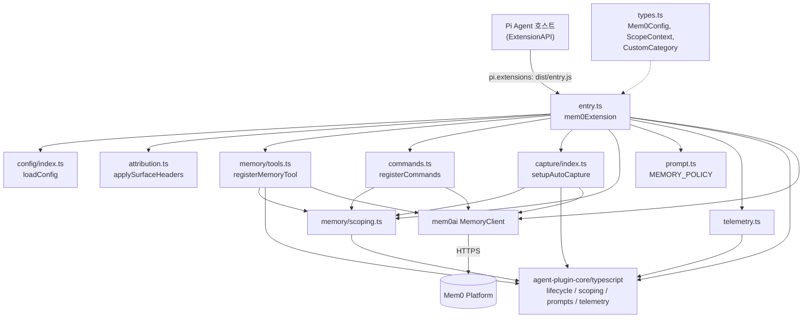
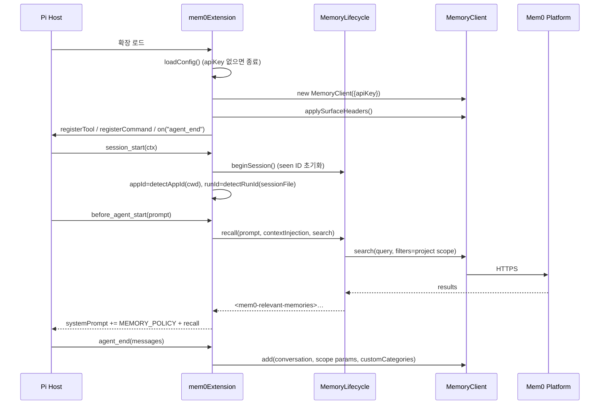

# pi_agent_plugin 모듈

`integrations/pi-agent-plugin`(npm: `@mem0/pi-agent-plugin`, 버전 0.3.2)은 [Pi Agent](https://github.com/earendil-works)(`@earendil-works/pi-coding-agent`)용 **Mem0 메모리 확장(extension)** 입니다. 세션·프로젝트를 넘나드는 영구 시맨틱 메모리를 에이전트에 제공하며, 호스티드 Mem0 플랫폼(`mem0ai` `MemoryClient`)을 백엔드로 사용합니다.

제공 기능:

- **자동 회상(recall)**: 매 에이전트 시작 전(`before_agent_start`) 프롬프트와 관련된 메모리를 검색해 시스템 프롬프트에 주입
- **자동 캡처(capture)**: 에이전트 종료(`agent_end`) 시 대화를 Mem0에 저장
- **`mem0_memory` 도구**: LLM이 호출하는 search/add/get_all/update/delete/delete_all
- **슬래시 명령**: `/mem0-remember`, `/mem0-forget`, `/mem0-search`, `/mem0-tour`, `/mem0-scope`, `/mem0-status`
- **스코프**: `project` / `session` / `global`
- **텔레메트리와 표면 귀속(attribution)**: PostHog 계열 이벤트 + `X-Mem0-*` 헤더

> 공통 라이프사이클·스코핑·텔레메트리 코드는 `integrations/agent-plugin-core/typescript/`에 있으며, 본 모듈은 상대 경로로 직접 import 합니다. 자세한 내용은 [Coding-Agent_Memory_Plugins_and_Shared_Plugin_Core](Coding-Agent_Memory_Plugins_and_Shared_Plugin_Core.md) 문서를 참고하세요. 호스티드 클라이언트 자체는 [TypeScript_SDK_Core_(Hosted_Client_and_OSS_Engine)](TypeScript_SDK_Core_(Hosted_Client_and_OSS_Engine).md)에 설명되어 있습니다.

---

## 1. 아키텍처



### 파일별 역할

| 파일 | 역할 |
|---|---|
| `src/entry.ts` | 확장 진입점 `mem0Extension(pi)`. 설정 로드, 클라이언트 생성, 도구/명령/캡처 등록, 라이프사이클 이벤트 핸들러(`session_start`, `before_agent_start`, `session_shutdown`) |
| `src/config/index.ts` | `loadConfig()`: `~/.pi/agent/mem0-config.json` + 환경변수 병합 |
| `src/types.ts` | `Scope`, `Mem0Config`, `ScopeContext`, `CustomCategory`, `DEFAULT_CUSTOM_CATEGORIES`(10개 카테고리) |
| `src/attribution.ts` | `applySurfaceHeaders()`: 공유 클라이언트에 출처 헤더 주입 |
| `src/memory/scoping.ts` | `detectAppId`, `detectRunId`, `resolveSearchFilters`, `resolveAddParams` |
| `src/memory/tools.ts` | `mem0_memory` 도구 정의 및 `buildToolExecute` |
| `src/commands.ts` | 슬래시 명령 6종 등록 |
| `src/capture/index.ts` | `agent_end` 자동 캡처 |
| `src/telemetry.ts` | 익명/식별 ID 관리, `captureEvent`/`captureToolEvent`/`captureCommandEvent` |
| `skills/*/SKILL.md` | `context-loader`, `forget`, `remember`, `search`, `status`, `tour` 스킬(패키지 `pi.skills`로 노출) |

---

## 2. 설정 (`loadConfig`)

```ts
interface Mem0Config {
  apiKey: string; userId: string; autoCapture: boolean;
  defaultScope: "project" | "session" | "global";
  contextInjection: boolean; searchThreshold: number;
}
```

| 키 | 기본값 | 비고 |
|---|---|---|
| `apiKey` | `""` | `MEM0_API_KEY`가 파일 값을 덮어씀 |
| `userId` | `""` | `MEM0_USER_ID`가 덮어씀. 비면 `$USER` → `$USERNAME` → `os.userInfo()` → `"default"` (`resolveUserId`) |
| `autoCapture` | `true` | |
| `defaultScope` | `"project"` | |
| `contextInjection` | `true` | 자동 회상 on/off |
| `searchThreshold` | `0.3` | `/mem0-search`에서 사용 |

- 우선순위: 기본값 < `~/.pi/agent/mem0-config.json` < 환경변수. 파일이 손상되면 조용히 기본값을 사용합니다.
- `apiKey`가 없으면 경고를 출력하고 **확장 전체를 비활성화**(등록 없이 return)합니다.

---

## 3. 런타임 흐름

### 3.1 초기화와 이벤트



### 3.2 스코프

`ScopeContext = { userId, appId, runId }` 는 `entry.ts`가 하나의 가변 객체로 보유하며 `session_start`에서 채워집니다.

- `appId`: `git rev-parse --show-toplevel`의 basename(타임아웃 3초), 실패 시 `cwd`의 basename
- `runId`: 세션 파일 경로의 SHA-256 앞 12자, 세션 파일이 없으면 `"unknown"`
- 실제 필터/파라미터 계산은 코어의 `scopeSearchFilters`, `scopeAddParams`, `resolveToolScope`에 위임합니다.
- 자동 회상과 자동 캡처는 **항상 `project` 스코프**를 사용합니다. 도구는 `scope` 인자 → `config.defaultScope` 순으로 결정합니다.

### 3.3 자동 회상 (`MemoryLifecycle.recall`)

`buildRecallContext`(코어)의 동작:

1. `contextInjection`이 false이거나 프롬프트가 비면 빈 문자열
2. 프롬프트를 시크릿 마스킹 후 최대 6,000자로 절단
3. 검색을 **2초 타임아웃**(`Promise.race`)으로 수행, 실패/타임아웃 시 조용히 빈 문자열
4. 이미 본 메모리 ID(`seenIds`)는 제외, 최대 4,000자 안에서 번호 매긴 목록을 `<mem0-relevant-memories>` 블록으로 구성

### 3.4 자동 캡처

`agent_end`에서 `lifecycle.prepareConversation(messages)`가 `user`/`assistant` 텍스트만 추출하고 `redactSecrets`로 API 키·토큰·개인키 등을 `[REDACTED]` 처리합니다. 결과가 비면 건너뛰고, 아니면 `mem0.add(conversation, {...scopeParams, customCategories})`를 호출합니다. 실패해도 에이전트 흐름을 막지 않고 `pi.capture.auto`(success=false)를 기록한 뒤 `console.error`만 남깁니다.

---

## 4. `mem0_memory` 도구

| action | 필수 인자 | 동작 |
|---|---|---|
| `search` | `query` | `mem0.search(query, {filters})` |
| `add` | `content` | `mem0.add([{role:"user",content}], {...scope, customCategories})` |
| `get_all` | - | `mem0.getAll({filters})` |
| `update` | `memory_id`, `content` | `mem0.update(id, {text})` |
| `delete` | `memory_id` | `mem0.delete(id)` |
| `delete_all` | - | `mem0.deleteAll(scope params)` (파괴적) |

- `memory_id`는 `[mem0:<uuid>]` 형태도 허용하도록 `normalizeMemoryId`로 정규화합니다.
- 출력은 **200줄 / 50,000바이트**로 절단되고 안내 문구가 붙습니다(`truncateOutput`).
- `AbortSignal`이 이미 중단됐으면 `"Cancelled"` 예외를 던집니다.
- `promptGuidelines`가 LLM에게 "명시적 요청이 없으면 `scope`를 넘기지 말 것"을 지시합니다.
- 각 호출은 `pi.tool.mem0_memory` 이벤트로 `action`, `success`, `latency_ms`, `result_count`를 기록합니다.

---

## 5. 슬래시 명령 (`registerCommands`)

등록 순서는 테스트(`commands.test.ts`)가 고정합니다: `mem0-remember`, `mem0-forget`, `mem0-search`, `mem0-tour`, `mem0-scope`, `mem0-status`.

| 명령 | 동작 |
|---|---|
| `/mem0-remember <text>` | `mem0.add([{role:"user",content}], {infer:false})`로 **원문 그대로** 저장. 빈 입력은 사용 안내 경고 |
| `/mem0-forget <query>` | 검색 → 0건이면 "No matches", 1건이면 `ui.confirm`, 여러 건이면 `ui.select`로 선택 → 삭제. 취소 시 "Cancelled" |
| `/mem0-search <query>` | 항상 시맨틱 검색(`threshold: searchThreshold`, `topK: 10`, `rerank: true`). 16진수처럼 보이는 문자열도 ID 조회로 취급하지 않음 |
| `/mem0-tour` | `getAll` 결과를 카테고리별로 그룹화하여 "Memory tour" 출력, 없으면 빈 상태 메시지 |
| `/mem0-scope [scope]` | 인자 없이 현재 스코프 표시, 인자가 있으면 `defaultScope` 변경, 잘못된 값이면 경고 |
| `/mem0-status` | 현재 상태 표시 |

결과는 `pi.sendMessage({customType, content, display: true})`로 사용자에게 보이는 메시지로 출력됩니다. 각 명령은 `captureCommandEvent`로 `pi.command.<name>` 이벤트를 남깁니다.

---

## 6. 표면 귀속 (`applySurfaceHeaders`)

저장소 규칙(`integrations/CLAUDE.md`의 *Surface attribution*)에 따라 공유 `MemoryClient`의 `headers`를 **생성 직후 한 번** 설정합니다. 자동 회상·캡처·도구·삭제가 모두 같은 클라이언트를 쓰므로 개별 호출이 아닌 클라이언트 단에서 처리해야 전 경로가 귀속됩니다.

| 헤더 | 값 | 규칙 |
|---|---|---|
| `X-Mem0-Source` | `PI_AGENT` | set-once (비어 있거나 공백일 때만 설정) |
| `X-Application` | `pi` | set-once |
| `X-Mem0-Client` | `mem0-pi-agent/<version>` | append-only, 외부 래퍼 항목을 앞에 유지 |

스택 제한(`boundedStack`): 최대 **4개 항목**, 최대 **200자**. 문자를 자르지 않고 *항목 단위*로 버리며, 자신의 항목 슬롯은 항상 예약합니다(과거에 push 후 trim 하면서 자기 항목이 사라지던 결함을 `attribution.test.ts`가 회귀 방지).

---

## 7. 텔레메트리

`telemetry.ts`는 코어의 `createTelemetry({host:"pi", source:"PI_AGENT_PLUGIN", version, distinctId})`를 감쌉니다.

- distinct ID: `apiKey`가 있으면 SHA-256 해시, 없으면 `~/.pi/agent/mem0-telemetry-id.json`에 저장되는 `pi-mem0-anon-<uuid>`.
- 익명 → 식별 전환 시 최초 1회 `$identify`(`$anon_distinct_id`)를 보내고 익명 파일을 삭제합니다.
- 이벤트: `pi.plugin.registered`, `pi.session.start`, `pi.session.stop`, `pi.capture.auto`, `pi.tool.mem0_memory`, `pi.command.*`.
- `MEM0_TELEMETRY=false`면 큐에 아무것도 쌓이지 않습니다(`telemetry.test.ts`).
- 쓰기 불가 디렉터리 등 어떤 실패도 플러그인 동작을 깨지 않습니다.
- 테스트용 훅: `_getEventQueue()`, `_resetForTesting()`.

---

## 8. 빌드, 패키징, 테스트, CI/CD

| 파일 | 내용 |
|---|---|
| `package.json` | ESM 패키지. 스크립트 `build`(tsup), `test`(`vitest run`), `test:watch`, `typecheck`(`tsc --noEmit`). `pi.extensions: ["./dist/entry.js"]`, `pi.skills: ["./skills"]`. 배포 파일: `dist`, `skills`, `README.md`, `LICENSE` |
| 의존성 | 런타임 `mem0ai ^3.0.7`; peer `@earendil-works/pi-ai`, `@earendil-works/pi-coding-agent`, `typebox` |
| `pnpm-workspace.yaml` / `package.json#pnpm.overrides` | `form-data`, `uuid`, `esbuild`, `undici`, `axios`, `postcss` 등 취약 버전 상향 고정 (두 곳을 동기화 유지) |
| `tsup.config.ts` | 엔트리 `src/index.ts`, `src/entry.ts`; ESM, `splitting`, `dts`, sourcemap; `node:*`, `@earendil-works/*`, `typebox`, `mem0ai`는 external |
| `tsconfig.json` | `rootDir: ".."` (코어 TS 소스를 상대 import 하기 위함), `strict`, `noEmit`, `allowImportingTsExtensions`; 테스트 파일 제외 |
| `vitest.config.ts` | `globals: true` |

> 코어를 `../../agent-plugin-core/typescript/src/...`로 직접 import 하고 tsup이 이를 번들에 포함하므로, 코어 변경은 이 패키지의 CI 경로 필터에도 포함됩니다.

### CI (`.github/workflows/pi-agent-plugin-checks.yml`)

- 트리거: `main` push(`integrations/pi-agent-plugin/**`, `integrations/agent-plugin-core/typescript/**`), 수동, `workflow_call`. PR에서는 `ci-gate.yml`이 호출합니다.
- Jobs: **lint**(tsc --noEmit, Node 20) · **test**(vitest, Node 20/22 매트릭스) · **build**(pnpm build 후 `python3 integrations/agent-plugin-core/conformance/artifacts.py pi-agent`로 패키지 산출물 검증).
- 자세한 게이트 구조: [CI_CD_and_Repository_Governance](CI_CD_and_Repository_Governance.md).

### CD (`pi-agent-plugin-cd.yml`)

- 릴리스 태그 접두사 `pi-agent-v*` → `release.yml` 라우터가 dispatch → npm(`@mem0/pi-agent-plugin`) OIDC trusted publishing.
- **워크플로 파일명은 npm 신뢰 게시자 설정에 묶여 있으므로 변경 금지.**

### 테스트

`src/*.test.ts`(attribution, commands, entry, telemetry, scoping)와 `tests/*.test.ts`(capture, config, formatting, scoping, telemetry, tools). 명령 테스트는 `makePi`/`makeMem0`/`makeCtx`로 Pi API·클라이언트·UI를 모킹합니다.

---

## 9. 유지보수 시 주의점

- 새 클라이언트 호출 경로를 추가할 때 헤더를 개별 호출에 붙이지 말고 `applySurfaceHeaders`가 처리하도록 유지하세요.
- 새 `X-Mem0-Source` 값은 플랫폼 `EventSource` enum에 먼저 반영되어야 하며, 그렇지 않으면 `OTHERS`로 집계됩니다.
- 시크릿 마스킹은 코어(`redactSecrets`)에 있으므로 패턴 추가는 코어에서 하고 다른 플러그인과 공유되는 점을 고려하세요.
- 코어를 수정하면 Claude Code 등 다른 TypeScript 소비자(예: [Framework_and_Workflow-Tool_Integrations](Framework_and_Workflow-Tool_Integrations.md)의 형제 플러그인)에도 영향이 갑니다.
- 공개 동작(명령, 설정 키) 변경 시 `docs/integrations/`를 같은 PR에서 갱신해야 합니다.
