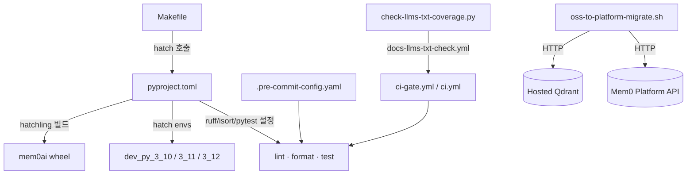
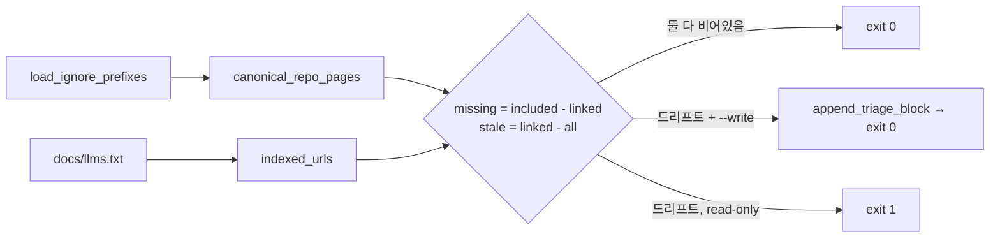
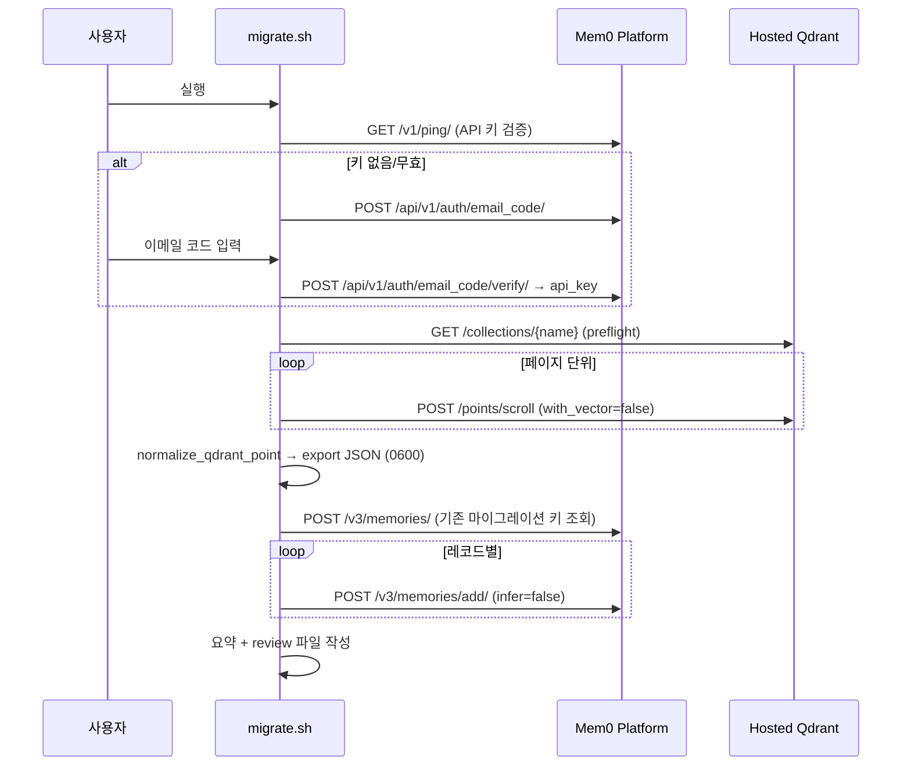

# py_build_and_scripts

`py_build_and_scripts`는 루트 Python SDK(`mem0ai`)의 **패키징·툴링 설정**과 저장소 전역 **유틸리티 스크립트**를 담당하는 모듈입니다.

| 파일 | 역할 |
|------|------|
| `pyproject.toml` | `mem0ai` 패키지 메타데이터, 의존성, hatch 환경, ruff/isort/pytest 설정 |
| `scripts/check-llms-txt-coverage.py` | `docs/llms.txt`와 `docs/**/*.mdx`의 동기화 검사 (CI 및 로컬) |
| `scripts/oss-to-platform-migrate.sh` | Python OSS(hosted Qdrant) 메모리를 Mem0 Platform으로 마이그레이션 |

관련 문서: [root_build_config](root_build_config.md) (`Makefile`, `.pre-commit-config.yaml`), [CI_CD_and_Repository_Governance](CI_CD_and_Repository_Governance.md), [Python_SDK_Core_(Memory_Engine_and_Hosted_Client)](Python_SDK_Core_(Memory_Engine_and_Hosted_Client).md), [Python_Pluggable_Provider_Layer](Python_Pluggable_Provider_Layer.md), [cli_python_build_config](cli_python_build_config.md).

---

## 1. 아키텍처 개요

---

## 2. `pyproject.toml`

### 2.1 빌드 시스템과 패키지 포함 범위
- `build-backend = "hatchling.build"`, 패키지명 `mem0ai`, 버전 `2.2.1`, `requires-python = ">=3.10,<4.0"`.
- 휠에는 `mem0/**/*.py`와 `mem0/memory/oss_notices_config.json`만 포함됩니다(`[tool.hatch.build]`의 include/exclude, `[tool.hatch.build.targets.wheel]`의 `only-include = ["mem0"]`).
  새로운 비-Python 리소스를 `mem0/` 안에 두려면 include/exclude 양쪽에 추가해야 합니다.

### 2.2 의존성 구조
핵심 `dependencies`는 최소(`qdrant-client`, `pydantic`, `openai`, `httpx`, `posthog`, `pytz`, `sqlalchemy`, `protobuf`)로 유지하고, 나머지는 optional extras로 분리합니다. 루트 `CLAUDE.md`의 규칙("코어 `dependencies`에 추가 금지, optional 그룹 사용")과 일치합니다.

| extra | 내용 | 관련 문서 |
|-------|------|-----------|
| `nlp` | `spacy` | `mem0/utils/entity_extraction.py` — [py_utils](Python_SDK_Core_(Memory_Engine_and_Hosted_Client).md) |
| `vector-stores` | chromadb, weaviate, pinecone, faiss, pgvector(psycopg), mongo, redis, elasticsearch, milvus, oracledb 등 | [py_vector_stores](Python_Pluggable_Provider_Layer.md) |
| `llms` | groq, together, litellm, ollama, vertexai, google-genai 등 | [py_llms](Python_Pluggable_Provider_Layer.md) |
| `extras` | boto3, langchain*, sentence-transformers, transformers, opensearch-py, fastembed | embeddings / rerankers |
| `test` | pytest, pytest-mock, pytest-asyncio | `tests/` |
| `dev` | `ruff==0.16.0`, isort, pre-commit | 린트/포맷 |

### 2.3 hatch 환경과 스크립트
- `dev_py_3_10`, `dev_py_3_11`, `dev_py_3_12`: 모두 `test`, `vector-stores`, `llms`, `extras`, `dev` feature를 포함합니다.
- `default` 환경(`dev` feature)의 스크립트: `format`, `format-check`, `lint`, `lint-fix`, `test`(`pytest tests/ {args}`).
- 루트 `Makefile`의 `test-py-3.10/3.11/3.12` 등 타깃이 이 환경을 호출합니다 ([root_build_config](root_build_config.md)).

### 2.4 린트·포맷·테스트 설정
- `[tool.ruff]` `line-length = 120`, lint 규칙 `E4, E7, E9, F`. (`cli/python/`은 line length 100으로 별도 — [cli_python_build_config](cli_python_build_config.md).)
- `isort` `profile = "black"`, `known-first-party = ["mem0", "mem0_cli"]` (ruff isort 설정과 동기화 유지).
- `[tool.pytest.ini_options] pythonpath = ["."]`.
- 파일 하단 주석: 플러그인 버전 bump 시 이 파일을 "touch"해야 필수 CI 체크가 실행됩니다(path-filter 함정). `ci-gate.yml`의 변경 감지와 연관됩니다 ([CI_CD_and_Repository_Governance](CI_CD_and_Repository_Governance.md)).

---

## 3. `scripts/check-llms-txt-coverage.py`

stdlib만 사용하는 단일 스크립트로, 양방향 diff를 수행합니다.

- **missing**: `docs/**/*.mdx`에는 있지만 `docs/llms.txt`에 링크되지 않은 페이지
- **stale**: `docs/llms.txt`가 가리키는 URL(`https://docs.mem0.ai/...`)에 대응하는 `.mdx`가 없는 경우

주요 함수: `load_ignore_prefixes()`(`scripts/llms-txt-ignore.txt`의 prefix 제외 목록), `canonical_repo_pages()`, `indexed_urls()`(`URL_RE` 정규식), `format_placeholder()`, `append_triage_block()`, `main()`.

| 모드 | 동작 | 종료 코드 |
|------|------|-----------|
| 기본(read-only) | 드리프트 출력 | 동기화 0 / 드리프트 1 |
| `--write` | missing 페이지를 `## Unclassified - needs triage` 아래 placeholder로 추가. stale은 자동 삭제하지 않음(이름 변경 여부는 사람이 판단) | 0 |

CI 연동: `.github/workflows/docs-llms-txt-check.yml`이 이 스크립트를 실행하고, `ci-gate.yml`의 경로 필터에 `scripts/check-llms-txt-coverage.py`, `scripts/llms-txt-ignore.txt`가 포함되어 있습니다. 새 `.mdx` 페이지를 추가하면 `llms.txt` 항목도 필요합니다(루트 `CLAUDE.md` 규칙).

---

## 4. `scripts/oss-to-platform-migrate.sh`

bash 래퍼(`python3` 존재 확인 후 `exec python3 - "$@" <<'PY'`)로 내부에 Python 스크립트를 내장하며, 외부 의존성 없이 `urllib`만 사용합니다. 대상은 **Python OSS + hosted Qdrant** 사용자이며, 기본 컬렉션은 `mem0`, 기본 Platform URL은 `https://api.mem0.ai`입니다.

### 4.1 실행 모드
| 플래그 | 단계 |
|--------|------|
| (없음) | 3단계: 인증 → Qdrant 내보내기 → Platform 가져오기 |
| `--auth-only` | 인증만 |
| `--export-only` | Qdrant → JSON 파일만 |
| `--import-only --input <file>` | JSON 파일 → Platform만 |

세 모드 플래그는 상호 배타적입니다.

### 4.2 인증 (`resolve_auth`)
- API 키 우선순위: `--api-key` > `MEM0_API_KEY` > `~/.mem0/config.json`의 `platform.api_key` (`MEM0_DIR`로 디렉터리 변경 가능).
- `--api-key`와 `--email` 동시 사용 불가, `--code`는 `--email` 필요.
- 저장된 키가 무효하면 이메일 코드 로그인으로 폴백하지만, flag/env로 준 키가 무효하면 즉시 실패합니다.
- 비대화형 환경(`/dev/tty` 없음)에서는 `--email --code` 또는 `--yes`가 필요합니다.

### 4.3 내보내기
- 필터: `--user-id`, `--agent-id`, `--run-id`, 또는 `--all` (없으면 TTY에서 질문, 비TTY면 에러).
- Qdrant 자격증명: `--qdrant-url/--qdrant-api-key/--qdrant-collection` 또는 `QDRANT_URL/QDRANT_API_KEY/QDRANT_COLLECTION` 환경변수.
- 산출물 `kind: "mem0_oss_qdrant_export"`, `version: 1`. 기본 경로 `~/.mem0/migrations/mem0-qdrant-export-<UTC timestamp>.json`, 파일 권한 `0600`.
- 각 레코드: `id`, `memory`(payload `data`), `hash`, `created_at`, `updated_at`, `user_id/agent_id/run_id/actor_id/role`, 나머지는 `metadata`로 보존.

### 4.4 가져오기와 멱등성
- 각 레코드는 `messages=[{role: user, content: memory}]`, `infer: False`(LLM 재추출 없음), `source: "migration"`으로 전송됩니다. `user_id/agent_id/run_id` 중 최소 하나가 필요하며, `created_at`은 `timestamp`로 변환됩니다.
- **중복 방지**: `sha256(sdk:vector_store:collection:id)`를 `metadata.mem0_migration_import_key`로 저장하고, 가져오기 전에 해당 scope의 Platform 메모리를 조회해 키를 비교합니다.
  - 키와 `mem0_migration_local_hash`가 같으면 `skipped_existing`
  - 키는 같고 hash가 다르면 `changed_existing`(덮어쓰지 않고 review 파일에 기록)
  - 잘못된 레코드 → `invalid`, 요청 실패 → `failed`
- review가 필요한 레코드가 있으면 `<input>-import-review-<timestamp>.json`(`kind: mem0_platform_import_review`)을 작성합니다.

### 4.5 텔레메트리
`MEM0_TELEMETRY`(기본 true)가 켜져 있으면 PostHog로 `oss.migrate.started/authenticated/completed/failed` 이벤트를 best-effort(실패 무시)로 전송하고, OSS/CLI 익명 ID를 이메일에 `$identify`로 연결하며 `aliased_pairs`에 해시 마커를 저장해 중복 전송을 막습니다. `MEM0_MIGRATE_TELEMETRY_URL`로 엔드포인트를 변경할 수 있습니다. 텔레메트리 설계는 [telemetry_and_notices](Python_SDK_Core_(Memory_Engine_and_Hosted_Client).md)를 참고하세요.

### 4.6 보안 메모
- 설정 디렉터리 `0700`, 설정·내보내기 파일 `0600`.
- 내보내기 파일에 메모리 원문이 평문으로 들어가므로 보관·삭제에 주의해야 합니다.
- 지원 범위: Python OSS의 hosted Qdrant만 해당합니다. 다른 vector store는 [Python_Pluggable_Provider_Layer](Python_Pluggable_Provider_Layer.md)의 별도 경로가 필요합니다.

---

## 5. 개발자 참고

- 새 provider 의존성은 코어가 아닌 해당 extra에 추가합니다.
- 버전 bump는 `pyproject.toml`의 `version`에서 하며, 릴리스 워크플로우는 [CI_CD_and_Repository_Governance](CI_CD_and_Repository_Governance.md)를 참고하세요.
- 스크립트 변경 시 `docs-llms-txt` 잡의 경로 필터가 동작하는지 확인하세요.
