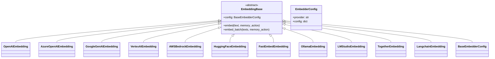
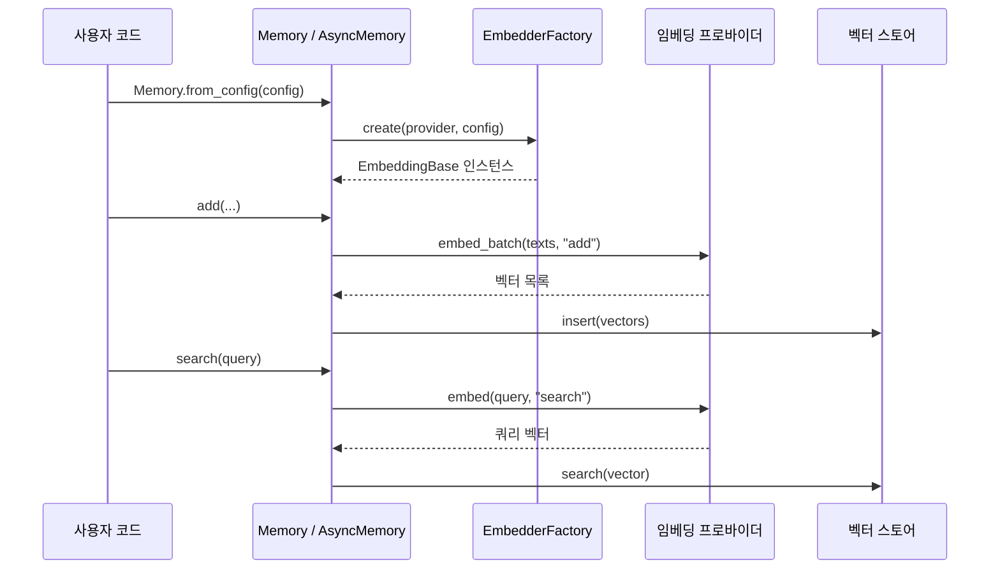
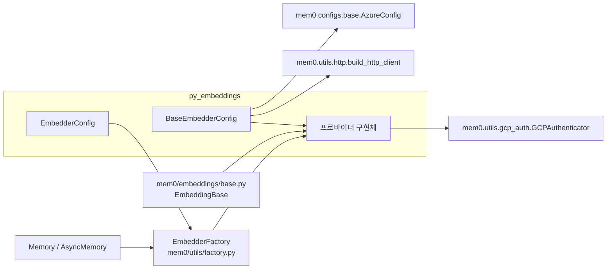

# py_embeddings 모듈

`py_embeddings`는 Mem0 Python SDK에서 텍스트를 벡터로 바꾸는 **임베딩 프로바이더 계층**이다. 공통 설정 클래스(`BaseEmbedderConfig`), 프로바이더 선택용 Pydantic 모델(`EmbedderConfig`), 그리고 11개 프로바이더 구현체로 구성된다. `Memory` / `AsyncMemory`는 `EmbedderFactory.create(...)`로 임베더를 만들고, 메모리 추가·검색·갱신 때마다 `embed()` 또는 `embed_batch()`를 호출한다.

상위 계층은 [Python_Pluggable_Provider_Layer](Python_Pluggable_Provider_Layer.md)이고, 형제 모듈은 [py_llms](py_llms.md), [py_rerankers](py_rerankers.md), [py_vector_stores](py_vector_stores.md)이다.

## 1. 구성 요소

| 파일 | 클래스 | 기본 모델 / 기본 차원 | 비고 |
|------|--------|-----------------------|------|
| `mem0/configs/embeddings/base.py` | `BaseEmbedderConfig` | - | 모든 프로바이더 공용 설정 |
| `mem0/embeddings/configs.py` | `EmbedderConfig` | - | `provider` + `config` 검증 |
| `mem0/embeddings/openai.py` | `OpenAIEmbedding` | `text-embedding-3-small` / 1536 | `embedding_dims`를 명시했을 때만 `dimensions` 전달 |
| `mem0/embeddings/azure_openai.py` | `AzureOpenAIEmbedding` | (배포 이름 사용) | API 키 없으면 `DefaultAzureCredential` |
| `mem0/embeddings/gemini.py` | `GoogleGenAIEmbedding` | `models/gemini-embedding-001` / 768 | `google-genai` 사용 |
| `mem0/embeddings/vertexai.py` | `VertexAIEmbedding` | `gemini-embedding-001` / 256 | 작업(task) 타입 매핑 |
| `mem0/embeddings/aws_bedrock.py` | `AWSBedrockEmbedding` | `amazon.titan-embed-text-v1` | `embed_batch` 미구현(순차 폴백) |
| `mem0/embeddings/huggingface.py` | `HuggingFaceEmbedding` | `multi-qa-MiniLM-L6-cos-v1` | 로컬 모델 또는 TEI 서버 |
| `mem0/embeddings/fastembed.py` | `FastEmbedEmbedding` | `thenlper/gte-large` | ONNX 런타임, `embed_batch` 미구현 |
| `mem0/embeddings/ollama.py` | `OllamaEmbedding` | `nomic-embed-text` / 512 | 모델이 없으면 자동 `pull` |
| `mem0/embeddings/lmstudio.py` | `LMStudioEmbedding` | nomic-embed-text-v1.5 GGUF / 1536 | OpenAI 호환 API |
| `mem0/embeddings/together.py` | `TogetherEmbedding` | `intfloat/multilingual-e5-large-instruct` / 1024 | |
| `mem0/embeddings/langchain.py` | `LangchainEmbedding` | - | `Embeddings` 인스턴스를 `model`로 주입 |

모든 구현체는 `mem0/embeddings/base.py`의 `EmbeddingBase`(이 모듈의 핵심 컴포넌트 목록에는 없지만 계약을 정의함)를 상속한다.

## 2. 아키텍처



### 설정 계층

- `BaseEmbedderConfig`는 하나의 평평한 클래스에 모든 프로바이더 전용 필드(`ollama_base_url`, `openai_base_url`, `huggingface_base_url`, `azure_kwargs`, `vertex_credentials_json`, `output_dimensionality`, `lmstudio_base_url`, `aws_*` 등)를 담는다. 각 프로바이더는 자기에게 해당하는 필드만 읽는다.
- 생성 시 `build_http_client(http_client_proxies)`로 `http_client`를 만들고, `azure_kwargs`는 `AzureConfig`로 감싼다. `aws_region`은 인자 → `AWS_REGION` 환경 변수 → `us-west-2` 순으로 결정된다.
- `lmstudio_base_url` 기본값은 `http://localhost:1234/v1`이다.
- `EmbedderConfig.validate_config`는 `provider`가 허용 목록(`openai`, `ollama`, `huggingface`, `azure_openai`, `gemini`, `vertexai`, `together`, `lmstudio`, `langchain`, `aws_bedrock`, `fastembed`)에 없으면 `ValueError("Unsupported embedding provider: ...")`를 발생시킨다. `config` 필드 검증은 `provider` 필드가 먼저 정의되어 있어야 동작한다.

## 3. 호출 흐름



`mem0/memory/main.py`에서 확인되는 사용 방식은 다음과 같다.

- `memory_action` 값은 `"add"`, `"search"`, `"update"` 세 가지이다. 대부분의 프로바이더는 무시하지만 `VertexAIEmbedding`은 작업 타입 선택에 사용한다.
- `Memory`는 임베딩을 동기로 호출한다. `AsyncMemory`는 `asyncio.to_thread(self.embedding_model.embed, ...)`로 감싸서 호출한다. 따라서 프로바이더 구현은 동기 코드여도 된다.
- `add` 경로에서 `embed_batch`를 먼저 시도하고, 실패하거나 개수가 맞지 않으면 `embed`를 하나씩 호출하는 폴백이 있다. 엔티티 임베딩과 검색 시 엔티티 부스트도 같은 방식이며, 개수가 맞지 않으면 경고 로그를 남긴다.

## 4. 프로바이더별 동작 상세

### 배치 처리(`embed_batch`)

기본 구현은 `embed()`를 순차 호출한다. 다음 프로바이더는 네이티브 배치를 구현했다.

| 프로바이더 | 청크 크기 | 비고 |
|------------|-----------|------|
| `OpenAIEmbedding`, `AzureOpenAIEmbedding`, `GoogleGenAIEmbedding` | 100 | `response.data`를 `index`로 정렬(Gemini는 응답 순서 그대로) |
| `VertexAIEmbedding` | 250 | `memory_action`에 따른 task type 적용 |
| `HuggingFaceEmbedding`, `LMStudioEmbedding`, `TogetherEmbedding`, `OllamaEmbedding` | 한 번에 전체 | 빈 입력은 `[]` 반환 |

반환 개수가 입력 개수와 다르면 모두 `ValueError`를 던진다. `AWSBedrockEmbedding`, `FastEmbedEmbedding`, `LangchainEmbedding`은 기본 순차 구현을 쓴다.

### 개행 처리

OpenAI, Azure OpenAI, Gemini, LM Studio, FastEmbed는 `\n`을 공백으로 치환한 뒤 임베딩한다. Together, Ollama, Bedrock, Vertex AI, Langchain, HuggingFace는 치환하지 않는다.

### 인증과 연결

| 프로바이더 | 자격 증명 경로 |
|------------|----------------|
| OpenAI | `config.api_key` → `OPENAI_API_KEY`. base URL은 `openai_base_url` → `OPENAI_API_BASE`(지원 중단 경고) → `OPENAI_BASE_URL` → 기본값 |
| Azure OpenAI | `azure_kwargs.*` → `EMBEDDING_AZURE_OPENAI_API_KEY`, `EMBEDDING_AZURE_DEPLOYMENT`, `EMBEDDING_AZURE_ENDPOINT`, `EMBEDDING_AZURE_API_VERSION`. 키가 비었거나 `your-api-key`면 Azure AD 토큰 사용 |
| Gemini | `config.api_key` → `GOOGLE_API_KEY` |
| Vertex AI | `GCPAuthenticator.setup_vertex_ai(...)`; 실패 시 `vertex_credentials_json` 또는 `GOOGLE_APPLICATION_CREDENTIALS`로 폴백, 둘 다 없으면 `ValueError` |
| AWS Bedrock | 환경 변수를 먼저 읽고 config 값이 있으면 덮어쓴다. 세션 토큰도 지원 |
| HuggingFace | `huggingface_base_url`이 있으면 OpenAI 호환 클라이언트(`HUGGINGFACE_API_KEY` 또는 `"hf"`), 없으면 로컬 `SentenceTransformer` |
| Together | `config.api_key` → `TOGETHER_API_KEY` |
| LM Studio | 키 기본값 `lm-studio` |

### 프로바이더별 특이점

- **OpenAI**: `embedding_dims`를 지정하지 않으면 `dimensions`를 API에 보내지 않는다. vLLM, Voyage 같은 OpenAI 호환 백엔드가 이 파라미터를 거부하기 때문이다. 내부 `embedding_dims`는 1536으로 채워진다.
- **AWS Bedrock**: 모델 ID 접두사(`cohere` 등)로 요청 본문 형식을 나눈다. Titan Text Embeddings V2(`"v2"`가 모델명에 포함)일 때만 `embedding_dims`를 `dimensions`로 전달한다. `_normalize_vector`는 정의되어 있지만 `_get_embedding`에서는 호출되지 않는다. 모든 예외는 `ValueError`로 감싸 다시 던진다.
- **Vertex AI**: `add`/`update`는 `RETRIEVAL_DOCUMENT`, `search`는 `RETRIEVAL_QUERY`가 기본이다(`memory_*_embedding_type`으로 변경 가능). `memory_action`이 `None`이면 `SEMANTIC_SIMILARITY`를 쓴다.
- **Ollama**: 초기화 때 `_ensure_model_exists()`가 로컬 모델 목록을 확인하고 없으면 `pull`한다. 이름에 `:`가 없으면 `:latest`를 붙여 비교한다.
- **FastEmbed**: `embedding_dims`가 없으면 모델의 `embedding_size`를 사용한다.
- **HuggingFace**: 로컬 모드에서는 `embedding_dims`를 모델의 문장 임베딩 차원으로 채운다.
- **Langchain**: `config.model`에 `langchain.embeddings.base.Embeddings` 인스턴스를 직접 넣어야 하며 아니면 `ValueError`이다. `EmbedderConfig`가 `dict` 설정을 받으므로 인스턴스는 코드로 구성할 때만 쓸 수 있다.

## 5. 의존성



- 외부 SDK는 각 모듈 상단에서 import한다. 선택 의존성이 없으면 `aws_bedrock`, `fastembed`, `ollama`, `langchain`은 안내 메시지가 담긴 `ImportError`를 내고, 나머지는 원래 `ImportError`가 그대로 발생한다. 새 의존성은 `pyproject.toml`의 optional 그룹에 둔다.
- 팩토리와 `Memory` 쪽 동작은 [py_utils](py_utils.md), [py_memory_core](py_memory_core.md)를 참고한다.
- 임베딩 차원은 벡터 스토어 컬렉션 차원과 일치해야 한다. 스토어 설정은 [py_vector_stores](py_vector_stores.md)에서 다룬다.
- TypeScript 쪽 대응 구현은 [ts_oss_embeddings](ts_oss_embeddings.md)이다.

## 6. 설정 예시

```python
from mem0 import Memory

config = {
    "embedder": {
        "provider": "openai",
        "config": {"model": "text-embedding-3-small", "embedding_dims": 1536},
    }
}
m = Memory.from_config(config)
```

## 7. 새 프로바이더 추가 방법

1. `mem0/embeddings/<name>.py`에 `EmbeddingBase`를 상속하는 클래스를 만들고 `embed(text, memory_action=None)`을 구현한다. 네이티브 배치가 있으면 `embed_batch`도 재정의하고 반환 개수를 검증한다.
2. `BaseEmbedderConfig`에 필요한 필드가 있으면 추가한다.
3. `EmbedderConfig.validate_config`의 허용 목록에 provider 이름을 넣는다.
4. `EmbedderFactory`에 등록한다(`mem0/utils/factory.py`).
5. `tests/embeddings/` 아래에 테스트를 추가하고 `docs/integrations/`에 가이드를 작성한다.

## 8. 유의 사항

- 허용 목록이 `EmbedderConfig`와 팩토리 두 곳에 있으므로 한쪽만 고치면 불일치가 생긴다.
- 서로 다른 임베딩 모델/차원으로 바꾸면 기존 벡터와 호환되지 않으므로 컬렉션을 다시 만들어야 한다.
- `BaseEmbedderConfig`는 Pydantic 모델이 아니라 일반 클래스이다(저장소 규칙은 Pydantic v2를 권장하지만 이 파일은 `ABC` 기반이다).
