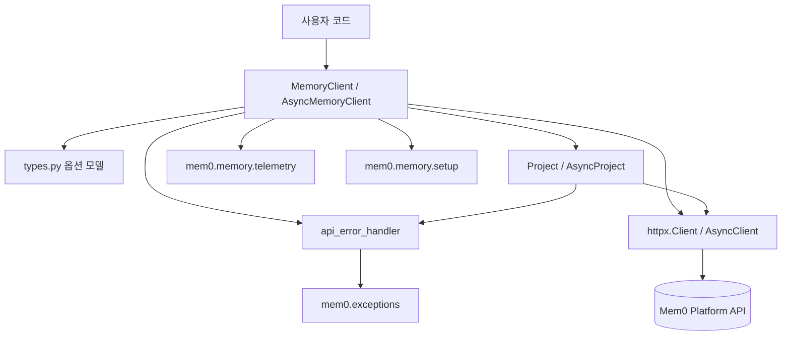
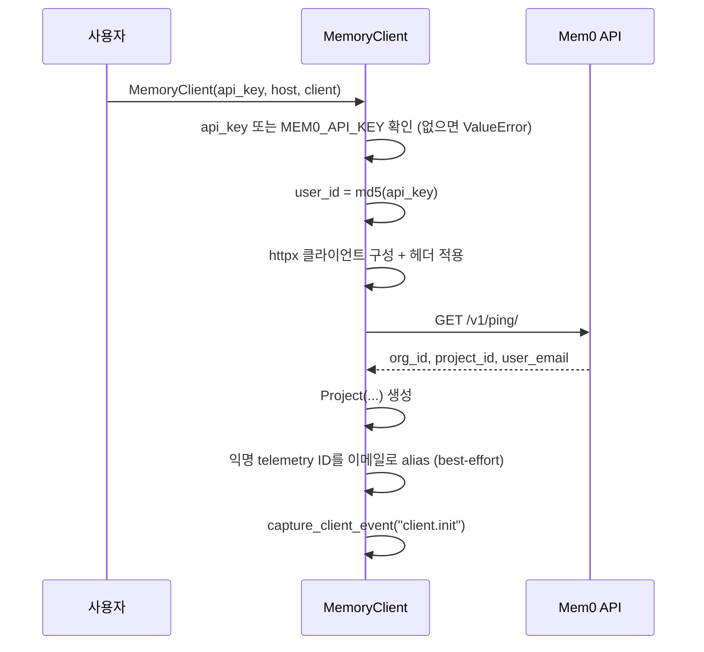
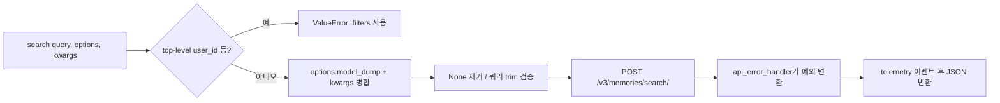
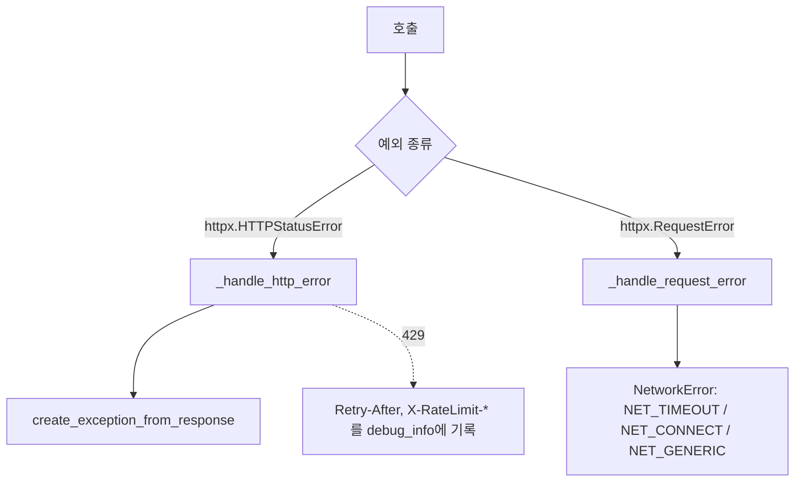

# py_hosted_client

## 개요

`py_hosted_client`는 Mem0 호스티드 플랫폼 API(기본 `https://api.mem0.ai`)를 호출하는 Python SDK 클라이언트 모듈이다. `mem0/client/` 아래 4개 파일로 구성되며, 동기(`MemoryClient`)와 비동기(`AsyncMemoryClient`) 인터페이스를 모두 제공한다. 로컬 엔진인 `Memory`(`py_memory_core`)와 달리 모든 처리를 원격 API에 위임한다.

| 파일 | 핵심 구성요소 | 역할 |
|------|--------------|------|
| `mem0/client/main.py` | `MemoryClient`, `AsyncMemoryClient` | 메모리 CRUD, 검색, 엔티티, 배치, 내보내기, 프로필, 웹훅, 피드백 |
| `mem0/client/project.py` | `Project`, `AsyncProject` (+ `BaseProject`, `ProjectConfig`) | 프로젝트/멤버 관리 |
| `mem0/client/types.py` | `AddMemoryOptions`, `SearchMemoryOptions`, `GetAllMemoryOptions`, `DeleteAllMemoryOptions`, `UpdateMemoryOptions`, `ProjectUpdateOptions` | Pydantic 옵션 모델 |
| `mem0/client/utils.py` | `api_error_handler`, `APIError` | HTTP 오류를 구조화된 예외로 변환 |

## 아키텍처

### 클라이언트 초기화 흐름

### 요청 처리 흐름 (예: `search`)

## 주요 기능

### 1. `MemoryClient` / `AsyncMemoryClient` (`main.py`)

두 클래스는 동일한 메서드 집합을 갖는다(비동기는 `async`, `async with` 지원, 내부 클라이언트는 `async_client`).

- **메모리**: `add`(`/v3/memories/add/`), `get`, `get_all`(`/v3/memories/`, `page`/`page_size`는 쿼리 파라미터), `search`(`/v3/memories/search/`), `update`, `delete`(`delete_linked` 지원), `delete_all`, `history`
- **엔티티**: `users`, `delete_users`(조건 없으면 전체 삭제), `reset`
- **배치**: `batch_update`, `batch_delete` (`/v1/batch/`)
- **내보내기/요약**: `create_memory_export`, `get_memory_export`, `get_summary`
- **프로필**: `get_profile`, `generate_profile`, `get_profile_settings`, `update_profile_settings`, `sample_profiles`, `get_profile_job`. 생성은 비동기 작업이므로 `status`로 분기하고, `Idempotency-Key` 헤더로 재시도를 안전하게 한다. `_UNSET` 센티널은 "생략(변경 없음)"과 명시적 `None`("지우기")을 구분한다.
- **프로젝트(Deprecated)**: `get_project`, `update_project` → `client.project.*` 사용 권장
- **웹훅**: `get_webhooks`, `create_webhook`, `update_webhook`, `delete_webhook`
- **피드백**: `feedback` (`POSITIVE`/`NEGATIVE`/`VERY_NEGATIVE`)
- `chat`은 미구현(`NotImplementedError`)

설계 포인트:
- **엔티티 ID 규칙**: `search`/`get_all`은 `user_id` 등 최상위 인자를 거부하고 `filters`로 전달하도록 강제한다(`ENTITY_PARAMS`).
- **옵션 병합**: `options.model_dump(exclude_unset=True)`와 `**kwargs`를 병합하며 `None` 값은 제거된다(`update`의 `expiration_date=None`은 예외로 유지되어 만료 해제 가능).
- **경로 인코딩**: `_encode_path_segment`로 ID를 URL 인코딩한다.
- **헤더 정책**: `_client_headers`는 `Authorization: Token ...`, `Mem0-User-ID`, `X-Mem0-Client`를 설정한다. `X-Mem0-Source`/`X-Application`은 set-once(가장 바깥 레이어 우선, 환경변수 `MEM0_SOURCE`/`MEM0_APPLICATION`), `X-Mem0-Client`는 append-only이며 `_bounded_stack`이 최대 4개/200자로 제한한다(항목 단위로만 삭제, 자기 항목은 항상 보존). 사용자 지정 클라이언트는 `_apply_client_headers`가 기존 헤더를 지우지 않고 병합한다.
- **차이점**: 동기 `_validate_api_key`는 `self.client`로, 비동기는 생성자가 동기이므로 `requests.get`으로 `/v1/ping/`을 호출한다.
- **텔레메트리**: 각 호출 후 `capture_client_event`를 보낸다. `metadata` 값은 이벤트에서 제외한다.

### 2. `Project` / `AsyncProject` (`project.py`)

`BaseProject`(ABC)가 `ProjectConfig`(`org_id`, `project_id`, `user_email`, `extra="forbid"`)와 파라미터 준비(`_prepare_params`, `_prepare_org_params`)를 담당하고, 동기·비동기 구현이 `get`, `create`, `update`(`custom_instructions`, `custom_categories`, `multilingual`, `decay`, `agent_custom_instructions`), `delete`, `get_members`, `add_member`, `update_member`, `remove_member`를 제공한다. 역할은 `READER` 또는 `OWNER`만 허용된다. 생성 시 `org_id`/`project_id`가 없으면 `ValueError`가 발생한다. 엔드포인트는 `/api/v1/orgs/organizations/{org_id}/projects/...`.

### 3. 옵션 모델 (`types.py`)

Pydantic `BaseModel`로 IDE 자동완성과 검증을 제공한다. `AddMemoryOptions`(filters, metadata, infer, custom_categories, timestamp, expiration_date 등), `SearchMemoryOptions`(top_k, rerank, threshold, latest_only, keyword_search 등), `GetAllMemoryOptions`, `DeleteAllMemoryOptions`, `UpdateMemoryOptions`, `ProjectUpdateOptions`. 메서드는 옵션 객체와 `**kwargs`를 모두 받아 하위 호환을 유지한다.

### 4. 오류 처리 (`utils.py`)

`api_error_handler` 데코레이터가 동기/비동기 함수를 자동 판별하여 처리한다.

`APIError`는 하위 호환용 Deprecated 클래스이며, 신규 코드는 `mem0.exceptions`의 구체 예외(`AuthenticationError`, `RateLimitError`, `MemoryNotFoundError`, `NetworkError` 등)를 사용한다.

## 의존 관계 및 관련 문서

- `mem0.exceptions`: 예외 정의 — [py_memory_core](py_memory_core.md)의 `memory_and_access_exceptions`, `infrastructure_exceptions` 참고
- `mem0.memory.setup`(`setup_config`, `get_user_id`, anon ID alias)와 `mem0.memory.telemetry`(`capture_client_event`, `client_telemetry`): [py_memory_core](py_memory_core.md)의 `history_storage_and_setup`, `telemetry_and_notices` 참고
- 대응 TypeScript 구현: [ts_hosted_client](ts_hosted_client.md)
- 이 모듈을 사용하는 CLI/통합: [cli_python_backend](cli_python_backend.md) 등

## 참고

- 모듈 import 시점에 `setup_config()`가 실행된다.
- 기본 HTTP 타임아웃은 300초이다.
- 패키지 버전은 `importlib.metadata.version("mem0ai")`로 조회한다(순환 import 방지).
- 빌드/패키징은 루트 `pyproject.toml`(hatch)을 따른다.
