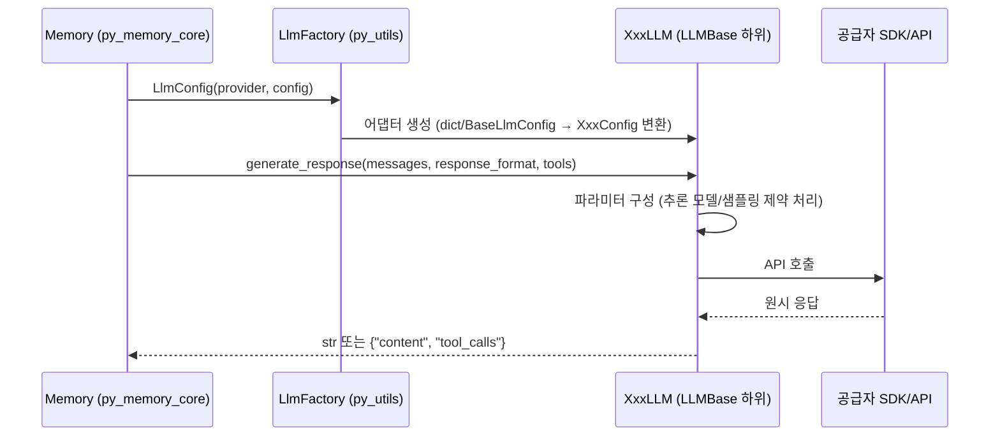

# py_llms 모듈 문서

`py_llms`는 Mem0 Python SDK(`mem0ai`)에서 **LLM 공급자(provider) 어댑터**와 그 **설정 클래스**를 담당하는 모듈이다. 메모리 엔진(`mem0/memory/main.py`)은 사실 추출·메모리 갱신 결정 등을 위해 LLM을 호출하는데, 이 모듈이 공급자별 SDK 차이를 `generate_response()`라는 단일 인터페이스로 감춘다.

- 구현 위치: `mem0/llms/*.py` (어댑터), `mem0/configs/llms/*.py` (공급자별 설정)
- 상위 모듈: Python_Pluggable_Provider_Layer (형제: `py_embeddings`, `py_rerankers`, `py_vector_stores`)
- 호출 측: `mem0/utils/factory.py`의 `LlmFactory` (→ `py_utils`), `Memory`/`AsyncMemory` (→ `py_memory_core`)

> 공통 베이스 클래스 `LLMBase`(`mem0/llms/base.py`)와 `BaseLlmConfig`(`mem0/configs/llms/base.py`)는 이 모듈의 핵심 컴포넌트 목록에는 포함되지 않았으나, 모든 어댑터가 상속한다. 아래 설명 중 `_get_supported_params`, `_is_reasoning_model`, `_uses_max_completion_tokens` 등은 `LLMBase`가 제공하는 것으로 코드에서 사용 방식만 확인한 내용이다.

## 아키텍처 개요

```mermaid
classDiagram
    class BaseLlmConfig
    class LLMBase {
        +generate_response(messages, response_format, tools, tool_choice)
    }
    class LlmConfig {
        +provider: str
        +config: dict
    }
    BaseLlmConfig <|-- OpenAIConfig
    BaseLlmConfig <|-- AnthropicConfig
    BaseLlmConfig <|-- AzureOpenAIConfig
    BaseLlmConfig <|-- AWSBedrockConfig
    BaseLlmConfig <|-- GeminiConfig
    BaseLlmConfig <|-- "기타 설정(DeepSeek, LMStudio, MiniMax, Ollama, Vllm, XAI)"
    LLMBase <|-- OpenAILLM
    LLMBase <|-- AnthropicLLM
    LLMBase <|-- AzureOpenAILLM
    LLMBase <|-- AWSBedrockLLM
    LLMBase <|-- GeminiLLM
    LLMBase <|-- "기타 어댑터"
    OpenAILLM ..> OpenAIConfig
    AnthropicLLM ..> AnthropicConfig
    LlmConfig ..> LLMBase : provider 이름 검증
```

### 요청 흐름



## 핵심 설계 패턴

1. **설정 정규화**: 대부분의 어댑터 생성자는 `None` / `dict` / `BaseLlmConfig` / 전용 Config를 모두 받아 전용 Config(예: `AnthropicConfig`)로 변환한 뒤 `super().__init__(config)`를 호출한다.
2. **기본 모델·자격 증명 폴백**: 모델이 비어 있으면 어댑터별 기본값을 쓰고, API 키·base URL은 설정 → 환경 변수 → 기본값 순으로 찾는다.
3. **통일된 응답 형식**: `tools`가 없으면 `str`, 있으면 `{"content": ..., "tool_calls": [{"name", "arguments"}]}`를 반환한다(`_parse_response`). 인자 JSON은 `mem0.memory.utils.extract_json`으로 정리 후 `json.loads`한다.
4. **지연 임포트 오류**: 선택 의존성(`anthropic`, `boto3`, `groq`, `litellm`, `ollama`, `together`, `google-genai`, `langchain`)이 없으면 설치 안내와 함께 `ImportError`를 발생시킨다.
5. **OpenAI 호환 재사용**: DeepSeek, LM Studio, MiniMax, vLLM, xAI는 `openai.OpenAI` 클라이언트에 `base_url`만 바꿔 사용한다.

## 설정 레지스트리: `LlmConfig` (`mem0/llms/configs.py`)

Pydantic 모델로 `provider`(기본 `"openai"`)와 `config`(dict)를 가진다. `validate_config`가 지원 공급자 목록에 없는 값을 `ValueError("Unsupported LLM provider: ...")`로 거부한다.

지원 공급자: `openai`, `ollama`, `anthropic`, `groq`, `together`, `aws_bedrock`, `litellm`, `azure_openai`, `openai_structured`, `azure_openai_structured`, `gemini`, `deepseek`, `minimax`, `xai`, `sarvam`, `lmstudio`, `vllm`, `langchain`.

## 공급자별 구성요소

| 공급자 | 어댑터 (`mem0/llms/`) | 전용 Config (`mem0/configs/llms/`) | 기본 모델 | 특징 |
|---|---|---|---|---|
| OpenAI / OpenRouter | `openai.py` `OpenAILLM` | `openai.py` `OpenAIConfig` | `gpt-5-mini` | `OPENROUTER_API_KEY`가 있으면 OpenRouter 사용(`models`, `route`, 헤더). `store`는 옵트인. `response_callback` 지원 |
| OpenAI Structured | `openai_structured.py` `OpenAIStructuredLLM` | (BaseLlmConfig 사용) | `gpt-5-mini` | `client.beta.chat.completions.parse` 사용 |
| Azure OpenAI | `azure_openai.py` `AzureOpenAILLM` | `azure.py` `AzureOpenAIConfig` | `gpt-5-mini` | API 키 없으면 `DefaultAzureCredential`. 마지막 메시지의 "assistant"를 "ai"로 치환(콘텐츠 필터 회피, issue #2636) |
| Azure Structured | `azure_openai_structured.py` `AzureOpenAIStructuredLLM` | (BaseLlmConfig 사용) | `gpt-5-mini` | 추론 모델은 `temperature`/`top_p` 제외, `max_completion_tokens` 사용 |
| Anthropic | `anthropic.py` `AnthropicLLM` | `anthropic.py` `AnthropicConfig` | `claude-sonnet-4-6` | system 메시지 분리, 모델 계열/버전별 샘플링 파라미터 허용 여부(`_enable_sampling_parameters`), temperature·top_p 동시 전송 금지 |
| AWS Bedrock | `aws_bedrock.py` `AWSBedrockLLM` | `aws_bedrock.py` `AWSBedrockConfig` | `anthropic.claude-3-5-sonnet-20240620-v1:0` | 모델 ID에서 provider 자동 감지(`extract_provider`, `provider_override`), Converse/`invoke_model` 분기, 도구 지원 provider 제한 |
| Google Gemini | `gemini.py` `GeminiLLM` | `gemini.py` `GeminiConfig` | `gemini-2.0-flash` | Developer API 또는 Vertex AI(`vertexai`, `project`, `location`, 환경 변수 폴백) |
| DeepSeek | `deepseek.py` `DeepSeekLLM` | `deepseek.py` `DeepSeekConfig` | `deepseek-chat` | OpenAI 호환, `DEEPSEEK_API_BASE` |
| MiniMax | `minimax.py` `MiniMaxLLM` | `minimax.py` `MinimaxConfig` | `MiniMax-M2.7` | OpenAI 호환, `MINIMAX_API_BASE` |
| xAI (Grok) | `xai.py` `XAILLM` | `xai.py` `XAIConfig` | `grok-4.3` | OpenAI 호환, `XAI_API_BASE` |
| LM Studio | `lmstudio.py` `LMStudioLLM` | `lmstudio.py` `LMStudioConfig` | Llama 3.1 70B GGUF | 기본 `http://localhost:1234/v1`, 기본 `response_format`은 `json_object` |
| vLLM | `vllm.py` `VllmLLM` | `vllm.py` `VllmConfig` | `Qwen/Qwen2.5-32B-Instruct` | 기본 `http://localhost:8000/v1`, `VLLM_BASE_URL`/`VLLM_API_KEY` |
| Ollama | `ollama.py` `OllamaLLM` | `ollama.py` `OllamaConfig` | `llama3.1:70b` | 네이티브 `format="json"`, `options`(num_predict 등), dict/객체 응답 모두 처리 |
| Groq | `groq.py` `GroqLLM` | (BaseLlmConfig 사용) | `llama-3.3-70b-versatile` | `compound` 계열 모델은 JSON `response_format` 생략 |
| Together | `together.py` `TogetherLLM` | (BaseLlmConfig 사용) | `MiniMaxAI/MiniMax-M3` | `kwargs` 전달 |
| LiteLLM | `litellm.py` `LiteLLM` | (BaseLlmConfig 사용) | `gpt-5-mini` | 도구 사용 시 `litellm.supports_function_calling` 검사 |
| LangChain | `langchain.py` `LangchainLLM` | (BaseLlmConfig 사용) | 없음(필수) | `config.model`이 `BaseChatModel` 인스턴스여야 함, `bind_tools` |
| Sarvam | `sarvam.py` `SarvamLLM` | (BaseLlmConfig 사용) | `sarvam-m` | `requests`로 직접 REST 호출, API 키 필수 |

## 공급자별 주의 사항

- **추론 모델 처리**: `OpenAIConfig`/`AzureOpenAIConfig`의 `is_reasoning_model`(명시 오버라이드)과 `reasoning_effort`는 `max_tokens`/`temperature` 전송 여부를 제어한다. 이름 기반 휴리스틱은 `LLMBase`에 있다.
- **Anthropic/MiniMax on Bedrock**: Converse API에서 `temperature`와 `topP`를 같이 보내면 오류가 나므로 `_build_inference_config`가 `topP`를 생략한다. 응답의 `reasoningContent` 블록을 건너뛰고 첫 `text` 블록을 반환한다.
- **Gemini**: 응답이 차단되어 `content`가 `None`일 수 있어 안전하게 파싱한다. 도구 스키마에서 `additionalProperties`를 제거한다.
- **코드상 확인되는 불일치**: `XAILLM`은 `BaseLlmConfig` 변환 시 `http_client_proxies=config.http_client`를 전달한다(다른 어댑터는 `config.http_client_proxies`). `AWSBedrockConfig`의 `get_aws_config`는 자격 증명 값이 있을 때만 키를 추가한다.

## 사용 예

```python
from mem0 import Memory

config = {
    "llm": {
        "provider": "anthropic",
        "config": {"model": "claude-sonnet-4-6", "temperature": 0.1, "max_tokens": 2000},
    }
}
m = Memory.from_config(config)
```

## 새 공급자 추가 시 (참고)

저장소 규칙(`mem0/AGENTS.md`의 "Adding a provider")에 따라 `mem0/configs/llms/<name>.py`, `mem0/llms/<name>.py`를 만들고 `LlmConfig`의 허용 목록과 `LlmFactory`(`mem0/utils/factory.py`)에 등록한다. 선택 의존성은 `pyproject.toml`의 optional 그룹에 둔다(코어 `dependencies`에 추가 금지).

## 관련 문서

- [py_embeddings](py_embeddings.md), [py_rerankers](py_rerankers.md), [py_vector_stores](py_vector_stores.md): 같은 공급자 계층의 형제 모듈
- [py_utils](py_utils.md): `LlmFactory`
- [py_memory_core](py_memory_core.md): LLM 소비자(`Memory`, 프롬프트 유틸 `extract_json` 등)
- TypeScript 대응 구현: [ts_oss_llms](ts_oss_llms.md)

> 이 모듈은 단일 책임 단위로 충분히 응집되어 있어 별도 하위 모듈 문서는 생성하지 않았다.
