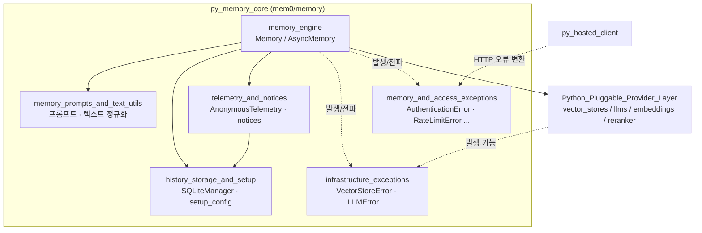
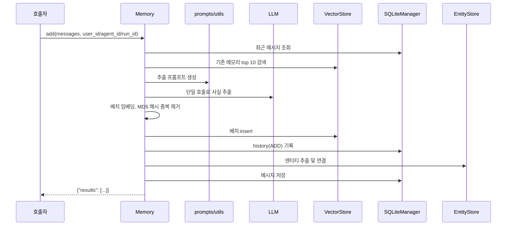
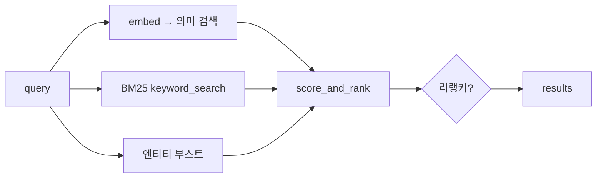
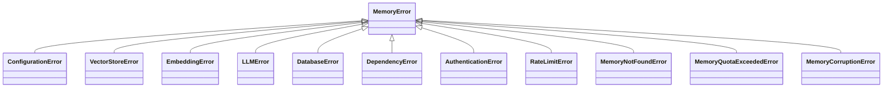

# py_memory_core 개요

## 1. 목적

`py_memory_core`(`mem0/memory`)는 Mem0 오픈소스 Python SDK의 핵심 엔진입니다. 이 모듈은 다음 일을 합니다.

- 대화 메시지에서 사실(memory)을 LLM으로 추출합니다.
- 추출한 사실을 벡터 스토어에 저장합니다.
- 의미 검색, BM25, 엔티티 부스트를 합친 하이브리드 검색으로 조회합니다.
- 메모리를 수정하거나 삭제하고, 그 이력을 SQLite에 기록합니다.
- 익명 텔레메트리와 사용자 안내(notice)를 처리합니다.
- 구조화된 예외 계층을 제공합니다.

진입점은 `Memory`(동기)와 `AsyncMemory`(비동기)입니다. 두 클래스는 `mem0/memory/main.py`에 있고, 임베더·벡터 스토어·LLM·리랭커는 팩토리로 만들어 주입받습니다. 플러그형 provider 구현은 이 모듈 밖의 `Python_Pluggable_Provider_Layer`에 있습니다.

## 2. 아키텍처

### 2.1 하위 모듈 구성

`memory_engine`이 중심입니다. 프롬프트·이력 저장·텔레메트리는 엔진이 호출하는 지원 모듈이고, 예외 두 모듈은 모든 계층이 공유하는 오류 타입입니다.

### 2.2 `add()` 처리 흐름 (V3 배치 파이프라인)

### 2.3 `search()` 하이브리드 점수화

- 만료된 메모리는 `show_expired=True`가 아니면 제외됩니다.
- 리랭커가 실패하면 원본 결과로 폴백합니다.
- 벡터 스토어가 `keyword_search`를 구현하지 않으면 경고를 남기고 의미 검색만 씁니다.

### 2.4 예외 계층

모든 예외는 `mem0/exceptions.py`의 `MemoryError`를 상속합니다. 이 클래스는 Python 내장 `MemoryError`를 가립니다. `message`, `error_code`, `details`, `suggestion`, `debug_info`를 가집니다. 이 다이어그램은 이 모듈 소유의 클래스만 보여 줍니다. `ValidationError`와 `NetworkError`도 같은 파일에 있지만 핵심 컴포넌트는 아닙니다.

## 3. 하위 모듈 요약

| 하위 모듈 | 핵심 컴포넌트 | 역할 |
|---|---|---|
| [memory_engine](memory_engine.md) | `Memory`, `AsyncMemory`, `MemoryType` | `add` / `search` / `update` / `delete` / `reset`, 스코프 검증, 신원 키 보호 |
| [memory_prompts_and_text_utils](memory_prompts_and_text_utils.md) | `get_update_memory_messages`, `get_fact_retrieval_messages`, `ensure_json_instruction`, `normalize_facts`, `format_entities`, `remove_spaces_from_entities` | 추출·업데이트 프롬프트 조립과 LLM 출력 정규화. 순수 함수 위주입니다. |
| [history_storage_and_setup](history_storage_and_setup.md) | `SQLiteManager`, `setup_config` | 변경 이력과 최근 메시지를 SQLite에 저장하고, `~/.mem0/config.json`과 익명 `user_id`를 관리합니다. |
| [telemetry_and_notices](telemetry_and_notices.md) | `AnonymousTelemetry`, `capture_event`, `display_*_notice` | PostHog 기반 익명 통계(샘플링 적용), A/B 안내문 표시, 노출 횟수 제한 |
| [infrastructure_exceptions](infrastructure_exceptions.md) | `VectorStoreError`, `EmbeddingError`, `LLMError`, `DatabaseError`, `DependencyError`, `ConfigurationError`, `VectorSearchError`, `CacheError` | 인프라와 구성 오류. OSS 전용 클래스는 기본 `error_code`와 `suggestion`을 가집니다. |
| [memory_and_access_exceptions](memory_and_access_exceptions.md) | `AuthenticationError`, `RateLimitError`, `MemoryNotFoundError`, `MemoryQuotaExceededError`, `MemoryCorruptionError` | 접근 권한, 사용량 제한, 메모리 상태 오류. HTTP 상태 코드 매핑과 연결됩니다. |

## 4. 설계상 주의할 점

- **스코프 필수**: `user_id`, `agent_id`, `run_id` 중 하나 이상이 있어야 합니다. 없으면 `Mem0ValidationError`가 발생합니다.
- **신원 키 보호**: `metadata`에 들어온 `user_id`, `agent_id`, `run_id`, `actor_id`는 제거됩니다. 스코프는 엔티티 파라미터로만 설정합니다.
- **오류 정책**: `SQLiteManager`는 로그를 남기고 예외를 전파합니다. `setup.py`와 텔레메트리는 예외를 삼켜서, 부가 기능이 본 기능을 막지 않게 합니다.
- **텔레메트리 옵트아웃**: `MEM0_TELEMETRY=false`로 끕니다. 샘플링 비율은 `MEM0_TELEMETRY_SAMPLE_RATE`(기본 0.1)로 조정합니다. 프롬프트와 메모리 내용은 전송하지 않습니다.
- **import 시점 부수 효과**: `setup.py`는 import 때 `MEM0_DIR`(기본 `~/.mem0`) 디렉터리를 만듭니다. 읽기 전용 환경에서는 `MEM0_DIR`을 쓰기 가능한 경로로 지정해야 합니다.
- **이력 DB 영속성**: `SQLiteManager`의 기본 `db_path`는 `:memory:`라서 프로세스 종료와 함께 데이터가 사라집니다. 영속화하려면 파일 경로를 넘깁니다.

## 5. 관련 모듈

- `py_hosted_client`: 호스티드 `MemoryClient`. 플랫폼 전용 기능(`timestamp`, `reference_date` 등)이 필요할 때 씁니다.
- `Python_Pluggable_Provider_Layer`: `py_vector_stores`, `py_llms`, `py_embeddings`, `py_rerankers`.
- `py_utils`: 팩토리와 엔티티 추출.
- TypeScript 대응 구현: `ts_oss_core`, `ts_oss_history_storage`.