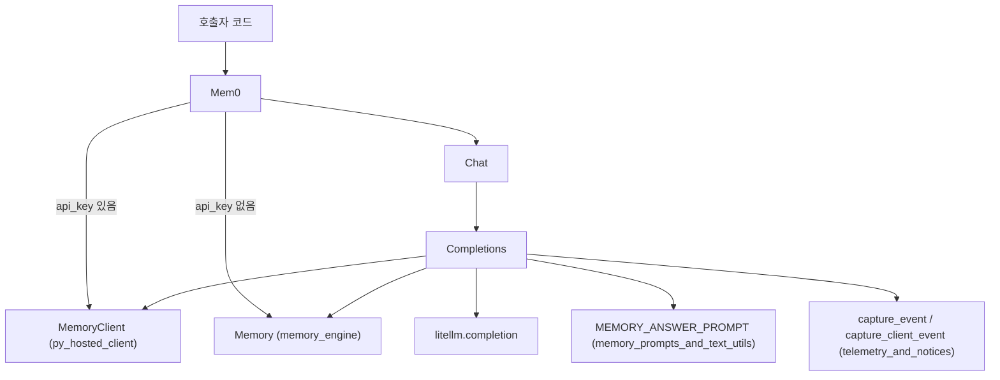
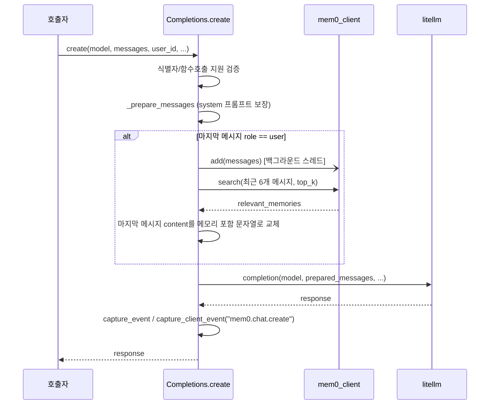

# py_proxy 모듈

## 개요

`py_proxy`(`mem0/proxy/main.py`)는 OpenAI 호환 `chat.completions.create` 인터페이스로 Mem0 메모리를 투명하게 붙여 주는 얇은 프록시 계층이다. 호출 시 (1) 대화 내용을 메모리에 비동기로 저장하고, (2) 관련 메모리를 검색하여 마지막 사용자 메시지에 주입한 뒤, (3) `litellm.completion`으로 실제 LLM을 호출한다.

구성 요소는 세 개뿐이다.

| 컴포넌트 | 역할 |
|---|---|
| `Mem0` | 진입점. `api_key` 유무에 따라 `MemoryClient`(호스티드) 또는 `Memory`(OSS)를 선택하고 `chat` 속성을 노출 |
| `Chat` | `completions` 속성만 가진 네임스페이스 (OpenAI SDK 형태 모방) |
| `Completions` | 실제 로직: 메시지 준비, 메모리 저장/검색, 프롬프트 구성, LLM 호출, 텔레메트리 |

## 아키텍처



### 의존 모듈

- 호스티드 클라이언트: [py_hosted_client](py_hosted_client.md) — `MemoryClient`
- OSS 메모리 엔진: [memory_engine](memory_engine.md) — `Memory.from_config`, `add`, `search`
- 프롬프트: [memory_prompts_and_text_utils](memory_prompts_and_text_utils.md) 및 `mem0.configs.prompts.MEMORY_ANSWER_PROMPT`
- 텔레메트리: [telemetry_and_notices](telemetry_and_notices.md)
- 외부 의존성: `litellm`(필수, import 실패 시 `ImportError`), `httpx`(타입 힌트의 `httpx.Timeout`)

## 컴포넌트 상세

### `Mem0.__init__(config=None, api_key=None, host=None)`

- `api_key`가 있으면 `MemoryClient(api_key, host)`.
- 아니면 `config`가 있을 때 `Memory.from_config(config)`, 없으면 `Memory()`.
- 결과를 `self.mem0_client`에 저장하고 `self.chat = Chat(self.mem0_client)`를 생성한다.

### `Completions.create(...)`

Mem0 인자(`user_id`, `agent_id`, `run_id`, `metadata`, `filters`, `top_k=10`)와 LiteLLM/OpenAI 호환 인자(`temperature`, `stream`, `tools`, `base_url`, `api_key`, `model_list` 등)를 함께 받는다.

검증:
1. `user_id`, `agent_id`, `run_id` 중 하나는 필수 — 없으면 `ValueError`.
2. `litellm.supports_function_calling(model)`이 거짓이면 `ValueError`.

### 내부 헬퍼

| 메서드 | 동작 |
|---|---|
| `_prepare_messages` | 첫 메시지가 `system`이 아니면 `MEMORY_ANSWER_PROMPT`를 system 메시지로 앞에 추가 (리스트를 새로 만들어 반환) |
| `_async_add_to_memory` | 데몬 `threading.Thread`에서 `mem0_client.add(...)` 실행. 응답을 기다리지 않음 |
| `_fetch_relevant_memories` | 마지막 6개 메시지를 `"role: content"`로 이어 붙여 쿼리로 `mem0_client.search(...)` 호출 |
| `_format_query_with_memories` | 클라이언트 타입별로 메모리 텍스트 구성 후 `- Relevant Memories/Facts: ... - Entities: ... - User Question: ...` 형식 문자열 반환 |

## 요청 처리 흐름



## 동작상 유의점

- **저장과 검색의 경쟁**: `add`는 별도 스레드에서 실행되고 `search`는 즉시 동기 호출되므로, 방금 보낸 메시지가 검색 결과에 반영된다는 보장은 없다.
- **저장 대상**: 저장에는 원본 `messages`가 쓰이고, 메모리가 주입된 `prepared_messages`는 저장되지 않는다. 다만 `_prepare_messages`가 `messages[0]`이 system일 때 같은 리스트를 그대로 반환하므로, 이 경우 `prepared_messages[-1]["content"]` 교체가 호출자의 `messages` 내용(같은 dict 객체)까지 변경할 수 있다.
- **결과 형식 분기**: `Memory`는 `{"results": [...], "relations": [...]}` 형태를, `MemoryClient`는 리스트를 반환한다는 가정에 의존한다. 두 타입 외의 클라이언트에서는 `memories_text`가 정의되지 않는다.
- **`filters` 전달**: `add`와 `search` 양쪽에 동일하게 전달된다. 클라이언트별 `add`의 `filters` 지원 여부는 해당 모듈 문서를 참고.
- **스트리밍**: `stream=True`여도 텔레메트리는 `completion()` 반환 직후 기록되며, 응답은 LiteLLM 반환 객체를 그대로 돌려준다.
- **`TODO` 상태**: 쿼리는 최근 6개 메시지 단순 연결이며, 대화 요약은 미구현이다.
- 마지막 메시지가 `user`가 아니면 메모리 저장/검색/주입 없이 LLM만 호출한다.

## 사용 예

```python
from mem0.proxy.main import Mem0

client = Mem0(api_key="m0-...")           # 호스티드
# client = Mem0(config={...})              # OSS (Memory.from_config)

resp = client.chat.completions.create(
    model="gpt-4o-mini",
    messages=[{"role": "user", "content": "내가 좋아하는 음식 기억해?"}],
    user_id="alice",
)
```

## 시스템 내 위치

`py_proxy`는 [Python_SDK_Core_(Memory_Engine_and_Hosted_Client)](Python_SDK_Core_(Memory_Engine_and_Hosted_Client).md)의 하위 모듈로, 코어 SDK 위에 얹힌 편의 래퍼다. 프로바이더 계층([Python_Pluggable_Provider_Layer](Python_Pluggable_Provider_Layer.md))은 `Memory` 내부에서 사용되며, 프록시의 LLM 호출은 이와 별개로 LiteLLM이 직접 수행한다.
