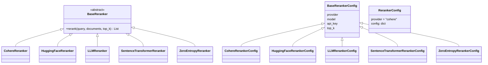
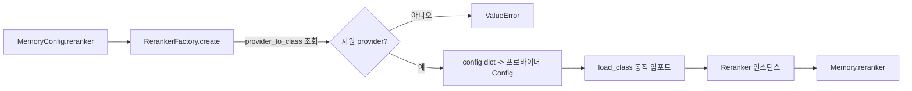
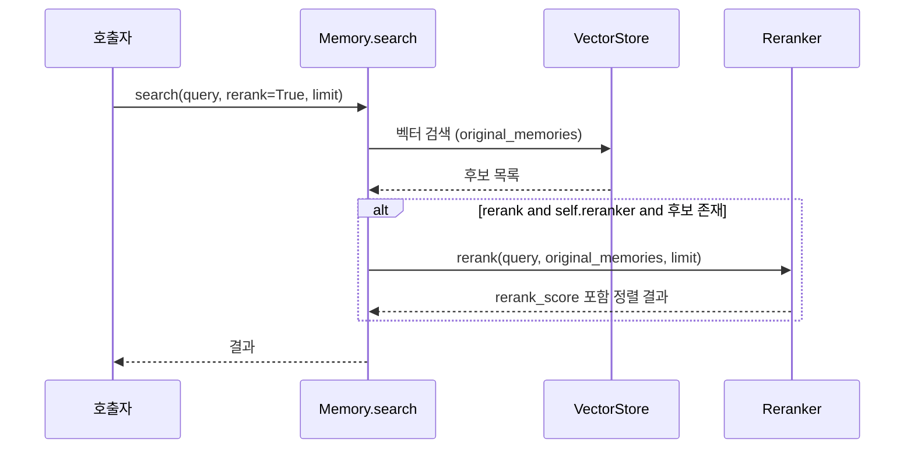
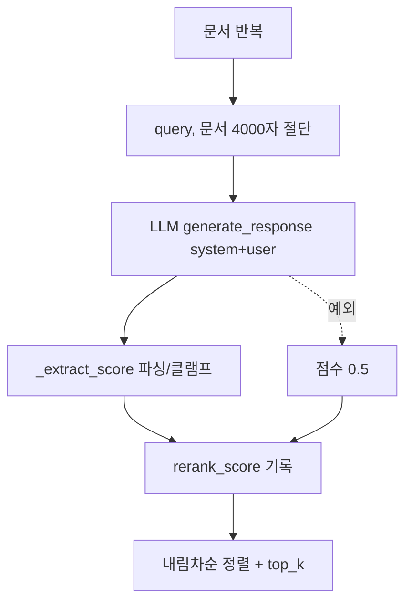

# py_rerankers 모듈

## 소개

`py_rerankers`는 Mem0 Python SDK에서 **벡터 검색 결과를 재정렬(rerank)** 하는 플러그형 프로바이더 계층입니다. `Memory.search()`가 벡터 스토어에서 후보 메모리를 가져온 뒤, 설정된 reranker가 `query`와 각 후보의 관련도를 다시 계산해 `rerank_score`를 붙이고 정렬합니다.

지원 프로바이더(5종): `cohere`, `sentence_transformer`, `zero_entropy`, `llm_reranker`, `huggingface`.

관련 모듈: [py_llms](py_llms.md) (LLMReranker가 사용), [py_vector_stores](py_vector_stores.md) (후보 검색), [py_memory_core](py_memory_core.md) (`Memory`가 reranker를 소유), [py_utils](py_utils.md) (`RerankerFactory`).

## 파일 구성

| 경로 | 역할 |
|------|------|
| `mem0/reranker/base.py` | 추상 클래스 `BaseReranker` (`rerank()` 단일 메서드) |
| `mem0/reranker/cohere_reranker.py` | `CohereReranker` |
| `mem0/reranker/huggingface_reranker.py` | `HuggingFaceReranker` |
| `mem0/reranker/llm_reranker.py` | `LLMReranker` |
| `mem0/reranker/sentence_transformer_reranker.py` | `SentenceTransformerReranker` |
| `mem0/reranker/zero_entropy_reranker.py` | `ZeroEntropyReranker` |
| `mem0/configs/rerankers/base.py` | `BaseRerankerConfig` (`provider`, `model`, `api_key`, `top_k`) |
| `mem0/configs/rerankers/config.py` | `RerankerConfig` (최상위 설정: `provider`, `config`) |
| `mem0/configs/rerankers/{cohere,huggingface,llm,sentence_transformer,zero_entropy}.py` | 프로바이더별 설정 |

## 아키텍처



## 시스템 내 위치와 생성 흐름

`MemoryConfig.reranker`(`RerankerConfig`)가 설정되어 있으면 `Memory`/`AsyncMemory` 초기화 시 `RerankerFactory.create(provider, config)`로 인스턴스를 만듭니다 (`mem0/memory/main.py`).



`RerankerFactory.provider_to_class` 매핑 (`mem0/utils/factory.py`):

| provider | 클래스 | 설정 클래스 |
|----------|--------|-------------|
| `cohere` | `CohereReranker` | `CohereRerankerConfig` |
| `sentence_transformer` | `SentenceTransformerReranker` | `SentenceTransformerRerankerConfig` |
| `zero_entropy` | `ZeroEntropyReranker` | `ZeroEntropyRerankerConfig` |
| `llm_reranker` | `LLMReranker` | `LLMRerankerConfig` |
| `huggingface` | `HuggingFaceReranker` | `HuggingFaceRerankerConfig` |

`config`가 `None`이면 `kwargs`로, `dict`이면 `config_class(**config, **kwargs)`로 설정을 만들고, 그 외 타입이 `BaseRerankerConfig`가 아니면 `ValueError`를 던집니다. 클래스 임포트 실패는 `ImportError`로 감쌉니다. 선택 의존성은 임포트 시점이 아닌 **생성자에서** 검사합니다.

## 검색 시 데이터 흐름



`AsyncMemory`는 동일 로직을 `rerank`를 스레드 실행기로 감싸 호출합니다.

## 공통 계약

- 입력: `documents: List[Dict]`. 텍스트는 `memory` → `text` → `content` 순으로 찾고, 없으면 `str(doc)`.
- 출력: 원본을 `copy()`한 딕셔너리에 `rerank_score`를 추가. 입력은 변경하지 않음.
- `documents`가 비어 있으면 그대로 반환.
- `top_k` 우선순위: 호출 인자 → `config.top_k` → 전체 반환.
- 실패 시 예외를 전파하지 않고 경고 로그를 남기며 **원래 순서로 폴백**합니다(대부분 `rerank_score=0.0`, LLM은 문서별 `0.5`).

## 프로바이더 상세

### CohereReranker
- 설정: `model="rerank-v3.5"`, `return_documents=False`, `max_chunks_per_doc=None`.
- API 키: `config.api_key` 또는 `COHERE_API_KEY`; 없으면 `ValueError`. `cohere` 미설치 시 `ImportError`.
- `client.rerank(...)` 호출 후 `result.index`로 원본 문서를 매핑하고 `relevance_score`를 기록합니다. `top_n = top_k or config.top_k or len(documents)`.
- 참고: `CohereRerankerConfig`는 `BaseRerankerConfig`를 상속하므로 `top_k`, `api_key`는 기반 클래스에서 옵니다.

### SentenceTransformerReranker
- 설정: `model="cross-encoder/ms-marco-MiniLM-L-6-v2"`, `device=None`, `batch_size=32`, `show_progress_bar=False`.
- `CrossEncoder.predict`로 `[query, doc]` 쌍을 점수화하고 내림차순 정렬 후 `top_k` 적용. 점수는 정규화하지 않은 원시 값입니다.
- `dict`/`BaseRerankerConfig` 입력은 자동으로 전용 설정으로 변환됩니다.

### HuggingFaceReranker
- 설정: `model="BAAI/bge-reranker-base"`, `device=None`(CUDA 자동 감지), `batch_size=32`, `max_length=512`, `normalize=True`.
- `AutoModelForSequenceClassification`으로 배치 추론 후 로짓을 얻습니다. `normalize=True`이면 문서별 **시그모이드**를 적용합니다(`_normalize_scores`). 이전 min-max 방식은 집합 상대적이라 최하위/단일 문서가 0.0이 되는 문제가 있어 대체되었습니다.
- `transformers`/`torch` 미설치 시 `ImportError`.

### LLMReranker
- 설정: `provider="openai"`, `model="gpt-5-mini"`, `temperature=0.0`, `max_tokens=100`, 선택적 `llm`(중첩 `{provider, config}`; Ollama 등 프로바이더 전용 필드용), `scoring_prompt`(deprecated, 시스템 메시지로 사용되며 `DeprecationWarning`).
- 내부적으로 `LlmFactory.create`로 LLM을 만들고, 문서마다 한 번씩 `generate_response`를 호출합니다 (**문서 수만큼 LLM 호출** → 지연/비용 증가).
- 시스템/사용자 메시지를 분리하고 입력을 `_MAX_INPUT_LEN=4000`자로 잘라 프롬프트 주입·과다 입력을 완화합니다.
- `_extract_score`: 소수 우선, 정수 폴백으로 첫 숫자를 파싱해 `[0.0, 1.0]`로 클램프, 숫자가 없으면 `0.5`.



### ZeroEntropyReranker
- 설정: `model="zerank-1"` (`zerank-1-small` 사용 가능), `api_key`, `top_k`.
- API 키: `config.api_key` 또는 `ZERO_ENTROPY_API_KEY`; 없으면 `ValueError`. `zeroentropy` 미설치 시 `ImportError`.
- `client.models.rerank(...)` 결과를 점수 내림차순으로 정렬한 뒤 `top_k`를 적용합니다.

## 설정 예시

```python
from mem0 import Memory

config = {
    "reranker": {
        "provider": "huggingface",
        "config": {"model": "BAAI/bge-reranker-base", "top_k": 5},
    }
}
m = Memory.from_config(config)
m.search("선호하는 음료", user_id="alice", rerank=True)
```

`RerankerConfig`는 `extra="forbid"`이며 `provider` 기본값은 `"cohere"`입니다.

## 유지보수 시 유의점

- 새 프로바이더 추가: `BaseReranker` 구현 + `BaseRerankerConfig` 하위 설정 + `RerankerFactory.provider_to_class` 등록 + 선택(optional) 의존성 그룹 추가(`pyproject.toml`의 core `dependencies` 금지). 절차는 `mem0/CLAUDE.md`의 "Adding a provider" 참고.
- 점수 척도는 프로바이더마다 다릅니다(Cohere/ZeroEntropy 관련도, 시그모이드 [0,1], Cross-encoder 원시 점수, LLM 0~1). 서로 비교하지 마십시오.
- 폴백은 오류를 로그로만 노출하므로 운영 시 경고 로그를 모니터링해야 합니다.
- 설정 클래스 `HuggingFaceRerankerConfig`, `LLMRerankerConfig`, `SentenceTransformerRerankerConfig`는 `RerankerFactory`가 임포트하지만 핵심 컴포넌트 목록 밖에 있습니다.
- TypeScript 대응 구현은 [ts_oss_rerankers](ts_oss_rerankers.md)를 참고하십시오.
