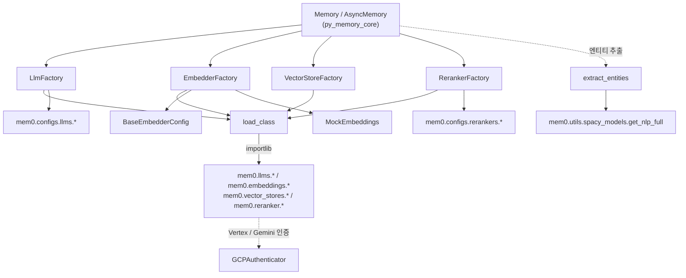
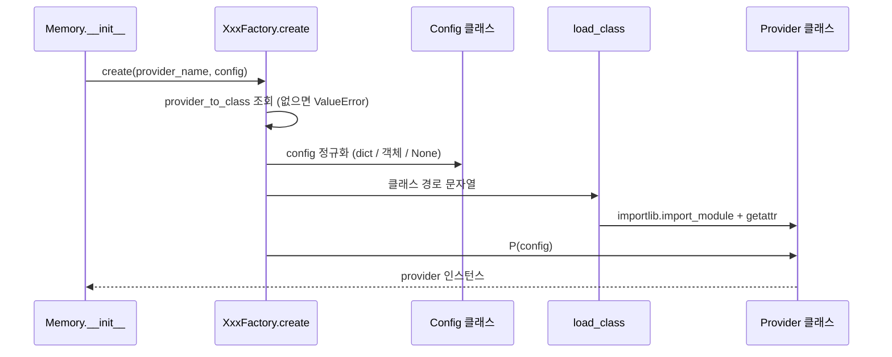
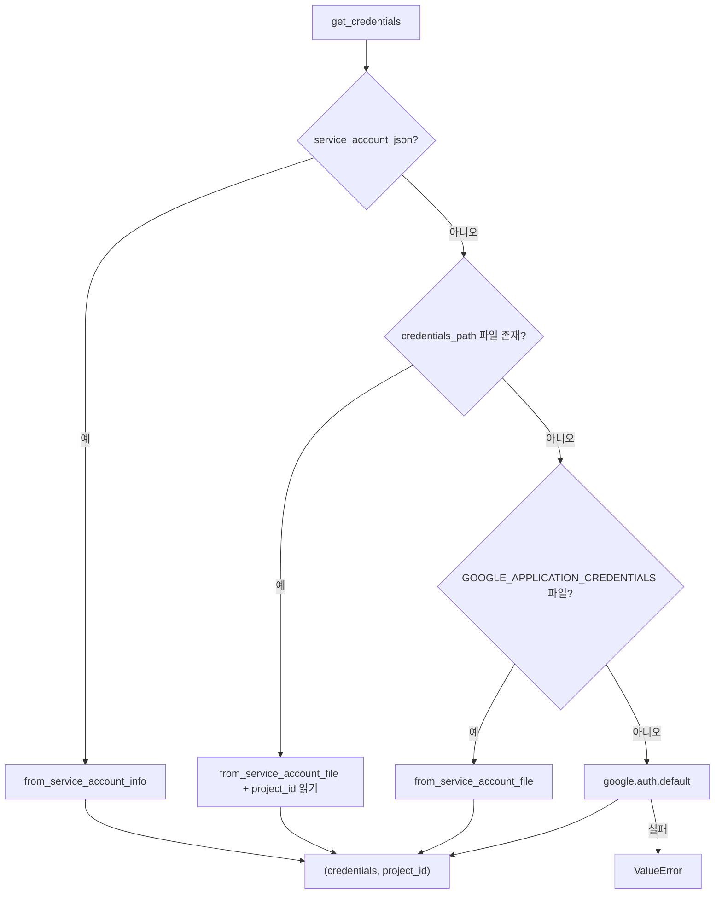
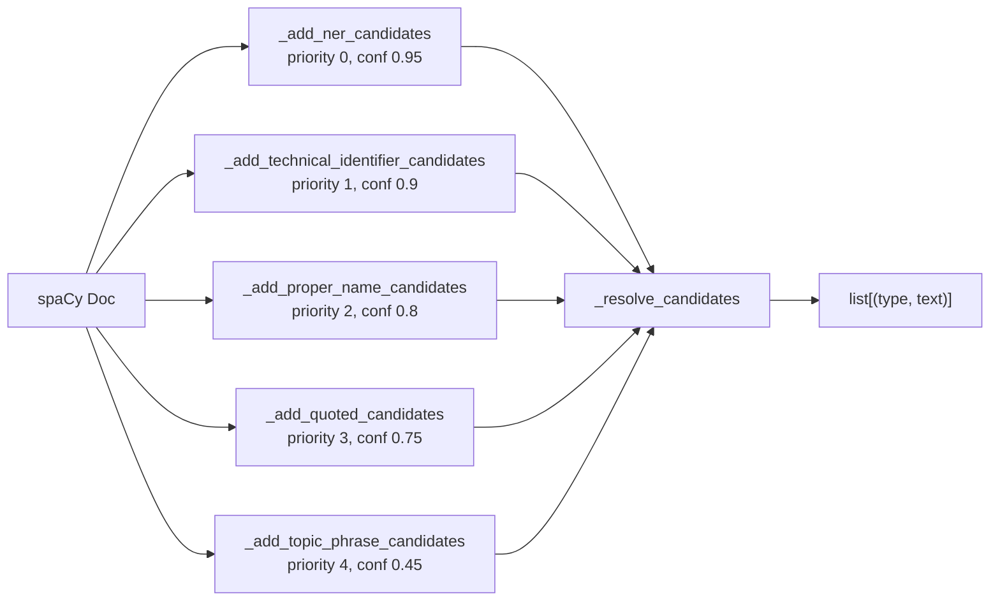

# py_utils 모듈

`mem0/utils/` 패키지는 Python SDK 전반에서 공유되는 **횡단 유틸리티**를 모읍니다. 세 가지 책임이 있습니다.

| 파일 | 핵심 컴포넌트 | 역할 |
|------|---------------|------|
| `mem0/utils/factory.py` | `LlmFactory`, `EmbedderFactory`, `VectorStoreFactory`, `RerankerFactory` | provider 이름 → 클래스/설정 매핑 및 지연 로딩(lazy import) 인스턴스 생성 |
| `mem0/utils/gcp_auth.py` | `GCPAuthenticator` | Vertex AI / Google GenAI용 GCP 인증 통합 처리 |
| `mem0/utils/entity_extraction.py` | `_lemmatize_compound` (및 `extract_entities*`) | spaCy 기반 엔티티 후보 추출 및 우선순위 기반 해소 |

상위 모듈은 [py_memory_core](py_memory_core.md)(`Memory`/`AsyncMemory`)이며, 팩토리가 생성하는 대상은 [py_llms](py_llms.md), [py_embeddings](py_embeddings.md), [py_vector_stores](py_vector_stores.md), [py_rerankers](py_rerankers.md)에 문서화되어 있습니다.

---

## 1. 아키텍처 개요

핵심 설계: 팩토리는 **클래스를 문자열 경로로만 보관**하고 `load_class()`(`importlib.import_module` + `getattr`)로 필요할 때만 import 합니다. 따라서 사용하지 않는 provider의 선택적 의존성(예: `qdrant_client`, `pinecone`)은 설치되어 있지 않아도 됩니다. 이는 루트 `AGENTS.md`의 "핵심 `dependencies`에 추가하지 말고 optional group을 사용" 규칙과 맞물립니다 (`pyproject.toml` 참고).

---

## 2. Factory (`mem0/utils/factory.py`)

### 2.1 공통 흐름

### 2.2 `LlmFactory`

- `provider_to_class`: `provider -> (클래스 경로, Config 클래스)`. `openai`, `ollama`, `anthropic`, `gemini`, `deepseek`, `minimax`, `xai`, `lmstudio`, `vllm`, `aws_bedrock`, `azure_openai`, `*_structured`, `groq`, `together`, `litellm`, `sarvam`, `langchain` 등 18개.
- 전용 Config가 없는 provider(`groq`, `together`, `litellm`, `sarvam`, `langchain`)는 `BaseLlmConfig`를 사용.
- `create(provider_name, config=None, **kwargs)` 설정 처리 규칙:
  1. `None` → `config_class(**kwargs)`
  2. `dict` → `{**config, **kwargs}`로 병합 후 `config_class(**...)`
  3. `BaseLlmConfig` 인스턴스이고 provider 전용 Config가 필요하면 → `model`, `temperature`, `api_key`, `max_tokens`, `top_p`, `top_k`, `enable_vision`, `vision_details`, `http_client_proxies`를 복사해 변환. `reasoning_effort`/`is_reasoning_model`은 대상 Config 시그니처(`inspect.signature`)가 명시적으로 받거나 `**kwargs`를 허용할 때만 전달 (예상 밖 인자로 인한 예외 방지).
  4. 그 외 → 그대로 사용.
- `register_provider(name, class_path, config_class=None)`: 런타임에 provider 추가 (기본 `BaseLlmConfig`).
- `get_supported_providers()`: 등록된 이름 목록.

### 2.3 `EmbedderFactory`

- `provider_to_class`는 클래스 경로 문자열만 보관 (11개: openai, ollama, huggingface, azure_openai, gemini, vertexai, together, lmstudio, langchain, aws_bedrock, fastembed).
- `create(provider_name, config, vector_config)`:
  - `provider_name == "upstash_vector"`이고 `vector_config.enable_embeddings`가 참이면 **`MockEmbeddings`** 반환 (Upstash가 서버측에서 임베딩을 수행).
  - 그 외에는 `BaseEmbedderConfig(**config)`로 감싼 뒤 provider 생성. `config`는 dict여야 합니다.
  - 미지원 provider → `ValueError`.

### 2.4 `VectorStoreFactory`

- 25개 provider 매핑 (qdrant, chroma, pgvector, milvus, upstash_vector, pinecone, mongodb, redis, valkey, faiss, neptune, turbopuffer, oracledb 등).
- `create(provider_name, config)`: `config`가 dict가 아니면 `model_dump()`(Pydantic v2)로 변환 후 **`provider(**config)`** 형태로 키워드 전개. 즉 다른 팩토리와 달리 Config 객체가 아니라 필드 값이 생성자 인자로 전달됩니다.
- `reset(instance)`: `instance.reset()` 호출 후 같은 인스턴스를 반환.

### 2.5 `RerankerFactory`

- `provider_to_class`: `cohere`, `sentence_transformer`, `zero_entropy`, `llm_reranker`, `huggingface`.
- `create(provider_name, config=None, **kwargs)`: `None`/dict는 해당 Config 클래스로 생성, `BaseRerankerConfig` 인스턴스는 그대로 사용, 그 외 타입은 `ValueError`. 클래스 import 실패(`ImportError`/`AttributeError`)는 provider명을 담은 `ImportError`로 재포장.

### 2.6 팩토리별 비교

| 항목 | Llm | Embedder | VectorStore | Reranker |
|------|-----|----------|-------------|----------|
| 매핑 값 | (경로, Config) | 경로 | 경로 | (경로, Config) |
| 생성자 인자 | Config 객체 | `BaseEmbedderConfig` | `**dict` | Config 객체 |
| 동적 등록 | `register_provider` | 없음 | 없음 | 없음 |
| 특수 처리 | 기본→전용 Config 변환 | Upstash `MockEmbeddings` | `reset()` | import 오류 재포장 |

> 주의: `Memory` 쪽 Config 검증(예: `LlmConfig`, `VectorStoreConfig`의 provider 검증)은 각 provider 모듈 문서에 있습니다. 새 provider 추가 절차는 `mem0/AGENTS.md`의 "Adding a provider"를 따르며, 이때 이 파일의 `provider_to_class`에도 항목을 추가해야 합니다.

---

## 3. GCP 인증 (`mem0/utils/gcp_auth.py`)

`GCPAuthenticator`는 모두 `@staticmethod`로 구성된 인증 헬퍼입니다.

| 메서드 | 설명 |
|--------|------|
| `get_credentials(service_account_json, credentials_path, scopes)` | 위 우선순위(in-memory dict → 파일 경로 → 환경변수 → ADC)로 `(credentials, project_id)` 반환 |
| `setup_vertex_ai(..., project_id, location="us-central1")` | `cloud-platform` scope로 인증 후 `vertexai.init()` 호출. project_id 우선순위: 인자 → 인증정보 → `GOOGLE_CLOUD_PROJECT`; 모두 없으면 `ValueError` |
| `get_genai_client(service_account_json, credentials_path, api_key)` | `api_key`가 있으면 우선 사용, 없으면 `generative-language` scope 서비스 계정 인증으로 `google.genai.Client` 생성 |

유의 사항:
- 모듈 최상단에서 `google-auth`를 import 하며 없으면 **import 시점에** `ImportError`가 발생합니다. 따라서 Vertex/Gemini 관련 provider 내부에서만 import 해야 합니다.
- `vertexai`, `google.genai`는 메서드 호출 시점에 지연 import 됩니다.
- 환경변수 경로가 존재하지 않는 파일이면 조용히 건너뛰고 ADC로 폴백합니다.

사용처: [py_embeddings](py_embeddings.md)의 `VertexAIEmbedding`·`GoogleGenAIEmbedding`, [py_llms](py_llms.md)의 `GeminiLLM`, [py_vector_stores](py_vector_stores.md)의 `GoogleMatchingEngine`.

---

## 4. 엔티티 추출 (`mem0/utils/entity_extraction.py`)

spaCy `Doc`에서 `(entity_type, entity_text)` 목록을 만듭니다. 타입은 `PROPER`, `QUOTED`, `TOPIC`, `IDENTIFIER`. spaCy를 쓸 수 없으면 `[]`를 반환합니다.

### 4.1 공개 API

| 함수 | 설명 |
|------|------|
| `extract_entities(text)` | `mem0.utils.spacy_models.get_nlp_full()`로 모델을 얻어 한 문장/문서 처리 |
| `extract_entities_batch(texts, batch_size=32)` | `nlp.pipe`로 배치 처리. 모델이 없으면 입력 수만큼 빈 리스트 |

`spacy_models` 모듈(모델 로딩)은 이 문서의 범위 밖이며, 함수 내부에서 지연 import 됩니다.

### 4.2 후보 수집 파이프라인

모든 후보는 `_add_candidate()`를 통과합니다: `_clean_text`로 마크다운 장식 제거 → 길이 2 이하 또는 `_has_artifacts`(`**`, 개행, 100자 초과, 글머리 기호 시작 등)이면 폐기.

| 수집기 | 타입 | 요점 |
|--------|------|------|
| NER | `PROPER` | `_ACCEPTED_NER_LABELS`(PERSON, ORG, GPE 등)만 허용, 날짜/수량류(`_REJECTED_NER_LABELS`) 제외. 뒤따르는 숫자 집계 토큰 제거, `and` 포함·일반어 단일 토큰·compound/amod 단일 토큰 제외 |
| 기술 식별자 | `IDENTIFIER` | `a.b.c` 형태(정규식 `[A-Za-z_][\w-]*(\.[A-Za-z_][\w-]*)+`) |
| 고유명 span | `PROPER` | 대문자 시작 토큰 연속 + 내부 연결어(`of the for at in`) 허용. `_GENERIC_SINGLE_ENTITY_TERMS`, `_GENERIC_CAPS`, 불용어 단일 토큰 제외 |
| 따옴표 | `QUOTED` | `"..."` 및 `'...'`(경계 조건이 있는 정규식), 3자 이상 |
| 주제 구 | `TOPIC` | `noun_chunks`를 소유격/따옴표로 분할 후 head 명사 검사. 일반 head(`_GENERIC_HEADS`), 모호한 형용사(`_NON_SPECIFIC_ADJ`), 일반 어미(`_GENERIC_ENDINGS`) 제거. 공백이 있는 구만 채택 |

보조 함수 `_lemmatize_compound(toks)`는 복합어 토큰을 합칠 때 `NOUN`만 `lemma_`로, 나머지는 원문 `text`로 이어 붙입니다.

### 4.3 충돌 해소 `_resolve_candidates`

1. 소문자·공백 정규화한 텍스트 기준으로 중복 제거 — `(priority, -confidence)`가 더 작은 후보 유지.
2. `(priority, -confidence, -길이, start)`로 정렬한 뒤, 이미 채택된 후보와 span이 겹치면 폐기. 예외: **공백이 있는 `TOPIC`은 `PROPER`와 겹쳐도 허용**. 따옴표 후보는 `start=-1`이라 겹침 검사에서 제외됩니다.
3. 최종 결과를 문서 내 위치순(위치 없는 후보는 맨 뒤)으로 정렬해 반환.

---

## 5. 의존성 요약

| 방향 | 대상 |
|------|------|
| 사용 (config) | `mem0.configs.llms.*`, `mem0.configs.embeddings.base`, `mem0.configs.rerankers.*` |
| 사용 (embedding mock) | `mem0.embeddings.mock.MockEmbeddings` |
| 동적 import | provider 모듈 전체 ([py_llms](py_llms.md), [py_embeddings](py_embeddings.md), [py_vector_stores](py_vector_stores.md), [py_rerankers](py_rerankers.md)) |
| 외부 | `google-auth`, `vertexai`, `google-genai`, `spacy`(선택) |
| 호출자 | [py_memory_core](py_memory_core.md)의 `Memory`/`AsyncMemory`, [py_proxy](py_proxy.md) |

TypeScript SDK의 대응물은 `mem0-ts/src/oss/src/utils/factory.ts`(`LLMFactory` 등)이며, 구조는 유사하나 별도 구현입니다.
