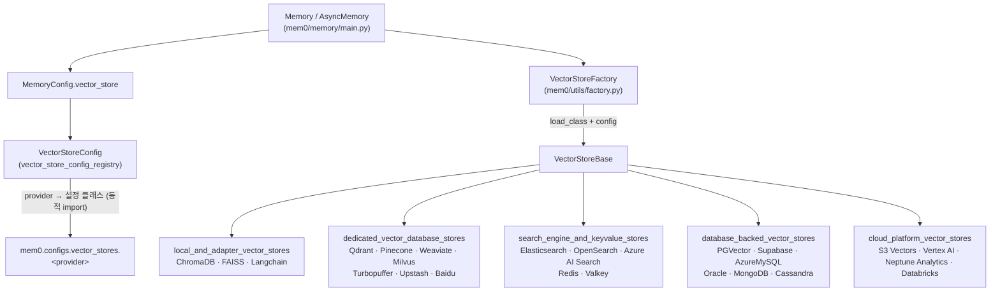
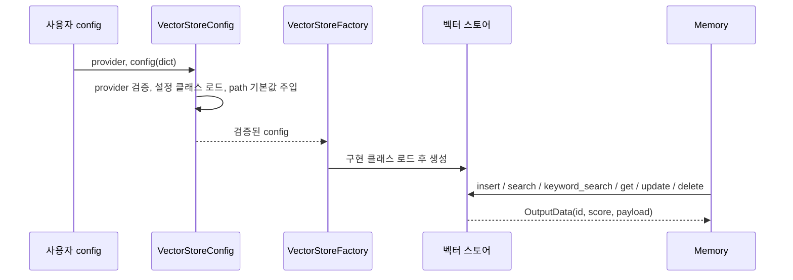
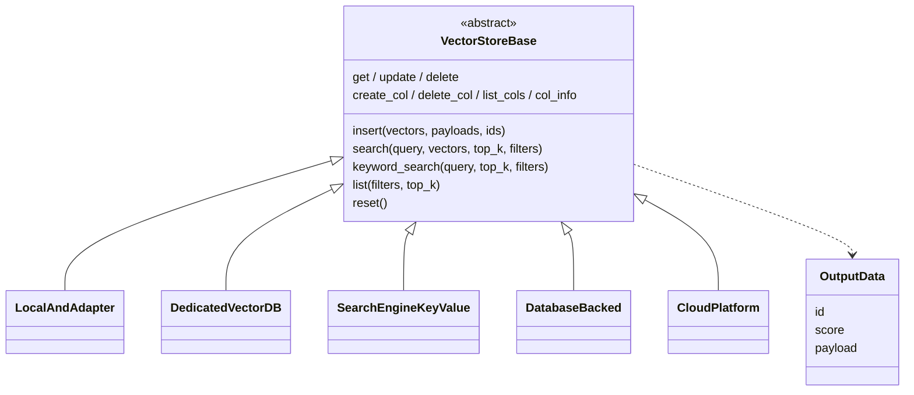

# py_vector_stores 모듈 개요

## 1. 목적

`py_vector_stores`(`mem0/vector_stores`)는 Mem0 Python SDK에서 메모리 임베딩을 저장하고 검색하는 **플러그형 벡터 스토어 계층**입니다. `Memory`/`AsyncMemory` 엔진은 백엔드가 무엇인지 모른 채 공통 인터페이스(`VectorStoreBase`)만 호출합니다.

- **추상화**: 모든 스토어는 `VectorStoreBase`를 상속하고 `insert`, `search`, `get`, `update`, `delete`, `list`, `create_col`, `list_cols`, `delete_col`, `col_info`, `reset`을 구현합니다. 대부분은 BM25 계열 `keyword_search`도 제공하며, 지원하지 않으면 `None`을 반환합니다.
- **결과 형식**: 검색 결과는 `OutputData(id, score, payload)` 형태로 통일됩니다. 거리 기반 메트릭은 "높을수록 유사"하도록 변환됩니다.
- **설정 검증**: provider 이름은 Pydantic 설정 클래스(`mem0/configs/vector_stores/<provider>.py`)로 연결됩니다. 이 설정 클래스들은 대부분 정의되지 않은 필드를 거부합니다.
- **지연 로딩**: 각 provider SDK는 선택 의존성이며, 해당 모듈을 import할 때만 로드됩니다. 코어 `dependencies`에는 추가하지 않고 optional 그룹으로 관리합니다.
- **지원 범위**: 총 25개 provider를 지원하며, 성격에 따라 5개 그룹으로 나뉩니다.

## 2. 아키텍처

### 2.1 전체 구조

### 2.2 설정 해석 및 인스턴스화 흐름

### 2.3 공통 계약

## 3. 하위 모듈 요약

| 모듈 | 대상 스토어 | 특징 |
|---|---|---|
| [vector_store_config_registry](vector_store_config_registry.md) | `VectorStoreConfig` | provider → 설정 클래스 매핑, 검증, 로컬 스토어용 기본 `path`(`/tmp/<provider>`) 주입 |
| [local_and_adapter_vector_stores](local_and_adapter_vector_stores.md) | `ChromaDB`, `FAISS`, `Langchain` | 서버 없이 쓰는 임베디드 스토어와 LangChain 어댑터. 개발·테스트에 적합 |
| [dedicated_vector_database_stores](dedicated_vector_database_stores.md) | `Qdrant`, `PineconeDB`, `Weaviate`, `MilvusDB`, `TurbopufferDB`, `UpstashVector`, `BaiduDB` | 벡터 전용 DB. BM25/하이브리드 검색과 풍부한 필터 변환 |
| [search_engine_and_keyvalue_stores](search_engine_and_keyvalue_stores.md) | `ElasticsearchDB`, `OpenSearchDB`, `AzureAISearch`, `RedisDB`, `ValkeyDB` | 검색 엔진과 키-값/인메모리 계열. kNN 쿼리와 텍스트 검색 |
| [database_backed_vector_stores](database_backed_vector_stores.md) | `PGVector`, `Supabase`, `AzureMySQL`, `OracleAIVectorSearch`, `MongoDB`, `CassandraDB` | 범용 DB를 벡터 저장소로 사용. 일부(AzureMySQL, Cassandra)는 Python 측 유사도 계산 |
| [cloud_platform_vector_stores](cloud_platform_vector_stores.md) | `S3Vectors`, `GoogleMatchingEngine`, `NeptuneAnalyticsVector`, `Databricks` | 클라우드가 관리하는 벡터 서비스. 컬렉션 생성 방식과 `reset` 지원 여부가 백엔드마다 다름 |

## 4. 설계상 주의점

- **이중 등록**: 새 provider는 설정 쪽(`VectorStoreConfig._provider_configs`)과 구현 쪽(`VectorStoreFactory.provider_to_class`)에 모두 등록해야 합니다. 한쪽만 등록하면 설정은 통과해도 생성 단계에서 실패합니다.
- **`list()` 반환 형태**: 많은 스토어가 `[[결과...]]`처럼 중첩 리스트를 반환합니다. 이는 `Memory`와의 호환을 위한 규약입니다.
- **필터 인젝션 방어**: 쿼리 문자열이나 SQL/Cypher를 조립하는 스토어(Milvus, Upstash, Baidu, Elasticsearch, AzureMySQL, Cassandra, Oracle, MongoDB, Neptune, Databricks, Valkey 등)는 키·값·식별자 검증이 보안 경계입니다. 수정할 때 이 검증을 유지해야 합니다.
- **파괴적 `reset()`**: 컬렉션이나 인덱스를 삭제 후 재생성합니다. Redis는 생성자가 `index.create(overwrite=True)`를 호출하므로 기존 인덱스가 덮어써질 수 있습니다.
- **로컬 스토어 경로**: 기본 `path`는 `/tmp`라서 재부팅 시 데이터가 사라질 수 있습니다. 운영 환경에서는 `path`를 명시하세요.
- **새 provider 추가 절차**:
  1. 설정 클래스를 작성합니다.
  2. 레지스트리에 등록합니다.
  3. 구현 클래스를 작성하고 팩토리에 등록합니다.
  4. `docs/`를 갱신합니다.

## 5. 관련 문서

- TypeScript 대응 구현: `ts_oss_vector_stores`
- `VectorStoreFactory`: `py_utils`
- `Memory`의 소비 방식: `py_memory_core`