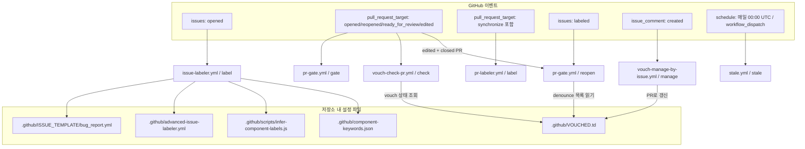
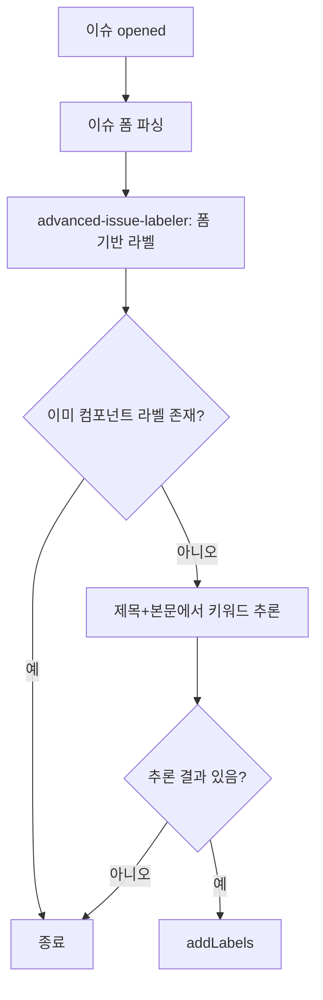
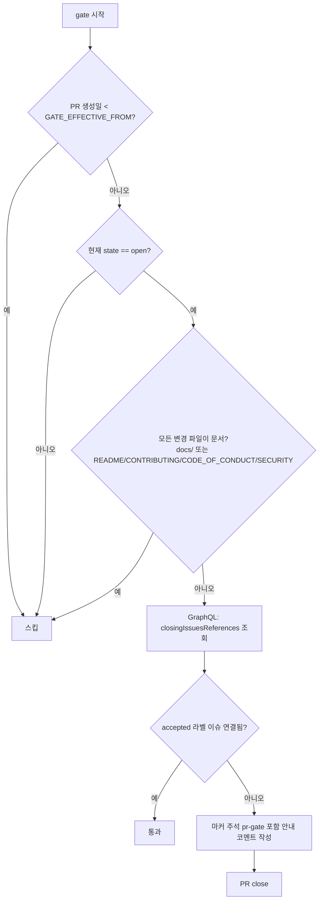
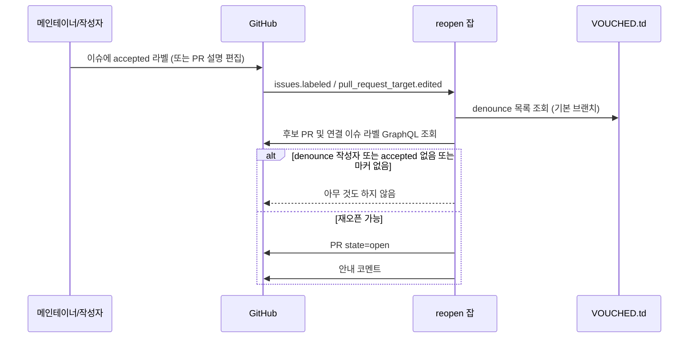
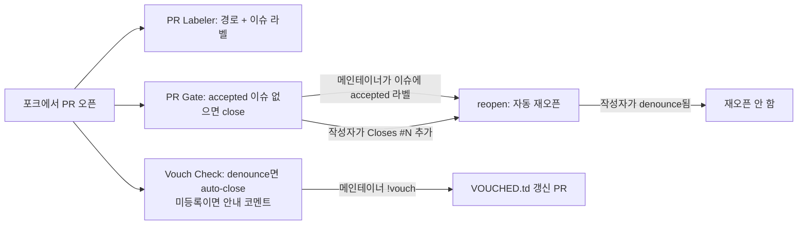

# repo_governance_workflows 모듈

## 1. 소개

`repo_governance_workflows`는 mem0 저장소의 **기여 거버넌스(contribution governance)** 를 자동화하는 GitHub Actions 워크플로 6종으로 구성된 모듈이다. 빌드·배포가 아니라 *이슈/PR을 누가, 어떤 조건으로 열고 유지할 수 있는가*를 다룬다.

| 워크플로 파일 | 워크플로 이름 | 잡 | 역할 |
|---|---|---|---|
| `.github/workflows/issue-labeler.yml` | Auto-label issues | `label` | 새 이슈에 컴포넌트 라벨 자동 부여 |
| `.github/workflows/pr-gate.yml` | PR Gate | `gate`, `reopen` | `accepted` 이슈가 연결되지 않은 외부 PR 자동 close / 조건 충족 시 자동 reopen |
| `.github/workflows/pr-labeler.yml` | PR Labeler | `label` | 변경 경로 기반 + 연결된 이슈 기반 PR 라벨링 |
| `.github/workflows/stale.yml` | Close stale issues | `stale` | 비활성 이슈/PR 정리 |
| `.github/workflows/vouch-check-pr.yml` | Vouch - Check PR | `check` | PR 작성자의 vouch 상태 확인 |
| `.github/workflows/vouch-manage-by-issue.yml` | Vouch - Manage by Issue | `manage` | 코멘트 명령(`!vouch` 등)으로 `.github/VOUCHED.td` 관리 |

빌드/릴리스 파이프라인은 [root_ci_cd_pipeline](root_ci_cd_pipeline.md), 통합 패키지 CI/CD는 [integrations_ci_cd](integrations_ci_cd.md), CLI CI/CD는 [cli_ci_cd](cli_ci_cd.md)를 참고한다. 상위 모듈은 CI_CD_and_Repository_Governance이다.

> 정책 원문은 루트 `CLAUDE.md`(AGENTS.md)의 "Two gates decide whether your pull request stays open" 절과 `CONTRIBUTING.md`에 있다. 이 문서는 그 정책이 워크플로로 *어떻게 구현되는지*를 설명한다.

## 2. 아키텍처 개요

핵심 설계는 **두 개의 독립된 게이트**다. PR Gate는 "변경(change)"을, Vouch는 "계정(account)"을 판단하며 서로를 대체하지 않는다. 단, `reopen` 잡은 `VOUCHED.td`의 denounce(`-handle`) 목록을 읽어 vouch 결정이 게이트보다 우선하도록 한다.

### 공통 보안 특성

- PR 관련 워크플로는 모두 `pull_request_target`을 쓴다. 포크 PR에서도 쓰기 권한 토큰이 필요하기 때문이며, 대신 **PR 코드를 checkout/실행하지 않고** API 호출만 한다. (`issue-labeler.yml`만 `actions/checkout`을 하지만 이는 기본 브랜치의 이슈 이벤트다.)
- 각 워크플로는 `permissions`를 최소 범위로 명시한다.
- `.github/workflows/` 수정에는 메인테이너 승인이 필요하다(게시 자격 증명이 워크플로 파일명에 고정됨 — `CLAUDE.md` 참조).

## 3. 컴포넌트 상세

### 3.1 `issue-labeler.yml` — Auto-label issues

- **트리거**: `issues: [opened]`
- **권한**: `contents: read`, `issues: write`
- **`label` 잡 단계**
  1. `actions/checkout@v4`
  2. `stefanbuck/github-issue-parser@v3` — `.github/ISSUE_TEMPLATE/bug_report.yml` 기준으로 이슈 폼을 JSON으로 파싱 (`continue-on-error: true`)
  3. `redhat-plumbers-in-action/advanced-issue-labeler@v3` — 파싱 결과와 `.github/advanced-issue-labeler.yml`로 폼 필드 → 라벨 매핑 (`continue-on-error: true`)
  4. `actions/github-script@v7` — **폼을 쓰지 않은 이슈의 폴백**. `.github/scripts/infer-component-labels.js`의 `loadKeywords`, `componentLabels`, `inferComponentLabels`를 `require`하여 `.github/component-keywords.json` 키워드로 제목+본문에서 컴포넌트를 추론

폴백 로직 요약: 이슈를 다시 조회 → 이미 알려진 컴포넌트 라벨이 있으면 종료 → 없으면 추론 결과가 있을 때만 `issues.addLabels`.

### 3.2 `pr-gate.yml` — PR Gate

- **트리거**: `pull_request_target`(`opened`, `reopened`, `ready_for_review`, `edited`) 및 `issues: [labeled]`
- **동시성**: 그룹 `pr-gate-<event>-<action>-<번호>`; PR 이벤트일 때만 `cancel-in-progress`
- **환경**: `GATE_EFFECTIVE_FROM = 2026-08-12T00:00:00Z` — 이 시각 이전에 생성된 PR은 면제
- **권한**: `contents: read`, `pull-requests: write`, `issues: read`

#### `gate` 잡

실행 조건(`if`): PR 이벤트이며, `edited`가 아니고, 드래프트가 아니고, 작성자가 Bot이 아니고, **포크에서 온 PR**이고, 작성자 association이 `OWNER/MEMBER/COLLABORATOR`가 아님.

- 안내 코멘트는 `<!-- pr-gate -->` 마커로 시작한다. 이 마커는 `reopen`이 "이 게이트가 닫은 PR인가"를 판별하는 데 쓰인다.
- "Closed는 거절이 아니라 아직 큐에 없다는 뜻"이라는 메시지와 `Closes #<번호>` 연결 방법, `accepted` 라벨 요청 절차를 안내한다.

#### `reopen` 잡

실행 조건: (a) `issues` 이벤트에서 라벨이 `accepted`, 또는 (b) 닫힌 PR의 `edited` 이벤트(설명에 `Closes #N`을 추가한 경우).

1. `.github/VOUCHED.td`를 **기본 브랜치**에서 읽어 `-`로 시작하는 줄(denounce)을 소문자 핸들 집합으로 만든다. 읽기 실패 시 경고만 남기고 빈 집합(= 아무도 denounce되지 않음)으로 처리한다.
2. 후보 PR 결정: `issues` 이벤트면 해당 이슈의 `closedByPullRequestsReferences`(닫힌 PR 포함), PR 이벤트면 해당 PR 하나.
3. `isReopenable`: 작성자가 denounce 목록에 있으면 `false`("Vouch outranks this gate"). 그렇지 않으면 상태가 `CLOSED`이고 연결 이슈 중 `accepted`가 있어야 `true`.
4. 코멘트 중 `<!-- pr-gate -->` 마커가 없으면 *이 게이트가 닫은 PR이 아니므로* 건드리지 않는다.
5. `pulls.update(state: 'open')` 후 "An `accepted` issue is linked now…" 코멘트를 남긴다. 실패 시 경고 후 다음 후보로 진행.

### 3.3 `pr-labeler.yml` — PR Labeler

- **트리거**: `pull_request_target`(`opened`, `synchronize`, `reopened`, `edited`); 동시성 그룹 `pr-labeler-<번호>`, 이전 실행 취소
- **`label` 잡**
  1. `actions/labeler@v5` — 변경 경로 기반 라벨링(설정은 기본값인 `.github/labeler.yml` 사용; 이 파일은 제공된 컴포넌트에 없으므로 내용은 확인하지 못했다)
  2. `actions/github-script@v7` — **연결된 이슈의 라벨 전파**. 허용 목록: `sdk-python`, `sdk-typescript`, `vector-store`, `plugin`, `rest-api`, `documentation`, `ci`, `cli`, `integrations`. 우산(umbrella) 규칙으로 `plugin` → `integrations`도 함께 부여한다.

### 3.4 `stale.yml` — Close stale issues

- **트리거**: 매일 `0 0 * * *`(UTC) 및 수동 `workflow_dispatch`
- **정책** (`actions/stale@v9`)

| 대상 | stale 처리 | 자동 close | 면제 라벨 |
|---|---|---|---|
| 이슈 | 90일 무활동 | stale 후 14일 | `P0-critical`, `P1-high`, `good first issue`, `security` |
| PR | 90일 무활동 | **안 함**(`days-before-pr-close: -1`) | `P0-critical`, `P1-high` |

- 활동이 생기면 `stale` 라벨 제거(`remove-stale-when-updated: true`), 실행당 최대 100개 작업(`operations-per-run`).

### 3.5 `vouch-check-pr.yml` — Vouch - Check PR

- **트리거**: `pull_request_target`(`opened`, `reopened`); 동시성 그룹 `vouch-check-pr-<번호>`
- **조건**: Bot 아님 + 포크 PR + 작성자가 OWNER/MEMBER/COLLABORATOR 아님 (PR Gate와 동일한 외부 기여자 판별)
- **단계**
  1. `mitchellh/vouch/action/check-pr` (v1.5.0, 커밋 SHA로 고정) — `require-vouch: false`, `auto-close: true`. 즉 vouch가 *필수는 아니지만* denounce된 사용자의 PR은 자동으로 닫힌다.
  2. 출력 `status == 'allowed'`일 때만, `<!-- vouch-check -->` 마커 코멘트가 없으면 "아직 vouch 목록에 없을 뿐이며 차단되지 않는다"는 부드러운 안내 코멘트를 1회 남긴다.

`VOUCHED.td` 해석 (정책 문서 기준):

| 목록 상태 | 의미 | 효과 |
|---|---|---|
| `-handle` | 행동강령 절차 후 `!denounce` | 수락된 이슈가 있어도 PR close |
| 없음 | 첫 기여자 등 | 영향 없음, 안내 코멘트 1회 |
| `handle` | `!vouch` 실행됨 | 영향 없음, 코멘트 미표시 |

### 3.6 `vouch-manage-by-issue.yml` — Vouch - Manage by Issue

- **트리거**: `issue_comment: [created]`; 동시성 그룹 `vouch-manage`(`cancel-in-progress: false` — 직렬 처리)
- **조건**: 코멘트에 `!vouch`, `!denounce`, `!unvouch` 중 하나가 포함됨
- **권한**: `contents: write`, `issues: write`, `pull-requests: write`
- **단계**
  1. `actions/create-github-app-token@v3` — 시크릿 `VOUCH_APP_ID`, `VOUCH_APP_PRIVATE_KEY`로 GitHub App 토큰 발급 (기본 `GITHUB_TOKEN` 대신 사용)
  2. `actions/checkout@v4` (앱 토큰 사용)
  3. `mitchellh/vouch/action/manage-by-issue` (v1.5.0 SHA 고정) — `pull-request: "true"`, `merge-immediately: "false"`: `VOUCHED.td` 변경을 **PR로 제안**하고 즉시 병합하지는 않는다.

> 워크플로 `if`는 단순 `contains` 검사이므로 명령 실행 권한(누가 vouch할 수 있는가)의 검증은 `mitchellh/vouch` 액션 쪽에 위임된다. 해당 검증 로직은 이 모듈의 코드에서는 확인되지 않는다.

## 4. 전체 흐름: 외부 기여자의 PR 생애주기

CI 게이팅(`ci-gate.yml` 등)과의 관계: 이 모듈은 코드 품질 검사를 하지 않으며, 테스트·빌드 검증은 [root_ci_cd_pipeline](root_ci_cd_pipeline.md)에서 담당한다.

## 5. 운영 시 유의사항

- **게이트 면제 대상**: 드래프트, 문서 전용 PR(`docs/` 또는 루트의 `README.md`, `CONTRIBUTING.md`, `CODE_OF_CONDUCT.md`, `SECURITY.md`만 변경), 같은 저장소 브랜치 PR, OWNER/MEMBER/COLLABORATOR, Bot.
- **`GATE_EFFECTIVE_FROM` 이후 생성된 PR만** 게이트 대상이다. 이 값을 바꾸면 정책 적용 범위가 달라진다.
- 닫힌 PR을 수동으로 재오픈하거나 같은 변경을 새 PR로 다시 올리지 말 것(정책 문서의 지침).
- 새 라벨을 PR 전파 대상에 추가하려면 `pr-labeler.yml`의 `allowed` 집합을 수정한다(워크플로 수정은 메인테이너 승인 필요).
- 컴포넌트 라벨 추론 키워드는 `.github/component-keywords.json`, 폼 매핑은 `.github/advanced-issue-labeler.yml`에서 관리한다. 두 파일과 `infer-component-labels.js`는 이번 분석 범위에 포함되지 않았다.
- CLA 서명(`CLAassistant`)은 이 모듈의 워크플로가 아닌 외부 봇이 처리한다.
