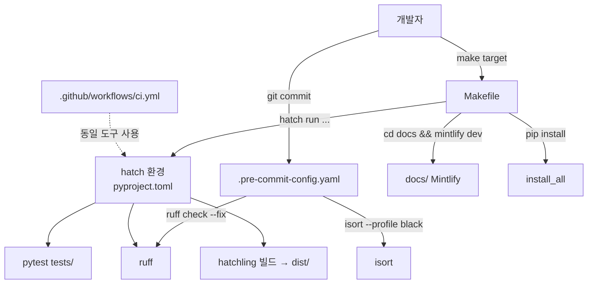
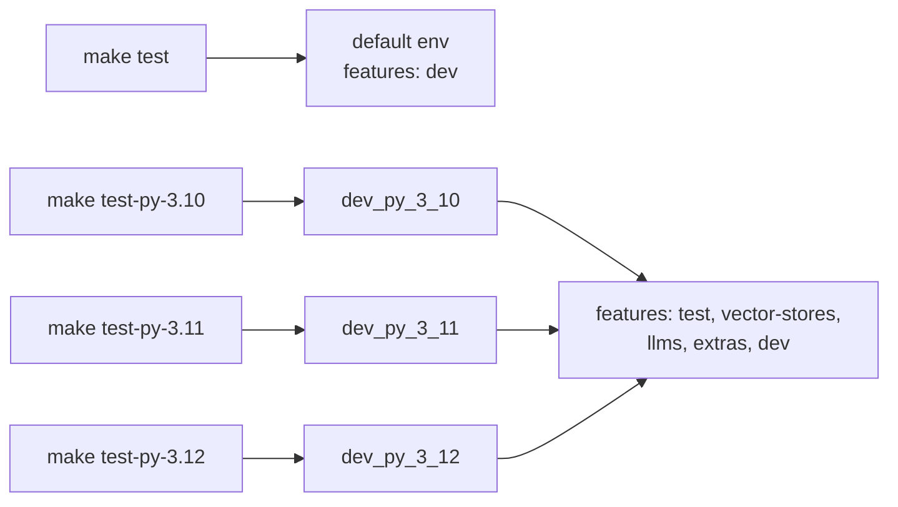
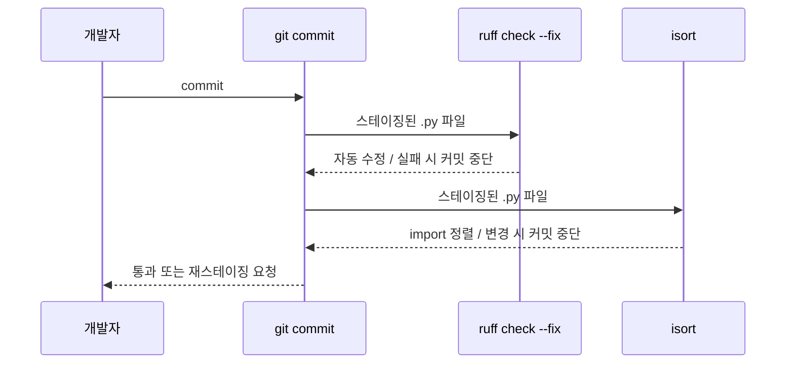

# root_build_config

## 소개

`root_build_config`는 저장소 루트의 **Python SDK(`mem0ai`) 개발 워크플로**를 정의하는 두 파일로 구성됩니다.

| 파일 | 역할 |
|------|------|
| `Makefile` | `hatch` / `mintlify` 명령을 감싼 개발자용 진입점 |
| `.pre-commit-config.yaml` | 커밋 시점 `ruff` + `isort` 자동 검사 |

실제 빌드·린트·테스트 설정(hatch 환경, ruff 규칙, 의존성 그룹)은 루트 `pyproject.toml`에 있으며 [py_build_and_scripts](py_build_and_scripts.md)에서 다룹니다. 이 모듈은 그 설정을 호출하는 얇은 계층입니다.

> 참고: 루트 `Makefile`은 Python SDK 전용입니다. `mem0-ts/`, `cli/`, `server/` 등은 각자의 설정을 가집니다 ([ts_build_and_config](ts_build_and_config.md), [cli_node_build_config](cli_node_build_config.md), [cli_python_build_config](cli_python_build_config.md), [dashboard_build_config](dashboard_build_config.md)).

## 아키텍처



## Makefile 타깃

변수: `ISORT_OPTIONS = --profile black`, `PROJECT_NAME := mem0ai`. 기본 타깃 `all`은 `format sort lint`를 순서대로 실행합니다.

| 타깃 | 실행 명령 | 설명 |
|------|-----------|------|
| `install` | `hatch env create` | 기본 hatch 환경 생성 (`dev` feature만 포함) |
| `install_all` | `pip install ruff==0.16.0 groq together boto3 ...` | 모든 선택적 provider SDK를 현재 pip 환경에 설치 |
| `format` | `hatch run format` | `ruff format` |
| `sort` | `hatch run isort mem0/` | import 정렬 (`mem0/` 대상) |
| `lint` | `hatch run lint` | `ruff check` |
| `docs` | `cd docs && mintlify dev` | 문서 사이트 로컬 미리보기 |
| `build` | `hatch build` | wheel/sdist 생성 |
| `publish` | `hatch publish` | PyPI 배포 |
| `clean` | `rm -rf dist` | 빌드 산출물 삭제 |
| `test` | `hatch run test` | `pytest tests/ {args}` (기본 환경) |
| `test-py-3.10` / `3.11` / `3.12` | `hatch run dev_py_3_XX:test` | 해당 Python 버전의 전체 feature 환경에서 테스트 |

`.PHONY`는 `format sort lint`만 선언되어 있어 나머지 타깃(`build`, `test`, `docs` 등)은 동명 파일/디렉터리(예: `docs/`)가 존재하면 최신 상태로 간주되어 건너뛸 수 있습니다. 특히 `docs` 타깃은 `docs/` 디렉터리가 존재하므로 `make docs`가 "up to date"로 무시될 가능성이 있어 주의가 필요합니다.

### 테스트 환경 매트릭스



주의: `default` 환경은 `dev` feature만 포함하므로 provider 의존성이 없습니다. provider 관련 테스트까지 돌리려면 `test-py-3.x` 타깃(또는 `hatch shell dev_py_3_11`)을 사용합니다. 이 점은 `CLAUDE.md`의 설정 안내(`hatch shell dev_py_3_11`)와 일치합니다.

## pre-commit 훅

`.pre-commit-config.yaml`은 `repo: local` 훅 두 개를 정의하며 둘 다 `language: system`이므로 **도구가 이미 PATH에 설치되어 있어야** 합니다 (`pip install -e '.[dev]'`로 `ruff==0.16.0`, `isort`, `pre-commit` 설치).

| 훅 id | 명령 | 대상 |
|-------|------|------|
| `ruff` | `ruff check --fix` | `types: [python]` |
| `isort` | `isort --profile black` | `types: [python]` |



설치: `pre-commit install` (`CLAUDE.md`의 Setup 참고). `CLAUDE.md`는 훅 건너뛰기(`--no-verify`)를 금지합니다.

## 설정 일관성 (pyproject.toml과의 관계)

- ruff `line-length = 120`, lint 규칙 `E4, E7, E9, F`, 버전 `ruff==0.16.0`(dev extra 및 `install_all`에서 동일하게 고정).
- isort 프로파일 `black`: `Makefile`(`ISORT_OPTIONS`), pre-commit 훅 인자, `pyproject.toml [tool.isort]`에 각각 중복 선언되어 있으므로 변경 시 세 곳을 함께 수정해야 합니다. 실제로 `sort` 타깃은 `ISORT_OPTIONS` 변수를 사용하지 않고 `hatch run isort mem0/`만 호출합니다. 따라서 이 변수는 현재 사실상 미사용이며, 프로파일은 `pyproject.toml`에서 적용됩니다.
- `ruff format`은 pre-commit에 없고 `make format`에서만 실행됩니다. 커밋 전에 직접 실행해야 합니다.
- `install_all`은 `pyproject.toml`의 optional group(`vector-stores`, `llms`, `extras`)과 별도로 수동 관리되는 목록이라 버전 범위가 어긋날 수 있습니다(예: `pinecone<7.0.0` vs `pyproject.toml`의 `pinecone<=7.3.0`). 정확한 환경 재현은 hatch 환경을 우선하세요.
- 참고: `pyproject.toml`의 `requires-python`은 `>=3.10`이며 `CLAUDE.md`는 3.9+를 언급합니다. 불일치이므로 `pyproject.toml`을 기준으로 삼으세요.

## 일반 워크플로

```bash
make install          # hatch 환경 생성
pre-commit install    # 커밋 훅 등록
make                  # format + sort + lint
make test-py-3.11     # 전체 feature 테스트
make build            # dist/ 생성
make docs             # 문서 미리보기 (Mintlify 필요)
```

## CI와의 관계

로컬 타깃은 CI 워크플로가 사용하는 도구와 같은 계열입니다. CI 구성은 [root_ci_cd_pipeline](root_ci_cd_pipeline.md)에서 설명하며, `.github/workflows/` 수정은 `CLAUDE.md`에 따라 메인테이너 승인이 필요합니다. 상위 모듈: [Build_Configuration_and_Tooling](Build_Configuration_and_Tooling.md).
