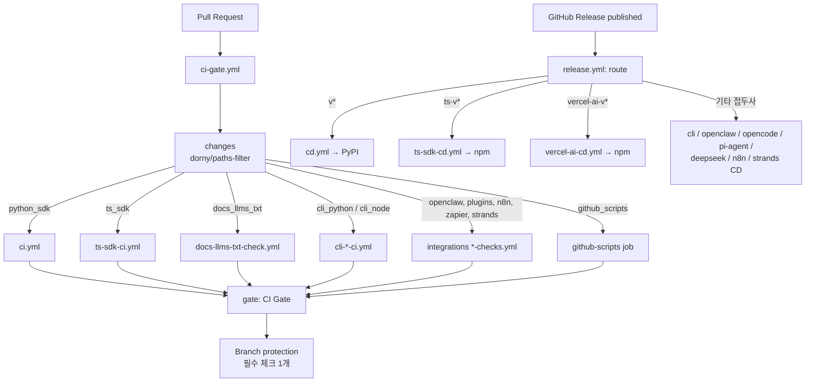
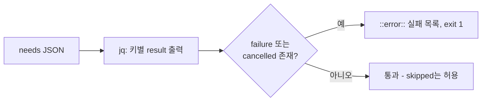
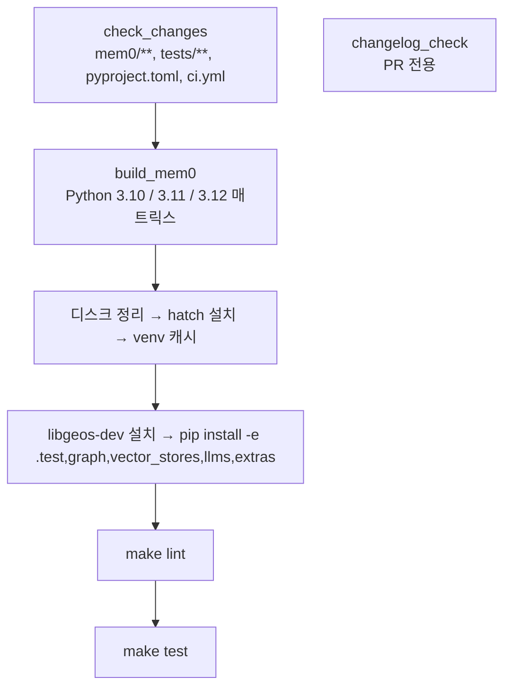
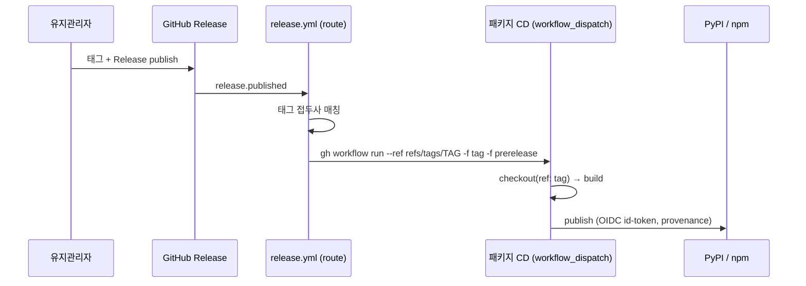
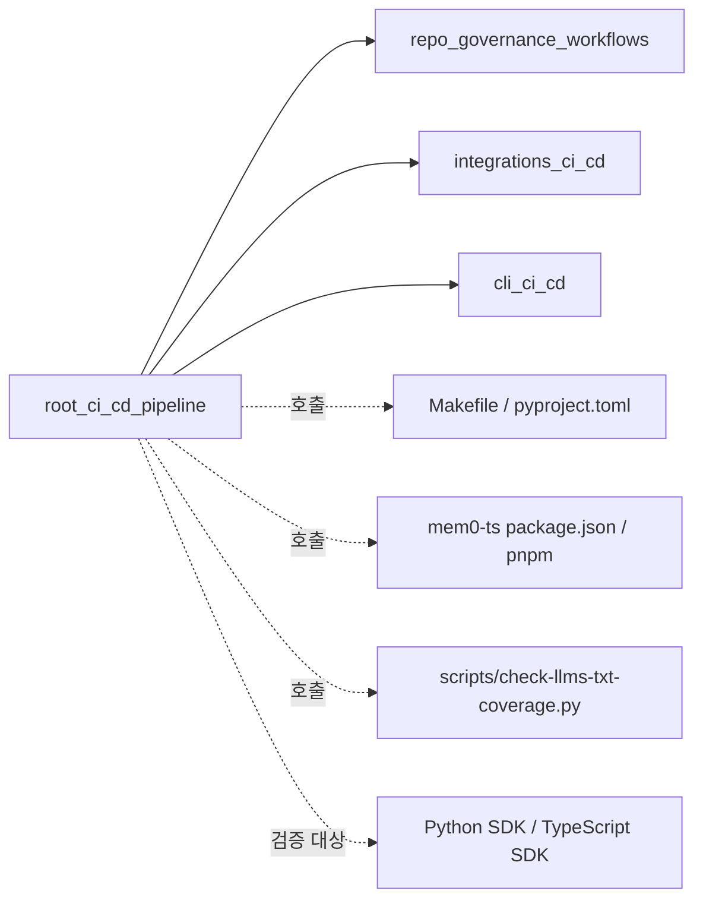

# root_ci_cd_pipeline 모듈

`root_ci_cd_pipeline`은 mem0 모노레포의 **핵심 CI/CD 오케스트레이션 계층**입니다. 모든 PR을 단일 필수 상태 체크(`CI Gate`)로 모으고, 릴리스 태그를 접두사별로 패키지 CD 워크플로우에 라우팅합니다. 대상 파일은 `.github/workflows/` 아래의 다음 8개입니다.

| 파일 | 역할 |
|------|------|
| `ci-gate.yml` | PR 단일 게이트. 변경 패키지 감지 → 재사용 워크플로우 호출 → 결과 집계 |
| `ci.yml` | Python SDK CI (lint, test, changelog 검사) |
| `ts-sdk-ci.yml` | TypeScript SDK CI (lint, build, unit/integration, changelog 검사) |
| `docs-llms-txt-check.yml` | `docs/llms.txt`와 `docs/**/*.mdx` 동기화 검사 |
| `release.yml` | Release Router. 릴리스 태그 접두사로 CD 워크플로우 디스패치 |
| `cd.yml` | Python SDK(`mem0ai`)를 PyPI에 게시 |
| `ts-sdk-cd.yml` | TypeScript SDK(`mem0ai`)를 npm에 게시 |
| `vercel-ai-cd.yml` | `@mem0/vercel-ai-provider`를 npm에 게시 |

관련 하위 파이프라인 문서는 다음을 참고하세요. 이 문서에서는 내용을 반복하지 않습니다.

- 거버넌스(PR Gate, vouch, 라벨러, stale): `repo_governance_workflows`
- 통합(integrations) 패키지 CI/CD: `integrations_ci_cd`
- CLI(Python/Node) CI/CD: `cli_ci_cd`
- 빌드 도구(Makefile, pyproject, package.json 등): `Build_Configuration_and_Tooling`

> 주의: `.github/workflows/`는 게시 자격 증명이 워크플로우 파일명에 고정되어 있으므로 유지관리자 승인 없이 수정하면 안 됩니다(루트 `CLAUDE.md` 규칙).

---

## 1. 아키텍처 개요

핵심 설계 원칙은 두 가지입니다.

1. **경로 필터 CI를 필수 체크로 지정할 수 없는 문제 해결**: 경로 필터가 걸린 워크플로우는 해당 경로를 건드리지 않는 PR에서 보고되지 않아 필수 체크가 "Expected" 상태로 멈춥니다. `ci-gate.yml`이 항상 실행되어 이 문제를 제거합니다.
2. **릴리스당 한 번만 실행**: 패키지 CD 워크플로우는 더 이상 release 이벤트를 직접 구독하지 않고, `release.yml`이 태그를 보고 해당 파이프라인만 디스패치합니다.

---

## 2. CI Gate (`ci-gate.yml`)

### 2.1 구성 요소

| Job | 설명 |
|-----|------|
| `changes` | `dorny/paths-filter@v3`로 15개 출력(`python_sdk`, `ts_sdk`, `cli_python`, `cli_node`, `openclaw`, `agent_plugins_python`, `agent_plugins_typescript`, `opencode_plugin`, `pi_agent_plugin`, `deepseek_plugin`, `n8n_nodes_mem0`, `zapier_mem0`, `mem0_strands`, `docs_llms_txt`, `github_scripts`) 생성 |
| `python-sdk`, `ts-sdk`, `cli-python`, `cli-node`, `openclaw`, `agent-plugins-*`, `opencode-plugin`, `pi-agent-plugin`, `deepseek-plugin`, `n8n-nodes-mem0`, `zapier-mem0`, `mem0-strands`, `docs-llms-txt` | `if: needs.changes.outputs.<key> == 'true'` 조건으로 패키지 워크플로우를 `uses:`(재사용 워크플로우)로 호출 |
| `github-scripts` | 재사용 워크플로우가 아닌 인라인 job. Node 20으로 `.github/scripts/*.test.js` 실행 |
| `gate` | 이름 `CI Gate`. `if: always()`로 모든 job을 `needs`에 두고 결과 집계 |

- 트리거: `pull_request`. `concurrency` 그룹은 `ci-gate-<PR 번호>`이며 `cancel-in-progress: true`입니다.
- 권한: `contents: read`, `pull-requests: read`.
- 각 필터는 해당 패키지 경로 + 패키지 워크플로우 파일 + `ci-gate.yml` 자체를 포함하므로, 워크플로우 변경도 파이프라인을 재실행합니다.
- 공유 코어 영향: `integrations/agent-plugin-core/typescript/**`는 openclaw, opencode, pi-agent, deepseek, agent-plugins-typescript 필터에 모두 포함됩니다. 반면 `agent_plugins_python`은 `!integrations/agent-plugin-core/typescript/**`로 TS 코어를 제외합니다.
- 관찰된 불일치(파일 기준): `n8n_nodes_mem0` 필터에는 `ci-gate.yml`이 없고, 호출 job에는 `secrets: inherit`도 없으며, `agent-plugins-python`도 `secrets: inherit`가 없습니다.

### 2.2 집계 로직

`skipped`는 정상으로 간주하고 `failure`/`cancelled`만 실패로 처리합니다. 따라서 변경되지 않은 패키지는 게이트를 막지 않습니다.

### 2.3 새 패키지 추가 절차 (파일 주석 기준)

1. `changes` job에 필터와 출력 추가
2. 패키지 워크플로우를 `uses:`로 호출하는 job 추가(패키지 워크플로우에 `workflow_call` 필요)
3. `gate`의 `needs`에 해당 job 추가

---

## 3. 패키지 CI 워크플로우

모두 PR에서는 `ci-gate.yml`이 호출(`workflow_call`)하고, push는 `main`에서 독립적으로 동작합니다.

### 3.1 Python SDK — `ci.yml`

- `changelog_check`(PR 전용): `pyproject.toml`의 `version`이 base→head에서 바뀌면 `docs/changelog/sdk.mdx` 수정이 같은 PR에 있어야 합니다. 없으면 실패합니다.
- `build_mem0`: 변경이 없으면 각 step이 skip됩니다(매트릭스 job 자체는 성공 처리). `ruff==0.16.0`을 설치하고 `make lint`, `make test`를 실행합니다. 상세 타깃은 `Build_Configuration_and_Tooling`의 `Makefile` 참고.
- 참고: 조건 `github.event_name == 'pull_request'`는 `workflow_call` 안에서 호출자의 이벤트가 유지되므로 PR에서 동작합니다.

### 3.2 TypeScript SDK — `ts-sdk-ci.yml`

| Job | 내용 |
|-----|------|
| `check_changes` | `mem0-ts/**` 변경 감지(`dorny/paths-filter@v2`) |
| `changelog_check` | `mem0-ts/package.json` 버전 변경 시 `docs/changelog/sdk.mdx` 필수 |
| `build_ts_sdk` | Node 20/22 매트릭스: `pnpm install --frozen-lockfile` → `prettier --check .` → `pnpm run build` → `pnpm run test:unit` → `dist/index.js`, `dist/oss/index.js` export 검증. Node 20에서만 coverage 업로드 |
| `integration_ts_sdk` | `build_ts_sdk` 이후, `max-parallel: 1`로 `MEM0_API_KEY` 시크릿을 사용해 `pnpm run test:integration` 실행 |

### 3.3 문서 인덱스 검사 — `docs-llms-txt-check.yml`

`scripts/check-llms-txt-coverage.py`를 실행해 새 `.mdx` 페이지가 `docs/llms.txt`에 등록되었는지, 사라진 페이지를 가리키는 링크가 없는지 검사합니다. `ubuntu-24.04-arm`, 타임아웃 2분. 실패 시 `--write` 옵션으로 placeholder를 생성하는 수정 절차를 로그로 안내합니다. 스크립트는 `py_build_and_scripts`에서 다룹니다.

---

## 4. 릴리스/배포 파이프라인

### 4.1 Release Router (`release.yml`)

트리거는 `release: published`, 권한은 `actions: write`입니다. `route` job이 태그 접두사를 `case`로 매칭해 CD 워크플로우명을 정하고 `gh workflow run ... --ref refs/tags/$TAG -f tag=... -f prerelease=...`로 디스패치합니다. `--ref`를 태그로 지정하므로 정확히 태그된 커밋을 빌드하고 provenance를 서명합니다.

| 태그 접두사 | 대상 워크플로우 |
|-------------|-----------------|
| `ts-v*` | `ts-sdk-cd.yml` |
| `cli-node-v*` | `cli-node-cd.yml` |
| `cli-v*` | `cli-python-cd.yml` |
| `vercel-ai-v*` | `vercel-ai-cd.yml` |
| `openclaw-v*` | `openclaw-cd.yml` |
| `opencode-v*` | `opencode-plugin-cd.yml` |
| `pi-agent-v*` | `pi-agent-plugin-cd.yml` |
| `deepseek-plugin-v*` | `deepseek-plugin-cd.yml` |
| `n8n-nodes-mem0-v*` | `n8n-nodes-mem0-cd.yml` |
| `mem0-strands-v*` | `mem0-strands-cd.yml` |
| `v*` (마지막 arm) | `cd.yml` |
| 그 외 | 오류 후 `exit 1` (아무것도 게시되지 않음) |

`v*`는 반드시 마지막에 둬야 `vercel-ai-v*`가 Python 파이프라인으로 잘못 라우팅되지 않습니다. (`cli-node-v*`가 `cli-v*`보다 먼저인 것도 같은 이유입니다.) 매칭 결과는 `$GITHUB_STEP_SUMMARY`에 기록됩니다.

재게시는 Release를 삭제/재생성하지 않고 `gh workflow run <package>-cd.yml --ref refs/tags/<tag> -f tag=<tag>`로 수동 디스패치합니다. 단, workflow_dispatch 전환 이전 태그는 main에서 수동 디스패치해야 합니다.

### 4.2 CD 워크플로우 비교

| 항목 | `cd.yml` | `ts-sdk-cd.yml` | `vercel-ai-cd.yml` |
|------|----------|-----------------|--------------------|
| 대상 | `mem0ai` (PyPI) | `mem0ai` (npm) | `@mem0/vercel-ai-provider` (npm) |
| 가드 | `startsWith(tag,'v') && !contains(tag,'-v')` | `startsWith(tag,'ts-v')` | `startsWith(tag,'vercel-ai-v')` |
| 빌드 | Python 3.11, `hatch env create`, `hatch build --clean` | Node 22, pnpm 10, `pnpm run build` (`mem0-ts`) | Node 22, pnpm 10, `pnpm run build` (`integrations/vercel-ai-sdk`) |
| 게시 | `pypa/gh-action-pypi-publish@release/v1` (`dist/`) | `npx npm@latest publish --provenance --access public` | 동일 |
| 프리릴리스 | 입력은 받지만 미사용(버전 문자열로 표현) | `version`의 preid를 dist-tag로 사용 | 동일 |
| 권한 | `id-token: write` | `id-token: write` | `id-token: write` |

- 입력: `tag`(필수), `prerelease`(선택, 기본 false).
- 이중 가드: 라우터뿐 아니라 각 CD job에도 접두사 `if`가 있어, 잘못된 태그로 수동 실행해도 게시되지 않습니다.
- `cd.yml`의 Test PyPI 게시는 TODO 주석 처리되어 있습니다.
- npm 게시는 시크릿 토큰 대신 OIDC(`id-token: write`)와 `--provenance`를 사용합니다. 레지스트리 신뢰 설정은 저장소 외부에서 관리됩니다.
- `prerelease=true`일 때 `version.split('-')[1].split('.')[0]`로 preid를 뽑으므로, 버전에 `-` 프리릴리스 부분(예: `2.1.0-beta.1`)이 없으면 이 단계가 실패합니다.

---

## 5. 의존성 및 시스템 내 위치

- `ci-gate.yml`은 `integrations_ci_cd`, `cli_ci_cd`의 `*-checks.yml`/`*-ci.yml`을 재사용 워크플로우로 호출하고, `github_scripts` 필터로 `repo_governance_workflows`(`pr-gate.yml`, `vouch-check-pr.yml`, `issue-labeler.yml`)의 스크립트 테스트를 트리거합니다.
- `release.yml`은 `integrations_ci_cd`/`cli_ci_cd`의 CD 워크플로우도 디스패치합니다.
- 소비하는 빌드 설정: 루트 `Makefile`(`lint`, `test`), `pyproject.toml`(버전, hatch), `mem0-ts/package.json`(`build`, `test:unit`, `test:integration`).

## 6. 운영 시 유의사항

- 브랜치 보호의 필수 체크는 `CI Gate` 하나만 지정합니다.
- 버전을 올리는 PR은 `docs/changelog/sdk.mdx`를 함께 수정해야 합니다(Python/TS 공통 파일).
- 새 릴리스 태그 접두사를 추가하면 `release.yml`의 `case` 순서(구체적 접두사 먼저, `v*` 마지막)를 지켜야 합니다.
- 통합 테스트는 `MEM0_API_KEY` 시크릿이 필요하므로 포크 PR에서는 시크릿이 전달되지 않을 수 있습니다.
