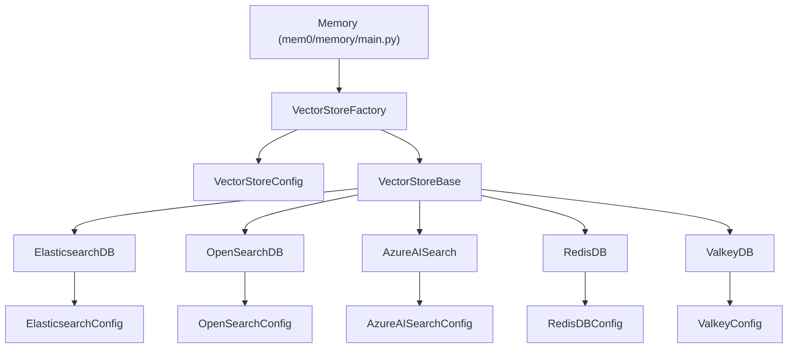
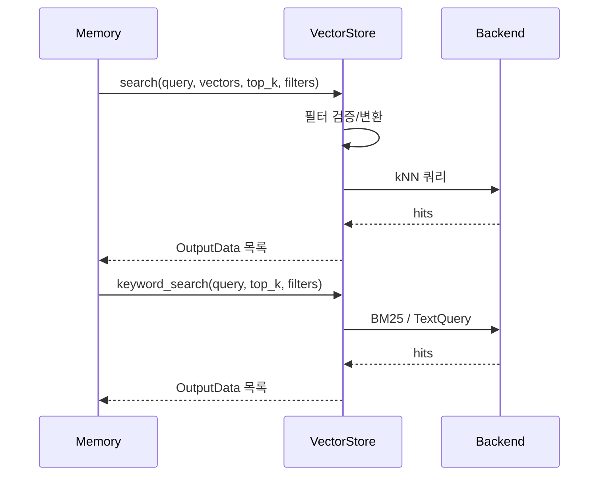

# search_engine_and_keyvalue_stores 모듈

## 개요

`search_engine_and_keyvalue_stores`는 Mem0 Python SDK의 벡터 스토어 계층(`py_vector_stores`) 중, **검색 엔진 계열**(Elasticsearch, OpenSearch, Azure AI Search)과 **키-값/인메모리 계열**(Redis, Valkey) 백엔드를 구현한 모듈이다. 모든 구현체는 `mem0.vector_stores.base.VectorStoreBase`를 상속하며, 설정은 `mem0/configs/vector_stores/*`의 Pydantic 모델이 검증한다.

| 구현 클래스 | 파일 | 설정 모델 | 백엔드 |
|---|---|---|---|
| `ElasticsearchDB` | `mem0/vector_stores/elasticsearch.py` | `ElasticsearchConfig` | Elasticsearch (`dense_vector` + kNN) |
| `OpenSearchDB` | `mem0/vector_stores/opensearch.py` | `OpenSearchConfig` | OpenSearch (`knn_vector`, nmslib HNSW) |
| `AzureAISearch` | `mem0/vector_stores/azure_ai_search.py` | `AzureAISearchConfig` | Azure AI Search (HNSW, 양자화, 하이브리드) |
| `RedisDB`, `MemoryResult` | `mem0/vector_stores/redis.py` | `RedisDBConfig` | Redis Stack + `redisvl` |
| `ValkeyDB` | `mem0/vector_stores/valkey.py` | `ValkeyConfig` | Valkey + valkey-search 모듈 |

> 같은 계열의 TypeScript 구현은 `ts_oss_vector_stores_search_engine_and_keyvalue_stores`(TypeScript 쪽 모듈 문서)를 참고한다. 형제 모듈: `vector_store_config_registry`, `local_and_adapter_vector_stores`, `dedicated_vector_database_stores`, `database_backed_vector_stores`, `cloud_platform_vector_stores`. 팩토리(`VectorStoreFactory`)는 `py_utils`에서 이 클래스들을 이름으로 로드한다.

## 아키텍처



### 공통 인터페이스

각 클래스는 동일한 메서드 집합을 제공한다: `create_col`, `insert`, `search`, `keyword_search`(Redis·Valkey 제외 일부), `get`, `update`, `delete`, `list`, `list_cols`, `col_info`, `delete_col`, `reset`.

- `search(query, vectors, top_k, filters)`: 벡터 유사도 검색. 결과는 `OutputData`(`id`, `score`, `payload`) 또는 `MemoryResult`.
- `keyword_search(query, top_k, filters)`: BM25/텍스트 검색. `Memory`의 하이브리드 검색에서 사용된다.
- `list(...)`는 `[[결과...]]` 형태의 **중첩 리스트**를 반환한다 (Redis·Valkey·ES·OpenSearch·Azure 공통).



## 구현체별 상세

### ElasticsearchDB
- 접속: `cloud_id` + `api_key`, 또는 `host[:port]` + basic auth. `verify_certs`, `ca_certs`, `headers` 지원.
- 인덱스 매핑: `vector`(`dense_vector`, cosine), `metadata.user_id/agent_id/run_id`(keyword). `auto_create_index`일 때만 생성.
- `search`: 기본은 `knn` 쿼리(`size=top_k`, `num_candidates=top_k*2`)에 `metadata.<key>` term 필터를 pre-filter로 적용. `custom_search_query` 콜러블로 대체 가능. (`size` 미지정 시 기본 10건으로 잘리는 문제를 방지.)
- `keyword_search`: `metadata.data`, `metadata.text_lemmatized`에 대한 `match` should 절.
- 필터 키는 `^[a-zA-Z_][a-zA-Z0-9_]*$`, 값은 `str/int/float/bool`만 허용(`_validate_filter`) → 쿼리 인젝션 방지.
- `insert`는 `elasticsearch.helpers.bulk` 사용. `reset`은 삭제 후 `create_index`.

### OpenSearchDB
- 문서 구조: `vector_field`(`knn_vector`, nmslib HNSW cosinesimil), `payload`, `id`. 문서 `_id`와 별개의 커스텀 `id` 필드를 두므로 `get/update/delete`는 먼저 `term` 검색으로 실제 `_id`를 찾는다.
- `create_col`은 인덱스 생성 후 최대 180회 재시도하며 준비 상태를 폴링(타임아웃 시 `TimeoutError`).
- `insert`: `None`/빈/차원 불일치 벡터를 사전 검증. `auto_refresh`가 켜진 경우에만 배치 후 한 번 `indices.refresh` (OpenSearch Serverless 호환성).
- `_build_filter_clauses`: 모든 필터 키를 `term` 절로 변환(문자열은 `.keyword`), 값 `"*"`는 `exists` 절, `None`/비스칼라 값은 무시.
- `search`는 내부적으로 `k = top_k*2`로 조회 후 `top_k`로 자른다. `keyword_search`는 실패 시 예외 대신 `None`을 반환(최선 노력 보조 기능).

### AzureAISearch
- 인증: `api_key`가 없거나 `"your-api-key"` 플레이스홀더면 `DefaultAzureCredential`, 아니면 `AzureKeyCredential`.
- 인덱스: `id`(key), `user_id/run_id/agent_id`(filterable), `vector`(`Edm.Single` 또는 `Edm.Half`), `payload`(JSON 문자열). HNSW + 선택적 `scalar`/`binary` 양자화(`compression_type`).
- `hybrid_search=True`면 `search_text`와 벡터 쿼리를 함께 실행(`search_fields=["payload"]`). `vector_filter_mode` 기본값은 `preFilter`.
- OData 필터 빌더 `_build_filter_expression`: 키 sanitize, 문자열의 `'` 이스케이프, 지원하지 않는 타입은 `ValueError`.
- `AzureAISearchConfig`는 추가 필드를 거부하고, 폐기된 `use_compression`에 대해 `compression_type`으로 이전하도록 안내하는 오류를 낸다.

### RedisDB / MemoryResult
- `redisvl`의 `SearchIndex`로 스키마 정의: tag(`memory_id`, `hash`, `agent_id`, `run_id`, `user_id`), text(`memory`, `metadata`), numeric(`created_at`, `updated_at`), vector(`embedding`, flat, cosine, float32). 키 접두사는 `mem0:<collection_name>`.
- 생성자가 `index.create(overwrite=True)`를 호출하므로 **기존 인덱스가 덮어써질 수 있다**는 점에 유의.
- 벡터는 `numpy float32` 바이트로 저장, 타임스탬프는 epoch 정수 ↔ ISO 문자열로 변환. 점수는 `max(0, 1 - vector_distance)`.
- `keyword_search`는 `TextQuery`(BM25) 사용. `list`는 `created_at` 내림차순 정렬.
- `MemoryResult`는 `id`, `payload`, `score`를 담는 단순 결과 객체.
- `RedisDBConfig`: `redis_url`(필수), `collection_name="mem0"`, `embedding_model_dims=1536`, `extra="forbid"`.

### ValkeyDB
- `FT.CREATE`를 직접 조립(`_build_index_schema`). 인덱스 타입 `hnsw`(기본; `hnsw_m`, `hnsw_ef_construction`, `hnsw_ef_runtime`) 또는 `flat`. `cluster_mode`로 `ValkeyCluster` 사용.
- 시작 시 `FT._LIST`로 search 모듈 존재를 확인하고, 없으면 안내 메시지와 함께 `ValueError`.
- 데이터는 Hash(`hset`)로 저장. 태그 필터 값은 `_escape_tag_value`로 특수문자를 이스케이프해 와일드카드/OR 연산자 주입(테넌트 격리 우회)을 막는다.
- `search`: `KNN` 쿼리(`ef_runtime` 쿼리별 지정 가능). `list`는 영벡터로 큰 K(기본 1000) 검색하는 방식으로 구현되며 오류 시 `[[]]` 반환.
- `get`은 없는 ID에 대해 `KeyError`를 발생시킨다(Redis는 `None`).
- 별도 `keyword_search` 메서드는 제공하지 않으며, `memory` 필드는 TEXT로 인덱싱된다.

## 구현체 간 차이 요약

| 항목 | Elasticsearch | OpenSearch | Azure AI Search | Redis | Valkey |
|---|---|---|---|---|---|
| 벡터 필드 | `vector` | `vector_field` | `vector` | `embedding` | `embedding` |
| 페이로드 저장 | `metadata` 객체 | `payload` 객체 | `payload` JSON 문자열 | 개별 필드 + `metadata` JSON | 개별 필드 + `metadata` TAG(JSON) |
| 키워드 검색 | BM25 match | BM25 match | `search_text` | `TextQuery` | 없음 |
| `get` 미존재 | `None` | `None` | `None` | `None` | `KeyError` |
| 필터 안전장치 | 키/값 검증 | 키/값 검증 | 키 sanitize + 이스케이프 | `Tag` 필터 | 태그 값 이스케이프 |

## 사용 예

```python
from mem0 import Memory

config = {
    "vector_store": {
        "provider": "redis",
        "config": {"redis_url": "redis://localhost:6379", "collection_name": "mem0", "embedding_model_dims": 1536},
    }
}
m = Memory.from_config(config)
```

선택 의존성은 각 모듈 임포트 시점에 확인되며(`elasticsearch`, `opensearch-py`, `azure-search-documents`, `redis`/`redisvl`, `valkey`), 코어 `dependencies`에 추가하지 않고 optional 그룹으로 설치해야 한다(루트 `pyproject.toml`, `CLAUDE.md` 규칙).
