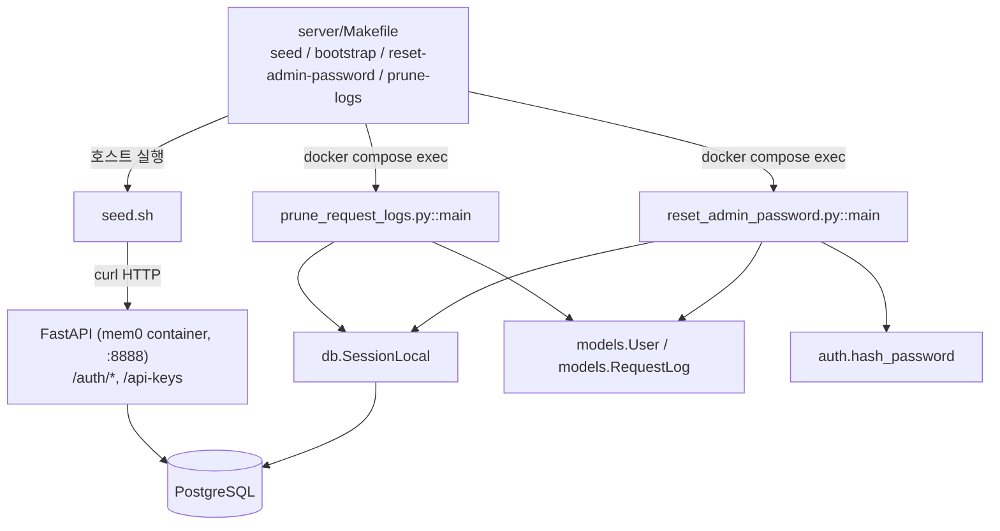
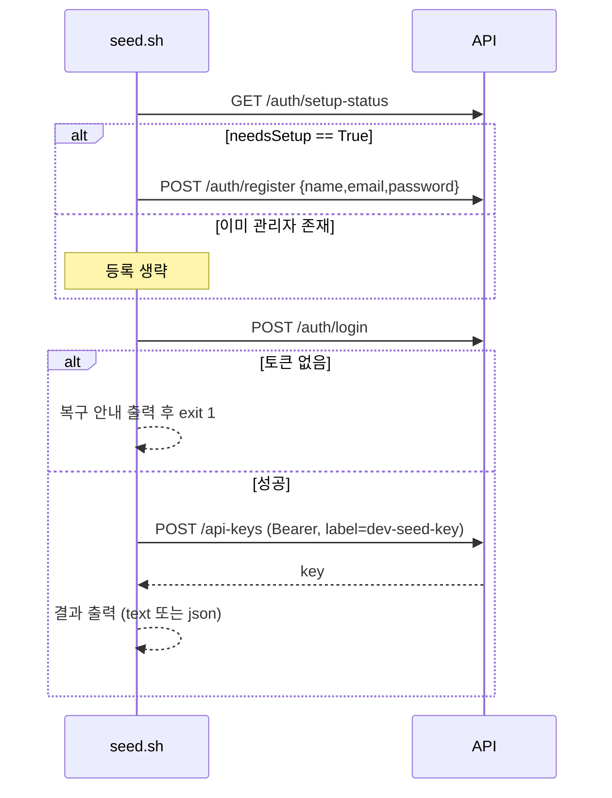
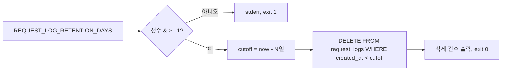

# server_admin_scripts 모듈

`server/scripts/` 아래의 운영(Admin) 스크립트 3개를 다룬다. 셀프 호스팅 Mem0 서버의 초기 시드, 관리자 비밀번호 복구, 요청 로그 정리를 담당한다.

| 파일 | 역할 | 실행 위치 |
|------|------|-----------|
| `server/scripts/seed.sh` | 관리자 계정 생성/로그인 후 API 키 발급 | 호스트 (HTTP로 API 호출) |
| `server/scripts/reset_admin_password.py` | 이메일 기준 비밀번호 재설정 | `mem0` 컨테이너 내부 (DB 직접 접근) |
| `server/scripts/prune_request_logs.py` | 보존 기간이 지난 `request_logs` 삭제 | `mem0` 컨테이너 내부 또는 cron/systemd timer |

## 아키텍처



핵심 구분: `seed.sh`는 공개 HTTP API만 사용하므로 컨테이너 밖에서 실행할 수 있다. 반면 Python 스크립트 2개는 `from db import SessionLocal` 같은 서버 내부 모듈을 직접 import하므로 컨테이너 안에서 `PYTHONPATH=/app`로 실행해야 한다(`server/Makefile`의 해당 타깃이 이를 설정함).

## 컴포넌트 상세

### `seed.sh`

환경변수(기본값): `API_URL=http://localhost:8888`, `DASHBOARD_URL=http://localhost:3000`, `EMAIL=admin@mem0.dev`, `PASSWORD`(미지정 시 `secrets.token_urlsafe(16)`로 생성), `NAME=Admin`, `OUTPUT=text|json`.



동작 포인트:
- JSON 페이로드는 환경변수를 `python3 json.dumps`로 직렬화해 쉘 인젝션/이스케이프 문제를 피한다.
- 로그인 실패(관리자는 있으나 비밀번호 불일치) 시 `make clean && make bootstrap`(데이터 삭제) 또는 `make reset-admin-password`(데이터 유지)를 안내한다.
- `OUTPUT=json`이면 `dashboard_url`, `api_url`, `email`, `password`, `api_key`를 한 줄 JSON으로 출력하고 종료한다(자동화용).
- `.env`에 `OPENAI_API_KEY`/`ANTHROPIC_API_KEY`/`GOOGLE_API_KEY`가 없으면 경고하며, 이 경우 메모리 API가 `provider_auth_failed`를 반환한다고 알린다.
- 주의: 생성된 비밀번호와 API 키가 stdout에 평문 출력되므로 로그 수집 환경에서 `make seed` 출력 보관에 유의한다.

### `reset_admin_password.py::main`

- 입력: 환경변수 `EMAIL`, `PASSWORD`(최소 `MIN_PASSWORD_LENGTH = 8`자).
- 처리: `select(User).where(User.email == email)` → `user.password_hash = hash_password(password)` → commit.
- 종료 코드: `0` 성공, `1` 사용자 없음, `2` 입력 누락/비밀번호 짧음.
- `auth.hash_password`를 재사용하므로 로그인 경로와 동일한 해시 방식이 보장된다. 이메일로 사용자를 찾기에 관리자 외 계정에도 동작한다.

### `prune_request_logs.py::main`

- 입력: `REQUEST_LOG_RETENTION_DAYS`(기본 30, 정수 ≥ 1). 비어 있으면 30으로 처리한다.
- 처리: `cutoff = now(UTC) - retention_days` 이전의 `RequestLog.created_at` 행을 `delete`로 일괄 삭제하고 건수를 출력한다.
- 종료 코드: `0` 성공, `1` 잘못된 값(정수 아님 또는 < 1).
- `request_logs`는 `006_request_logs_brin.py` 마이그레이션의 BRIN 인덱스로 시간 범위 삭제에 유리하다(자세한 스키마는 [server_database](server_database.md) 참고).



## 사용법

`server/` 디렉터리에서 실행한다.

```bash
make bootstrap                                        # up + 대기 + seed
make seed EMAIL=a@b.com PASSWORD=... OUTPUT=json
make reset-admin-password EMAIL=a@b.com PASSWORD=newpass123
make prune-logs REQUEST_LOG_RETENTION_DAYS=14
```

`make prune-logs`에서 `REQUEST_LOG_RETENTION_DAYS`를 지정하지 않으면 빈 문자열이 전달되어 스크립트가 기본값 30으로 처리한다. 주기 실행은 호스트 cron 등에서 `docker compose exec -T mem0 python scripts/prune_request_logs.py`를 호출하면 된다(`PYTHONPATH=/app` 필요).

## 다른 모듈과의 관계

- [server_api_core](server_api_core.md): `/memories` 요청 로깅(`_persist_request_log`)이 `request_logs`를 채운다.
- [server_auth_and_routers](server_auth_and_routers.md): `seed.sh`가 호출하는 `/auth/setup-status`, `/auth/register`, `/auth/login`, `/api-keys`와 `hash_password`를 제공한다.
- [server_database](server_database.md): `db.SessionLocal`, `models.User`, `models.RequestLog` 정의 및 Alembic 마이그레이션.
- [server_deployment](server_deployment.md): `server/Makefile`, `docker-compose.yaml`에서 이 스크립트를 호출하는 타깃을 정의한다.
