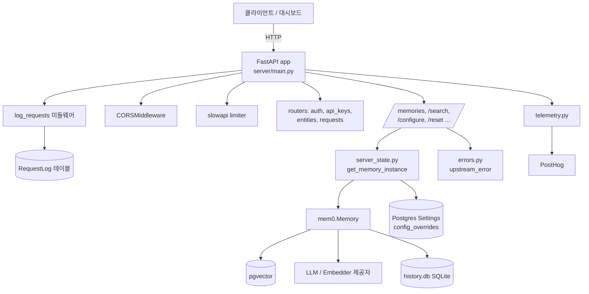
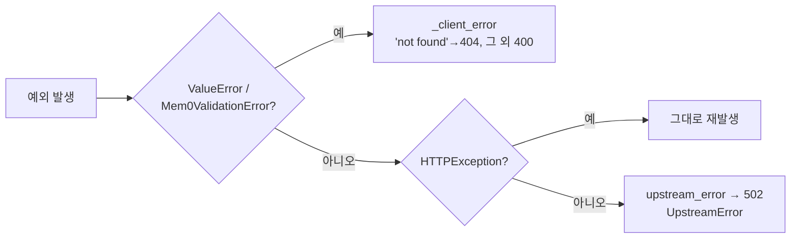
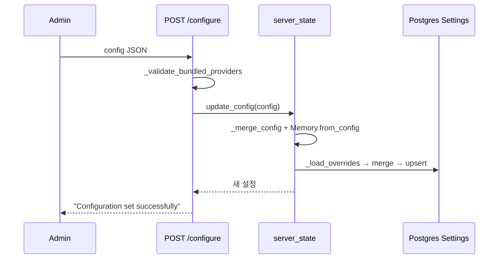

# server_api_core 모듈

`server_api_core`는 자가 호스팅(Self-Hosted) Mem0 REST 서버의 **FastAPI 진입점과 코어 런타임**입니다. Python SDK의 `mem0.Memory`를 HTTP API로 감싸고, 요청 로깅·오류 분류·설정 영속화·익명 텔레메트리를 담당합니다.

| 파일 | 역할 |
|------|------|
| `server/main.py` | FastAPI 앱 생성, 미들웨어, 메모리/검색/설정 엔드포인트, Pydantic 요청 모델 |
| `server/server_state.py` | 프로세스 전역 `Memory` 인스턴스와 설정(config) 상태 관리 |
| `server/errors.py` | 업스트림 오류 분류(`UpstreamError`), 요청 ID 로깅 |
| `server/telemetry.py` | 설치당 최대 2건의 익명 이벤트(PostHog), 대시보드 안내 로그 |

관련 모듈:
- 인증/라우터: [server_auth_and_routers](server_auth_and_routers.md)
- DB 및 마이그레이션: [server_database](server_database.md)
- 배포: [server_deployment](server_deployment.md)
- 관리 스크립트: [server_admin_scripts](server_admin_scripts.md)
- 대시보드: [Self-Hosted_Admin_Dashboard](Self-Hosted_Admin_Dashboard.md)
- SDK 코어(`Memory`): [py_memory_core](py_memory_core.md)

---

## 1. 아키텍처

### 시작 시퀀스 (`server/main.py` 모듈 import 시점)

1. `load_dotenv()` → `install_request_id_logging()`으로 로그 레코드에 `request_id` 주입.
2. 인증 사전 검사:
   - `AUTH_DISABLED`가 아니고 `JWT_SECRET`이 없으면 `RuntimeError`로 기동 실패.
   - `AUTH_DISABLED`이면 경고 로그.
   - `ADMIN_API_KEY`가 16자(`MIN_KEY_LENGTH`) 미만이면 경고, 없으면 `_warn_if_unconfigured()`가 관리자 사용자가 0명일 때 설정 안내를 로그로 출력.
3. `telemetry.log_status()` 호출.
4. `DEFAULT_CONFIG` 구성(pgvector + OpenAI LLM/embedder, `history_db_path`), 환경 변수로 덮어쓰기 가능.
5. `set_session_factory(SessionLocal)` → `initialize_state(DEFAULT_CONFIG)`로 `Memory.from_config` 생성.
6. FastAPI 앱 생성, `RateLimitExceeded`/`UpstreamError` 핸들러, CORS(`DASHBOARD_URL`만 허용), 4개 라우터 등록.

---

## 2. 컴포넌트 상세

### 2.1 `server/main.py`

#### 요청 모델 (Pydantic)

| 모델 | 용도 |
|------|------|
| `Message` | `role`, `content` |
| `MemoryCreate` | `messages` + `user_id`/`agent_id`/`run_id`, `metadata`, `expiration_date`, `infer`, `memory_type`, `prompt` |
| `MemoryUpdate` | `text`, `metadata`, `expiration_date` (부분 업데이트) |
| `SearchRequest` | `query`, `filters`, `top_k`, `threshold`, `explain`, `show_expired` (최상위 `user_id`/`agent_id`/`run_id`는 deprecated) |
| `GenerateInstructionsRequest` | `use_case` |

#### 엔드포인트

| 메서드/경로 | 함수 | 인가 | 설명 |
|-------------|------|------|------|
| `GET /configure` | `get_config` | `verify_auth` | 현재 설정 반환(민감 키는 `_redact_config`로 `[redacted]` 처리) |
| `GET /configure/providers` | `list_bundled_providers` | `verify_auth` | 번들된 LLM(`openai`, `anthropic`, `gemini`)/embedder(`openai`, `gemini`) 목록 |
| `POST /configure` | `set_config` | `require_admin` | 번들 제공자 검증 후 `update_config` |
| `POST /generate-instructions` | `generate_instructions` | `verify_auth` | LLM으로 사용 사례별 커스텀 지침과 테스트 메시지 생성 |
| `POST /memories` | `add_memory` | `verify_auth` | 식별자 하나 이상 필수, `Memory.add` 호출 |
| `GET /memories` | `get_all_memories` | `verify_auth` | 식별자 없으면 관리자만 전체(raw) 목록, 있으면 `Memory.get_all` |
| `GET /memories/{memory_id}` | `get_memory` | `verify_auth` | 단건 조회 |
| `POST /search` | `search_memories` | `verify_auth` | `Memory.search` |
| `PUT /memories/{memory_id}` | `update_memory` | `verify_auth` | `model_fields_set`에 포함된 필드만 전달 |
| `GET /memories/{memory_id}/history` | `memory_history` | `verify_auth` | 변경 이력 |
| `DELETE /memories/{memory_id}` | `delete_memory` | `verify_auth` | 단건 삭제 |
| `DELETE /memories` | `delete_all_memories` | `require_admin` | 식별자 필수 |
| `POST /reset` | `reset_memory` | `require_admin` | 전체 초기화 |
| `GET /` | `home` | 없음 | `/docs`로 리다이렉트 |

#### 요청 로깅 미들웨어 `log_requests`

- 요청마다 `new_request_id()`를 생성해 `request_id_var`(ContextVar)에 설정하고 응답 헤더 `X-Request-ID`로 반환.
- 응답 후 `run_in_executor`로 `_persist_request_log`를 비동기 실행하여 `RequestLog`(메서드, 경로, 상태 코드, 지연 ms, `auth_type`)를 저장. 저장 실패는 롤백 후 로그만 남기며 요청에는 영향이 없습니다.
- `OPTIONS`, `/api/health`, `/docs`, `/redoc`, `/openapi.json`, `/requests*` 경로는 기록 제외(`_should_log_request`).

#### 오류 매핑 규칙

`search_memories`는 `ValueError`를 400으로, `get_all_memories`는 `HTTPException`을 그대로 전달하는 등 엔드포인트별로 약간 다릅니다.

### 2.2 `server/server_state.py`

모듈 전역 상태를 `threading.RLock`으로 보호합니다.

| 함수 | 동작 |
|------|------|
| `set_session_factory(factory)` | DB 세션 팩토리 등록 |
| `initialize_state(default_config)` | 기본 설정 + DB의 `Settings["config_overrides"]`를 병합해 `Memory.from_config` 생성 |
| `update_config(updates)` | 현재 설정에 deep merge → 새 `Memory` 인스턴스 생성 → 오버라이드를 Postgres `Settings`에 upsert |
| `get_current_config()` | 설정 deepcopy 반환 |
| `get_memory_instance()` | 초기화 전이면 `RuntimeError` |

참고: 오버라이드 저장/로드 실패는 예외를 삼키고(저장 시 경고 로그) 메모리 내 설정만 갱신됩니다. 재시작 후 설정이 사라질 수 있습니다. 또한 `Memory`를 재생성하므로 설정 변경 중 진행 중인 요청은 이전 인스턴스를 사용합니다.

### 2.3 `server/errors.py`

- `request_id_var`: 요청 ID ContextVar(기본 `-`).
- `install_request_id_logging()`: `LogRecordFactory`를 교체해 모든 로그에 `request_id` 필드 추가.
- `UpstreamError(HTTPException)`: 상태 502, `code`와 `request_id` 포함.
- `upstream_error()`: 현재 예외를 `__cause__`/`__context__` 체인까지 탐색해 분류.

| 코드 | 판별 기준 |
|------|-----------|
| `provider_auth_failed` | `AuthenticationError`/`PermissionDeniedError` 또는 401/403 |
| `provider_rate_limited` | `RateLimitError` 또는 429 |
| `provider_timeout` | `APITimeoutError`, `TimeoutError` |
| `provider_unavailable` | `APIConnectionError`, `ConnectionError`, 5xx |
| `provider_bad_request` | `BadRequestError`, 400/422 |
| `datastore_unavailable` | `OperationalError`, `DBAPIError`, `DisconnectionError` |
| `vector_store_unavailable` | `UnexpectedResponse`, `ResponseHandlingException`, `qdrant_client` 모듈 |
| `unknown` | 그 외 |

`upstream_error_handler`는 `{"detail", "code", "request_id"}` JSON과 `X-Request-ID` 헤더를 반환합니다.

### 2.4 `server/telemetry.py`

- 기본 활성화, `MEM0_TELEMETRY=false`(`0/no/off`)로 비활성화.
- 설치당 최대 두 이벤트: `admin_registered`, `onboarding_completed`. 상태는 `MEM0_TELEMETRY_STATE_PATH`(기본 `/app/history/telemetry.json`)에 저장되며 `_capture_once`가 중복 전송을 막습니다.
- 속성: 이메일 도메인, 서버 버전, 임의 설치 UUID(`onboarding_completed`는 use_case 문자열 포함).
- `log_dashboard_nudge_once`: 첫 메모리 저장 시 대시보드 URL을 로컬 로그로만 안내(외부 전송 없음, 텔레메트리 설정과 무관).
- `capture_*` 함수는 [server_auth_and_routers](server_auth_and_routers.md)의 인증 라우터에서 호출됩니다.

---

## 3. 환경 변수

| 변수 | 기본값 | 용도 |
|------|--------|------|
| `JWT_SECRET` | 없음 | `AUTH_DISABLED=false`일 때 필수 |
| `AUTH_DISABLED` | `false` | 로컬 개발용 인증 해제 |
| `ADMIN_API_KEY` | 없음 | 레거시 관리자 키 |
| `POSTGRES_HOST/PORT/DB/USER/PASSWORD/COLLECTION_NAME` | `postgres`/`5432`/`postgres`/`postgres`/`postgres`/`memories` | pgvector 설정 |
| `OPENAI_API_KEY` | 없음 | 기본 LLM/embedder 키 |
| `MEM0_DEFAULT_LLM_MODEL` | `gpt-5-mini` | 기본 LLM |
| `MEM0_DEFAULT_EMBEDDER_MODEL` | `text-embedding-3-small` | 기본 embedder |
| `HISTORY_DB_PATH` | `/app/history/history.db` | SQLite 이력 |
| `DASHBOARD_URL` | `http://localhost:3000` | CORS 허용 오리진 |
| `MEM0_TELEMETRY` | `true` | 텔레메트리 on/off |

개발용 `server/docker-compose.yaml`은 `mem0`(호스트 8888→8000), `postgres`(pgvector:pg17, 8432), `mem0-dashboard`(3000) 서비스를 정의하며 시작 시 `alembic upgrade head` 후 `uvicorn main:app`을 실행합니다. 자세한 내용은 [server_deployment](server_deployment.md), [server_database](server_database.md)를 참조하세요.

---

## 4. 유지보수 시 주의점

- 번들되지 않은 LLM/embedder 제공자를 쓰려면 이미지에 패키지를 설치하고 `BUNDLED_LLM_PROVIDERS` / `BUNDLED_EMBEDDER_PROVIDERS`를 확장해야 합니다(`_validate_bundled_providers`가 400 반환).
- 민감 키 목록(`SENSITIVE_CONFIG_KEYS`)에 없는 시크릿은 `GET /configure`에서 노출됩니다. 새 설정 키 추가 시 확인하세요.
- `GET /memories`의 전체 목록은 `vector_store.list` 기반 raw 조회이며 만료 필터가 적용되지 않습니다(최대 1000건).
- `/search`의 최상위 `user_id`/`agent_id`/`run_id`는 deprecated이며 `filters`로 병합됩니다.
- 요청 로그는 매 요청마다 쌓입니다. 정리는 [server_admin_scripts](server_admin_scripts.md)의 `prune_request_logs.py`를 사용하세요.
