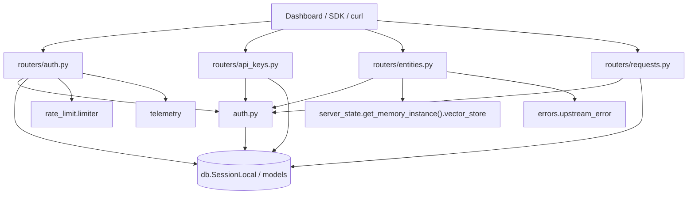
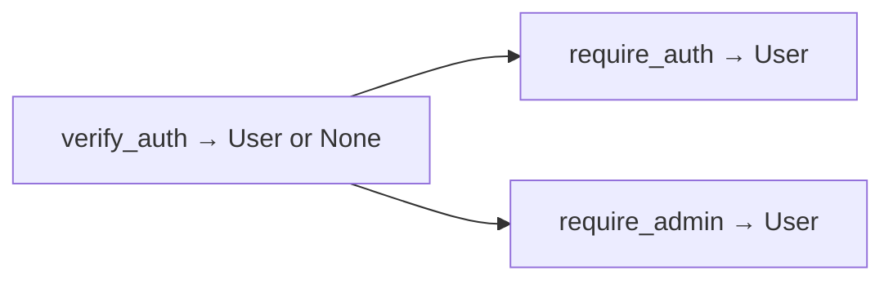
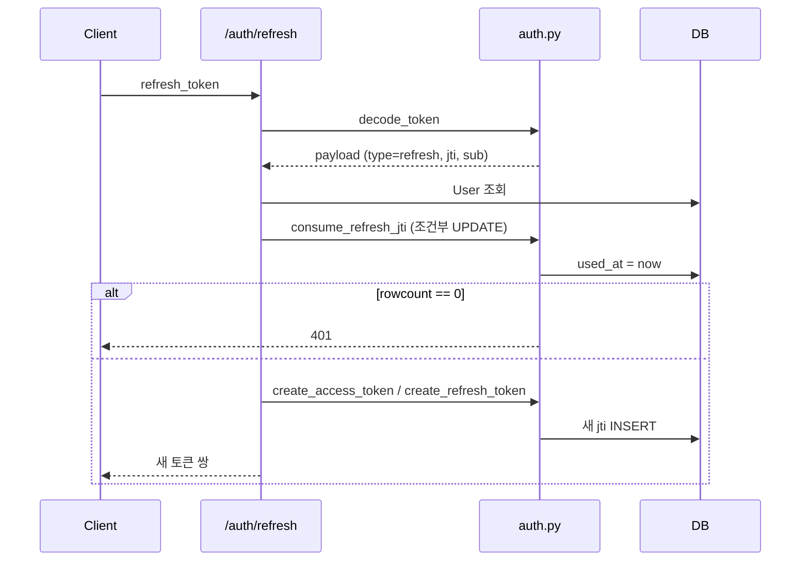

# server_auth_and_routers 모듈

셀프호스팅 Mem0 FastAPI 서버(`server/`)의 **인증/인가 의존성**(`server/auth.py`)과 **관리용 라우터**(`server/routers/*.py`)를 다룬다. JWT(액세스/리프레시), `X-API-Key`, 레거시 `ADMIN_API_KEY`, `AUTH_DISABLED` 모드를 하나의 FastAPI 의존성 체인으로 통합하고, 그 위에 계정(`/auth`), API 키(`/api-keys`), 엔티티(`/entities`), 요청 로그(`/requests`) 엔드포인트를 제공한다.

관련 모듈:
- 메모리 API, 서버 상태, 에러 핸들러: [server_api_core](server_api_core.md)
- `User`, `APIKey`, `RefreshTokenJti`, `RequestLog` 모델, `get_db`, Alembic 마이그레이션: [server_database](server_database.md)
- 관리 스크립트(`reset_admin_password.py`, `prune_request_logs.py`): [server_admin_scripts](server_admin_scripts.md)
- 환경 변수/컨테이너 배포: [server_deployment](server_deployment.md)
- 로그인/설정 UI 소비자: [Self-Hosted_Admin_Dashboard](Self-Hosted_Admin_Dashboard.md)

---

## 1. 구성 요소

| 파일 | 핵심 컴포넌트 | 역할 |
|------|---------------|------|
| `server/auth.py` | `verify_auth`, `require_auth`, `require_admin` | 인증 의존성, 토큰/키/비밀번호 유틸 |
| `server/routers/auth.py` | `register`, `login`, `refresh`, `me`, `update_me`, `change_password`, `setup_status`, `onboarding_complete` | 계정/세션 API (`/auth`) |
| `server/routers/api_keys.py` | `list_keys`, `create_key`, `revoke_key` | 사용자별 API 키 관리 (`/api-keys`) |
| `server/routers/entities.py` | `list_entities`, `delete_entity` | 벡터 스토어 payload 기반 엔티티 집계/삭제 (`/entities`) |
| `server/routers/requests.py` | `list_requests` | API 키 호출 로그 조회 (`/requests`) |

`routers/auth.py`는 `rate_limit.limiter`, `schemas.MessageResponse`, `telemetry.capture_*`에도 의존한다(이 모듈 외부).

## 2. 아키텍처

## 3. 인증 모델 (`server/auth.py`)

### 설정(환경 변수)
- `JWT_SECRET`: 필수. 비어 있으면 토큰 발급/검증 시 `500 JWT_SECRET is not configured.`
- `ADMIN_API_KEY`: 레거시 관리자 키(선택).
- `AUTH_DISABLED`: `1/true/yes/on`이면 인증 없이 통과.
- 상수: 알고리즘 `HS256`, 액세스 토큰 30분, 리프레시 토큰 30일, bcrypt(`passlib`).

### 의존성 체인

`verify_auth` 판정 순서와 `request.state.auth_type` 값:

| 순서 | 조건 | auth_type | 반환 |
|------|------|-----------|------|
| 1 | `Authorization: Bearer` 존재 | `bearer` | access JWT 검증 후 `User` (type이 `access`가 아니면 401) |
| 2 | `X-API-Key` == `ADMIN_API_KEY` (`secrets.compare_digest`) | `admin_api_key` | `None` |
| 3 | 그 외 `X-API-Key` | `api_key` | 접두사 12자로 후보 조회 → bcrypt 검증 → `last_used_at` 갱신 → 소유자 `User` |
| 4 | `AUTH_DISABLED` | `disabled` | `None` |
| 5 | 아무것도 없음 | – | 401 + `WWW-Authenticate: Bearer` |

주의: Bearer가 있으면 X-API-Key는 무시된다. DB 세션은 DB를 조회하는 분기에서만 짧게 열어(`with SessionLocal()`) 긴 요청 동안 커넥션을 점유하지 않는다. 그 결과 라우터가 받는 `user`는 해당 요청의 `db` 세션에서 **분리(detached)** 상태이며, 라우터는 `db.get(User, user.id)`로 다시 로드해 수정한다.

`require_auth`: `None`이면서 `admin_api_key`/`disabled`인 경우 가장 먼저 생성된 `User`를 대리 사용자로 반환하고, 없으면 401.

`require_admin`: `role == "admin"` 강제(아니면 403). `admin_api_key`/`disabled` 호출자는 가장 오래된 사용자가 admin이면 그 사용자, 사용자가 하나도 없으면 `_BOOTSTRAP_ADMIN`(임시 admin, id=0)으로 처리해 신규 배포 부트스트랩을 허용한다. 가장 오래된 사용자가 admin이 아니면 403.

### 보안 설계 포인트
- **타이밍 공격 완화**: 존재하지 않는 이메일 로그인 시 `dummy_verify_password()`로 bcrypt 비용을 동일하게 소모.
- **API 키 형식**: `m0sk_<token_urlsafe(32)>`, 앞 12자를 `key_prefix`로 저장하고 전체는 bcrypt 해시만 저장. 평문은 생성 응답에서 한 번만 노출.
- **리프레시 토큰 1회용**: 발급 시 `RefreshTokenJti` 행 저장, 사용 시 `consume_refresh_jti`가 `used_at IS NULL AND expires_at > now` 조건의 원자적 `UPDATE`를 수행하여 동시 재사용 경쟁을 `rowcount == 0` → 401로 차단.

## 4. 라우터

### 4.1 `/auth` (`routers/auth.py`)

| 메서드/경로 | 함수 | 인증 | 비고 |
|-------------|------|------|------|
| GET `/auth/setup-status` | `setup_status` | 없음 | 사용자 수 0이면 `needsSetup: true` |
| POST `/auth/register` | `register` | 없음 | 5/분. **최초 admin 1명만** 생성, 이후 403 |
| POST `/auth/login` | `login` | 없음 | 10/분. 성공 시 `last_login_at` 갱신 |
| POST `/auth/refresh` | `refresh` | refresh 토큰 본문 | 20/분. 토큰 회전 |
| GET `/auth/me` | `me` | `require_auth` | |
| PATCH `/auth/me` | `update_me` | `require_auth` | 이메일 중복 시 409 |
| POST `/auth/change-password` | `change_password` | `require_auth` | 현재 비밀번호 검증 후 변경 |
| POST `/auth/onboarding-complete` | `onboarding_complete` | `require_auth` | 텔레메트리 이벤트 1회 발송 |

비밀번호 최소 길이는 8자(`MIN_PASSWORD_LENGTH`). `register`는 사용자 수 확인 후에도 `IntegrityError`(DB의 admin 유일 제약, 마이그레이션 `004_unique_admin_role`)를 잡아 경쟁 상태를 403으로 변환한다. 요청/응답 모델: `RegisterRequest`, `LoginRequest`, `RefreshRequest`, `UpdateProfileRequest`, `ChangePasswordRequest`, `OnboardingCompleteRequest`, `TokenResponse`, `UserResponse`, `SetupStatusResponse`.

### 4.2 `/api-keys` (`routers/api_keys.py`)
모두 `require_auth`. 키는 **생성자 본인 소유**만 접근 가능.
- `list_keys`: 폐기되지 않은 키를 최신순으로 반환(`KeyListItem`, 해시/평문 제외).
- `create_key`: `generate_api_key()` 후 201 + `CreateKeyResponse`(`key` 전체값 포함).
- `revoke_key`: UUID가 아니거나 타인 소유면 404, 이미 폐기면 400, 아니면 `revoked_at` 설정(소프트 삭제).

### 4.3 `/entities` (`routers/entities.py`)
- `list_entities` (`verify_auth`): 벡터 스토어에서 최대 `SCAN_LIMIT=10_000`개 payload를 스캔해 `user_id`/`agent_id`/`run_id`별로 `total_memories`, 최초 `created_at`, 최신 `updated_at`을 집계한다. 결과는 (type, id) 순 정렬.
- `delete_entity` (`require_admin`): `get_memory_instance().delete_all(<field>=entity_id)` 호출, 실패 시 `errors.upstream_error()`.

참고: `list_entities`는 `verify_auth`만 사용하므로 로그인된 모든 역할(및 admin 키/비활성 모드)이 조회 가능하다. 집계는 10,000개 상한이라 그 이상의 데이터에서는 부분 결과다.

### 4.4 `/requests` (`routers/requests.py`)
`require_admin`. `RequestLog` 중 `auth_type`이 `api_key`/`admin_api_key`인 행만 최신순으로 `limit`(1–200, 기본 50)개 반환. 로그 기록 자체는 [server_api_core](server_api_core.md)의 `log_requests` 미들웨어가 담당하고, 정리는 [server_admin_scripts](server_admin_scripts.md)의 `prune_request_logs.py`가 담당한다.

## 5. 권한 매트릭스

| 엔드포인트 | 비로그인 | 일반 사용자 | admin | ADMIN_API_KEY / AUTH_DISABLED |
|-----------|---------|------------|-------|-------------------------------|
| `/auth/setup-status`, `/register`*, `/login`, `/refresh` | O | O | O | O |
| `/auth/me`, `/change-password`, `/api-keys` | X | O | O | 가장 오래된 사용자로 대리 |
| `GET /entities` | X | O | O | O |
| `DELETE /entities/...`, `GET /requests` | X | X | O | O (사용자 없으면 부트스트랩 admin) |

\* `register`는 사용자가 없을 때만 성공.

## 6. 유지보수 시 유의점
- 새 보호 엔드포인트는 `Depends(require_auth)` 또는 `Depends(require_admin)`를 사용한다. `verify_auth`는 `None`을 반환할 수 있으므로 사용자 객체가 필요하면 쓰지 않는다.
- 의존성이 반환한 `User`를 수정하려면 반드시 요청 `db`에서 재조회한다.
- `ADMIN_API_KEY`/`AUTH_DISABLED` 경로는 "가장 오래된 사용자"를 행위자로 삼으므로 감사 추적이 부정확할 수 있다. 운영 환경에서는 `AUTH_DISABLED`를 사용하지 않는다.
- 설정 값(`JWT_SECRET` 등) 주입은 `server/docker-compose.yaml`과 [server_deployment](server_deployment.md)를 참고.
