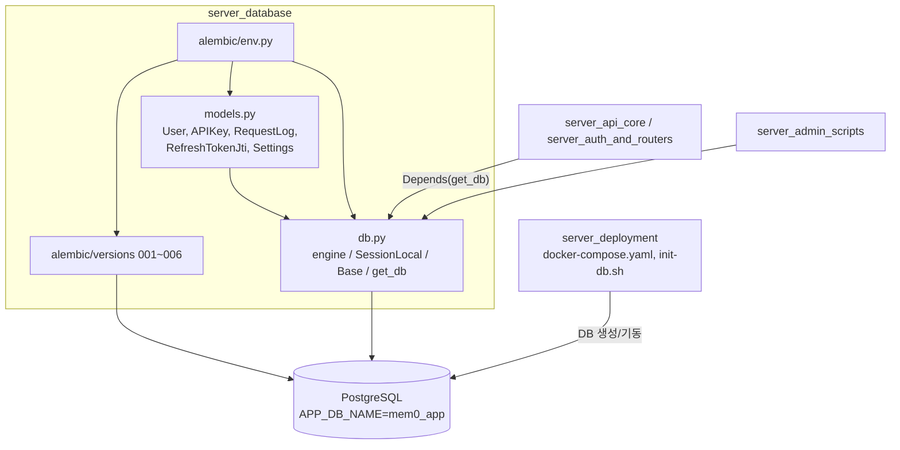
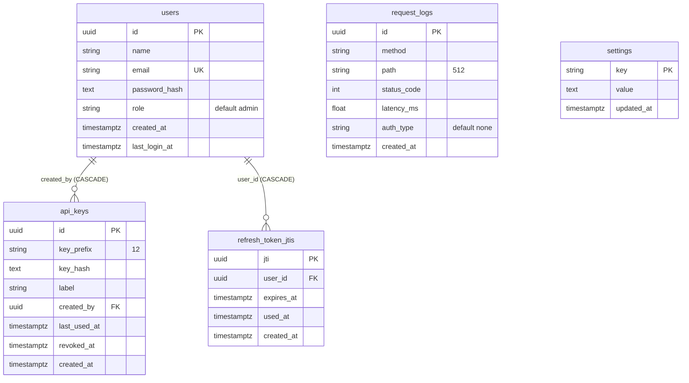
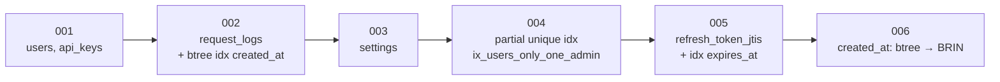
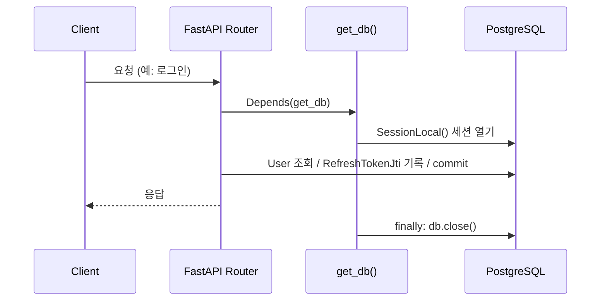

# server_database 모듈

`server_database`는 자체 호스팅 Mem0 서버(`server/`)의 **애플리케이션 메타데이터 영속 계층**입니다. SQLAlchemy 엔진/세션 팩토리(`server/db.py`), ORM 모델(`server/models.py`), Alembic 마이그레이션(`server/alembic*`)으로 구성되며, PostgreSQL에 사용자, API 키, 요청 로그, 설정, 리프레시 토큰 JTI를 저장합니다.

> 주의: 메모리 벡터/그래프 데이터는 이 모듈이 아니라 pgvector/Neo4j 등 [Python_Pluggable_Provider_Layer](Python_Pluggable_Provider_Layer.md)가 관리합니다. 이 모듈은 서버 운영용(인증·감사·설정) 테이블만 다룹니다.

## 1. 구성 요소

| 파일 | 역할 |
|------|------|
| `server/db.py` | `_build_database_url()`, `engine`, `SessionLocal`, `Base`, `get_db()` |
| `server/models.py` | ORM 모델 `User`, `APIKey`, `RequestLog`, `RefreshTokenJti`, `Settings` 및 헬퍼 `_new_uuid`, `_utcnow` |
| `server/alembic.ini` | Alembic 설정 (`script_location = alembic`) |
| `server/alembic/env.py` | `run_migrations_offline`, `run_migrations_online` |
| `server/alembic/versions/001`~`006` | 스키마 리비전 (각각 `upgrade`/`downgrade`) |

## 2. 아키텍처

관련 모듈: [server_api_core](server_api_core.md), [server_auth_and_routers](server_auth_and_routers.md), [server_admin_scripts](server_admin_scripts.md), [server_deployment](server_deployment.md).

## 3. 연결 설정 (`server/db.py`)

`_build_database_url()`은 환경 변수로 URL을 조립합니다.

| 환경 변수 | 기본값 |
|-----------|--------|
| `POSTGRES_HOST` | `postgres` |
| `POSTGRES_PORT` | `5432` |
| `POSTGRES_USER` | `postgres` |
| `POSTGRES_PASSWORD` | `postgres` |
| `APP_DB_NAME` | `mem0_app` |

결과 형식: `postgresql+psycopg://{user}:{password}@{host}:{port}/{db}`

- `engine = create_engine(url, pool_pre_ping=True)` — 끊어진 커넥션을 사용 전에 감지합니다.
- `SessionLocal = sessionmaker(bind=engine, autoflush=False, expire_on_commit=False)` — 자동 flush를 끄고 커밋 후에도 객체 속성을 유지합니다.
- `Base(DeclarativeBase)` — 모든 모델의 공통 베이스.
- `get_db()` — FastAPI 의존성. 요청마다 세션을 열고 `finally`에서 `close()`합니다. **커밋은 호출 측 책임**입니다.

기본 비밀번호(`postgres`)는 개발용이므로 운영 환경에서는 반드시 환경 변수로 재정의해야 합니다.

## 4. 데이터 모델 (`server/models.py`)

공통: 기본키는 `uuid4`(`_new_uuid`), 시각은 timezone-aware UTC(`_utcnow`).

| 테이블 | 용도 |
|--------|------|
| `users` | 대시보드 로그인 사용자. 비밀번호는 `password_hash`로만 저장 |
| `api_keys` | API 키. 원문이 아닌 `key_hash`와 식별용 `key_prefix`만 저장, `revoked_at`으로 폐기 표시 |
| `request_logs` | 요청 메서드/경로/상태/지연시간/인증 방식 감사 로그 (`server/main.py`의 `_persist_request_log`가 기록) |
| `refresh_token_jtis` | 단일 사용 리프레시 토큰 추적. `used_at`이 설정되면 재사용 거부 |
| `settings` | 키-값 설정 저장소. `updated_at`은 `onupdate`로 자동 갱신 |

## 5. 마이그레이션 (Alembic)

`alembic/env.py`는 `alembic.ini`의 `sqlalchemy.url`을 **런타임에 `_build_database_url()` 값으로 덮어씁니다**. 또한 `import models`로 모든 테이블을 `Base.metadata`에 등록해 `target_metadata`로 사용합니다. 온라인 모드는 `NullPool`을 씁니다.

| 리비전 | 내용 |
|--------|------|
| 001 | `users`(email 유니크 + `ix_users_email`), `api_keys` 생성 |
| 002 | `request_logs`, 인덱스 `ix_request_logs_created_at` |
| 003 | `settings` |
| 004 | `role = 'admin'` 조건의 부분 유니크 인덱스로 **관리자 최대 1명** 강제 (DB 수준) |
| 005 | `refresh_token_jtis`, `ix_refresh_token_jtis_expires_at` |
| 006 | `request_logs.created_at` 인덱스를 BRIN으로 교체 (시간순 append 로그에 적합, 크기 절감). downgrade 시 btree 복원 |

주의점:
- 모델 정의와 마이그레이션이 별도로 관리됩니다. 컬럼을 바꿀 때는 `models.py`와 새 리비전(`007_...`)을 함께 수정해야 합니다.
- 004의 부분 유니크 인덱스와 006의 `USING BRIN`은 PostgreSQL 전용입니다.
- 모델에는 `ix_users_only_one_admin`, BRIN 인덱스가 선언되어 있지 않으므로 `alembic revision --autogenerate`는 이들을 제거하려는 diff를 만들 수 있습니다. 결과를 검토하세요.

## 6. 사용 흐름

마이그레이션 실행은 보통 `alembic upgrade head`(작업 디렉터리 `server/`)로 수행하며, 컨테이너/부트스트랩 절차는 [server_deployment](server_deployment.md)(`docker-compose.yaml`, `init-db.sh`, `Makefile`)를 참고하세요. 요청 로그 정리와 관리자 비밀번호 초기화는 [server_admin_scripts](server_admin_scripts.md)의 `prune_request_logs.py`, `reset_admin_password.py`가 이 모듈의 세션/모델을 사용합니다.
