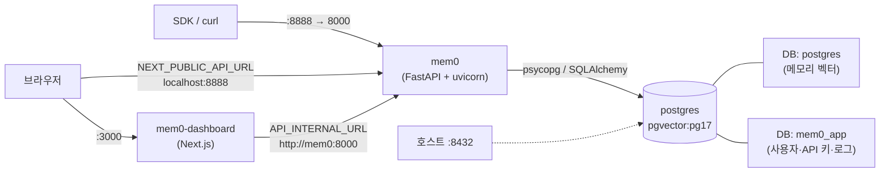
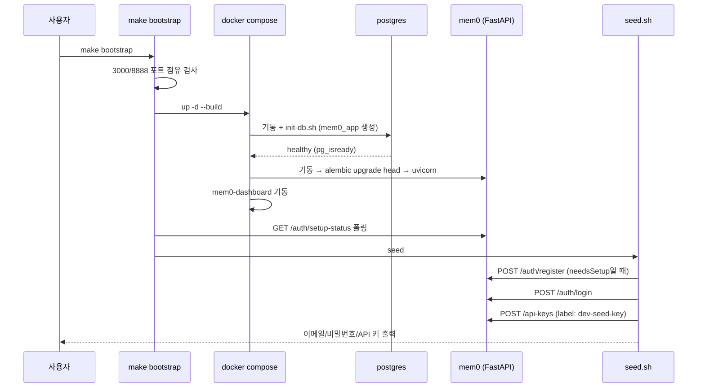

# server_deployment 모듈

`server_deployment`는 자가 호스팅 Mem0 서버(`server/`)를 컨테이너로 빌드·실행·운영하기 위한 파일 묶음이다. 구성 파일은 `server/Dockerfile`, `server/Makefile`, `server/docker-compose.yaml`, `server/init-db.sh`, `server/requirements.txt`이다. 애플리케이션 코드는 포함하지 않는다.

관련 모듈:
- API 엔드포인트: [server_api_core](server_api_core.md)
- 인증과 라우터: [server_auth_and_routers](server_auth_and_routers.md)
- DB 모델과 Alembic 마이그레이션: [server_database](server_database.md)
- 관리 스크립트(`seed.sh`, `reset_admin_password.py`, `prune_request_logs.py`): [server_admin_scripts](server_admin_scripts.md)
- 대시보드 UI: [Self-Hosted_Admin_Dashboard](Self-Hosted_Admin_Dashboard.md)
- 대시보드 빌드(`server/dashboard/Dockerfile`, `entrypoint.sh`): [dashboard_build_config](Build_Configuration_and_Tooling.md)

## 1. 아키텍처

`docker-compose.yaml`(프로젝트 이름 `mem0-dev`)은 세 서비스를 `mem0_network` 브리지 네트워크에 올린다.

| 서비스 | 이미지/빌드 | 호스트 포트 | 역할 |
|---|---|---|---|
| `mem0` | build context `..`, `server/dev.Dockerfile` | 8888 → 8000 | REST API. 시작 시 `alembic upgrade head` 실행 후 `uvicorn main:app --reload` |
| `postgres` | `pgvector/pgvector:pg17` | 8432 → 5432 | 벡터 저장소 + 앱 DB |
| `mem0-dashboard` | build `./dashboard` | 3000 | 관리 UI |

### 컴포넌트 설명

- **`Dockerfile`**: `python:3.12-slim` 기반 이미지다. `requirements.txt`를 먼저 설치해 레이어 캐시를 활용한 뒤 소스를 복사한다. 8000 포트를 노출하고 `uvicorn main:app --host 0.0.0.0 --port 8000 --reload`로 시작한다. `--reload`가 포함되어 있어 운영용으로는 개발 성향이 강하다. `make build`가 이 파일을 사용한다.
- **`docker-compose.yaml`**: 개발 스택이다. `mem0` 서비스는 위 `Dockerfile`이 아니라 `server/dev.Dockerfile`을 빌드한다. `./history:/app/history`와 `.:/app`을 마운트하고, 시작 명령에서 `mem0ai`를 `--force-reinstall --no-deps`로 재설치한 뒤 마이그레이션과 uvicorn을 실행한다. `postgres`가 `service_healthy`가 된 뒤에야 시작한다.
- **`init-db.sh`**: Postgres 컨테이너의 `/docker-entrypoint-initdb.d/`에 마운트된다. 기본 `postgres` DB는 pgvector 메모리 저장용으로 두고, 사용자·인증·API 키용 `mem0_app` DB를 멱등적으로(`WHERE NOT EXISTS ... \gexec`) 생성한다. 데이터 볼륨이 비어 있는 최초 기동에서만 실행된다.
- **`requirements.txt`**: `fastapi`, `uvicorn`, `pydantic[email]`, `mem0ai`, `psycopg[binary]`/`psycopg-pool`, 번들 LLM/임베더(`anthropic`, `google-generativeai`), 인증·DB(`sqlalchemy`, `alembic`, `passlib[bcrypt]`, `bcrypt==4.0.1`, `python-jose`, `cryptography`), 텔레메트리(`posthog`), 속도 제한(`slowapi`)을 고정한다. 파일 주석에 따르면 프로바이더를 추가하려면 패키지를 추가하고 이미지를 재빌드한 뒤 `main.py`의 `BUNDLED_*_PROVIDERS`도 갱신해야 한다.
- **`Makefile`**: 운영 편의 타겟 모음이다(아래 참조).

## 2. 환경 변수

| 변수 | 위치 | 설명 |
|---|---|---|
| `POSTGRES_PASSWORD` | compose | 필수. 없으면 `Set POSTGRES_PASSWORD in .env` 오류로 중단 |
| `POSTGRES_USER` | compose | 기본 `postgres` |
| `JWT_SECRET` | compose → `mem0` | JWT 서명 키. `.env`에서 주입 |
| `AUTH_DISABLED` | compose → `mem0` | 기본 `false` |
| `MEM0_TELEMETRY` | compose → `mem0` | 기본 `true`. 끄려면 `false` |
| `APP_DB_NAME` | compose | `mem0_app` 고정 |
| `DASHBOARD_URL` | compose | `http://localhost:3000` |
| `NEXT_PUBLIC_API_URL` | dashboard | 브라우저가 호출하는 API 주소 (`http://localhost:8888`) |
| `API_INTERNAL_URL` | dashboard | 컨테이너 간 통신용 (`http://mem0:8000`) |
| `NEXT_PUBLIC_INSTANCE_NAME` | dashboard | 인스턴스 표시 이름 |
| `OPENAI_API_KEY` 등 | `.env` | LLM 프로바이더 키. 없으면 `seed.sh`가 경고하고 요청이 `provider_auth_failed`로 실패 |

`.env`는 `env_file`로 `mem0` 서비스에 전달된다. 커밋하지 않는다(리포지토리 규칙).

## 3. Makefile 타겟

기본값: `API_URL=http://localhost:8888`, `DASHBOARD_URL=http://localhost:3000`, `OUTPUT=text`.

| 타겟 | 동작 |
|---|---|
| `up` | 3000/8888 포트 사용 여부를 `lsof`로 검사 → `docker compose up -d --build` → `wait-api`, `wait-dashboard` |
| `down` / `clean` | `docker compose down` / `down -v`(볼륨 삭제, 데이터 초기화) |
| `logs` | `docker compose logs -f` |
| `wait-api` | `GET /auth/setup-status`가 성공할 때까지 2초 간격 폴링 |
| `wait-dashboard` | `GET /api/health`가 성공할 때까지 폴링 |
| `seed` | `scripts/seed.sh` 호출 (`EMAIL`, `PASSWORD`, `NAME`, `OUTPUT` 전달) |
| `bootstrap` | `up` → `wait-api` → `wait-dashboard` → `seed` |
| `health` | API(`/docs`), 대시보드, `pg_isready` 상태 출력 |
| `reset-admin-password` | `EMAIL`, `PASSWORD` 필수. `mem0` 컨테이너에서 `scripts/reset_admin_password.py` 실행 |
| `prune-logs` | `REQUEST_LOG_RETENTION_DAYS`로 `scripts/prune_request_logs.py` 실행 |
| `build` | `docker build -t mem0-api-server .` |
| `run_local` | `docker run -p 8000:8000 -v $(pwd):/app mem0-api-server --env-file .env` |

> 참고: `run_local`은 `--env-file`이 이미지 이름 뒤에 있어 docker 옵션이 아닌 컨테이너 인자로 전달된다. 환경 파일이 적용되지 않을 수 있으니 사용 시 확인이 필요하다.

## 4. 부트스트랩 흐름

`seed.sh`는 비밀번호를 지정하지 않으면 무작위로 생성하며, `OUTPUT=json`이면 JSON으로 출력한다. 관리자가 이미 있고 비밀번호가 다르면 로그인 실패 후 `make clean && make bootstrap`(데이터 삭제) 또는 `make reset-admin-password`(데이터 유지)를 안내한다.

## 5. 운영 시 유의사항

- **헬스체크**: Postgres는 `pg_isready`(5초 간격, 5회), 대시보드는 `wget /api/health`(10초 간격, 3회). `mem0` 서비스에는 compose 헬스체크가 없고 대시보드는 `service_started`만 기다린다. 그래서 Makefile이 별도로 폴링한다.
- **데이터 영속성**: `postgres_db` 명명 볼륨. `make clean`은 이 볼륨까지 삭제한다.
- **마이그레이션**: 컨테이너 시작 때마다 `alembic upgrade head`가 자동 실행된다([server_database](server_database.md) 참고).
- **포트 충돌**: 호스트 8888/3000은 `make up`이 사전 검사한다. Postgres 8432는 검사하지 않는다.
- **문서와 구성의 불일치**: `server/CLAUDE.md`는 Neo4j(8474/8687)를 스택에 포함한다고 쓰지만, 현재 `docker-compose.yaml`에는 Neo4j 서비스가 없다. 또한 `server/CLAUDE.md`는 운영 이미지를 `make build`로 만든다고 하나 `Dockerfile`에도 `--reload`가 들어 있다. 실제 배포 전에 구성을 확인해야 한다.
- **개발 전용 성격**: compose 파일의 소스 바인드 마운트, `--reload`, 이름 `mem0-dev`는 개발 스택임을 보여 준다. 운영 배포에는 별도 하드닝(시크릿 관리, TLS, `--reload` 제거)이 필요하다.
- **의존 방향**: 이 모듈은 코드에 의존하지 않고 이미지 구성만 담당한다. 대시보드 이미지는 `server/dashboard/Dockerfile`의 멀티스테이지(`base`/`deps`/`builder`/`runner`) 빌드와, 런타임에 `NEXT_PUBLIC_*` 플레이스홀더를 치환하는 `entrypoint.sh`를 사용한다.
