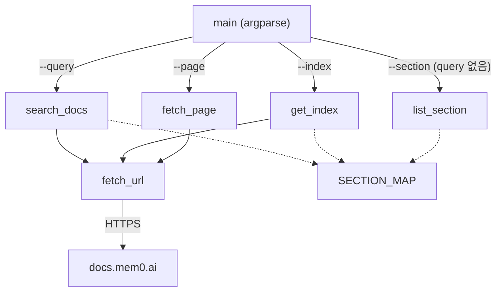
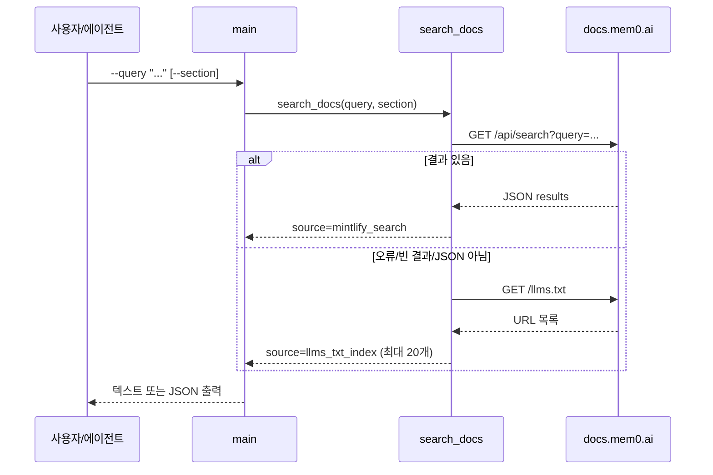

# skills_doc_search 모듈

## 개요

`skills_doc_search`는 `skills/mem0/scripts/mem0_doc_search.py` 단일 스크립트로 구성된 CLI 도구입니다. 로컬에 문서를 저장하지 않고, 필요할 때마다 `https://docs.mem0.ai`(Mintlify 기반)에서 Mem0 문서를 검색·조회합니다(just-in-time retrieval). Claude Code 스킬(`skills/mem0`)이 컨텍스트를 부풀리지 않고 최신 문서를 참조하도록 하는 것이 목적입니다.

- 외부 의존성 없음: 표준 라이브러리(`argparse`, `json`, `urllib`)만 사용
- 핵심 컴포넌트: `skills/mem0/scripts/mem0_doc_search.py::main` (CLI 진입점)
- 상위 그룹: Coding-Agent 메모리 플러그인 모듈 (`Coding-Agent_Memory_Plugins_and_Shared_Plugin_Core`). 스킬 파일은 `skills/AGENTS.md` 규칙(크기 예산 관리)을 따릅니다.

## 상수와 SECTION_MAP

| 상수 | 값 | 용도 |
|---|---|---|
| `DOCS_BASE` | `https://docs.mem0.ai` | 모든 URL의 기준 |
| `SEARCH_ENDPOINT` | `{DOCS_BASE}/api/search` | Mintlify 검색 API |
| `LLMS_INDEX` | `{DOCS_BASE}/llms.txt` | 전체 문서 URL 인덱스(폴백) |
| `SECTION_MAP` | dict | `platform`, `api`, `open-source`, `sdks`, `integrations` 섹션별 알려진 페이지 경로 |

`llms.txt`는 저장소의 `scripts/check-llms-txt-coverage.py` 및 `.github/workflows/docs-llms-txt-check.yml`이 새 `.mdx` 페이지 등재 여부를 검증하므로, 이 도구의 폴백 인덱스 품질은 해당 CI 게이트에 의해 유지됩니다.

## 아키텍처



### 함수별 역할

- `fetch_url(url)`: `User-Agent: Mem0DocSearchAgent/1.0`, 타임아웃 15초로 GET. HTTP/URL 오류는 예외를 던지지 않고 `"HTTP Error ..."` / `"URL Error: ..."` 문자열로 반환합니다.
- `search_docs(query, section)`: 1차로 Mintlify `/api/search`를 호출. `results`가 있으면 `{"source": "mintlify_search", "results": [...]}` 반환. 실패(JSON 파싱 오류 포함 모든 예외)나 빈 결과면 `llms.txt`를 줄 단위로 대소문자 무시 부분 문자열 매칭하여 최대 20개를 `{"source": "llms_txt_index", ...}`로 반환.
- `fetch_page(page_path)`: `/`로 시작하면 `DOCS_BASE`에 붙이고, 아니면 전체 URL로 간주. 내용은 10,000자로 잘리며 `truncated` 플래그 제공.
- `get_index()`: `llms.txt`에서 `#`로 시작하지 않는 비어있지 않은 줄을 URL로 취급하여 총 개수·목록·섹션명 반환.
- `list_section(section)`: `SECTION_MAP`의 페이지를 전체 URL로 나열. 알 수 없는 섹션이면 `error`와 `available` 반환.

## CLI 사용법

```bash
python skills/mem0/scripts/mem0_doc_search.py --query "how to add graph memory"
python skills/mem0/scripts/mem0_doc_search.py --query "webhook events" --section platform
python skills/mem0/scripts/mem0_doc_search.py --page "/platform/features/graph-memory"
python skills/mem0/scripts/mem0_doc_search.py --index
python skills/mem0/scripts/mem0_doc_search.py --section open-source
python skills/mem0/scripts/mem0_doc_search.py --query "filters" --json
```

| 옵션 | 설명 |
|---|---|
| `--query` | 문서 검색어 |
| `--page` | 특정 페이지 경로 조회 |
| `--index` | 전체 인덱스 출력 |
| `--section` | 섹션 필터(`--query`와 함께) 또는 섹션 페이지 목록(단독) |
| `--json` | JSON 출력 |

### 분기 우선순위

`main`은 `--index` → (`--section` 단독) → `--page` → `--query` 순으로 평가합니다. 아무 인자도 없으면 도움말 출력 후 종료 코드 1로 종료합니다.

## 검색 흐름



## 출력 형식

`--json`이 없으면 결과 딕셔너리의 키에 따라 사람이 읽는 형태로 출력합니다: `results`(제목·URL·설명 200자), `matching_urls`, `urls`(최대 30개), `pages`, `content`(잘림 안내 포함), `error`.

## 동작상 유의점

- 섹션 필터 방식이 경로에 따라 다릅니다. Mintlify 결과는 URL이 섹션 경로로 **시작**하는지(`startswith`), 폴백은 경로가 URL에 **포함**되는지(`in`)로 판정합니다.
- 폴백 검색은 질의 전체 문자열의 부분 일치이므로 여러 단어 질의는 매칭이 적을 수 있습니다.
- 네트워크 오류가 문자열로 반환되므로, 폴백 단계에서 오류 메시지가 `llms.txt` 내용처럼 처리될 수 있습니다(결과가 비게 됨).
- `SECTION_MAP`은 하드코딩되어 있어 문서 구조 변경 시 수동 갱신이 필요합니다.
- `str | None` 타입 힌트 때문에 Python 3.10+ 가 필요합니다.

## 관련 모듈

- 같은 그룹의 플러그인 공통 코어: [agent_plugin_core_python](agent_plugin_core_python.md), 빌드/적합성 검증: [agent_plugin_core_build_conformance](agent_plugin_core_build_conformance.md)
- `llms.txt` 검증 CI: [CI_CD_and_Repository_Governance](CI_CD_and_Repository_Governance.md), 빌드 스크립트: [Build_Configuration_and_Tooling](Build_Configuration_and_Tooling.md)
