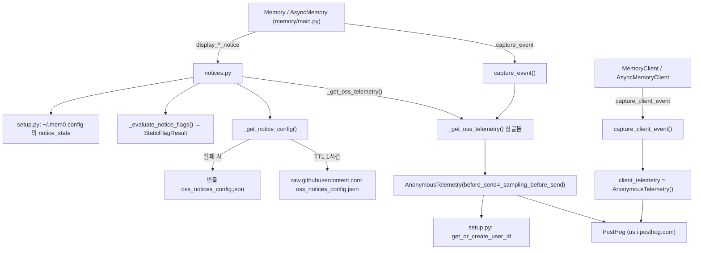
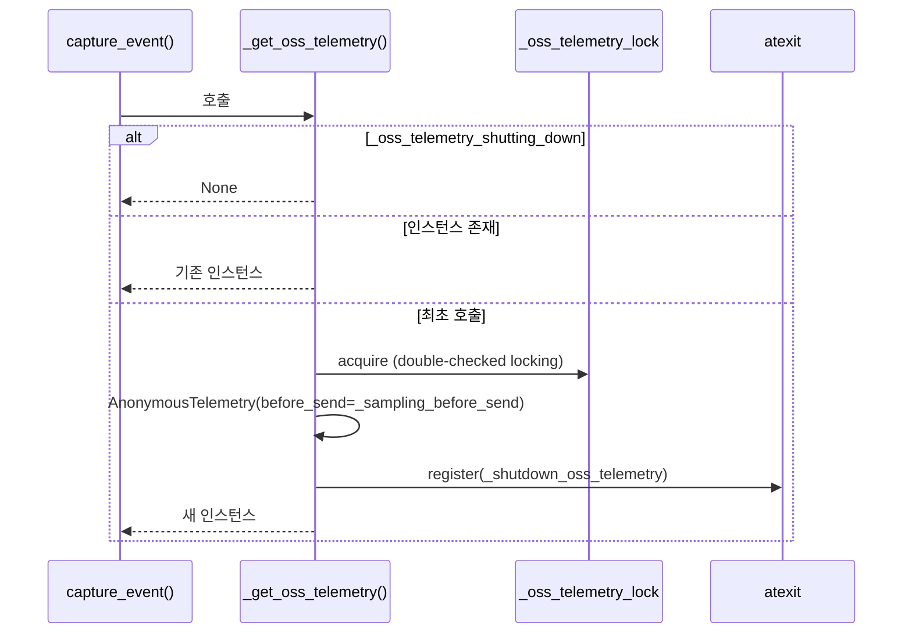
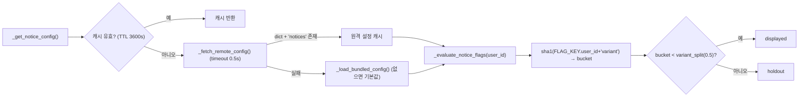
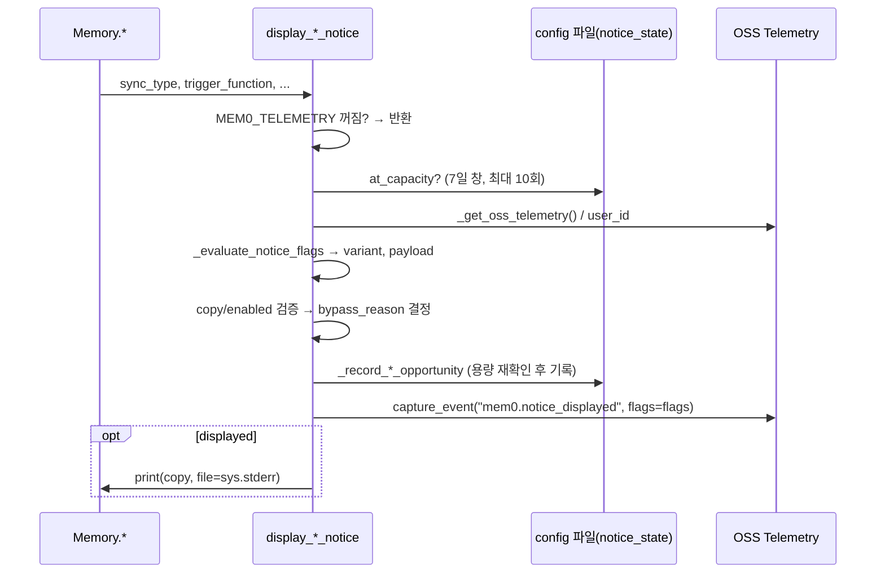

# telemetry_and_notices 모듈

`telemetry_and_notices`는 Python SDK(`mem0ai`)의 OSS `Memory`/`AsyncMemory`와 호스팅 `MemoryClient`가 사용하는 **익명 사용 통계 수집**과 **사용자 안내(notice) 표시**를 담당한다. 두 파일로 구성된다.

| 파일 | 핵심 구성요소 | 역할 |
|------|---------------|------|
| `mem0/memory/telemetry.py` | `AnonymousTelemetry`, `_parse_sample_rate`, `_sampling_before_send`, `_shutdown_oss_telemetry` | PostHog 기반 이벤트 전송, 샘플링, 싱글톤 수명 관리 |
| `mem0/memory/notices.py` | `StaticFlagResult` 외 `display_*_notice` 함수군 | 원격/번들 설정 기반 A/B 안내문 표시, 노출 횟수 제한, 이벤트 기록 |

상위 모듈은 [py_memory_core](Python_SDK_Core_(Memory_Engine_and_Hosted_Client).md)이며, 실제 호출 지점은 [memory_engine](memory_engine.md)(`mem0/memory/main.py`)과 호스팅 클라이언트([py_hosted_client](Python_SDK_Core_(Memory_Engine_and_Hosted_Client).md))다. 설정/사용자 ID 저장은 [history_storage_and_setup](history_storage_and_setup.md)의 `mem0/memory/setup.py`(`get_or_create_user_id`, `_load_config`, `_write_config`)에 의존한다.

---

## 1. 아키텍처

핵심 설계:

- **두 개의 텔레메트리 인스턴스**: OSS용은 지연 생성되는 프로세스 전역 싱글톤(샘플링 적용), 호스팅 클라이언트용은 모듈 로드 시 생성되는 `client_telemetry`(샘플링 없음).
- **절대 예외를 던지지 않음**: 모든 공개 함수는 `try/except`로 감싸 애플리케이션 흐름을 방해하지 않는다.
- **옵트아웃**: 환경변수 `MEM0_TELEMETRY`(`true/1/yes` 외에는 비활성)가 꺼져 있으면 `AnonymousTelemetry`는 `posthog=None`이 되고 모든 notice 함수도 즉시 반환한다.

---

## 2. telemetry.py

### 2.1 설정 값

| 항목 | 설명 |
|------|------|
| `MEM0_TELEMETRY` | 환경변수, 기본 `"True"`. 문자열이면 불리언으로 변환, 그 외 타입이면 `ValueError`. |
| `MEM0_TELEMETRY_SAMPLE_RATE` | 기본 `0.1`. `_parse_sample_rate`가 파싱하며 숫자가 아니거나 `[0.0, 1.0]` 밖이면 기본값으로 대체(절대 raise 안 함). |
| `FEATURE_FLAGS_REQUEST_TIMEOUT_SECONDS` | `0.5`초. `notices.py`의 원격 설정 fetch 타임아웃으로도 재사용. |
| `_LIFECYCLE_EVENTS` | 샘플링을 우회하는 이벤트: `mem0.init`, `mem0.reset`, `mem0._create_procedural_memory`, `mem0.notice_displayed`, `$identify`. `memory/main.py`의 이벤트명과 동기화 필요. |

`posthog`와 `urllib3` 로거는 `CRITICAL + 1`로 설정해 완전히 침묵시킨다.

### 2.2 `AnonymousTelemetry`

| 메서드 | 동작 |
|--------|------|
| `__init__(vector_store=None, before_send=None)` | 비활성이면 `posthog/user_id = None`. 아니면 `Posthog` 클라이언트 생성 후 `get_or_create_user_id(vector_store)`로 익명 ID 확보. |
| `capture_event(event_name, properties, user_email, flags)` | `distinct_id = user_email or user_id`. 없으면 건너뜀. `client_source`, `client_version`, OS/Python/프로세서 정보를 기본 속성으로 병합. `flags`가 있으면 PostHog `capture`에 전달(notice용 feature flag 속성). |
| `capture_identify(anon_id, email)` | `$anon_distinct_id`를 포함한 `$identify`를 보내 PostHog에서 익명 ID를 이메일로 병합. 값이 비었거나 동일하면 `False`. |
| `close()` | `posthog.shutdown()` 후 `None`으로 설정. |

### 2.3 샘플링: `_sampling_before_send`

PostHog `before_send` 훅이다.

1. `msg`가 `dict`가 아니면 `None`(드롭).
2. 라이프사이클 이벤트가 아니고 `random.random() >= MEM0_TELEMETRY_SAMPLE_RATE`이면 드롭.
3. 생존 이벤트에 `properties["sample_rate"]`를 기록(라이프사이클은 `1.0`)해 대시보드에서 `1/sample_rate`로 실제 건수를 추정하게 한다.

### 2.4 OSS 싱글톤과 종료

`_shutdown_oss_telemetry`는 락을 잡고 `_oss_telemetry_shutting_down=True`로 표시한 뒤 인스턴스를 `close()`한다. 이후 `_get_oss_telemetry()`는 `None`을 돌려주므로 인터프리터 종료 중 새 PostHog 스레드가 생기지 않는다.

### 2.5 공개 캡처 함수

| 함수 | 대상 | 페이로드 |
|------|------|----------|
| `capture_event(event_name, memory_instance, additional_data)` | OSS `Memory` | `collection`, `vector_size`, `history_store`(`sqlite`), `vector_store`/`llm`/`embedding_model`의 클래스 경로, `function`(클래스+`api_version`) |
| `capture_client_event(event_name, instance, additional_data)` | `MemoryClient` | `function`(클래스 경로), `instance.user_email`을 distinct_id로 사용 |

프롬프트나 메모리 내용은 전송하지 않고 구성 메타데이터만 보낸다.

---

## 3. notices.py

릴리스 없이 안내문(예: 신규 기능 소개)을 내려주고 노출 효과를 측정하기 위한 장치다. PostHog feature flag를 흉내 내는 **로컬 결정적 버킷팅**을 사용한다.

### 3.1 설정 로드와 변형(variant) 결정

- 같은 `user_id`는 항상 같은 variant를 받는다(해시 기반).
- 결과는 `StaticFlagResult(variant, payload)`로 감싸 PostHog `evaluate_flags` 반환값과 동일한 인터페이스(`get_flag`, `get_flag_payload`, `_get_event_properties`)를 제공한다. `capture_event(..., flags=flags)`로 전달되어 이벤트에 `$feature/mem0-oss-notices`가 붙는다.
- 락(`_config_fetch_lock`)과 이중 확인으로 동시 fetch를 방지한다.

### 3.2 notice 종류

| notice ID | 진입 함수 | 트리거 |
|-----------|-----------|--------|
| `first_run` | `display_first_run_notice` (+`_async`) | 프로세스/머신 최초 사용. 영구 상태에 `consumed` 기록. |
| `temporal_usage` | `display_temporal_usage_notice` | `detect_temporal_usage_from_metadata/search`: 날짜 유사 메타데이터 키·값, 쿼리의 상대 시간 표현("last week"), ISO 날짜, 날짜 범위 필터. |
| `decay_usage` | `display_decay_usage_notice` | `detect_decay_usage_from_delete`(성공 삭제 5회 이상), `detect_decay_usage_from_delete_all`(삭제 건수 > 0). |
| `scale_threshold` | `display_scale_threshold_notice` | `top_k >= 50`, 또는 add 결과 기준 메모리 수 `>= 2000`(100건 추가마다 점검, 1회만 평가). |
| `performance_slow_query` | `display_performance_slow_query_notice` | 검색 소요 시간 `>= 2.0`초. |
| `temporal_stub`, `decay_stub` | `get_temporal_feature_error_message`, `get_decay_feature_error_message` | OSS에서 미지원인 `timestamp`/`reference_date`/`decay` 파라미터 사용 시 에러 문구를 반환. |

각 `display_*_async`는 `asyncio.to_thread`로 동기 버전을 감싼다(파일 I/O·네트워크가 이벤트 루프를 막지 않도록).

### 3.3 공통 표시 로직

모든 `display_*` 함수는 거의 같은 순서를 따른다.

- `bypass_reason`: `missing_notice_config`, `payload_disabled`, `missing_copy`, `holdout`, `not_displayed`.
- `displayed = variant == "displayed" and enabled and bool(copy)`. holdout 그룹도 이벤트는 기록되지만 출력은 하지 않는다. 예외로 `*_feature_error`는 holdout에도 문구를 반환한다(기능 미지원 에러는 숨길 수 없기 때문).
- 노출 제한: `*_CAP = 10`회 / `*_WINDOW = 7일`. 프로세스 내 플래그(`_*_capacity_reached_in_process`)로 반복적인 파일 읽기를 피한다. 용량 확인 중 예외가 나면 "가득 참"으로 간주해 안전하게 노출하지 않는다.
- 상태 저장: `STATE_SECTION="notice_state"` 아래에 notice별 `events` 목록(`evaluated_at` ISO 시각 등)을 `_write_config`로 저장한다. 모든 읽기-수정-쓰기는 `_state_lock`으로 보호한다.
- `scale_threshold`의 메모리 수 조회는 `_get_provider_memory_count`가 벡터 스토어의 `count()` → `col_info()` → client `count` 순으로 시도하고 `_extract_count`가 `count/points_count/vectors_count/indexed_vectors_count/num_docs` 키를 탐색한다.

### 3.4 first_run 클레임

`_claim_first_run_notice`는 (1) 프로세스 내 플래그, (2) 설정 파일의 `consumed` 값을 확인하고 처음이면 `consumed=True`와 시각, 트리거 함수를 **표시 전에** 기록한다. 따라서 여러 프로세스가 동시에 시작해도 대체로 한 번만 시도되며, 실패해도 재시도하지 않는다(안내를 반복 노출하는 것보다 놓치는 쪽을 택함). variant는 이후 `_update_first_run_variant`로 갱신된다.

---

## 4. 다른 모듈과의 관계

- [memory_engine](memory_engine.md): `Memory`/`AsyncMemory`가 `capture_event`와 `display_*`/`detect_*`를 호출한다. 새 이벤트를 추가할 때 샘플링 우회가 필요하면 `_LIFECYCLE_EVENTS`에 등록한다.
- [history_storage_and_setup](history_storage_and_setup.md): 익명 사용자 ID(`get_or_create_user_id`)와 설정 파일 입출력(`_load_config`, `_write_config`)을 제공한다.
- 호스팅 클라이언트는 `capture_client_event`와 `capture_identify`로 이메일-익명 ID 병합을 수행한다.
- 다른 언어/제품의 유사 구현: TypeScript SDK(`mem0-ts/src/oss/src/utils/telemetry.ts`, `notices.ts`), [Python_CLI](Python_CLI.md)의 `cli_python_telemetry`, [Node_CLI](Node_CLI.md)의 `surfaceNotice`. 서버 측은 [Self-Hosted_Server](Self-Hosted_Server_(API,_Auth,_Persistence,_Deployment).md)의 `server/telemetry.py`를 참고한다.

## 5. 운영 및 유지보수 메모

- 텔레메트리 끄기: `MEM0_TELEMETRY=false`. 샘플링 조정: `MEM0_TELEMETRY_SAMPLE_RATE=0.5` 등.
- PostHog 프로젝트 키와 호스트(`us.i.posthog.com`)는 `telemetry.py`에 하드코딩되어 있다.
- 원격 notice 설정은 `mem0/memory/oss_notices_config.json`(main 브랜치)을 수정해 배포하며, 클라이언트는 최대 1시간 후 반영한다. 오프라인이면 번들 파일을 사용한다.
- `notices.py`는 `display_*` 함수 간 코드 중복이 크다(variant 판정·`bypass_reason` 로직 복제). 새 notice를 추가할 때는 기존 패턴(용량 확인 → 평가 → 기록 → 이벤트 → stderr 출력)을 그대로 따르고, 필요하면 공통 헬퍼로 추출하는 리팩터링을 고려한다.
- 텔레메트리 동작을 바꾸는 경우 `docs/`의 공개 문서(프라이버시 안내)도 같은 PR에서 갱신해야 한다(`CLAUDE.md` 규칙).
