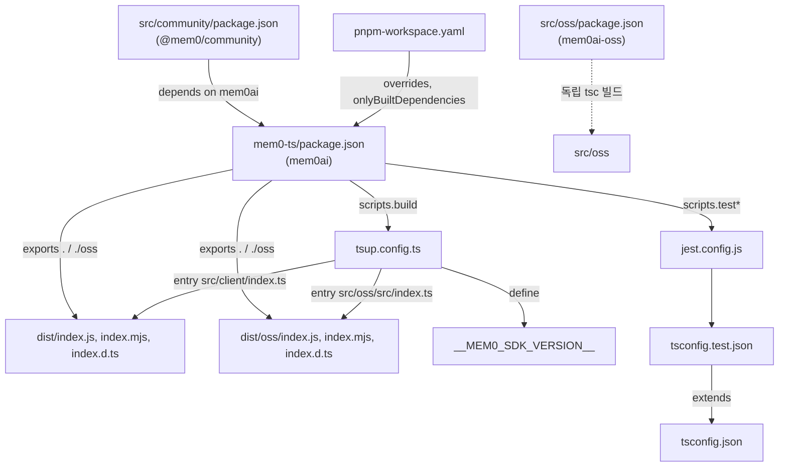
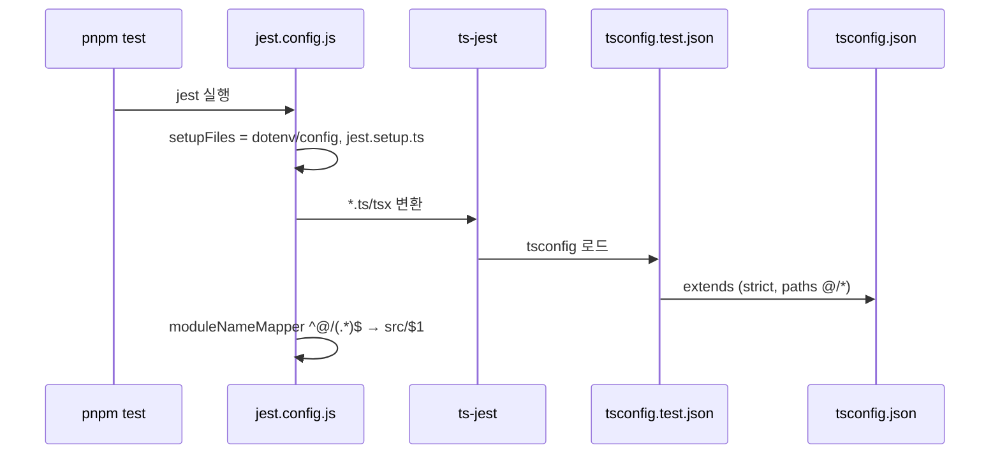
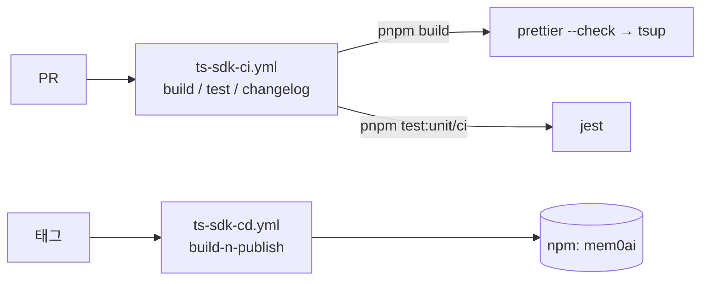

# ts_build_and_config

`mem0-ts/` 아래 TypeScript SDK(`mem0ai`)와 보조 패키지(`@mem0/community`, `mem0ai-oss`)의 **빌드·패키징·테스트·의존성 설정**을 모은 모듈입니다. 런타임 로직은 없고 설정 파일만 있습니다. 이 설정이 SDK의 번들 형태, 공개 엔트리포인트, 선택적 peer 의존성, 테스트 환경을 결정합니다.

관련 모듈:
- 설정이 빌드하는 소스: [TypeScript_SDK_Core_(Hosted_Client_and_OSS_Engine)](TypeScript_SDK_Core_(Hosted_Client_and_OSS_Engine).md), [TypeScript_Pluggable_Provider_Layer](TypeScript_Pluggable_Provider_Layer.md)
- 이 설정을 CI에서 실행하는 워크플로(`ts-sdk-ci.yml`, `ts-sdk-cd.yml`): [CI_CD_and_Repository_Governance](CI_CD_and_Repository_Governance.md)
- 형제 설정 모듈: [cli_node_build_config](cli_node_build_config.md), [dashboard_build_config](dashboard_build_config.md), [root_build_config](root_build_config.md)

## 구성 파일

| 파일 | 역할 |
|------|------|
| `mem0-ts/package.json` | `mem0ai` 패키지 매니페스트: 스크립트, `exports`, 의존성, peer 의존성, pnpm 오버라이드 |
| `mem0-ts/pnpm-workspace.yaml` | 워크스페이스(`"."` 단일 패키지), `onlyBuiltDependencies`, 보안 `overrides`, `patchedDependencies` |
| `mem0-ts/tsup.config.ts` | 번들러 설정: 두 개의 빌드 타깃, `external`, 버전 `define` |
| `mem0-ts/tsconfig.json` | 기본 컴파일러 옵션 (strict, ES2018, `@/*` 경로 별칭) |
| `mem0-ts/tsconfig.test.json` | 테스트용 tsconfig (`jest` 타입, `noEmit`) |
| `mem0-ts/jest.config.js` | ts-jest 기반 테스트 설정 |
| `mem0-ts/src/community/package.json`, `tsconfig.json` | `@mem0/community` (LangChain 통합) 패키지 |
| `mem0-ts/src/oss/package.json` | 레거시/로컬용 `mem0ai-oss` 패키지 (`tsc` 빌드) |

## 아키텍처

### 빌드 (`tsup.config.ts`)

`defineConfig` 배열로 두 타깃을 만듭니다. 둘 다 `cjs`+`esm`, `dts: true`, sourcemap 포함입니다.

1. `src/client/index.ts` → `dist/` (호스팅 `MemoryClient`)
2. `src/oss/src/index.ts` → `dist/oss/` (셀프호스팅 `Memory`)

- `external` 목록에 모든 provider SDK(`openai`, `pg`, `qdrant`, `redis`, `@aws-sdk/*` 등)를 넣어 번들에서 제외합니다. 사용자가 필요한 것만 설치하는 구조입니다.
- `define`으로 `package.json`의 `version`을 `__MEM0_SDK_VERSION__`에 주입합니다. 텔레메트리 등이 이 값을 씁니다.
- `package.json` 안에도 `tsup` 인라인 필드(`entry: src/index.ts`, `external: @mem0/community`)가 있습니다. 다만 `tsup.config.ts`가 있으면 그쪽이 우선하므로, 인라인 필드는 사실상 잔존 설정으로 보입니다. 수정할 때는 `tsup.config.ts`를 기준으로 하세요.

### 패키지 공개 인터페이스 (`package.json`)

- `exports`: `"."`(클라이언트)와 `"./oss"`(OSS 엔진) 두 엔트리. 각각 `types` / `require` / `import` 조건을 가집니다.
- `typesVersions`는 `oss` 서브패스 타입을 구버전 `moduleResolution: node`에서도 해석하게 합니다.
- `files: ["dist"]`, `engines.node >= 18`, `publishConfig.access: public`.
- `dependencies`는 `axios`, `openai`, `uuid`, `zod`뿐입니다. 나머지(약 40개)는 `peerDependencies`로 두고 `peerDependenciesMeta`에서 거의 전부 `optional: true`로 표시합니다. 쓰는 provider만 설치하면 됩니다.
- 루트 `AGENTS.md` 규칙대로 **pnpm 전용**입니다 (`packageManager: pnpm@10.5.2`). 단, 일부 스크립트는 내부에서 `npm run`/`npx`를 호출합니다 (아래 참고).

### 스크립트

| 스크립트 | 동작 |
|----------|------|
| `build` | `npm run clean && npx prettier --check . && npx tsup` — 포맷 검사에 실패하면 빌드도 실패 |
| `clean` | `rimraf dist` |
| `dev` | `npx nodemon` |
| `example` / `start` | `ts-node src/oss/examples/vector-stores/index.ts` / `pnpm run example memory` |
| `format` / `format:check` | `prettier --write .` / `--check .` (둘 다 먼저 `clean`) |
| `test` / `test:ts` / `test:watch` | `jest` (watch 포함) |
| `test:ci` | `jest --coverage --ci` |
| `test:unit` | 커버리지 포함, `integration` 경로 제외 |
| `test:integration` | `jest --config jest.integration.config.js --forceExit` (해당 설정 파일은 이 모듈의 제공 코드에 없음) |

### 의존성 보안 고정 (`pnpm-workspace.yaml`)

- `overrides`로 취약 버전 범위(`axios<1.18.0`, `esbuild`, `undici`, `tar` 등)를 안전한 버전으로 강제합니다.
- `onlyBuiltDependencies`: 빌드 스크립트 실행을 `esbuild`, `better-sqlite3`에만 허용합니다.
- `patchedDependencies`: `tar@7.5.22`에 `patches/tar@7.5.22.patch` 적용.
- 같은 `overrides`가 `package.json`의 `pnpm` 필드에도 있습니다. 거의 중복이며 `package.json` 쪽에만 `@aws-sdk/*` 버전 고정과 `weaviate-client>uuid` 등이 더 있어 **두 곳이 완전히 일치하지 않습니다**. 오버라이드를 추가할 때 양쪽을 함께 확인하세요.

### TypeScript / 테스트 설정

- `tsconfig.json`: `target ES2018`, `module ESNext`, `strict`, `isolatedModules`, `stripInternal`, `paths: @/* → ./src/*`. 테스트 파일(`**/*.test.ts`)은 제외합니다.
- `tsconfig.test.json`: 위를 상속하고 `types: [node, jest]`, `rootDir: "."`, `noEmit`. 테스트 파일을 다시 포함합니다.
- `jest.config.js`: `preset: ts-jest`, `testEnvironment: node`, `roots: src, tests`, `dotenv/config`와 `jest.setup.ts`를 `setupFiles`로 로드, `dist`·`node_modules` 제외. `.env`의 API 키를 읽는 통합 테스트용이므로 `.env`를 커밋하지 마세요.
- `transform`과 `globals` 양쪽에 ts-jest 설정이 중복돼 있는데, 후자는 최신 ts-jest에서 deprecated입니다.

### 하위 패키지

**`@mem0/community`** (`src/community/package.json`): `.`와 `./langchain` 두 엔트리를 `tsup`으로 `cjs/esm` 빌드합니다. `mem0ai`와 `@langchain/*`에 의존하며 `prepublishOnly`에서 빌드합니다. 소스는 `Mem0Memory` LangChain 통합입니다 ([TypeScript_SDK_Core_(Hosted_Client_and_OSS_Engine)](TypeScript_SDK_Core_(Hosted_Client_and_OSS_Engine).md)의 `ts_community_integrations`). `tsconfig.json`은 `ES2020`, `rootDir: ./src`, 테스트 제외입니다. 의존하는 `mem0ai` 범위가 `^2.1.8`로, 루트 패키지 버전(3.3.1)과 어긋나 있습니다.

**`mem0ai-oss`** (`src/oss/package.json`): 버전 `1.0.0`, MIT 라이선스, `tsc`로 빌드하는 독립 패키지입니다. 배포되는 `mem0ai/oss`는 이 패키지가 아니라 루트 `tsup.config.ts`가 만듭니다. 의존성 버전도 루트보다 오래됐습니다 (`@anthropic-ai/sdk ^0.18` 등). 예제 실행·로컬 개발용으로 보세요.

## 배포 흐름

워크플로의 정확한 단계는 [CI_CD_and_Repository_Governance](CI_CD_and_Repository_Governance.md) 문서를 참고하세요. 버전은 `package.json`의 `version`만 올리면 `__MEM0_SDK_VERSION__`에 반영됩니다.

## 변경 시 체크리스트

- 새 provider를 추가하면 `peerDependencies`(+`peerDependenciesMeta` optional), `tsup.config.ts`의 `external`을 함께 갱신합니다. 빠지면 번들에 SDK가 포함되거나 import가 실패합니다.
- 새 공개 엔트리를 만들면 `tsup.config.ts`의 entry, `package.json`의 `exports`·`typesVersions`를 같이 수정합니다.
- 코드 포맷은 Prettier입니다 (`build`가 `prettier --check`를 포함). ESLint나 Biome를 섞지 마세요.
- `require()`는 쓰지 말고 ES module `import`만 사용합니다 (저장소 규칙).
- 공개 API가 바뀌면 `docs/`도 같은 PR에서 갱신해야 합니다.
