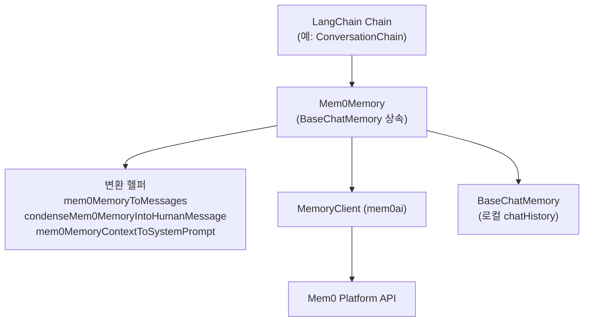
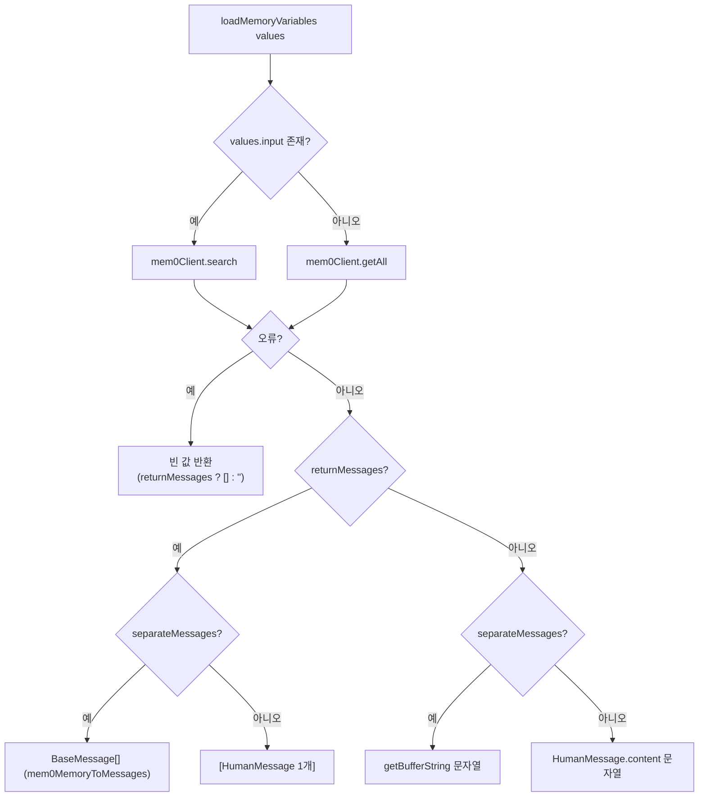
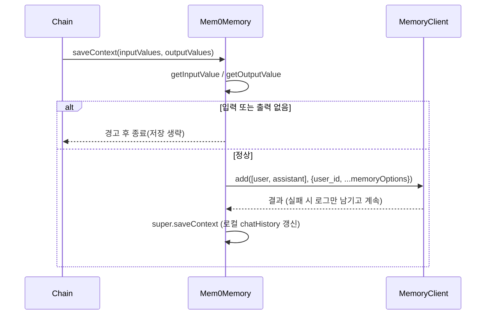

# ts_community_integrations 모듈

## 개요

`ts_community_integrations`는 `mem0-ts/src/community` 패키지에 포함된 **커뮤니티 통합(community integrations)** 모듈입니다. 현재 핵심 구성요소는 LangChain.js용 메모리 어댑터 `Mem0Memory`(`mem0-ts/src/community/src/integrations/langchain/mem0.ts`) 하나이며, LangChain의 `BaseChatMemory`를 상속해 Mem0 호스티드 플랫폼(`MemoryClient`)을 대화 메모리 저장소로 사용할 수 있게 합니다.

- 사용 대상: `ConversationChain` 등 LangChain 체인에 Mem0의 장기 기억을 붙이려는 개발자
- 백엔드: Mem0 호스티드 API (`mem0ai` 패키지의 `MemoryClient`). 셀프호스팅 `Memory`(OSS)는 사용하지 않음
- 상위 SDK 문서: [TypeScript_SDK_Core_(Hosted_Client_and_OSS_Engine)](TypeScript_SDK_Core_(Hosted_Client_and_OSS_Engine).md), 호스티드 클라이언트 상세는 [ts_hosted_client](ts_hosted_client.md) 참조

## 아키텍처



### 구성요소

| 구성요소 | 역할 |
|---|---|
| `Mem0Memory` | 메모리 어댑터 클래스. `loadMemoryVariables`, `saveContext`, `clear`, `memoryKeys` 구현 |
| `Mem0MemoryInput` | 생성자 옵션 (`sessionId`, `apiKey`, `humanPrefix`, `aiPrefix`, `memoryOptions`, `mem0Options`, `separateMessages`; `BaseChatMemoryInput` 확장) |
| `ClientOptions` | `MemoryClient`에 전달되는 `{ apiKey, host? }` |
| `mem0MemoryContextToSystemPrompt` | `Memory[]`에서 `memory` 텍스트만 줄바꿈으로 이어 붙임 |
| `condenseMem0MemoryIntoHumanMessage` | 안내 문구 + 메모리 텍스트를 단일 `HumanMessage`로 구성 |
| `mem0MemoryToMessages` | 메모리를 `SystemMessage`로, 각 메모리의 `messages`를 `HumanMessage`/`AIMessage`/`ChatMessage`로 변환 |

## 핵심 동작

### 생성자
- `apiKey`, `sessionId`가 없으면 `Error`를 던집니다.
- `returnMessages`(기본 `false`), `inputKey`, `outputKey`는 `BaseChatMemory`로 전달됩니다.
- `memoryKey`는 `"history"`, 접두사 기본값은 `Human`/`AI`, `separateMessages` 기본값은 `false`입니다.
- `new MemoryClient({...mem0Options, apiKey})`로 클라이언트를 만들고, 실패하면 로그 후 일반화된 에러를 던집니다.

### `loadMemoryVariables`
`values.input`이 있으면 `search`, 없으면 `getAll`을 호출합니다. 두 경우 모두 `user_id: sessionId`가 기본 적용되고 `memoryOptions`가 **그 뒤에** 펼쳐지므로, `memoryOptions.user_id`가 있으면 `sessionId`보다 우선합니다(README 예시의 "user_id 사용 권장"과 같은 맥락).



### `saveContext`


### `clear`
Mem0 쪽 삭제는 **구현되어 있지 않습니다**(주석 처리됨). `super.clear()`로 로컬 chat history만 비웁니다.

## 사용 예

```typescript
const memory = new Mem0Memory({
  sessionId: "user123",
  apiKey: "your-api-key",
  memoryOptions: { user_id: "user123", run_id: "run123" },
});
const chain = new ConversationChain({ llm: model, memory });
```

## 유의사항

- **오류 삼킴**: 검색/저장 오류는 `console.error`만 남기고 체인을 중단하지 않습니다. 장애가 조용히 메모리 유실로 이어질 수 있으니 로그를 확인하세요.
- **`clear()` 미구현**: 원격 메모리는 삭제되지 않습니다. 필요하면 `MemoryClient`의 `deleteAll` 등을 직접 호출해야 합니다.
- `memoryOptions` 타입은 `AddMemoryOptions | SearchMemoryOptions | GetAllMemoryOptions`의 합집합이며, 같은 객체가 add/search/getAll에 모두 펼쳐집니다. 호출별로 유효하지 않은 필드는 넣지 않는 것이 안전합니다.
- `mem0MemoryToMessages`는 `memory.messages`가 있을 때만 대화 메시지를 추가합니다.

## 빌드 및 의존성

- 패키지 설정: `mem0-ts/src/community/package.json` (scripts: `build`, `dev`, `test`, `format`, `prepublishOnly` 등), `mem0-ts/src/community/tsconfig.json`
- 런타임 의존: `mem0ai`, `@langchain/core`, `@langchain/community`
- 워크스페이스/빌드 구성은 `mem0-ts/pnpm-workspace.yaml`, `mem0-ts/tsup.config.ts` 참고. TS 패키지는 pnpm 전용이며 ES 모듈 `import`만 사용합니다(루트 `CLAUDE.md` 규칙).
- CI: [CI_CD_and_Repository_Governance](CI_CD_and_Repository_Governance.md)의 `ts-sdk-ci.yml`과 연계

## 관련 문서

- [ts_hosted_client](ts_hosted_client.md) — `MemoryClient`, `add`/`search`/`getAll` 옵션 타입
- [ts_oss_core](ts_oss_core.md) — 셀프호스팅 `Memory` 엔진(이 모듈은 사용하지 않음)
- [Build_Configuration_and_Tooling](Build_Configuration_and_Tooling.md) — `ts_build_and_config`
