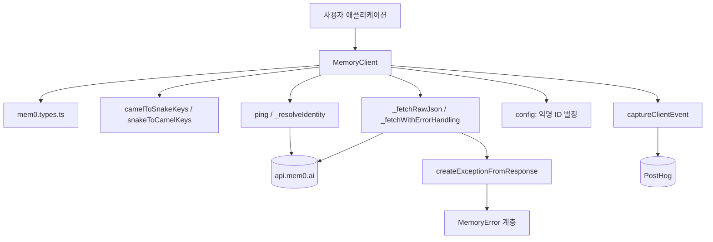
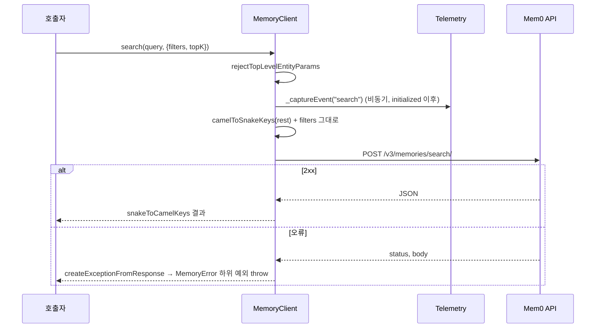
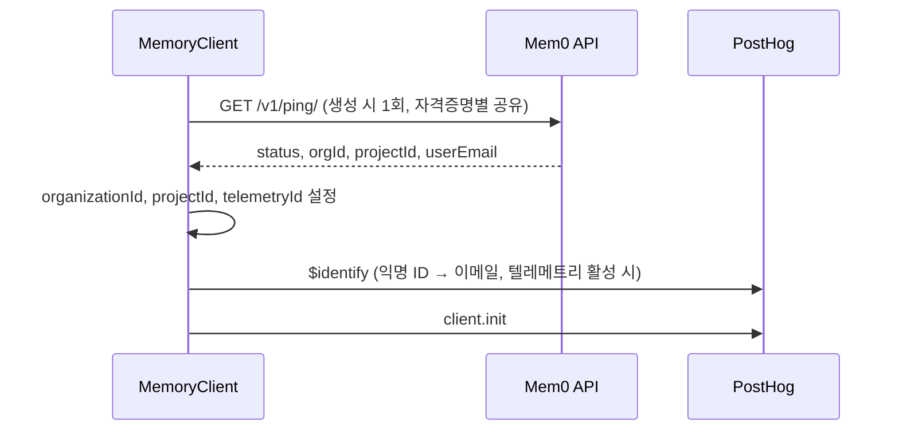
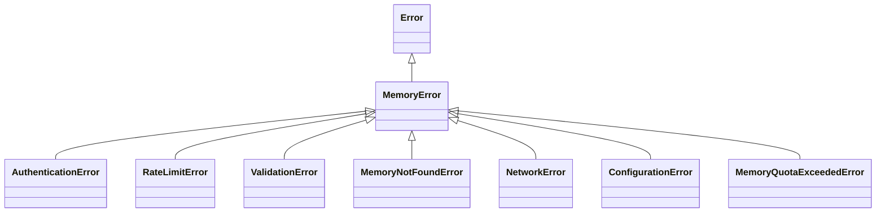

# ts_hosted_client 모듈

## 개요

`ts_hosted_client`는 `mem0ai` npm 패키지에서 **호스팅 플랫폼(`https://api.mem0.ai`)** 을 호출하는 TypeScript 클라이언트입니다. 핵심은 `mem0-ts/src/client/mem0.ts`의 `MemoryClient` 클래스이며, 다음 파일이 함께 동작합니다.

| 파일 | 역할 |
|------|------|
| `mem0-ts/src/client/mem0.ts` | `MemoryClient`: 메모리 CRUD, 검색, 엔터티, 프로젝트, 웹훅, 피드백, 프로필, 내보내기 |
| `mem0-ts/src/client/mem0.types.ts` | 옵션/응답 타입 (`AddMemoryOptions`, `SearchMemoryOptions`, `GetAllMemoryOptions`, `DeleteAllMemoryOptions`, `EntityOptions`, `Message` 등) |
| `mem0-ts/src/client/telemetry.ts` | `UnifiedTelemetry`, `isTelemetryEnabled`, `captureClientEvent` (PostHog 직접 전송) |
| `mem0-ts/src/client/telemetry.types.ts` | `TelemetryOptions` 등 텔레메트리 타입 |
| `mem0-ts/src/common/exceptions.ts` | 구조화된 예외 계층 (`MemoryError` 및 하위 클래스) |

셀프 호스팅 엔진(`Memory`)은 [ts_oss_core](ts_oss_core.md), 이 SDK가 속한 상위 모듈은 [TypeScript_SDK_Core_(Hosted_Client_and_OSS_Engine)](TypeScript_SDK_Core_(Hosted_Client_and_OSS_Engine).md)를 참고하세요. Python 대응 구현은 [py_hosted_client](py_hosted_client.md)입니다. 코드 구조는 `MemoryClient`가 REST 호출을 감싸고, 모든 호출은 `_fetchWithErrorHandling`을 거칩니다.

## 아키텍처



### 주요 설계 포인트

1. **인증/헤더**: `Authorization: Token <apiKey>`, `Content-Type: application/json`, 그리고 `surfaceHeaders()`가 만든 표면 식별 헤더를 붙입니다.
   - `X-Mem0-Client`: **append-only**. 환경변수 `MEM0_CLIENT_STACK` 항목 뒤에 `mem0-js/<SDK_VERSION>`을 추가합니다. `boundedStack`이 최대 4개 항목 / 200자로 제한하며, 문자열을 자르지 않고 항목 단위로 버리되 자기 항목 슬롯은 보존합니다.
   - `X-Mem0-Source`(`MEM0_SOURCE`), `X-Application`(`MEM0_APPLICATION`): **set-once**. 가장 바깥 계층이 설정한 값을 아래 계층이 덮어쓰지 않습니다.
   - `SDK_VERSION`은 tsup `define`의 `__MEM0_SDK_VERSION__`로 주입됩니다 (`mem0-ts/tsup.config.ts`). 미주입 환경에서는 `"dev"`입니다.
2. **키 변환**: 사용자 코드는 camelCase, API는 snake_case입니다. `_preparePayload`/`camelToSnakeKeys`로 요청을, `snakeToCamelKeys`로 응답을 변환합니다. 사용자가 정의한 속성명이 담긴 페이로드(`filters`, 내보내기 `schema`, 프로필 `schema`)는 변환하지 않고 그대로 전달하며, 응답은 `_fetchRawJson`으로 받습니다. `_settingsWithVerbatimSchema`가 응답 속 `schema`를 원문으로 복원합니다.
3. **Identity 해석**: 생성자는 `ping()`을 `_resolveIdentity()`로 비동기 실행합니다. 메모리 요청은 이를 기다리지 않고, 텔레메트리와 `_awaitIdentity()`가 필요한 호출(프로젝트, 웹훅, 프로필)만 대기합니다. 결과는 `(host, apiKey)` 쌍별로 `identityByCredentials` 맵에 공유되고 최대 `identityCacheMax`(기본 50) 개로 FIFO 제한됩니다. 실패한 ping(`telemetryId` 없음)은 캐시에서 제거되어 재시도 가능합니다.
4. **엔터티 파라미터 규칙**: `getAll`, `search`는 `user_id`, `agent_id`, `app_id`, `run_id`(camelCase 포함)를 최상위 옵션으로 받지 않고 `rejectTopLevelEntityParams`로 거부합니다. `filters: { user_id: "..." }`를 사용해야 합니다. `add`, `deleteAll`은 `EntityOptions`를 최상위로 받습니다.
5. **경로 안전**: 경로 세그먼트는 `encodePathSegment`(`encodeURIComponent`)로 인코딩합니다.

## 요청 흐름





## API 엔드포인트 요약

| 메서드 | HTTP | 경로 |
|--------|------|------|
| `ping` | GET | `/v1/ping/` |
| `add` | POST | `/v3/memories/add/` (빈 `messages`는 오류) |
| `update` | PUT | `/v1/memories/{id}/` (`text`/`metadata`/`timestamp`/`expirationDate` 중 하나 이상 필요) |
| `get` | GET | `/v1/memories/{id}/` |
| `getAll` | POST | `/v3/memories/?page=&page_size=` |
| `search` | POST | `/v3/memories/search/` (`output_format: "v1.1"`) |
| `delete` | DELETE | `/v1/memories/{id}/` (`deleteLinked` → `delete_linked`) |
| `deleteAll` | DELETE | `/v1/memories/?...` |
| `history` | GET | `/v1/memories/{id}/history/` |
| `users` | GET | `/v1/entities/` |
| `deleteUser` (deprecated) | DELETE | `/v1/entities/{type}/{id}/` |
| `deleteUsers` | DELETE | `/v2/entities/{type}/{name}/` (인자 없으면 전체 엔터티 삭제) |
| `batchUpdate` / `batchDelete` | PUT / DELETE | `/v1/batch/` |
| `getProject` / `updateProject` | GET / PATCH | `/api/v1/orgs/organizations/{org}/projects/{project}/` (`organizationId`, `projectId` 필요) |
| `getWebhooks` / `createWebhook` | GET / POST | `/api/v1/webhooks/projects/{project}/` |
| `updateWebhook` / `deleteWebhook` | PUT / DELETE | `/api/v1/webhooks/{id}/` |
| `feedback` | POST | `/v1/feedback/` |
| `getProfile` | GET | `/v2/entities/user/{id}/profile/` |
| `generateProfile` / `sampleProfiles` | POST | `/v2/profiles/jobs/` (`Idempotency-Key`, 기본 uuidv7) |
| `getProfileJob` | GET | `statusUrl` 또는 `/v2/profiles/jobs/{id}/` |
| `getProfileSettings` / `updateProfileSettings` | GET / POST | `/v2/profiles/settings/` |
| `createMemoryExport` | POST | `/v1/exports/` (`filters`, `schema` 필수) |
| `getMemoryExport` | POST | `/v1/exports/get/` (`memoryExportId` 또는 `filters` 필요) |

### 프로필 기능 참고

- 생성은 비동기입니다. `getProfile` 응답은 `profile`이 비었는지가 아니라 `status`(`succeeded`, `pending`, `failed`, `not_enabled`, `insufficient_data`)로 분기해야 합니다.
- `generateProfile`/`sampleProfiles`는 작업이 큐에 들어가면 바로 반환하므로 `getProfile` 또는 `getProfileJob`으로 폴링합니다. 같은 `idempotencyKey`를 재사용하면 재시도 시 중복 작업과 과금을 피할 수 있습니다.
- `updateProfileSettings`에서 `schema`와 `customInstructions`는 API 본문의 `entities.user` 아래에 중첩되고, `enabled`만 프로젝트 전체 설정입니다. 평면으로 보내면 `Unsupported settings`로 거부됩니다.
- `sampleProfiles`는 실제 사용자에게 실제로 생성하며 결과가 저장되고 사용량에 포함됩니다.

## 예외 처리 (`mem0-ts/src/common/exceptions.ts`)

`createExceptionFromResponse(status, body)`가 HTTP 상태를 예외로 매핑하며, 각 예외는 `errorCode`(`HTTP_<status>`), `details`, `suggestion`, `debugInfo`를 가집니다.

| 상태 코드 | 예외 |
|-----------|------|
| 400, 409, 422 | `ValidationError` |
| 401, 403 | `AuthenticationError` |
| 404 | `MemoryNotFoundError` |
| 408, 502, 503, 504 | `NetworkError` |
| 413 | `MemoryQuotaExceededError` |
| 429 | `RateLimitError` |
| 500 및 기타 | `MemoryError` |

`ConfigurationError`는 매핑 대상이 아니라 클라이언트 설정이 잘못된 경우를 위한 클래스입니다. `ping()`은 `MemoryError`와 `APIError`는 그대로 전달하고, 그 외는 `APIError("Failed to ping server: ...")`로 감쌉니다. `APIError`는 `mem0.ts` 내부 클래스이며 `MemoryError`와 별개입니다.



## 텔레메트리

- `MEM0_TELEMETRY=false`이면 비활성화됩니다 (`isTelemetryEnabled()`).
- `UnifiedTelemetry`는 PostHog 엔드포인트로 `fetch` POST를 직접 보내며 `shutdown()`은 아무 동작도 하지 않습니다.
- 각 메서드는 `_captureEvent`로 메서드 이름, 인자 개수, 첫 인자의 키만 보냅니다. 값은 보내지 않으며, 이 호출은 `initialized` 이후 요청 경로 밖에서 실행되고 실패는 `console.error`로만 기록됩니다.
- `_maybeAliasAnonToEmail`은 `$identify`로 익명 ID(OSS/CLI)를 이메일에 연결합니다. 한 번 연결한 쌍은 `markMem0Aliased`로 기록합니다.
- `generateHash`는 입력을 쓰지 않고 난수 문자열을 반환합니다. 이름과 달리 API 키의 해시가 아닙니다.

## 사용 예

```typescript
import { MemoryClient } from "mem0ai";

const client = new MemoryClient({ apiKey: process.env.MEM0_API_KEY! });

await client.add([{ role: "user", content: "I prefer dark mode" }], { userId: "alice" });
const { results } = await client.search("UI preferences", { filters: { user_id: "alice" } });
```

## 빌드/테스트 참고

빌드는 `mem0-ts/package.json`, `mem0-ts/tsup.config.ts`, 테스트는 `mem0-ts/jest.config.js`에 정의되어 있습니다. 자세한 내용은 [ts_build_and_config](ts_build_and_config.md)를 참고하세요. CI는 `.github/workflows/ts-sdk-ci.yml`이 담당하며 [CI_CD_and_Repository_Governance](CI_CD_and_Repository_Governance.md)에서 다룹니다.

## 알려진 주의점

- `deleteUser`는 deprecated이며 2.2.0에서 제거 예정입니다. `deleteUsers`를 사용하세요. `deleteUsers`는 엔터티를 순차 삭제하며, 하나가 실패하면 `APIError`를 던지고 중단합니다.
- `deleteUsers`를 인자 없이 호출하면 모든 사용자, 에이전트, 앱, 런을 삭제합니다.
- `getAll`은 `page`, `pageSize`를 쿼리스트링으로, 나머지를 본문으로 보냅니다.
- `client`(axios 인스턴스)는 생성되지만 요청은 대부분 `fetch`로 전송됩니다.
- `deleteWebhook`은 `data.webhookId || data`로 ID를 결정합니다.
- `mem0.ts`는 `./config`, `./utils`를 import하지만 이 모듈 문서의 핵심 컴포넌트에는 포함되지 않았습니다. 세부 동작은 해당 파일을 직접 확인하세요.
