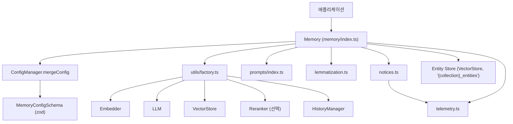
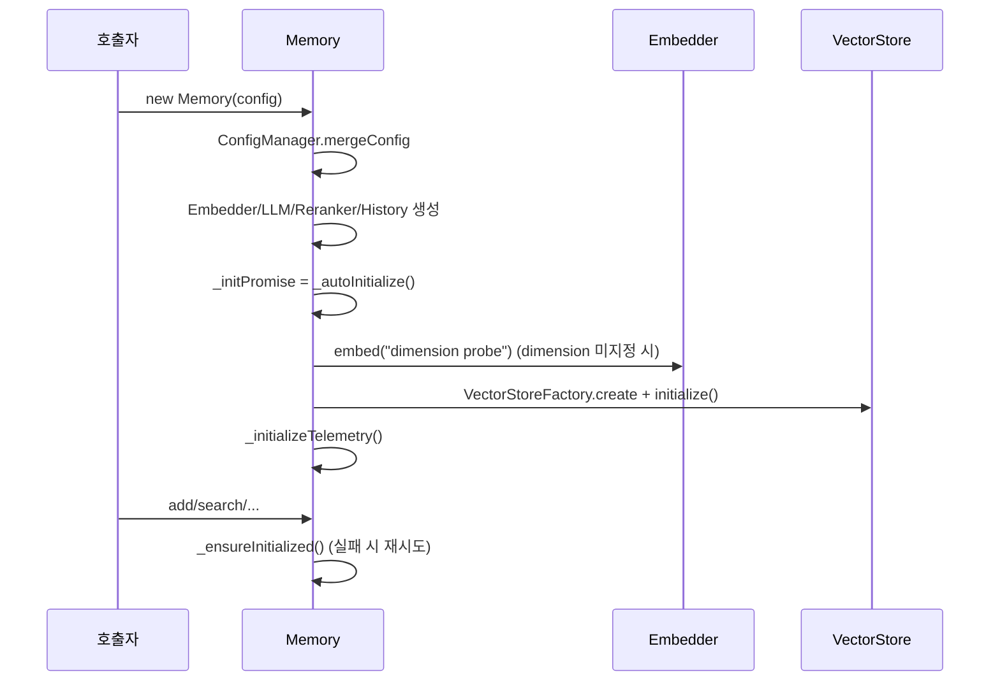
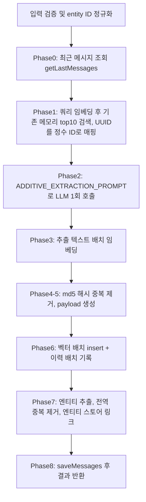
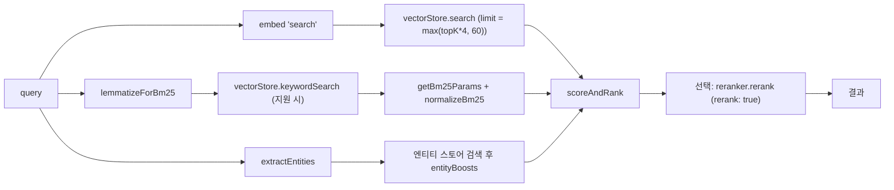

# ts_oss_core 모듈

## 개요

`ts_oss_core`는 TypeScript SDK(`mem0ai` npm 패키지)의 **자체 호스팅(OSS) 메모리 엔진**입니다. `mem0-ts/src/oss/src/` 아래에서 `Memory` 클래스를 중심으로 설정 병합, LLM 기반 사실 추출, 임베딩, 벡터 스토어 저장, 하이브리드 검색(시맨틱 + BM25 + 엔티티 부스트), 이력 기록, 텔레메트리/공지(notice)를 조율합니다.

호스티드 플랫폼 클라이언트는 [ts_hosted_client](ts_hosted_client.md)가, 개별 프로바이더 구현은 [TypeScript_Pluggable_Provider_Layer](TypeScript_Pluggable_Provider_Layer.md)(임베딩/LLM/리랭커/벡터 스토어)가, 이력 저장소 구현은 [ts_oss_history_storage](ts_oss_history_storage.md)가 담당합니다. 이 문서는 그 모두를 엮는 오케스트레이션 계층만 다룹니다.

## 핵심 구성요소

| 파일 | 구성요소 | 역할 |
|------|----------|------|
| `config/manager.ts` | `ConfigManager` | 사용자 설정을 기본값과 병합·정규화하고 `MemoryConfigSchema`(zod)로 검증 |
| `memory/index.ts` | `Memory` | 공개 API: `add`, `get`, `getAll`, `search`, `update`, `delete`, `deleteAll`, `history`, `reset`, `updateProject`, `fromConfig` |
| `memory/memory.types.ts` | `Entity`, `AddMemoryOptions`, `SearchMemoryOptions`, `GetAllMemoryOptions`, `DeleteAllMemoryOptions` | 메서드 옵션 타입 |
| `types/index.ts` | `Message`, `MemoryConfig`, `MemoryConfigSchema` 등 | 설정/결과 타입과 zod 스키마 |
| `prompts/index.ts` | `getFactRetrievalMessages`, `getUpdateMemoryMessages`, `parseMessages` | 프롬프트 및 LLM 응답 파싱(`extractJson`, `AdditiveExtractionSchema`) |
| `utils/factory.ts` | `EmbedderFactory`, `LLMFactory`, `VectorStoreFactory`, `RerankerFactory`, `HistoryManagerFactory` | provider 문자열 → 구현체 인스턴스 |
| `utils/bm25.ts` | `BM25` | 인메모리 BM25 스코어러(k1=1.5, b=0.75) |
| `utils/lemmatization.ts` | `simpleStem`, `lemmatizeForBm25` | 불용어 제거 + 스테밍(`natural` 있으면 Porter, 없으면 `simpleStem`) |
| `utils/logger.ts` | `Logger` | `info/error/debug/warn` 콘솔 로거 |
| `utils/notices.ts` | `resetNoticeConfigCache` 외 | 원격 설정 기반 사용 안내(notice) 로직 |
| `utils/telemetry.ts`, `telemetry.types.ts` | `UnifiedTelemetry`, `captureClientEvent`, `isTelemetryEnabled`, `TelemetryClient` 등 | PostHog 익명 텔레메트리 |

## 아키텍처

프로바이더 구현체는 [TypeScript_Pluggable_Provider_Layer](TypeScript_Pluggable_Provider_Layer.md), 히스토리 구현체(`SQLiteManager`, `MemoryHistoryManager`, `SupabaseHistoryManager`, `DummyHistoryManager`)는 [ts_oss_history_storage](ts_oss_history_storage.md)를 참고하세요.

## ConfigManager

`ConfigManager.mergeConfig(userConfig)`는 다음 정규화를 수행한 뒤 `MemoryConfigSchema.parse`로 검증합니다.

- **embedder**: 기본 모델(OpenAI)은 `fastembed`에는 적용하지 않음. `lmstudio_base_url`, `embedding_dims` 같은 snake_case 키를 camelCase로 흡수. 사용자 키는 spread로 보존(Vertex AI 등).
- **vectorStore**: provider를 소문자로 정규화(`provider === "memory"` 비교 오류 방지). `dimension`은 명시값이 없으면 `undefined`로 두어 `Memory._autoInitialize()`가 프로브 임베딩으로 자동 감지. 사용자 `client`가 있으면 우선 사용.
- **llm**: OpenAI 기본값(`baseURL`, `model`)은 `openai`/`openai_structured`에만 적용(다른 프로바이더의 기본값·환경변수 폴백이 가려지는 문제 방지). `vllm_base_url`, `top_p`, `max_tokens`, AWS Bedrock 필드 등 snake_case 허용.
- **historyStore**: 우선순위는 `historyStore.config` > 최상위 `historyDbPath` > 기본값. `disableHistory`, `reranker`, `customInstructions`는 그대로 전달.

## Memory 클래스

### 초기화

모든 공개 메서드는 `_ensureInitialized()`를 먼저 await 합니다. 초기화 실패는 저장되었다가 다음 호출에서 한 번 재시도되며, 그래도 실패하면 예외를 던집니다.

### add() — V3 단계별 배치 파이프라인

`infer: false`이면 system 메시지를 제외하고 메시지를 그대로 저장합니다. 기본(`infer: true`)은 다음 단계를 거칩니다.

- 매핑 정수 ID는 LLM 환각 방지용입니다.
- 에이전트 범위(`agent_id`만 있고 `user_id` 없음)에서는 `AGENT_CONTEXT_SUFFIX`가 프롬프트에 추가됩니다.
- LLM 호출 실패는 `LLMError`로 래핑됩니다. 응답은 `extractJson`으로 정리한 뒤 `AdditiveExtractionSchema`로 파싱하고, 실패하면 폴백 파싱합니다.
- 배치 insert/임베딩/이력 기록이 실패하면 개별 처리로 폴백합니다.
- `userId`/`agentId`/`runId` 중 최소 하나가 필요하며, 호출자 `metadata`의 식별 키는 `stripIdentityKeys`로 제거됩니다.
- `timestamp` 옵션은 OSS에서 지원하지 않아 에러(notice 문구)를 던집니다.

### search() — 하이브리드 스코어링

- 기본값: `topK = 20`, `threshold = 0.1`. `validateSearchParams`로 범위(threshold 0~1, topK 비음수 정수) 검증.
- 최상위 entity 파라미터는 `rejectTopLevelEntityParams`로 거부되고 `filters: { user_id }` 형태만 허용됩니다.
- `AND`/`OR`/`NOT`, `eq/ne/gt/gte/lt/lte/in/nin/contains/icontains`, `"*"` 등 고급 필터는 `_processMetadataFilters`가 `$or`/`$not` 형태로 변환합니다.
- 엔티티 부스트: 쿼리 엔티티 최대 8개, 유사도 0.5 이상만 반영, `similarity * ENTITY_BOOST_WEIGHT * memoryCountWeight`.
- 만료된 메모리(`payloadIsExpired`)는 `showExpired`가 아니면 제외. 리랭킹 실패 시 원본 결과로 폴백.
- `referenceDate`는 OSS 미지원(에러).

### 기타 메서드

| 메서드 | 동작 |
|--------|------|
| `get(id)` | 벡터 스토어 조회 후 `MemoryItem`으로 변환(예약 키 제외 payload는 `metadata`로) |
| `getAll({ filters, topK })` | 필터 필수, 만료 제외를 위해 over-fetch 후 `topK`로 자름 |
| `update(id, text \| options)` | `text`/`metadata`/`expirationDate` 중 하나 필요. `data`는 deprecated. 텍스트 변경 시 엔티티 링크 재구성 |
| `delete(id)` | 벡터 삭제 + `DELETE` 이력 + 엔티티 스토어에서 memory ID 제거 |
| `deleteAll(filters)` | 1000건 배치로 반복 삭제, 반복 배치 감지 시 중단. 필터 없으면 `reset()` 안내 에러 |
| `history(id)` | `HistoryManager.getHistory` |
| `reset()` | 이력/벡터/엔티티 컬렉션 삭제 후 팩토리로 재생성 (`langchain` 프로바이더는 컬렉션 삭제 생략) |
| `updateProject()` | OSS에서는 항상 에러(`decay` 요청 시 전용 메시지) |
| `Memory.fromConfig(dict)` | `MemoryConfigSchema.parse` 후 인스턴스 생성 |

### 엔티티 스토어

`getEntityStore()`가 같은 프로바이더로 `{collectionName}_entities` 컬렉션을 지연 생성합니다(`memory` 프로바이더는 `_entities.db`, `databricks`는 `tableName` 접미사). 엔티티 payload는 `data`, `entityType`, `linkedMemoryIds`와 스코프 ID를 가지며, 정확 일치(정규화 텍스트) 우선, 없으면 유사도 ≥ 0.95로 병합합니다. 정리 중 오류는 삼켜서 주 작업을 막지 않습니다.

## 팩토리 (`utils/factory.ts`)

provider 문자열을 소문자로 비교하는 switch 기반 팩토리입니다. 지원하지 않는 값은 `Unsupported ... provider` 에러를 던집니다.

| 팩토리 | 지원 provider (일부) |
|--------|----------------------|
| `EmbedderFactory` | `openai`, `aws_bedrock`, `ollama`, `lmstudio`, `together`, `google`/`gemini`, `azure_openai`, `fastembed`, `langchain`, `vertexai`, `huggingface` |
| `LLMFactory` | `openai`, `openai_structured`, `anthropic`, `groq`, `ollama`, `lmstudio`, `google`/`gemini`, `azure_openai`, `mistral`, `langchain`, `deepseek`, `xai`, `sarvam`, `aws_bedrock`, `litellm`, `minimax`, `together`, `vllm` |
| `VectorStoreFactory` | `memory`, `qdrant`, `chroma`, `redis`, `valkey`, `supabase`, `pgvector`, `pinecone`, `milvus`, `mongodb`, `weaviate`, `elasticsearch`, `opensearch`, `azure-ai-search`, `s3_vectors`, `oracledb` 등 |
| `RerankerFactory` | `cohere`, `zero_entropy`, `sentence_transformer`, `huggingface`, `llm_reranker` |
| `HistoryManagerFactory` | `sqlite`, `supabase`, `memory` |

`llm_reranker`는 중첩 `llm` 설정 또는 최상위 `provider`/`model`(기본 `gpt-5-mini`)로 내부 LLM을 만들어 `LLMReranker`에 주입합니다.

## 유틸리티

- **lemmatization**: 소문자화 → 영숫자 토큰화 → 불용어 제거 → 스테밍. `-ing` 단어는 원형도 함께 유지해 명사/동사 모호성을 완화합니다. 메모리 payload의 `textLemmatized`와 쿼리 양쪽에 같은 함수를 적용해 일관성을 맞춥니다.
- **BM25**: 문서 토큰 배열 기반의 자체 구현. `Memory.search`는 벡터 스토어의 `keywordSearch` 결과를 정규화하는 방식을 쓰며, 이 클래스는 독립 유틸입니다.
- **prompts**: `FactRetrievalSchema`, `MemoryUpdateSchema`(레거시 사실 추출/업데이트 흐름), V3 `ADDITIVE_EXTRACTION_PROMPT`, `generateAdditiveExtractionPrompt`. `extractJson`은 코드펜스, `<think>` 블록, OpenRouter/로컬 모델 노이즈 토큰을 제거하고 균형 잡힌 JSON 객체/배열을 찾습니다.

## 텔레메트리와 Notice

- `MEM0_TELEMETRY=false`로 비활성화합니다. 이벤트는 PostHog(`POSTHOG_HOST`)로 전송되며, `init`/`reset`/`notice_displayed`를 제외한 이벤트는 기본 10%로 샘플링됩니다(`MEM0_TELEMETRY_SAMPLE_RATE`로 조정, `sample_rate` 필드에 기록).
- `Memory.telemetryId`는 `getOrCreateMem0UserId()`(client 설정) 또는 벡터 스토어의 저장된 user ID에서 얻고, 실패 시 `"anonymous"`입니다.
- `notices.ts`는 원격 JSON 설정(`REMOTE_CONFIG_URL`, 1시간 캐시, 500ms 타임아웃, 번들 폴백)과 해시 기반 displayed/holdout 변형으로 first-run, temporal/decay 사용, 규모 임계값(topK ≥ 50, 메모리 2000개), 느린 쿼리(>2000ms) 안내를 stderr에 출력합니다. 주간 노출 상한(7일당 10회)과 상태는 `~/.mem0/config.json`(`MEM0_DIR`로 변경)에 원자적으로 기록됩니다. 모든 notice 로직은 예외를 삼켜 핵심 기능에 영향을 주지 않으며, `resetNoticeConfigCache`는 캐시 초기화(테스트용)입니다.

## 설계 메모

- 부수 기능(텔레메트리, notice, 엔티티 링크, 이력)은 **best-effort**로 실패해도 메모리 연산을 중단시키지 않습니다. 반면 입력 검증과 LLM 추출 실패(`LLMError`)는 즉시 예외로 전파됩니다.
- 내부 저장 키는 snake_case(`user_id`, `agent_id`, `run_id`)이고, 공개 옵션은 camelCase(`userId`)와 `filters`를 모두 받습니다.
- 빌드/테스트 설정은 `mem0-ts/package.json`, `mem0-ts/tsup.config.ts`, `mem0-ts/jest.config.js`를 참고하세요. Python 대응 구현은 [py_memory_core](Python_SDK_Core_(Memory_Engine_and_Hosted_Client).md)입니다.
