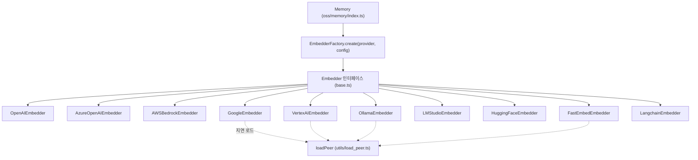
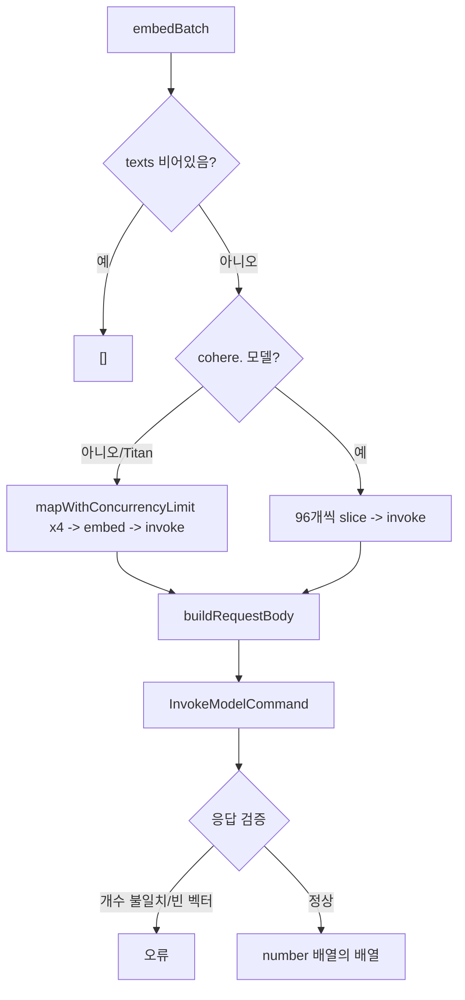

# ts_oss_embeddings 모듈

## 개요

`ts_oss_embeddings`는 TypeScript OSS SDK(`mem0-ts/src/oss`)에서 텍스트를 벡터로 변환하는 **임베더(Embedder) 프로바이더 계층**이다. 모든 프로바이더는 `mem0-ts/src/oss/src/embeddings/base.ts`의 `Embedder` 인터페이스를 구현하며, `EmbedderFactory`(`mem0-ts/src/oss/src/utils/factory.ts`)가 설정의 `provider` 문자열로 인스턴스를 만든다. Python 쪽 대응 계층은 [py_embeddings](py_embeddings.md)이다.

```ts
export interface Embedder {
  embed(text: string, memoryAction?: "add" | "update" | "search"): Promise<number[]>;
  embedBatch(texts: string[], memoryAction?: "add" | "update" | "search"): Promise<number[][]>;
}
```

`memoryAction`은 선택 인자이며, 작업 유형(저장/검색)별로 임베딩 타입을 구분하는 프로바이더(Bedrock-Cohere, Vertex AI)만 사용한다. 나머지는 무시한다.

## 구성 요소

| 파일 | 클래스 | 백엔드 | 기본 모델 |
|---|---|---|---|
| `embeddings/openai.ts` | `OpenAIEmbedder` | OpenAI (`openai` SDK) | `text-embedding-3-small` |
| `embeddings/azure.ts` | `AzureOpenAIEmbedder` | Azure OpenAI | `text-embedding-3-small` |
| `embeddings/aws_bedrock.ts` | `AWSBedrockEmbedder` | AWS Bedrock (Titan / Cohere) | `amazon.titan-embed-text-v1` |
| `embeddings/google.ts` | `GoogleEmbedder` | `@google/genai` | `gemini-embedding-001` |
| `embeddings/vertexai.ts` | `VertexAIEmbedder` | `@google-cloud/aiplatform` | `gemini-embedding-001` |
| `embeddings/ollama.ts` | `OllamaEmbedder` | Ollama 로컬 서버 | `nomic-embed-text:latest` |
| `embeddings/lmstudio.ts` | `LMStudioEmbedder` | LM Studio (OpenAI 호환) | `nomic-ai/nomic-embed-text-v1.5-GGUF/...` |
| `embeddings/huggingface.ts` | `HuggingFaceEmbedder` | TEI/HF 호환 `/v1/embeddings` | `tei` |
| `embeddings/fastembed.ts` | `FastEmbedEmbedder` | 로컬 ONNX (`fastembed`) | `fast-bge-small-en-v1.5` |
| `embeddings/langchain.ts` | `LangchainEmbedder` | LangChain `Embeddings` 인스턴스 | (사용자 제공) |

`EmbedderFactory`는 위 외에 `TogetherEmbedder`(`embeddings/together.ts`)도 등록한다. 해당 파일은 이번 핵심 컴포넌트에 포함되지 않아 여기서 다루지 않는다.

## 아키텍처



- 상위 호출자는 [ts_oss_core](ts_oss_core.md)의 `Memory`이다. 팩토리 등록은 `utils/factory.ts`에 있으며 알 수 없는 provider는 `Unsupported embedder provider` 오류를 던진다.
- 같은 계층의 형제 모듈: [ts_oss_llms](ts_oss_llms.md), [ts_oss_rerankers](ts_oss_rerankers.md), [ts_oss_vector_stores](ts_oss_vector_stores.md). 생성된 벡터는 벡터 스토어에 저장·검색된다.
- 설정 타입 `EmbeddingConfig`, `VertexAIConfig`는 `../types`에 정의된다.

## 공통 설계 패턴

### 1. 선택적 피어 의존성의 지연 로드
`google`, `vertexai`, `ollama`, `fastembed`는 `loadPeer(pkg, label, loader)`로 SDK를 첫 사용 시점에 동적 `import`한다. 설치되지 않았으면 `npm install <pkg>` 안내 오류를 낸다. Bedrock은 자체 `loadSdk()`를 두어 `ERR_MODULE_NOT_FOUND`/`MODULE_NOT_FOUND`일 때만 설치 안내를 하고, 그 외 오류(예: Node 버전 불일치)는 그대로 다시 던진다.

### 2. 클라이언트 메모이제이션
Bedrock(`clientPromise`), Vertex(`initPromise`), FastEmbed(`embeddingModel`)는 초기화 Promise를 캐시해 동시 호출이 하나의 클라이언트를 공유하게 한다. 실패하면 캐시를 비워 일시적 오류가 영구 장애가 되지 않게 한다.

### 3. 배치 처리와 순서 보장

| 프로바이더 | 배치 전략 |
|---|---|
| OpenAI, Azure | 100개씩 분할, 응답을 `index`로 정렬, 총 개수 불일치 시 오류 |
| HuggingFace | 단일 요청, `index` 정렬, 개수 검증, 빈 배열은 `[]` |
| LM Studio | 단일 요청, `index` 정렬, 개행을 공백으로 정규화 |
| Google | `contents`에 배열을 한 번에 전달 |
| Vertex AI | 모델별 한도로 분할: `gemini-embedding*`은 1, 그 외 250. 개수 검증 |
| Bedrock-Cohere | 96개씩 분할(`COHERE_MAX_BATCH`) |
| Bedrock-Titan | 텍스트당 1회 호출, 동시성 4(`TITAN_MAX_CONCURRENCY`)로 제한(`mapWithConcurrencyLimit`) |
| Ollama | `Promise.all`로 `embed`를 병렬 호출(동시성 제한 없음) |
| FastEmbed | 개행을 공백으로 바꾼 뒤 비동기 이터레이터로 수집 |
| Langchain | `embedDocuments`에 위임 (`embed`는 `embedQuery`) |

### 4. 작업 유형별 임베딩 타입
- **Bedrock-Cohere**: `add`/`update` → `search_document`, `search` → `search_query` (`COHERE_INPUT_TYPES`). 검색 쿼리를 문서 모드로 임베딩하면 검색 품질이 조용히 저하되기 때문이다.
- **Vertex AI**: 기본 `RETRIEVAL_DOCUMENT`(add/update), `RETRIEVAL_QUERY`(search). 설정 `memoryAddEmbeddingType` 등으로 재정의한다. `memoryAction`이 없을 때 `embed`는 `SEMANTIC_SIMILARITY`, `embedBatch`는 `add`를 기본으로 쓴다.

## 프로바이더별 세부 사항

### AWSBedrockEmbedder

- 자격 증명: `awsAccessKeyId`와 `awsSecretAccessKey`는 쌍으로 있어야 하며 일부만 주면 생성자에서 오류. 모두 생략하면 AWS 기본 자격 증명 체인을 쓴다. 리전은 `awsRegion` → `AWS_REGION` → `us-west-2`.
- Cohere v4(`embed-v4`)만 `embedding_types`, `output_dimension`을 보내고, Titan은 `titan-embed-text-v2`일 때만 `dimensions`를 보낸다. 응답 형태(Titan 단일 `embedding`, Cohere v3 평면 `embeddings`, v4 `embeddings.float`)를 모두 처리한다.

### OpenAIEmbedder / AzureOpenAIEmbedder
- OpenAI는 `baseURL || url`로 호환 서버를 지원하고 `encoding_format: "float"`를 보낸다. `embeddingDims`가 있으면 `dimensions`를 전달한다.
- Azure는 `apiKey`와 `modelProperties.endpoint`가 필수이며, 나머지 `modelProperties`는 `AzureOpenAI` 생성자에 전개된다.

### GoogleEmbedder / VertexAIEmbedder
- Google: `apiKey` 또는 `GOOGLE_API_KEY`. `embeddingDims`는 `outputDimensionality`로 전달.
- Vertex: 기본 차원 256, 위치는 `location` → `GCP_LOCATION` → `us-central1`. 프로젝트 ID는 `googleProjectId` → `GCP_PROJECT_ID` → `GOOGLE_CLOUD_PROJECT` → `GCLOUD_PROJECT` → ADC 순으로 결정한다. 자격 증명은 `vertexCredentialsJson`(키 파일 경로) 또는 `googleServiceAccountJson`(JSON 문자열/객체). `task_type`은 `parameters`가 아니라 **instance** 안에 넣어야 적용된다. 응답은 `isValidEmbedding`(`EmbeddingResponse` 형태)으로 검증한다.

### OllamaEmbedder
- 호스트: `url || baseURL || http://localhost:11434`. 생성자에서 `ensureModelExists()`를 비동기로 호출해 모델이 없으면 `pull`한다(오류는 로그만 남김). `embed` 때도 재확인하며 `initialized` 플래그로 중복 호출을 피한다. 기본 차원은 768.

### LMStudioEmbedder / HuggingFaceEmbedder
- 둘 다 `openai` 클라이언트를 호환 엔드포인트에 연결한다. LM Studio 기본 URL은 `http://localhost:1234/v1`, 기본 API 키 `lm-studio`.
- HuggingFace는 base URL이 필수(`huggingfaceBaseUrl` → `baseURL` → `url` → `HUGGINGFACE_BASE_URL`). Python의 로컬 sentence-transformers 경로는 TS에 없다.

### FastEmbedEmbedder
- 지원 모델을 `SUPPORTED_MODELS` 리터럴로 미러링해 생성자에서 동기 검증한다. fastembed에 모델이 추가되면 수동으로 동기화해야 한다.

### LangchainEmbedder
- `config.model`에 `embedQuery`/`embedDocuments`를 가진 초기화된 인스턴스를 넘겨야 한다. 오류는 콘솔에 기록하고 다시 던진다.

## 새 임베더 추가 방법
1. `embeddings/<name>.ts`에 `Embedder`를 구현하는 클래스를 만든다. 선택 SDK는 `loadPeer`로 지연 로드한다.
2. `utils/factory.ts`의 `EmbedderFactory.create`에 provider 문자열을 추가한다.
3. 필요한 설정 필드를 `../types`의 `EmbeddingConfig`에 추가한다.
4. 공개 API가 바뀌면 `docs/`도 같은 PR에서 갱신한다 (저장소 규칙).

## 참고
- 패키지 빌드/테스트 설정: `mem0-ts/package.json`, `mem0-ts/tsup.config.ts`, `mem0-ts/jest.config.js`
- Python 대응 구현: [py_embeddings](py_embeddings.md)
