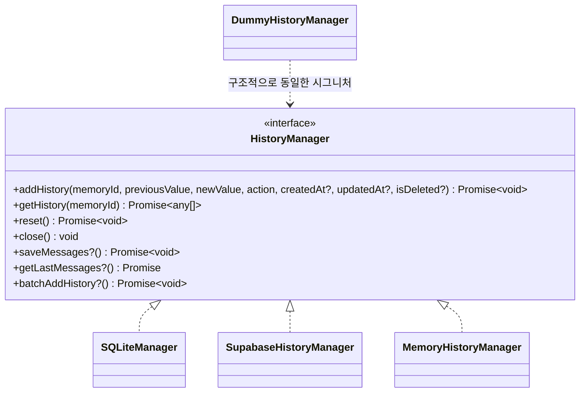
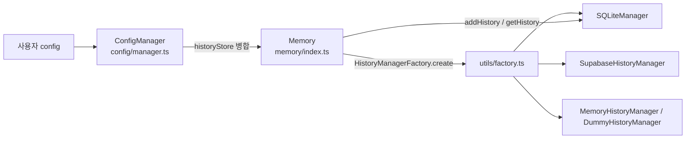
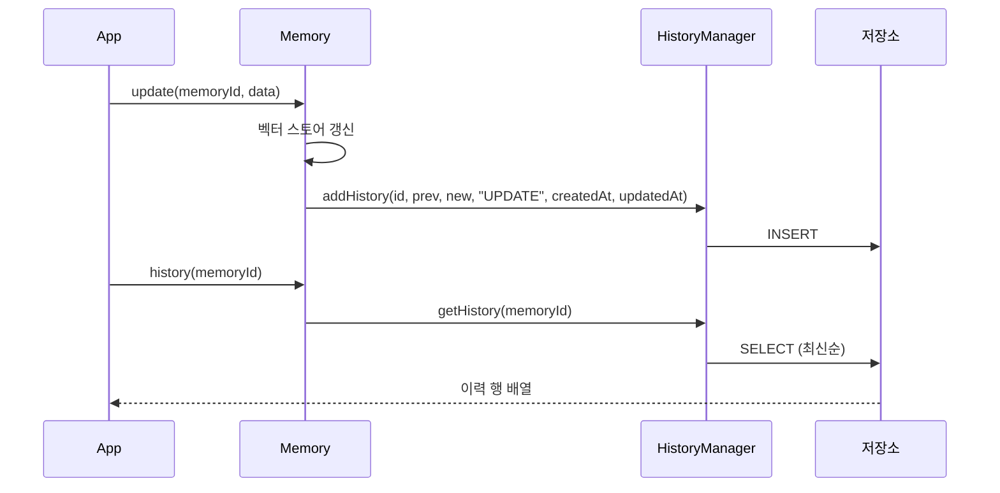

# ts_oss_history_storage

## 개요

`ts_oss_history_storage`는 TypeScript OSS SDK(`mem0-ts/src/oss`)에서 메모리의 **변경 이력(audit trail)** 을 저장하는 계층이다. `Memory.add / update / delete`가 수행될 때마다 이전 값·새 값·액션을 기록하고, `Memory.history()`가 이를 조회한다. 모든 구현체는 `mem0-ts/src/oss/src/storage/base.ts`의 `HistoryManager` 인터페이스를 따르며, 백엔드는 설정(`historyStore.provider`)으로 교체된다.

| 구현체 | 파일 | 저장소 | 영속성 |
|---|---|---|---|
| `SQLiteManager` | `storage/SQLiteManager.ts` | `better-sqlite3` 파일/인메모리 DB | 영속(기본값) |
| `SupabaseHistoryManager` | `storage/SupabaseHistoryManager.ts` | Supabase 테이블 | 영속(원격) |
| `MemoryHistoryManager` | `storage/MemoryHistoryManager.ts` | 프로세스 내 `Map` | 휘발성 |
| `DummyHistoryManager` | `storage/DummyHistoryManager.ts` | 없음(no-op) | 이력 비활성화 |

Python 쪽 대응 구현은 [py_memory_core](Python_SDK_Core_(Memory_Engine_and_Hosted_Client).md)의 `history_storage_and_setup`(`SQLiteManager`)이며, 상위 모듈 맥락은 [ts_oss_core](TypeScript_SDK_Core_(Hosted_Client_and_OSS_Engine).md)를 참고한다.

---

## 아키텍처



- `HistoryManager`의 필수 메서드는 `addHistory`, `getHistory`, `reset`, `close`이다.
- `saveMessages`, `getLastMessages`, `batchAddHistory`는 **V3 선택 메서드**로, 현재는 `SQLiteManager`만 구현한다. 호출 측은 존재 여부를 확인한 후 사용해야 한다.
- `DummyHistoryManager`는 `implements HistoryManager`를 선언하지 않지만 필수 메서드 시그니처가 동일해 구조적 타이핑으로 호환된다.

### 컴포넌트 간 관계 / 생성 흐름



`ConfigManager`(`config/manager.ts`)의 병합 우선순위는 다음과 같다.

1. `historyStore.config.historyDbPath` (명시적 설정)
2. 최상위 `historyDbPath` (하위 호환; provider가 sqlite일 때 반영)
3. 기본값 `config/defaults.ts`의 `memory.db`

`HistoryManagerFactory`는 sqlite 경로가 비어 있으면 `":memory:"`를 사용한다. `Memory`는 생성 시 `HistoryManagerFactory.create(provider, historyStore)`로 구현체를 얻는다. 팩토리가 지원하는 provider 전체 목록은 `utils/factory.ts`를 확인할 것.

---

## 컴포넌트 상세

### SQLiteManager

기본 구현체. 생성자에서 `ensureSQLiteDirectory(dbPath)`로 디렉터리를 보장한 뒤 `better-sqlite3`로 DB를 연다.

테이블:

```sql
memory_history(id INTEGER PK AUTOINCREMENT, memory_id TEXT NOT NULL,
               previous_value TEXT, new_value TEXT, action TEXT NOT NULL,
               created_at TEXT, updated_at TEXT, is_deleted INTEGER DEFAULT 0)
messages(id TEXT PK, session_scope TEXT, role TEXT, content TEXT,
         name TEXT, created_at TEXT)
```

| 메서드 | 동작 |
|---|---|
| `addHistory` | prepared statement(`stmtInsert`)로 INSERT. `createdAt`/`updatedAt` 미지정 시 `NULL` 저장 |
| `getHistory` | `WHERE memory_id = ? ORDER BY id DESC` (최신순, 개수 제한 없음) |
| `batchAddHistory` | 트랜잭션 하나로 다건 INSERT |
| `saveMessages` | 트랜잭션 내에서 메시지 INSERT 후, `session_scope`별 최근 10개만 남기고 삭제(evict) |
| `getLastMessages` | 최근 `limit`(기본 10)개를 조회해 시간 오름차순으로 반환 |
| `reset` | 두 테이블 `DROP` 후 `init()`으로 재생성 |
| `close` | DB 연결 종료 |

주의: `createdAt`을 생략하면 `NULL`이 저장되므로, 호출 측에서 타임스탬프를 넘기지 않으면 `created_at`이 비어 있게 된다. 또한 `saveMessages`의 eviction은 `created_at` 정렬 기준이다.

### SupabaseHistoryManager

- 피어 의존성 `@supabase/supabase-js`를 `loadPeer`(`utils/load_peer`)로 **지연 로딩**한다. 설치되지 않았으면 안내 메시지와 함께 실패한다.
- 생성자는 `initializeSupabase()`를 fire-and-forget(`.catch(console.error)`)으로 호출해 테이블 존재 여부를 확인한다. 테이블이 없으면 `create table` SQL을 콘솔에 출력하고 오류를 던진다. 클라이언트 중복 생성 경쟁은 `createClient`가 연결을 열지 않으므로 무해하다고 소스에 명시되어 있다.
- 테이블명 기본값은 `memory_history`(`tableName`으로 변경 가능). `id`는 `uuidv4()` 문자열이다.
- `getHistory`는 `created_at` 내림차순, **최대 100건**.
- `reset`은 `delete().neq("id", "")`로 전체 행을 삭제한다. `close`는 no-op.
- 오류는 `console.error` 후 re-throw 한다.

### MemoryHistoryManager

`Map<string, HistoryEntry>`에 UUID 키로 보관하는 휘발성 구현. `getHistory`는 `memory_id` 필터 → `created_at` 내림차순 → 최대 100건. 테스트나 영속성이 필요 없는 환경에 적합하다. 프로세스 종료 시 모두 사라진다.

### DummyHistoryManager

모든 메서드가 아무 일도 하지 않으며 `getHistory`는 항상 `[]`를 반환한다. 이력 기능을 완전히 끄고 싶을 때 쓴다.

---

## 데이터 흐름



`action` 값(예: ADD/UPDATE/DELETE)과 `is_deleted` 플래그의 의미는 `Memory`(`memory/index.ts`) 호출 측에서 결정되며, 이 모듈은 값을 그대로 저장한다.

---

## 구현체 비교 시 유의점

| 항목 | SQLite | Supabase | Memory | Dummy |
|---|---|---|---|---|
| `id` 타입 | 정수 auto-increment | UUID 문자열 | UUID 문자열 | - |
| 정렬 기준 | `id DESC` | `created_at DESC` | `created_at DESC` | - |
| 조회 상한 | 없음 | 100 | 100 | - |
| `createdAt` 미지정 | `NULL` | 현재 시각 | 현재 시각 | - |
| V3 선택 메서드 | 지원 | 미지원 | 미지원 | 미지원 |

백엔드를 바꾸면 위 차이(조회 상한, 타임스탬프 기본값)로 `history()` 결과가 달라질 수 있다.

## 설정 예시

```ts
import { Memory } from "mem0ai/oss";

// 기본(SQLite) — 경로만 지정
new Memory({ historyDbPath: "/tmp/history.db" });

// Supabase
new Memory({
  historyStore: {
    provider: "supabase",
    config: { supabaseUrl: "...", supabaseKey: "...", tableName: "memory_history" },
  },
});
```

## 관련 파일 / 문서

- 인터페이스: `mem0-ts/src/oss/src/storage/base.ts`
- 팩토리: `mem0-ts/src/oss/src/utils/factory.ts` (`HistoryManagerFactory`)
- 설정 병합: `mem0-ts/src/oss/src/config/manager.ts`, `config/defaults.ts`
- 호환성 테스트: `mem0-ts/src/oss/src/tests/sqlite-backward-compat.test.ts`
- 상위 모듈: [ts_oss_core](TypeScript_SDK_Core_(Hosted_Client_and_OSS_Engine).md)
- Python 대응: [Python_SDK_Core](Python_SDK_Core_(Memory_Engine_and_Hosted_Client).md) (`mem0/memory/storage.py::SQLiteManager`)
