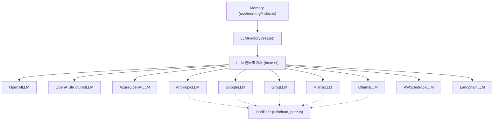
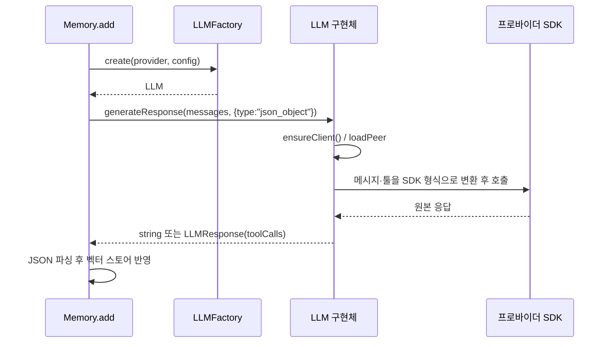

# ts_oss_llms 모듈

`mem0-ts/src/oss/src/llms/` 아래의 **TypeScript OSS SDK LLM 프로바이더 계층**입니다. 자체 호스팅 `Memory` 엔진이 사실(fact) 추출과 메모리 갱신(ADD/UPDATE/DELETE 판단)에 사용하는 LLM 호출을 공통 인터페이스 `LLM` 뒤로 감춥니다. Python 쪽 대응 계층은 [py_llms](py_llms.md)이며, 기본값·동작은 가능한 한 Python 프로바이더와 맞춰져 있습니다.

## 1. 역할과 위치

- 계약: `llms/base.ts`의 `LLM` 인터페이스(`generateResponse`, `generateChat`)와 `LLMResponse`(`content`, `role`, 선택적 `toolCalls[{name, arguments}]`).
- 생성: `utils/factory.ts`의 `LLMFactory.create(provider, config)`가 provider 문자열(소문자 비교)로 구현체를 고릅니다. 자세한 내용은 [ts_oss_core](ts_oss_core.md) 참고.
- 소비: `Memory`(`memory/index.ts`)가 [ts_oss_core](ts_oss_core.md)의 프롬프트(`getFactRetrievalMessages`, `getUpdateMemoryMessages`)를 만들어 `generateResponse`로 호출합니다.
- 형제 계층: [ts_oss_embeddings](ts_oss_embeddings.md), [ts_oss_rerankers](ts_oss_rerankers.md), [ts_oss_vector_stores](ts_oss_vector_stores.md). `LLMReranker`도 이 `LLM` 인터페이스를 재사용합니다.



`LLMFactory`가 지원하는 provider 키: `openai`, `openai_structured`, `anthropic`, `groq`, `ollama`, `lmstudio`, `google`/`gemini`, `azure_openai`, `mistral`, `langchain`, `deepseek`, `xai`, `sarvam`, `aws_bedrock`, `litellm`, `minimax`, `together`, `vllm`. 이 문서의 핵심 컴포넌트는 그중 아래 10개입니다(나머지는 별도 파일에서 OpenAI 호환 방식으로 구현).

## 2. 공통 인터페이스

| 메서드 | 용도 |
|---|---|
| `generateResponse(messages, responseFormat?, tools?)` | 메모리 엔진의 JSON/툴 호출용. 텍스트면 `string`, 툴 호출이 있으면 `LLMResponse` 반환 |
| `generateChat(messages)` | 단순 채팅 완성. 항상 `LLMResponse` |

공통 규칙:
- `msg.content`가 문자열이 아니면(이미지 등) 대부분 `JSON.stringify`로 직렬화합니다.
- 툴 정의는 OpenAI 형식(`{type:"function", function:{name, description, parameters}}`)을 입력으로 받아 각 SDK 형식으로 변환합니다.
- `toolCalls[].arguments`는 항상 **JSON 문자열**입니다.

## 3. 프로바이더별 컴포넌트

| 클래스 | SDK 로딩 | 기본 모델 | 특징 |
|---|---|---|---|
| `OpenAILLM` | 정적 `import OpenAI` | `gpt-5-mini` | `apiKey`, `baseURL`, `timeout` 전달. `response_format`, `tools`+`tool_choice:"auto"` |
| `OpenAIStructuredLLM` | 정적 | `gpt-5-mini` | `tools`가 있으면 툴만, 없으면 `response_format`만 전송(둘을 동시에 보내지 않음). `responseFormat`이 `null` 허용 |
| `AzureOpenAILLM` | 정적 `AzureOpenAI` | `gpt-5-mini` | `apiKey`와 `modelProperties.endpoint` 필수, 나머지 `modelProperties`는 클라이언트에 전달 |
| `AnthropicLLM` | `loadPeer("@anthropic-ai/sdk")` 지연 로딩 | `claude-sonnet-4-6` | system 메시지를 분리해 `system` 필드로 전달. `temperature`(기본 0.1)가 있으면 `top_p` 미전송(API가 둘 동시 거부). `max_tokens` 기본 2000. `baseURL` 지원. 툴 사용 시 `text`/`tool_use` 블록 분리, 비툴 응답은 첫 `text` 블록 탐색(thinking 블록 대응) |
| `GoogleLLM` | `loadPeer("@google/genai")` | `gemini-2.0-flash` | system 역할을 `model`로 매핑, `json_object`면 `responseMimeType: "application/json"`, 응답의 ```` ```json ```` 펜스 제거, `functionCalls`→`toolCalls` |
| `GroqLLM` | `loadPeer("groq-sdk")` | `llama3-70b-8192` | `GROQ_API_KEY` 환경변수 대체. `generateResponse`는 툴 미지원(문자열만 반환) |
| `MistralLLM` | `loadPeer("@mistralai/mistralai")` | `mistral-tiny-latest` | `contentToString`으로 ContentChunk 배열 처리, 빈 `choices`는 `""` |
| `OllamaLLM` | `loadPeer("ollama")` | `llama3.1:8b` | 호스트 기본 `http://localhost:11434`. `ensureModelExists`가 `list` 후 없으면 `pull`. `json_object`→`format:"json"` |
| `AWSBedrockLLM` | 동적 `import("@aws-sdk/client-bedrock-runtime")` | `anthropic.claude-3-5-sonnet-20240620-v1:0` | **Converse API** 단일 경로. `extractProvider`로 모델 패밀리 판별, anthropic/minimax는 `topP` 제외. 자격증명은 설정값 또는 AWS 기본 체인, `config.client` 주입 가능 |
| `LangchainLLM` | `config.model`에 이미 만들어진 Langchain 인스턴스 주입 | 인스턴스의 `modelId`/`model` | 프롬프트 문구로 `FactRetrievalSchema`/`MemoryUpdateSchema` 선택 후 `withStructuredOutput` 적용, `bindTools` 지원 |

### 선택적 피어 의존성 로딩

SDK를 `optional peer`로 두기 위해 `loadPeer(pkg, label, load)`를 사용합니다. 동적 `import()` 실패 시 `npm install <pkg>` 안내가 담긴 오류를 던집니다. 각 클래스는 `ensureClient()`에서 최초 1회 클라이언트를 만듭니다. `AWSBedrockLLM`은 별도로 `sdkPromise`를 캐시하되 실패 시 초기화해 재시도할 수 있게 합니다. `require()`를 쓰지 않는 이유는 tsup ESM 번들에서 `__require` shim 오류가 나기 때문입니다(소스 주석 참고). 빌드 설정은 `mem0-ts/tsup.config.ts`, `mem0-ts/package.json`을 확인하세요.

## 4. 호출 흐름



## 5. 기본 설정 예

```typescript
import { Memory } from "mem0ai/oss";

const memory = new Memory({
  llm: { provider: "anthropic", config: { apiKey: process.env.ANTHROPIC_API_KEY, model: "claude-sonnet-4-6" } },
});
```

## 6. 유지보수 시 주의점

- 새 프로바이더 추가: `llms/<name>.ts`에 `LLM` 구현 → `LLMFactory`의 switch에 case 추가 → `LLMConfig` 필드 확인 → 선택 의존성은 `loadPeer` 사용 → `docs/` 갱신(`mem0-ts/CLAUDE.md` 규칙).
- Python 프로바이더와 기본값 일치 유지(Anthropic 주석에 #5626, #6481 언급).
- 불일치 포인트: `OpenAILLM`, `AzureOpenAILLM`, `GroqLLM`의 `generateChat`은 `response.choices[0]`를 그대로 신뢰하므로 빈 `choices`에 방어가 없고, `MistralLLM`만 방어합니다.
- `GoogleLLM`은 system 메시지를 `model` 역할로 보내므로 Anthropic/Bedrock처럼 별도 system 필드를 쓰지 않습니다.
- `LangchainLLM`의 스키마 선택은 프롬프트 문자열 매칭에 의존하므로 [ts_oss_core](ts_oss_core.md)의 프롬프트 문구 변경 시 함께 확인해야 합니다.
