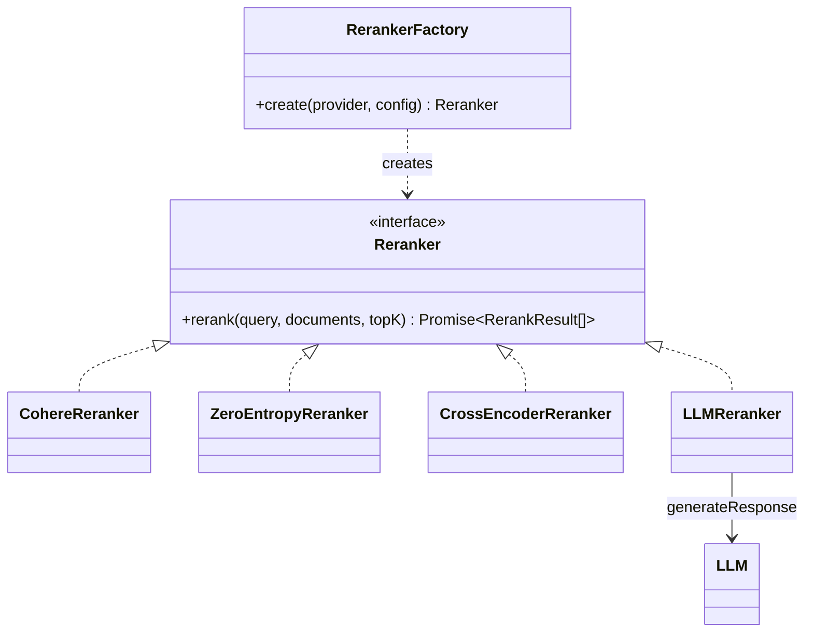
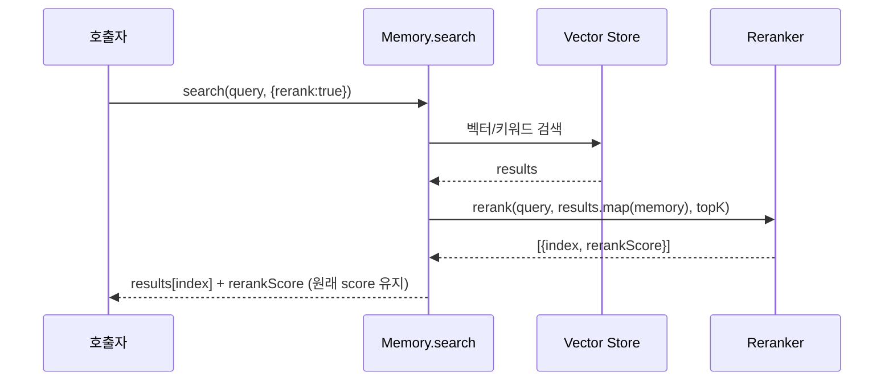

# ts_oss_rerankers 모듈

`mem0-ts/src/oss/src/rerankers/`는 TypeScript OSS `Memory`의 검색 결과를 쿼리 관련도 기준으로 다시 정렬(rerank)하는 프로바이더 모듈이다. 모든 구현체는 `Reranker` 인터페이스(`base.ts`)를 따르며, `RerankerFactory`가 `provider` 문자열로 인스턴스를 만든다. Python 대응 모듈은 [Python_Pluggable_Provider_Layer](Python_Pluggable_Provider_Layer.md)의 `py_rerankers`다.

## 1. 계약 (`base.ts`)

```ts
interface RerankResult { index: number; rerankScore: number }   // index = 입력 documents 배열의 인덱스
interface Reranker { rerank(query, documents, topK?): Promise<RerankResult[]> }
```

- 결과는 점수 내림차순이며, `topK`가 있으면 그 개수까지만 반환한다.
- `index`로 원본 항목을 복원하므로 호출자는 문서 텍스트가 아니라 인덱스에 의존한다.

## 2. 구성 요소

| Provider 키 | 클래스 (파일) | 방식 | 기본 모델 |
|---|---|---|---|
| `cohere` | `CohereReranker` (`cohere.ts`) | Cohere Rerank API | `rerank-v3.5` |
| `zero_entropy` | `ZeroEntropyReranker` (`zeroentropy.ts`) | ZeroEntropy API | `zerank-1` |
| `sentence_transformer` | `CrossEncoderReranker` (`cross_encoder.ts`) | 로컬 cross-encoder (Transformers.js) | `Xenova/ms-marco-MiniLM-L-6-v2` |
| `huggingface` | `CrossEncoderReranker` | 로컬 cross-encoder, `maxLength` 기본 512 | `Xenova/bge-reranker-base` |
| `llm_reranker` | `LLMReranker` (`llm.ts`) | 문서별 LLM 점수화 | 설정된 LLM (기본 openai, `gpt-5-mini`) |

프로바이더 키와 기본값은 `utils/factory.ts`의 `RerankerFactory.create`에서 확인한 것이다. 키는 `toLowerCase()`로 비교하며, 알 수 없는 키는 `Unsupported reranker provider` 에러를 던진다.

### 구조



## 3. 시스템 내 위치와 데이터 흐름

`Memory` 생성자는 `config.reranker`가 있을 때 `RerankerFactory.create(provider, config)`로 reranker를 만든다. 검색 시 `rerank: true` 옵션을 준 경우에만 Step 10에서 호출된다(`memory/index.ts`). 설정 타입 `RerankerConfig`는 `types/index.ts`에 있다. 상위 흐름은 [ts_oss_core](ts_oss_core.md), LLM 프로바이더는 [ts_oss_llms](ts_oss_llms.md)를 참고한다.



- `rerank`가 꺼져 있거나 reranker 미설정, 결과가 비어 있으면 건너뛴다.
- reranker가 예외를 던지면 `Memory`가 경고를 출력하고 원래 결과를 그대로 반환한다.
- `rerankScore`는 기존 `score`를 대체하지 않고 추가된다.

## 4. 구현체별 동작

### CohereReranker / ZeroEntropyReranker
- API 키는 `config.apiKey` 또는 환경변수(`COHERE_API_KEY`, `ZERO_ENTROPY_API_KEY`)에서 읽고, 없으면 생성자에서 에러를 던진다.
- 선택적 peer 패키지(`cohere-ai`, `zeroentropy`)를 `loadPeer`로 첫 사용 시점에 지연 로딩한다. 쓰지 않는 사용자는 설치할 필요가 없다. 클라이언트 생성 Promise를 캐시한다.
- Cohere는 `topN = topK || this.topK || documents.length`와 `returnDocuments`, `maxChunksPerDoc`를 전달한다. ZeroEntropy는 응답을 받은 뒤 직접 정렬하고 자른다.
- 실패 시 원래 순서로 `rerankScore: 0.0`을 부여해 반환한다(`topK`로 slice).

### CrossEncoderReranker
- `@huggingface/transformers`의 `AutoModelForSequenceClassification`과 `AutoTokenizer`를 `load()`에서 지연 동적 import한다. 정적 import를 하면 모든 `new Memory()`에 onnxruntime이 딸려오고, Linux에서 fastembed의 onnxruntime과 충돌하기 때문이다(소스 주석 참고).
- 모델과 토크나이저는 인스턴스당 한 번만 로드한다(Promise 캐시).
- 쿼리를 문서 수만큼 복제하고 `text_pair: documents`, `padding`, `truncation`, `max_length`로 토크나이즈한 뒤 logits를 얻는다.
- `normalize`(기본 `true`)면 sigmoid로 `[0,1]`에 정규화하고, `false`면 원시 logit을 반환한다.
- `batchSize`, `showProgressBar`는 Python SDK와의 설정 호환용이며 동작이 없다(단일 forward pass).
- 모델 로드나 추론 실패 시 경고 후 원래 순서, 점수 0.0으로 폴백한다.

### LLMReranker
- 생성자에서 LLM 인스턴스가 없으면 에러를 던진다. `RerankerFactory`가 `config.llm` 또는 최상위 `provider/model/temperature/maxTokens/apiKey`로 LLM을 만들어 주입한다.
- 문서마다 `Promise.all`로 병렬 호출한다. system 프롬프트(0.0~1.0 척도)와, 쿼리·문서를 각각 4000자로 자른 user 메시지(`Query: ...\n\nDocument: ...`)를 보낸다.
- `extractScore`는 소수(`-?\d+\.\d+`)를 먼저, 없으면 정수를 찾아 `[0,1]`로 clamp한다. 숫자가 없으면 중립값 `0.5`다.
- 문서 하나의 호출이 실패해도 그 문서만 `0.5`를 받고 전체는 계속된다. 문서 수만큼 LLM 호출이 발생하므로 비용과 지연에 유의해야 한다.

### 폴백 정책 요약

| 상황 | 점수 | 순서 |
|---|---|---|
| `documents`가 빈 배열 | - | `[]` 반환 (모델 로드도 안 함) |
| Cohere/ZeroEntropy/CrossEncoder 실패 | 전부 `0.0` | 원래 순서 |
| LLM 문서별 실패 또는 숫자 파싱 불가 | 해당 문서 `0.5` | 점수순 정렬 |

## 5. 테스트

- `cross_encoder.test.ts`: `@huggingface/transformers`를 jest mock으로 대체한다. `setupModel(logits)`가 토크나이저와 모델 mock을 연결하고, `sigmoid`는 기대값 계산용이다. 정렬, `text_pair` 토크나이즈, `topK`(호출 인자와 config), 빈 입력 시 미로드, `normalize: false`, 1회 로드, 기본 모델과 커스텀 모델, 기본 `maxLength`, 로드/추론 실패 폴백을 검증한다.
- `llm.test.ts`: `makeLLM(scoreByDoc)`가 프롬프트에 포함된 문서 텍스트로 점수를 돌려주는 가짜 LLM이다(문서 토큰이 프롬프트 문구의 부분 문자열이면 안 된다). 정렬, clamp, `topK`, 숫자 없을 때 0.5, 소수 우선 파싱, 문서별 실패, 정확한 system 프롬프트(드리프트 감지를 위해 일부러 복제), 4000자 절단, LLM 누락 시 throw를 검증한다.
- `utils/factory.test.ts`에서 프로바이더 키별 인스턴스 생성을 검증한다.
- 실행: `mem0-ts`에서 `pnpm run test` (jest, `mem0-ts/jest.config.js`). 자세한 빌드·테스트 설정은 [ts_build_and_config](Build_Configuration_and_Tooling.md)를 참고한다.

## 6. 사용 예

```ts
import { Memory } from "mem0ai/oss";

const memory = new Memory({
  reranker: { provider: "cohere", config: { apiKey: process.env.COHERE_API_KEY, topK: 5 } },
});
const res = await memory.search("선호하는 음료", { userId: "u1", rerank: true });
// res.results[i].rerankScore
```

## 7. 새 reranker 추가 시

1. `rerankers/<name>.ts`에서 `Reranker`를 구현한다(빈 입력은 `[]`, 실패는 폴백).
2. `RerankerConfig`(`types/index.ts`)에 필요한 필드를 추가한다.
3. `RerankerFactory.create`의 `switch`에 case를 추가하고 `src/index.ts`에서 export한다.
4. 테스트를 추가하고 공개 API 변경이므로 `docs/`도 함께 갱신한다(저장소 규칙).
