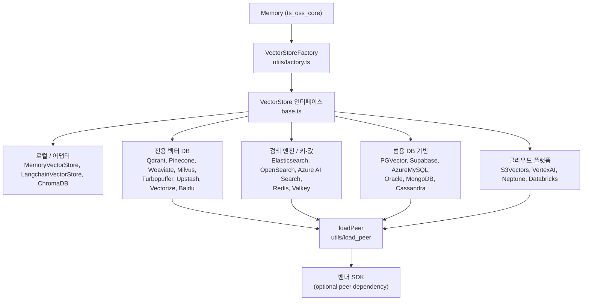
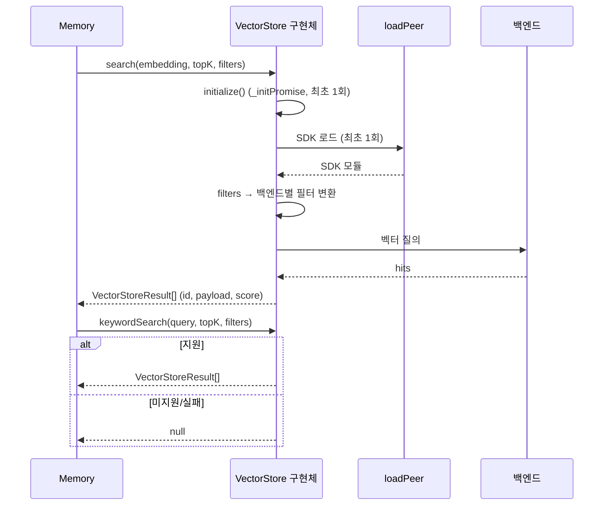

# ts_oss_vector_stores 개요

## 1. 목적

`ts_oss_vector_stores`(`mem0-ts/src/oss/src/vector_stores/`)는 mem0 TypeScript OSS SDK의 **벡터 저장소 어댑터 계층**입니다. OSS 엔진 `Memory`([ts_oss_core](ts_oss_core.md))는 메모리(임베딩 벡터와 payload)를 저장하고 검색할 때 공통 인터페이스 `VectorStore`(`base.ts`)만 사용합니다. 이 모듈은 그 인터페이스를 약 28개의 백엔드로 구현합니다. 백엔드는 로컬 SQLite부터 전용 벡터 DB, 검색 엔진, 범용 DB, 클라우드 관리형 서비스까지 다양합니다. 사용자는 설정의 `provider` 문자열만 바꿔 백엔드를 교체할 수 있습니다.

- **공통 계약**: `insert`, `search`, `keywordSearch?`, `get`, `update`, `delete`, `deleteCol`, `list`, `getUserId`, `setUserId`, `initialize`
- **생성**: `utils/factory.ts`의 `VectorStoreFactory`가 `provider`로 구현체를 만듭니다.
- **기본 스토어**: `provider: "memory"`(`MemoryVectorStore`, `better-sqlite3`)
- **Python 대응 모듈**: [py_vector_stores](py_vector_stores.md). 필터 검증, 와일드카드 처리, BM25 슬롯 같은 로직이 상당 부분 동일하므로 한쪽을 고치면 다른 쪽도 확인해야 합니다.

## 2. 아키텍처



### 공통 설계 패턴

| 패턴 | 설명 |
|---|---|
| 지연 로딩 | 벤더 SDK는 optional peer dependency입니다. `loadPeer`나 동적 `import()`로 처음 사용할 때만 로드하므로 `import { Memory } from "mem0ai/oss"`는 드라이버가 없어도 동작합니다. 클라우드 계열은 ESM 번들 호환을 위해 `require()`를 금지합니다. |
| 멱등 초기화 | `_initPromise`에 `initialize()` 결과를 캐시합니다. 생성자는 `initialize().catch(console.error)`로 비동기 시작하는 경우가 많고, 이후 호출에서 같은 Promise를 await합니다. |
| `memory_migrations` | 텔레메트리용 익명 사용자 ID(`getUserId`/`setUserId`)를 백엔드 안에 저장합니다. 위치(컬렉션, 네임스페이스, 키)는 백엔드마다 다르고, 일부는 메모리에만 보관합니다. |
| `keywordSearch` best-effort | 미지원이거나 실패하면 `null`을 반환합니다. 호출자는 시맨틱 검색만 사용하는 방식으로 폴백합니다. |
| 점수 정규화 | 거리 기반 metric을 "클수록 유사"로 변환합니다(`1-d`, `1/(1+d)`). |
| 클라이언트 주입 | 대부분 `config.client`로 사전 구성한 클라이언트를 받으며, 테스트에 사용합니다. |

### 검색 흐름



## 3. 하위 모듈 구성

| 하위 모듈 | 구현체 | 특징 |
|---|---|---|
| 로컬 / 어댑터 | `MemoryVectorStore`, `LangchainVectorStore`, `ChromaDB` | SQLite 선형 스캔과 인라인 BM25, LangChain 래핑(`filters` 무시), Chroma where 절 변환 |
| 전용 벡터 DB | `Qdrant`, `PineconeDB`, `WeaviateDB`, `Milvus`, `TurbopufferDB`, `UpstashVector`, `VectorizeDB`, `BaiduDB` | 벡터 검색 전문 서비스. Qdrant·Milvus·Baidu·Weaviate는 BM25를 지원하고, 필터 지원 범위는 어댑터마다 다름 |
| 검색 엔진 / 키-값 | `ElasticsearchDB`, `OpenSearchDB`, `AzureAISearch`, `RedisDB`, `ValkeyDB` | kNN/RediSearch/`FT.*` 기반. 필터 키와 값 검증으로 인젝션 방지 |
| 범용 DB 기반 | `PGVector`, `SupabaseDB`, `AzureMySQLDB`, `OracleAIVectorSearch`, `MongoDB`, `CassandraDB` | 기존 DB에 벡터 컬럼이나 인덱스 추가. AzureMySQL과 Cassandra는 클라이언트 측 유사도 계산 |
| 클라우드 플랫폼 | `S3Vectors`, `VertexAIVectorSearch`, `NeptuneAnalyticsVectorStore`, `DatabricksVectorStore` | 관리형 서비스. Databricks는 Delta 쓰기와 REST 검색의 이원 구조 |

## 4. 핵심 컴포넌트 문서

- [ts_oss_vector_stores_local_and_adapter_vector_stores](ts_oss_vector_stores_local_and_adapter_vector_stores.md): `VectorStore` 인터페이스, 기본 SQLite 스토어, LangChain·Chroma 어댑터
- [ts_oss_vector_stores_dedicated_vector_database_stores](ts_oss_vector_stores_dedicated_vector_database_stores.md): Qdrant, Pinecone, Weaviate, Milvus, Turbopuffer, Upstash, Vectorize, Baidu Mochow
- [ts_oss_vector_stores_search_engine_and_keyvalue_stores](ts_oss_vector_stores_search_engine_and_keyvalue_stores.md): Elasticsearch, OpenSearch, Azure AI Search, Redis, Valkey
- [ts_oss_vector_stores_database_backed_vector_stores](ts_oss_vector_stores_database_backed_vector_stores.md): PGVector, Supabase, Azure MySQL, Oracle, MongoDB, Cassandra
- [ts_oss_vector_stores_cloud_platform_vector_stores](ts_oss_vector_stores_cloud_platform_vector_stores.md): S3 Vectors, Vertex AI, Neptune Analytics, Databricks

관련 모듈: [ts_oss_core](ts_oss_core.md)(`Memory`, `VectorStoreFactory`), [py_vector_stores](py_vector_stores.md)(Python 대응 구현)

## 5. 유지보수 시 주의사항

- **필터 의미 차이**: 같은 `SearchFilters`여도 지원 범위가 다릅니다. Pinecone은 `NOT`을 무시하고, Weaviate·Milvus·Baidu·Upstash·MongoDB는 동등 비교 위주이며, LangChain은 필터를 무시합니다. 새 필터 기능은 어댑터마다 확인해야 합니다.
- **BM25 호환**: BM25 지원 이전에 만든 컬렉션(Qdrant, Milvus, Baidu)은 키워드 검색이 꺼진 채 동작합니다.
- **초기화 오류**: fire-and-forget 초기화의 실패는 로그에만 남고 이후 호출에서 다시 던져집니다. Valkey 등 일부는 CRUD 호출에서 `initialize()`를 await하지 않으므로 초기화 완료 전 호출에 주의해야 합니다.
- **성능 한계**: `MemoryVectorStore`, `AzureMySQLDB`, `CassandraDB`는 선형 스캔(O(N))이므로 대규모 데이터에는 부적합합니다.
- **보안**: 식별자와 필터 키 검증(정규식, 이스케이프), 값 바인딩 로직을 약화시키지 마세요.
- **새 어댑ter 추가**: `base.ts` 구현, `loadPeer` 사용, `_initPromise`, `memory_migrations` 처리, `keywordSearch` 미지원 시 `null` 반환 규약을 따르고 `VectorStoreFactory`에 등록합니다. `mem0-ts/AGENTS.md`(pnpm, Prettier, tsup, jest)의 규칙도 함께 확인합니다.

## 6. 사용 예

```typescript
import { Memory } from "mem0ai/oss";

const memory = new Memory({
  vectorStore: {
    provider: "pgvector",
    config: { connectionString: process.env.DATABASE_URL, collectionName: "memories", embeddingModelDims: 1536 },
  },
});
```