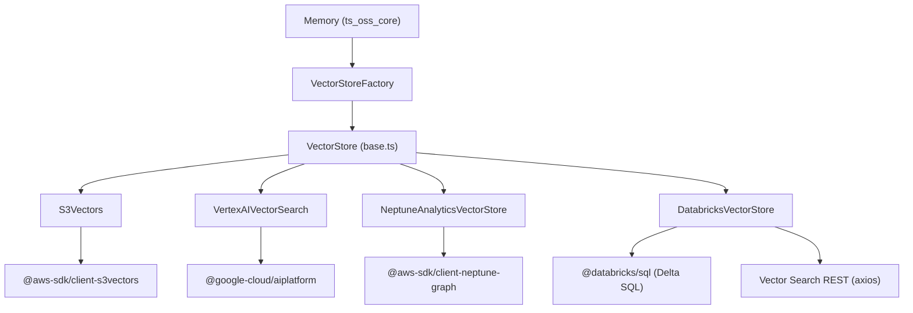
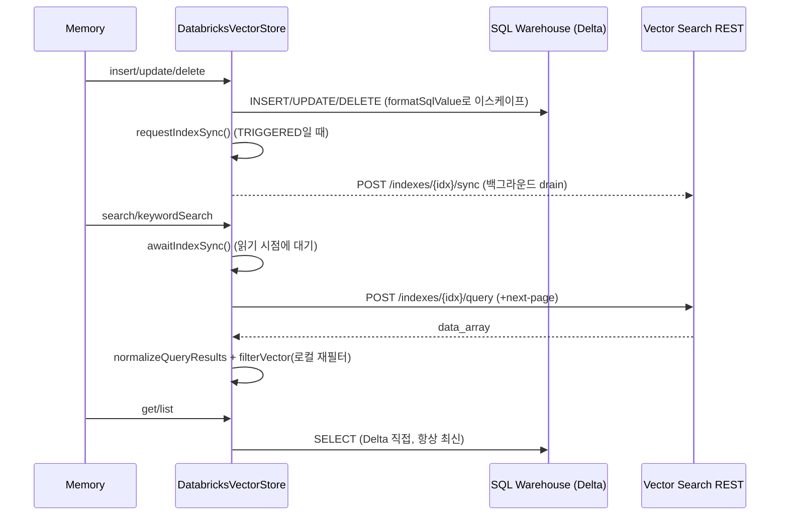

# ts_oss_vector_stores_cloud_platform_vector_stores

`mem0-ts/src/oss/src/vector_stores/` 아래에서 **클라우드 플랫폼 관리형 서비스**를 백엔드로 사용하는 4개의 `VectorStore` 구현체를 다룬다.

| 클래스 | 파일 | 백엔드 | 선택적 의존성(동적 `import()`) |
|---|---|---|---|
| `S3Vectors` | `s3_vectors.ts` | AWS S3 Vectors | `@aws-sdk/client-s3vectors` |
| `VertexAIVectorSearch` | `vertex_ai_vector_search.ts` | Google Vertex AI Vector Search (Matching Engine) | `@google-cloud/aiplatform` |
| `NeptuneAnalyticsVectorStore` | `neptune_analytics.ts` | AWS Neptune Analytics (openCypher) | `@aws-sdk/client-neptune-graph` |
| `DatabricksVectorStore` | `databricks.ts` | Databricks Mosaic AI Vector Search + Delta 테이블 | `@databricks/sql` (+ `axios`) |

모두 공통 인터페이스 `VectorStore`(`./base`)를 구현하며, `Memory`(→ [ts_oss_core](ts_oss_core.md))가 `VectorStoreFactory`를 통해 생성해 사용한다. 형제 모듈: [ts_oss_vector_stores_local_and_adapter_vector_stores](ts_oss_vector_stores_local_and_adapter_vector_stores.md), [ts_oss_vector_stores_dedicated_vector_database_stores](ts_oss_vector_stores_dedicated_vector_database_stores.md), [ts_oss_vector_stores_search_engine_and_keyvalue_stores](ts_oss_vector_stores_search_engine_and_keyvalue_stores.md), [ts_oss_vector_stores_database_backed_vector_stores](ts_oss_vector_stores_database_backed_vector_stores.md). Python 대응물은 [py_vector_stores](py_vector_stores.md)의 `cloud_platform_vector_stores`.

## 아키텍처



### 공통 계약

- 메서드: `insert`, `search`, `get`, `update`, `delete`, `deleteCol`, `list`, `keywordSearch`, `getUserId`, `setUserId`. 결과는 `VectorStoreResult { id, payload, score? }`.
- **`keywordSearch`**: S3 Vectors·Neptune·Vertex AI는 `null`을 반환(미지원 → 호출자가 BM25 등 폴백). Databricks만 `FULL_TEXT` 쿼리로 구현.
- **지연 초기화**: 생성자에서 `void this.initialize().catch(console.error)`로 `_initPromise`를 메모이즈. 각 연산도 `await this.initialize()`.
- **선택적 SDK는 반드시 동적 `import()`**: `require()`는 tsup/esbuild의 ESM 번들(`dist/oss/index.mjs`)에서 `__require` 심으로 바뀌어 깨진다. `index.ts`가 모듈을 eager re-export 하므로 최상위 import도 금지(소스 주석 참고). 빌드 설정은 `mem0-ts/tsup.config.ts`, `mem0-ts/package.json` 참조.
- **`getUserId`/`setUserId`**: 텔레메트리/마이그레이션용 사용자 ID를 백엔드 내부에 저장(아래 표).
- 점수는 "클수록 좋음"으로 정규화.

| 백엔드 | user ID 저장 위치 | 점수 변환 |
|---|---|---|
| S3 Vectors | 인덱스 `memory_migrations`, 키 `mem0-user`, 메타 `user_id` | cosine: `clamp(1-d,0,1)`, euclidean: `1/(1+d)` |
| Vertex AI | 같은 인덱스의 특수 datapoint `mem0-user-id-record` | `max(0, 1-distance)` |
| Neptune | 라벨 `MEM0_VECTOR_memory_migrations` 노드 `mem0-user` | `1/(1+max(0,score))` (제곱 유클리드 거리) |
| Databricks | 테이블 `<catalog>.<schema>.memory_migrations` | 서버 반환 score 그대로 |

## 컴포넌트별 상세

### S3Vectors

- 설정: `vectorBucketName`, `collectionName`, `embeddingModelDims|dimension`(필수), `distanceMetric`(`cosine` 기본/`euclidean`), `region|regionName`, `client`(주입), `clientConfig`.
- `_doInitialize`: 버킷과 인덱스를 `Get → NotFound면 Create → Conflict는 무시`(경쟁 안전) 순서로 보장. 데이터 타입 `float32`.
- `insert`/`update`는 `PutVectorsCommand`(upsert). `update`는 빈 vector 또는 payload가 없으면 `fetchStoredVector`로 기존 값을 병합, 없으면 에러.
- `list`: `ListVectorsCommand`를 `nextToken`으로 페이지네이션(500)하되 `topK` 충족 시 중단. 필터는 **클라이언트 측**(`matchesFilter`)에서 평가하며 반환 count는 페이지 길이.
- `search`: `QueryVectorsCommand`에 서버 필터 전달. 필터 변환은 `convertFilters`가 담당:
  - `eq/ne/gt/gte/lt/lte/in/nin` → `$` 연산자, `"*"` → `$exists`, 배열 → `$in`.
  - `$and/$or/$not`는 정규화하며, 항상 거짓인 조건은 센티널 `$alwaysFalse`로 표현해 `search`가 네트워크 호출 없이 `[]` 반환.
  - `contains/icontains/startsWith`는 미지원 → 에러. `$not`은 `negateFilter`(드 모르간)로 변환.
- `deleteCol`: 인덱스 삭제, NotFound 무시.

### VertexAIVectorSearch

- 설정: `projectId`, `projectNumber`, `region`, `endpointId`, `indexId`, `deploymentIndexId`, `credentialsPath|serviceAccountJson`, `vectorSearchApiEndpoint`, (`dimension`, 기본 768).
- `MatchServiceClient`(조회)와 `IndexServiceClient`(쓰기)를 분리. payload는 **restrict(namespace/allowList)**로 저장 → 값은 모두 문자열화되고 읽을 때 `allowList[0]`만 복원(타입 손실 주의).
- `search`/`get`은 `vectorSearchApiEndpoint`가 없으면 에러. `get`은 `findNeighbors`에 datapointId를 넣어 첫 이웃의 ID가 일치할 때만 반환.
- `update`: 존재 확인 후 upsert, 없으면 경고만 하고 반환. `delete`: gRPC NOT_FOUND(code 5) 무시. `deleteCol`: 미지원(경고).
- `list`: 영벡터로 `search` 수행(근사). `search` 결과에서 `mem0-user-id-record`는 제외.
- 필터: `{include, exclude}` 객체 → `allowList/denyList`, 나머지는 동치 비교만 가능.

### NeptuneAnalyticsVectorStore

- 설정: `graphIdentifier` 또는 `endpoint`(`neptune-graph://<id>`; HTTPS 엔드포인트는 `graphIdentifier` 별도 필요), `collectionName`(기본 `memories`), `dimension`(기본 1536), `client`.
- 컬렉션은 노드 라벨 `MEM0_VECTOR_<collectionName>`. 라벨/속성 이름은 백틱 이스케이프로 인젝션 방지.
- `insert`: ① `MERGE`로 속성 기록(`updatedAt` 자동 추가) ② `neptune.algo.vectors.upsert`로 임베딩 기록. 실패 시 **새로 만든 노드만** `cleanupFailedInsert`로 삭제(보상).
- `update`: payload+vector 동시 변경 시 이전 노드를 저장해 두고 upsert 실패하면 payload 복원(최선 노력 보상; 벡터 인덱스가 비트랜잭션이며 동일 ID 동시 쓰기는 가정하지 않음).
- `search`: `neptune.algo.vectors.topK.byEmbedding`에 `vertexFilter`(`equals/in/andAll/orAll…`)를 직렬화해 전달. `"*"`·`icontains`는 미지원.
- `list`: openCypher `WHERE` 절(파라미터 바인딩)을 생성해 항목과 `count(n)`을 병렬 조회 → 정확한 총 개수 반환.
- `executeQuery`: `ExecuteQueryCommand`(`OPEN_CYPHER`) 후 payload를 JSON 파싱, `results`/`result` 배열 모두 허용. SDK/클라이언트 Promise 실패 시 캐시를 비워 재시도 가능.

### DatabricksVectorStore

가장 복잡하다. **쓰기는 Delta 테이블(SQL), 검색은 Delta Sync 벡터 인덱스(REST)**로 이원화.



- 설정: `workspaceUrl|host`, `httpPath`, 인증은 `accessToken` 또는 `clientId/clientSecret`(OAuth M2M), `endpointName`(기본 `mem0_vector_search`), `endpointType`(`STANDARD`|`STORAGE_OPTIMIZED`), `pipelineType`(`TRIGGERED`|`CONTINUOUS`), `queryType`(`ANN`|`HYBRID`), `catalog`/`schema`/`tableName`, `embeddingModelDims`, `syncPollIntervalMs`, `syncTimeoutMs`, 테스트용 `sqlClient`/`httpClient`.
- 제약 검증: STORAGE_OPTIMIZED는 TRIGGERED만, 차원은 16의 배수. 식별자는 `validateIdentifier`(정규식)로 검증 — SQL에 직접 보간되므로 보안상 필수. `list`의 `topK`도 `Number.isSafeInteger` 검증으로 LIMIT 인젝션 차단.
- `_doInitialize`: 스키마/테이블(CDF 활성) 생성 → `memory_migrations` 테이블 → 엔드포인트 존재 보장·ONLINE 대기 → `DELTA_SYNC` 인덱스 생성·ready 대기. 실패 시 `_initPromise`를 지워 재시도 가능(모두 멱등).
- SQL 값 이스케이프(`formatSqlValue`): Spark의 백슬래시 이스케이프를 고려해 `\` → `\\`, `'` → `''`. 비유한 숫자는 거부.
- 세션: `session` 캐시, SQL 오류 시 `resetSession()`으로 폐기(쓰기 재시도는 하지 않음 — 비멱등 위험).
- OAuth: 작업별 `authorization_details`(Read/WriteVectorIndex)로 토큰 발급·캐시(만료 60초 전 갱신).
- **인덱스 동기화**: `requestIndexSync` → 단일 `drainIndexSync` 루프가 요청을 합쳐(coalesce) `/sync` 호출 후 readiness 대기. 오류는 다음 읽기(`awaitIndexSync`)에서 throw. 따라서 write 직후 `search`는 반영 완료를 기다리고, `get/list`는 대기 없이 Delta를 읽는다.
- **필터**: 서버 필터로 변환 가능한 것은 세션 키(`memory_id,user_id,agent_id,run_id`)의 접속(conjunctive) 조건뿐이다(STANDARD→`filters_json`, STORAGE_OPTIMIZED→SQL 문자열). 나머지(`$or/$not`, 메타데이터)는 `filterVector`로 **로컬 재필터**하며, 이때 `shouldPaginateForLocalFiltering`이 true면 최대 결과 수(ANN 10,000 / FULL_TEXT 200)로 요청하고 `query-next-page`로 페이지네이션한다.
- `search`: `HYBRID`는 `query_text`가 필요하므로 에러. `keywordSearch`는 `FULL_TEXT`; `text_lemmatized` 컬럼을 동기화하지만 `query_columns` 지정은 프리뷰 기능이라 아직 미적용(`payload`도 매칭되어 노이즈 가능).
- `update`는 `user_id/agent_id/run_id` 컬럼을 덮어쓰지 않는다(부분 payload가 행을 세션 검색에서 숨기는 것 방지). `deleteCol`: 인덱스(404 무시) 후 테이블 DROP.

## 백엔드 비교

| 항목 | S3Vectors | VertexAI | Neptune | Databricks |
|---|---|---|---|---|
| 서버 측 메타 필터 | `$` 연산자 | allow/deny list | vertexFilter | 세션 키만 |
| 로컬 필터 | `list`만 | 없음 | 없음 | 항상 재검증 |
| `list` 총 개수 | 페이지 길이 | 결과 길이 | 정확(`count`) | 최대 전체 스캔 한도 |
| `keywordSearch` | `null` | `null` | `null` | `FULL_TEXT` |
| `deleteCol` | 인덱스 삭제 | 미지원 | 노드 전체 삭제 | 인덱스+테이블 삭제 |
| 읽기 일관성 | 즉시 | 인덱스 반영 지연 | 즉시 | search는 sync 대기 |

## 사용 예 / 유의사항

```ts
const memory = new Memory({
  vectorStore: {
    provider: "s3_vectors",
    config: { vectorBucketName: "my-bucket", collectionName: "memories", embeddingModelDims: 1536, region: "us-east-1" },
  },
});
```

- 프로바이더 이름 등록은 `ts_oss_core`의 `VectorStoreFactory`(`utils/factory.ts`)를 확인.
- 선택적 SDK 미설치 시 설치 안내 에러가 첫 사용 시점에 발생한다.
- 임베딩 차원은 컬렉션 생성 시 고정되므로 임베더를 바꾸면 새 컬렉션이 필요하다.
- 테스트에서는 `client`/`sqlClient`/`httpClient`를 주입해 SDK 없이 검증 가능하다.
- Python 구현과의 동작 차이(필터 문법·점수 계산)는 [py_vector_stores](py_vector_stores.md) 참고.
